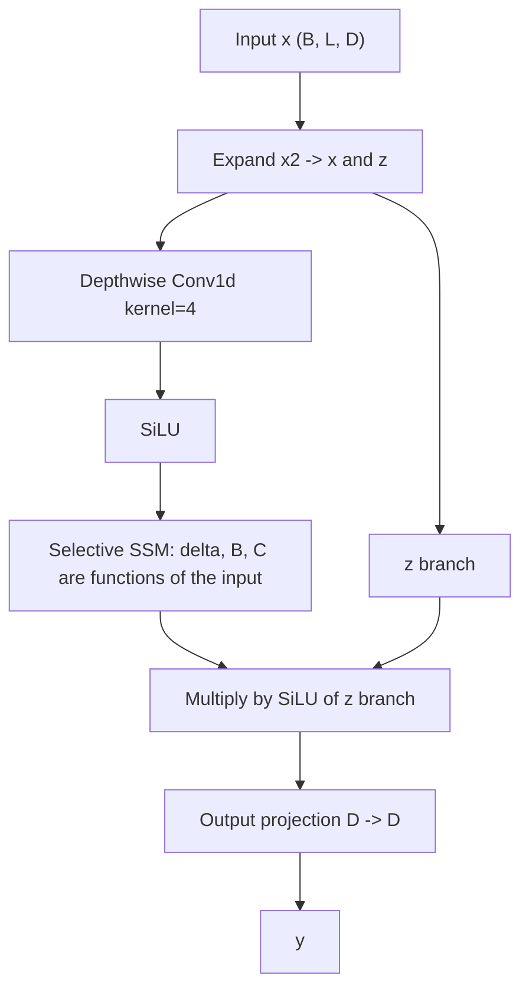
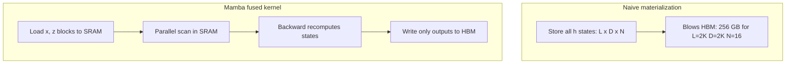

# Mamba and State Space Models

## Overview

State space models (SSMs) are a return to recurrence — but a recurrence with a structured, input-dependent transition matrix and a GPU kernel designed around the memory hierarchy. S4 (2021) proved linear-recurrence models could match transformers on long-range benchmarks; Mamba (Gu & Dao, Dec 2023) made them competitive on language modeling at 1-8B scale by making the dynamics *selective* (input-dependent) and by fusing the recurrence into a parallel scan kernel. Mamba-2 (2024) then proved a duality between SSMs and attention, turning the design into a tunable spectrum. Interviewers now ask SSM questions not as trivia but as a probe of whether you understand *what attention actually pays for* — exact, unbounded state — and what you give up to avoid it.

> **Interview Angle**: Expect "explain the selective scan", "why did S4 need convolution but Mamba doesn't", and "what does Mamba-2 change" from research-adjacent teams. The strongest answers connect each mechanism to a failure mode of the previous model.

## From RNNs to S4: The State Space Framing

A continuous-time linear state space system evolves a hidden state under a matrix differential equation:

\\[ h'(t) = A h(t) + B x(t), \quad y(t) = C h(t) \\]

Discretizing with step size \\( \Delta \\) (via zero-order hold) gives the recurrence \\( h_t = \bar{A} h_{t-1} + \bar{B} x_t \\), \\( y_t = C h_t \\), with \\( \bar{A} = \exp(\Delta A) \\). The HiPPO framework (Gu et al., 2020) showed that if you choose \\( A \\) to project history onto orthogonal polynomial bases, the state becomes an *optimal compressed memory* of the past. S4 built a practical model on HiPPO-LegS matrices: the recurrence is linear, so it can be computed either as an RNN (O(N) sequential) or unrolled into a long convolution \\( K = (C\bar{B}, C\bar{A}\bar{B}, C\bar{A}^2\bar{B}, \dots) \\) computed with FFTs (O(N log N) parallel).

That dual mode is the core SSM trick: **recurrence for inference, convolution (or scan) for training**. But S4's parameters \\( A, B, C, \Delta \\) are fixed after training — every token is processed with identical dynamics, so the model cannot selectively remember or forget based on content. On language, where "ignore this token" and "memorize this token forever" alternate token-by-token, time-invariant dynamics forced gigantic states to compensate.

### Time-invariant vs selective dynamics

| Property | S4 / S4D | Mamba (selective) |
|---|---|---|
| \\( \Delta, B, C \\) | Functions of position only | Functions of input: \\( \Delta = \text{softplus}(W_\Delta x) \\), \\( B = W_B x \\), \\( C = W_C x \\) |
| \\( A \\) | Structured (DPLR / diagonal) | Diagonal (negative real part) |
| Training form | Long convolution via FFT | Parallel scan, no FFT needed |
| Can skip tokens? | No — same kernel everywhere | Yes — large \\( \Delta \\) → decay state (forget), small \\( \Delta \\) → hold state (ignore input) |
| Gating | None | SiLU gate on output branch |

### Discretization and initialization details

Three implementation choices recur in every SSM exam question:

- **Zero-order hold (ZOH)**: Ā = exp(Δ·A), with B̄ simplified to Δ·B in Mamba — close enough in practice and it avoids a matrix inverse. The full ZOH form exists but the exponential is the part that matters.
- **Δ parameterization**: Δ = softplus(W_Δ·x + b_Δ), keeping it strictly positive. The bias is initialized so early training has a wide receptive field; Mamba initializes b_Δ uniformly in [1, 9] per channel (S4D-style heritage), so most channels start as slow-decaying, long-memory integrators.
- **A initialization**: A_n = −(2n+1) for the n-th state dimension (HiPPO-derived), a negative real diagonal so exp(Δ·A) ∈ (0, 1) — every state channel decays monotonically toward zero between writes.

The negative-real-diagonal constraint is what makes the recurrence stable by construction: the state is a sum of exponentially-weighted inputs, exactly like a gated RNN's forget gate, but expressed as a matrix exponential. It also means gradients through long horizons neither explode nor vanish — the pathology that killed classical RNN training.

## The Mamba Block

Mamba wraps the selective SSM in a gated block shaped like a transformer block but with the sequence mixer replaced:



What "selective" buys, concretely:

- \\( \Delta_t \\) (timescale): a large \\( \Delta_t \\) resets/decays the state (token gets written strongly, old content decays) — like a sharp forget gate; a small \\( \Delta_t \\) leaves state untouched (the token is skippable).
- \\( B_t, C_t \\): what gets written to and read from state is content-dependent — the model can write a name and later read it back when a question needs it.
- Because \\( \bar{A} = \exp(\Delta A) \\) depends on the input, the transition kernel differs per token; the FFT-convolution training trick of S4 is no longer available, which forces the hardware-aware scan below.

### Selective scan pseudo-code

```python
def selective_scan(x, A, B_t, C_t, delta_t):
    # x: (L, D), A: (D, N) negative-real diagonal,
    # B_t, C_t: (L, N) input-dependent, delta_t: (L, D)
    h = torch.zeros(D, N)
    ys = []
    for t in range(L):
        dA = torch.exp(delta_t[t].unsqueeze(-1) * A)   # (D, N)
        dB = delta_t[t].unsqueeze(-1) * B_t[t]          # (D, N)
        h = dA * h + dB * x[t].unsqueeze(-1)            # state update
        ys.append((h * C_t[t].unsqueeze(0)).sum(-1))    # read out
    return torch.stack(ys)
```

### A worked numerical pass

For one channel with A = −1 and a Δ sequence of 0.1, 5.0, 0.1 over three tokens:

- Token 1 (Δ = 0.1): Ā = e^(−0.1) ≈ 0.905 — the state keeps ~90% of its content and the write is small. This is a skippable token: dynamics barely move.
- Token 2 (Δ = 5.0): Ā = e^(−5) ≈ 0.007 — prior state is wiped and the token is written almost from scratch. This is a commit: a new topic, a quoted identifier, a name worth remembering.
- Token 3 (Δ = 0.1): state holds steady, now dominated by token 2's contribution — the model can read it back later through C.

This arithmetic is the mechanistic story of selectivity: large Δ commits to state, small Δ skims past. It also explains why Δ initialization matters — start all-large and the model forgets everything at step one; start all-small and nothing is ever forgotten.

## Hardware-Aware Parallel Scan

A recurrence looks sequential, but the scan operator here is associative: combining state updates for segments `s1` and `s2` can be done by composing their (dA, dB·x) pairs without materializing intermediate states. Mamba exploits this with a **parallel prefix scan**, plus three IO-level tricks from the paper:

1. **Kernel fusion**: input projection, discretization, scan, and output projection run in one kernel — no intermediate \\( h \\) tensors ever hit HBM.
2. **Scan in SRAM**: the per-block state (D × N per head) fits in shared memory; the naive alternative materializes (L, D, N) hidden states — for L=2K, D=2K, N=16 that is 256 GB per layer pass in fp16, which is why the naive implementation is 20-50× slower.
3. **Recomputation on backward**: instead of storing forward states, the backward pass recomputes them from saved inputs, trading FLOPs for HBM traffic — the same IO-aware insight as FlashAttention.



The throughput claim from the paper: Mamba's scan kernel is up to 3× faster than a highly-optimized convolution implementation of S4 at these sizes, and Mamba-3B decays tokens/s at ~5× the rate of a same-size transformer in unbatched generation (paper Fig. 4 regime: ~135 vs ~60 tokens/s on A100 for the 3B pair), because decode needs only one O(D·N) state update instead of reading an O(N) KV cache.

## Mamba-2 and State Space Duality

Mamba-2 (Dao & Gu, 2024) simplifies \\( A \\) to be **scalar-times-identity** per head: \\( \bar{A}_t = a_t I \\). The recurrence \\( h_t = a_t h_{t-1} + B_t x_t \\), \\( y_t = C_t^\top h_t \\) then unrolls exactly into a **masked quadratic form** \\( Y = \mathrm{tril}(C M B^\top) X \\) where \\( M_{ji} = \prod a \\) is a decaying mask — i.e., the same shape as attention with data-dependent decay, minus the softmax. This is **structured state space duality (SSD)**:

| View | Form | Best for |
|---|---|---|
| Recurrent | \\( h_t = a_t h_{t-1} + B_t x_t \\) | Inference: O(1) state per token |
| Quadratic (dual) | \\( Y = \mathrm{tril}(CB^\top \odot M) X \\) | Training: matrix multiplies, tensor cores |
| Chunk-parallel | Block-diagonal + low-rank split | Both: intra-chunk quadratic matmuls, inter-chunk scan |

Because the quadratic form is plain matmuls (no exp of arbitrary vectors, no FFT), Mamba-2 trains 2-8× faster than Mamba-1 at the same quality on Chinchilla-style scaling up to ~7B, and its duality theorem places transformer attention and SSMs at two ends of one family (softmax ≈ all-ones decay + normalization; SSM ≈ product-decay, no normalization). This framing is the single most quotable Mamba-2 insight in interviews.

### Mamba-1 vs Mamba-2 knobs

| Knob | Mamba-1 | Mamba-2 (SSD) |
|---|---|---|
| A form | Per-channel diagonal (D × N) | Scalar per head times identity |
| State per layer | D × N (e.g., 2048 × 16) | Per-head matrices (heads × d_head × d_head) |
| Training kernel | Associative scan (custom CUDA) | Chunked matmuls + a small scan |
| Hardware affinity | Memory-friendly, not tensor-core-shaped | Quadratic form hits tensor cores directly |
| Typical speed | Baseline | 2-8× faster training at equal loss |

The state reorganization (D×N matrix → per-head matrices) is also what lets Mamba-2 borrow the entire chunkwise-parallel machinery of linear attention — one more sign that the families converged (see `linear-attention-variants.md`).

## Model Card: What a Mamba Model Looks Like

Concrete configuration for Mamba-2.8B (the flagship Mamba-1 model), useful when an interviewer asks for the actual dims:

| Config field | Value | Meaning |
|---|---|---|
| d_model | 2560 | Hidden width |
| n_layer | 64 | Depth — more layers than a transformer of equal size, because layers are cheaper |
| d_state (N) | 16 | State width per channel |
| d_conv | 4 | Local conv kernel width in the block |
| expand | 2 | Inner SSM width = 2 × d_model |
| Total params | ~2.8B | Roughly half the parameter count of its 7B compute-class transformer peers |

Note the depth/width trade: with no quadratic attention term, the scaling runs prefer more, narrower layers — a 64-layer 2.8B model versus a 32-layer transformer. Mamba-2 models at 2.7B switch to grouped heads (e.g., 24 heads × 128 dims) with the SSD per-head matrix state instead.

### The 2024-2025 Mamba ecosystem

- **Vision Mamba (Vim) and VMamba**: bidirectional selective-scan backbones for images; competitive with ViTs at small-mid scale, still behind at the largest regimes as of 2025.
- **Codestral Mamba 7B (Mistral) and Falcon Mamba 7B (TII)**: open pure-SSM language models — Codestral Mamba targeted local code completion with 32K+ context; Falcon Mamba-7B claims transformer-class quality with constant memory. Both are useful citations that pure SSMs shipped at 7B.
- **Framework support**: `mamba-ssm` (official CUDA kernels), Hugging Face Transformers (`MambaForCausalLM`, `Mamba2ForCausalLM`), and vLLM serving paths for Mamba architectures.
- **Theory line**: the SSD duality spawned a unification literature mapping gated linear attention, RWKV, HGRN, and Mamba onto one family — handy framing when an interviewer asks "are these really different models?"

## Benchmarks vs Transformers

- **Scaling laws (Mamba-1 paper)**: Mamba matches or exceeds transformer-quality scaling laws up to ~2.7B params on the Pile, and on downsampled Books3 the gap *widens* with sequence length up to 64K — the linear-time family benefits from longer contexts.
- **Zero-shot downstream (Mamba-1, ~3B)**: +4 to +8 points over Pythia-2.8B across 9 tasks (e.g., 49.5 vs 42.3 on Lambada openwiki style evaluations reported in the paper).
- **Coding**: Mamba-3B approaches transformer-3B performance on HumanEval after tuning; throughput advantage remains ~4-5× in generation.
- **Hybrid evidence (2024)**: NVIDIA's empirical study of Mamba-based LLMs found pure Mamba lags on MMLU and associative recall at 8B, while hybrids (attention every ~6th layer) match transformers — consistent with Jamba's design.
- **Long-context throughput**: Jamba reports up to 3× throughput vs Mixtral-8x7B on 128K contexts; Samba and Griffin report analogous cache-size reductions. See `hybrid-architectures.md`.
- **Training recipe**: Mamba-1's headline models trained on the Pile (~300B tokens) with AdamW, with the 3B flagship using more than Chinchilla-optimal tokens; Mamba-2's scaling runs followed the Chinchilla protocol (~20 tokens/param) across 70M-7B. Read the comparisons as compute-matched, not data-maxed — a nuance that matters when quoting benchmark deltas.

### Mamba vs Transformer at a glance (1-8B class)

| Dimension | Transformer (Llama-class) | Mamba / Mamba-2 |
|---|---|---|
| Train compute per token | O(N²d) attention + O(Nd²) FFN | O(N·d·N_state) scan + O(Nd²) FFN |
| Decode state | KV cache: 2·L·n_kv·d_h·N bytes, grows linearly | Fixed: L·D·N_state elements (~megabytes) |
| Unbatched decode speed | Memory-bandwidth-bound on KV reads | ~3-5× faster (one state update per token) |
| In-context copying / recall | Exact (full cache) | Degrades beyond state capacity |
| Ecosystem (2025) | Mature: every serving stack | HF Transformers + vLLM support; thinner tooling |
| Training stability | Well-understood | Sensitive to \\( \Delta \\) parameterization; needs careful init (S4D-style) |

## Limitations and Open Problems

1. **Fixed-state compression loses exact recall.** The state is D×N per layer regardless of context; tasks that require verbatim retrieval of a needle far back (MQAR, copying) show gaps that attention does not have. This is a property of the representation, not a bug to be tuned away.
2. **In-context learning behaves differently under length generalization**: several reproductions found Mamba's ICL degrades on some tasks when the prompt exceeds training lengths, while RoPE-scaled transformers degrade more gracefully on retrieval-flavored tasks.
3. **The theoretical expressivity gap**: Merrill et al. (2024) showed fixed-size-state models cannot express certain regular-language state-tracking that transformers with chain-of-thought can — "the illusion of state" argument. Practical impact at 7B is debated but interviewers like the citation.
4. **Hardware affinity is nuanced**: the scan is fast, but attention has five years of fused-kernel engineering (FlashAttention-3, FP8); on tensor-core-heavy training, quadratic attention with FlashAttention is not obviously slower at N ≤ 8K.
5. **Multimodal/vision SSMs** (Vim, VMamba) exist but underperform top ViTs at very high resolution regimes as of 2025.
6. **Quantization and serving maturity**: scan state magnitudes are not softmax-normalized like K/V, so int8/int4 paths needed bespoke treatment; major stacks handle it now, but niche checkpoints still carry compatibility risk.

## Common Pitfalls

- Confusing the *selective scan* with a learned RNN cell: there is no gate network over the state — the gate is the input-dependent Δ baked into exp(ΔA).
- Assuming Mamba removes the need for positional encoding entirely: the conv + recurrence carry position implicitly, but bidirectional variants (vision) still need explicit handling.
- Quoting the 256 GB naive-materialization number as Mamba's memory *usage* — it is what the naive *training implementation* would allocate; the fused kernel never allocates it.
- Treating Mamba-2's quadratic form as softmax attention: there is no exp normalization, so logit magnitudes differ and mixing heads with attention layers requires care.
- Comparing Mamba and transformer *parameter* counts and expecting equal compute — the depth/width allocations differ (64 layers vs 32 at 2.8B).
- Forgetting that d_state=16 is per channel: total state is D×N per layer, which is why the 7B-class state is only a few MB.
- Assuming prefix caching works as it does for transformers: there is no KV cache to share — caching happens at the state level and only helps when prompts actually share prefixes (the state after a shared prefix is reusable, but it is a single vector, not blockwise pages).
- Citing hybrid numbers (3× throughput etc.) as pure-Mamba numbers — most long-context throughput results are hybrid results.
- Ignoring the Δ softplus bound: Δ is unbounded above, and a pathological input can spike it, wiping state — one reason stability-sensitive deployments monitor state norms.
- Believing SSMs make FlashAttention irrelevant: at N ≤ 8K, quadratic attention with FlashAttention is usually the cheaper engineering choice.

## Interview Questions

1. **What exactly does "selective" mean in Mamba's selective SSM, and why does it break S4's training method?**
   Selective means the SSM parameters Δ, B, C become functions of the input token rather than fixed learned constants. Δ controls per-token timescale (forget vs hold), B what is written to state, C what is read out. Because the transition kernel now varies per token, the response K = C·(A^k)·B sequence is no longer a single convolution kernel — S4's FFT-based parallel training form is unavailable. Mamba replaces it with an associative parallel scan fused into one GPU kernel, keeping the training parallel while preserving the recurrent inference mode.

2. **Why is the fused scan kernel so much faster than a naive PyTorch implementation?**
   The naive implementation materializes all hidden states — shape (L, D, N) — in HBM; for L=2K, D=2K, N=16 that is ~256 GB in fp16, so it is HBM-bound and also often OOMs. The fused kernel exploits that the per-block state fits in SRAM: it loads input tiles once, runs the parallel prefix scan and gating entirely in SRAM, and writes only the outputs back. The backward pass recomputes states rather than storing them. This is the same IO-aware reasoning as FlashAttention — reduce memory traffic, not FLOPs.

3. **State the Mamba-2 duality result in one sentence each for the SSM view and the attention view.**
   SSM view: with scalar-times-identity A, the selective SSM is a linear recurrence h_t = a_t·h_{t-1} + B_t·x_t with O(1) per-token state. Attention view: unrolling that recurrence yields Y = tril(CB^T ⊙ M)X, a masked quadratic form exactly like attention but with a product-of-a's decay mask and no softmax. The chunk-parallel algorithm computes intra-chunk parts as quadratic matmuls (tensor cores) and inter-chunk parts as a small scan, giving 2-8× training speedup over Mamba-1.

4. **You need a model for a code-completion product with 100K-token file context and cost-sensitive serving. Pure Mamba or Llama-style? Justify.**
   Neither pure choice is optimal; the honest answer is hybrid. Pure Mamba gives the right serving profile (constant decode state, fast streaming) but risks verbatim recall failures on long files — code completion depends on exact identifier retrieval. A Jamba/Samba-style hybrid (≈1/8 attention layers with GQA, rest SSM) restores exact recall where it matters while keeping 8×-smaller KV cache, and both Jamba and the NVIDIA 8B hybrid study show hybrid ≈ transformer quality at much better throughput. If constrained to one pure family, choose the transformer and add FlashAttention + KV quantization, accepting higher serving cost.

5. **What is the strongest evidence that pure SSMs underperform transformers, and how do hybrids fix it?**
   The MQAR-style associative-recall results (Zoology/Based line) and the "Repeat After Me" copying analysis show fixed-state models lose accuracy as the number of key-value pairs to remember grows, while softmax attention stays exact. The NVIDIA empirical study at 8B found pure Mamba behind on MMLU and recall tasks but hybrid models (attention every ~5-6 layers) matching transformer quality at lower serving cost. The fix is architectural: reserve a small fraction of layers for exact, unbounded state (attention) and let the rest compress — quality is recovered with a fraction of the memory cost.

## Key Takeaways

- SSMs are linear recurrences h_t = Āh_{t-1} + B̄x_t with a dual computation mode: recurrence for inference, parallel scan/convolution for training.
- HiPPO/S4 provided structured (polynomial-projection) state initialization; S4's dynamics are time-invariant, which limits content-based remembering.
- Mamba's contribution: selective (input-dependent) Δ/B/C + gating + a fused, SRAM-resident parallel scan with recomputation — the IO-aware insight mirrors FlashAttention.
- Mamba-2 (SSD) reduces A to scalar-times-identity, exposing an exact attention-shaped quadratic form and training 2-8× faster; attention and SSMs are two ends of one spectrum.
- Empirically: Mamba matches transformer scaling ≤3B, generates ~3-5× faster unbatched, but pure SSMs show recall/copying gaps; hybrids recover quality.
- The state is fixed-size (D×N per layer) — this is simultaneously the memory win and the recall ceiling.
- Watch the follow-on ecosystem: Mamba in HF Transformers and vLLM, Mamba-based hybrids from AI21/DeepMind/NVIDIA/Microsoft, and continued SSD-line kernel work.

## References

- Gu et al., "[HiPPO: Recurrent Memory with Optimal Polynomial Projections](https://arxiv.org/abs/2008.07669)" (NeurIPS 2020)
- Gu et al., "[Efficiently Modeling Long Sequences with Structured State Spaces](https://arxiv.org/abs/2111.00396)" (ICLR 2022) — S4
- Gu, Gupta, Goel, Ré, "[On the Parameterization and Initialization of Diagonal State Space Models](https://arxiv.org/abs/2206.11893)" (2022) — S4D
- Gu & Dao, "[Mamba: Linear-Time Sequence Modeling with Selective State Spaces](https://arxiv.org/abs/2312.00752)" (COLM 2024)
- Dao & Gu, "[Transformers are SSMs: Generalized Models and Efficient Algorithms Through Structured State Space Duality](https://arxiv.org/abs/2405.21060)" (ICML 2024) — Mamba-2 / SSD
- Jelassi, Brandfonbrener, Kakade, Malach, "[Repeat After Me: Transformers are Better than State Space Models at Copying](https://arxiv.org/abs/2402.01032)" (ICML 2024)
- Waleffe et al., "[An Empirical Study of Mamba-based Language Models](https://arxiv.org/abs/2406.07887)" (NVIDIA, NeurIPS 2024)
- Merrill, Petty, Sabharwal, "[The Illusion of State in State-Space Models](https://arxiv.org/abs/2404.08819)" (ICML 2024)
- Lieber et al., "[Jamba: A Hybrid Transformer-Mamba Language Model](https://arxiv.org/abs/2403.19887)" (AI21 Labs, 2024)
- Mamba in Hugging Face Transformers docs: [huggingface.co/docs/transformers/model_doc/mamba](https://huggingface.co/docs/transformers/model_doc/mamba)

## Cross-References

- [SSM vs Attention (decision page)](./ssm-vs-attention.md) — head-to-head complexity, recall, throughput comparison
- [Hybrid Architectures](./hybrid-architectures.md) — where Mamba blocks are deployed in production-grade models
- [RWKV](./rwkv.md) — the attention-RNN hybrid lineage that anticipates several selective-SSM ideas
- [Transformer Internals](../advanced/transformer-internals.md) — the KV-cache economics Mamba eliminates
- [FlashAttention](../advanced/flash-attention.md) — the IO-aware kernel methodology Mamba's scan reuses
- [RNN/LSTM](../../ml/deep-learning/rnn-lstm.md) — the pre-transformer recurrence baseline and its parallelization problem
