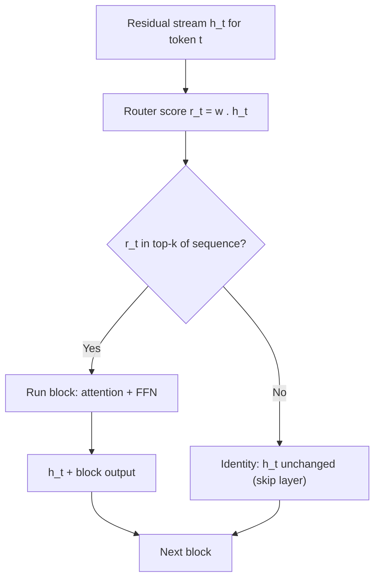
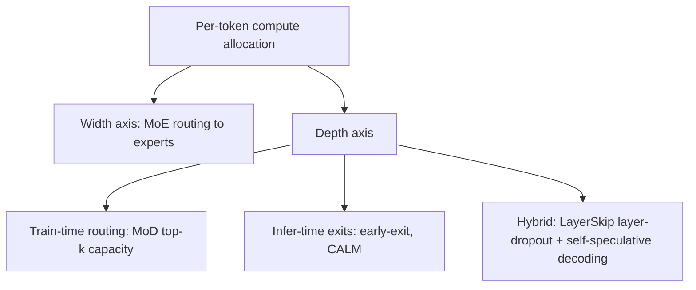

# Mixture-of-Depths and Compute Allocation in Depth

## Overview

Mixture-of-Depths (MoD) applies the MoE lesson — not every token deserves the same compute — to the *depth* axis of a transformer. Instead of routing tokens to different FFN experts (width), MoD routes them *around* entire transformer blocks: a learned per-token router decides whether a token passes through a block or skips it via the residual stream, cutting total FLOPs while keeping the parameter count fixed. Published by Meta (Raposo et al., 2024), MoD trains a 400M-class model to match a dense compute-matched baseline with ~50% of the blocks active per token, and pairs naturally with early-exit/skip-layer techniques (CALM, LayerSkip) that allocate compute per token at inference time. Interviews use this family to test whether you understand that transformers spend FLOPs unevenly across tokens — and what machinery (routers, auxiliary losses, verifier heads) makes adaptive-depth training stable.

> **Interview Angle**: The discriminator question is "MoE vs MoD — what exactly is being allocated?" MoE allocates *parameters* (which expert FFN), MoD allocates *depth* (whether this block runs for this token at all). Both are top-k routers with load-balancing problems; MoD's twist is causality.

## The MoD Mechanism: Routing Around Blocks

Each MoD block has a lightweight **router** (a linear projection, weight-shared across blocks or per-block) that scores each token. The router's objective is not "which expert" but a **compute-budget constraint**: a fixed capacity \\( c \\) (e.g., top-50%) of tokens may *participate* in the block (weighted attention/FFN); the rest bypass it entirely — the residual stream just carries them forward unchanged.

Key properties, each of which is an interview answer:

- **Fixed compute, not fixed quality**: because capacity is a hard top-k per block, FLOPs per token are constant and predictable — you can budget a 50%-depth model exactly, unlike "soft" weighting schemes.
- **Routing is sequence-relative**: top-k is taken over the whole sequence (or batch) per block, so a token's decision depends on competition with other tokens, not an absolute threshold.
- **Zero-parameter bypass**: skipped tokens consume router FLOPs only — a block skipped is a block's attention + FFN + norm compute saved.

### The causality problem and the fix

A naive top-k over the sequence leaks the future (token t's participation would depend on later tokens' scores). MoD solves it in a way that also solves the **variable tensor shape** problem: the router predicts, in a **single backward-look-free pass**, which tokens will land in top-k, then a **non-causal, batch-level selection** happens on *predicted* values with a fixed capacity — and crucially the paper's trick:

1. **Causal routing**: the router processes tokens sequentially but each token's score uses only its own hidden state; capacity selection uses an **autoregressive top-k** that respects token order.
2. **Round-to-capacity ("B" trick)**: sequence lengths are padded to multiples of the capacity constant B, so every batch has *exactly* c·L tokens through each block — fixed shapes, static graphs, no kernel-fragility from ragged tensors.

The result trains with standard dense-GPU tooling: MoD-400M matches or exceeds a FLOP-matched dense baseline (up to +2.3% on some evals in the paper) using **50% of the transformer blocks per token**, and a 6.3B MoD trained with 12.5% (1-of-8) block capacity was within ~1-2% of the compute-matched dense model — roughly **1.5× faster** FLOP-for-FLOP at eval loss parity.

## Training Dynamics: What the Router Learns

The paper's qualitative findings transfer to nearly all adaptive-compute work:

- **Tokens with low information need get skipped** — function words, mid-sentence continuations of predictable spans; high-entropy tokens (the first token after new information, punctuation boundaries in some analyses) keep full depth. The learned policy is close to an entropy-aware allocator *without any explicit entropy loss*.
- **Autoregressive top-k beats thresholding**: a fixed per-token sigmoid threshold makes compute *variable* per sequence (bad for serving) and trains worse (the router can collapse to all-skip or all-keep).
- **Router weight sharing across blocks** stabilized training in the 400M study; per-block routers are the natural choice at larger scale but need the same load-balancing care as MoE.
- No auxiliary router loss was needed in the paper's main runs — the top-k capacity constraint itself regularizes the router (contrast MoE, where load-balancing losses are standard). This is a subtle but quotable difference.

### MoE vs MoD

| Axis | Mixture-of-Experts | Mixture-of-Depths |
|---|---|---|
| What is allocated | FFN parameters (width) | Transformer blocks (depth) |
| Router output | Top-k of E experts per token | In/out of block, capacity c per sequence |
| Params vs FLOPs | Total ≫ active (Mixtral: 47B/13B) | Total = dense; active FLOPs ≪ dense |
| Auxiliary losses | Load balancing (standard) | Usually none (capacity constraint suffices) |
| Serving shapes | Static (fixed experts), kernels exist | Fixed shapes via capacity-B padding trick |
| Composability | Composes with attention variants | Composes with MoE (depth × width) |

## Follow-Ups and Adaptive-Depth Relatives

MoD sits in a lineage of per-token compute allocation that predates it and extends past it:

- **Early-exit / Depth-Adaptive Transformer** (Elbayad et al., ICLR 2020): attach exit heads at intermediate layers; tokens that satisfy a confidence criterion leave the stack early. Inference-only adaptivity; training must teach intermediate states to be "exit-ready."
- **CALM — Confident Adaptive Language Modeling** (Schuster et al., NeurIPS 2022): per-token early exit in *generation* with a calibrated confidence threshold; the paper reports ~1.5-3× decoding speedups with tiny quality deltas by exiting easy tokens after few layers. The core statistical trick: joint-confidence management across timesteps so early exits don't corrupt future conditioning.
- **LayerSkip / self-speculative decoding** (Elhoushi et al., Meta 2024): train with **layer dropout** so early layers form a usable shallow "draft" model; at inference the draft path generates several tokens and the full stack verifies them in one pass — early exit + speculative decoding fused into one checkpoint (reported ~2× decode speedup at same quality on summarization/code tasks).
- **Skip-layer-then-reroute (2025 MoD-line work)**: variants replace binary skip with *recompute-free* lightweight paths (e.g., LoRA-grade projections for skipped tokens) to reduce the quality tax of hard skipping.

## Skip-Layer and Early-Exit in One Section

The inference-time siblings of MoD share its economic premise but differ in when the decision is made:

| Technique | Decision time | Mechanism | Training change | Reported speedup |
|---|---|---|---|---|
| Mixture-of-Depths | Train + inference | Top-k router skips blocks, fixed capacity | Router projection; capacity-B padding | ~1.5× FLOP-equivalent at parity (400M/6B studies) |
| Depth-Adaptive Transformer | Inference | Exit heads at every layer | Exit-head training | Task-dependent (MT ~2× at small quality cost) |
| CALM | Inference (per generated token) | Confidence-calibrated early exit | Calibrator on intermediate states | ~1.5-3× decode |
| LayerSkip | Inference (self-speculative) | Early layers draft, full stack verifies | Layer dropout + shared exit head | ~2× decode, one checkpoint |
| Block dropping (inference hack) | Inference | Drop layers by saliency score, no training | None | Up to ~1.2-1.4× with measurable quality loss |

The engineering caveats that come up in system-design interviews: early-exit batching is awkward (different tokens at different depths ⇒ ragged compute — MoD's capacity padding exists precisely to avoid this), verification of exited tokens must preserve exactness (LayerSkip borrows speculative decoding's rejection sampling), and confidence calibration drifts under distribution shift.

## Interview Questions

1. **What exactly does Mixture-of-Depths allocate, and how does its router differ from an MoE router?**
   MoD allocates depth: per transformer block, a router picks a fixed capacity of tokens (e.g., top-50%) to run through the block; the rest bypass via the residual stream. An MoE router allocates width — which expert FFN processes the token — while every token still passes every layer. Consequences: MoD keeps parameters constant and cuts FLOPs (MoE does the reverse), MoD's router is sequence-relative top-k under a hard capacity constraint rather than expert competition, and MoD typically needs no load-balancing auxiliary loss because the capacity constraint itself regularizes routing.

2. **Why is causality a special problem for MoD routing, and how did the paper handle it?**
   If token t's participation depended on other tokens' scores in the same sequence, later tokens could influence earlier ones — a training-serving mismatch and a leakage bug. MoD's router scores each token from its own hidden state only, and the top-k capacity selection is performed autoregressively so the set of participating tokens is determined causally. Additionally, sequence lengths are padded to multiples of a constant B so exactly c·L tokens pass each block — preserving static tensor shapes, which is what makes it trainable with dense tooling and servable without ragged-batch kernels.

3. **Compare early exit (CALM) with MoD: when is each the right tool?**
   Early exit decides *at inference* how deep a token goes, using confidence heads; it requires no router training and gives variable compute per token, which complicates batching but adapts per-request difficulty. MoD bakes routing into the model at training time with fixed capacity — predictable FLOPs, static shapes, better training dynamics — but the allocation policy is frozen. CALM-style exits suit serving stacks that can handle variable-depth batches and want post-hoc speedups on existing-style models; MoD suits pretraining-budget-constrained regimes where you want a cheaper-by-construction model with predictable cost.

4. **What is LayerSkip and why combine layer dropout with speculative decoding?**
   LayerSkip trains with layer dropout so that early layers alone form a competent shallow draft of the model, and uses shared exit heads across depths. At inference, the early layers generate a draft of several tokens and the full network verifies them in a single pass using speculative decoding's rejection sampling — self-speculation with one checkpoint, no separate draft model, ~2× decode speedup on reported summarization/coding workloads. The combination solves both halves: dropout makes early exit *usable* as a draft, and speculative verification keeps the output distribution exactly correct despite shallow generation.

5. **If MoD keeps 50% of blocks, why doesn't quality collapse — what does the saved capacity go toward?**
   Because most tokens are redundant in depth: language has strong local predictability, and the residual stream already carries the token's representation forward. The paper's analyses show low-entropy, predictable tokens are preferentially skipped, while high-entropy or newly-informed tokens get full depth — compute concentrates where the loss gradient is. The capacity is effectively reallocated across the *sequence* rather than removed: each surviving token gets the same block compute as in a dense model, but fewer tokens consume it per block, so total FLOPs halve at roughly equal eval loss.

## Key Takeaways

- MoD = depth-axis MoE: a capacity-constrained top-k router decides whether each token runs each block; skipped tokens flow via the residual stream at near-zero cost.
- Fixed capacity + autoregressive selection + padding to capacity multiples = causal routing with static shapes — the engineering enabler for dense-GPU training and serving.
- Empirically: 50% capacity matches FLOP-matched dense at 400M; 1-of-8 (12.5%) capacity at 6.3B is within ~1-2% of dense eval loss (~1.5× FLOP-equivalent speedup).
- The router learns an entropy-like allocation (skip predictable tokens) with no explicit entropy loss — capacity constraint suffices, unlike MoE's load-balancing losses.
- Inference-time siblings: Depth-Adaptive Transformer, CALM (calibrated early exit, ~1.5-3×), LayerSkip (layer dropout + self-speculative verification, ~2×).
- The batching problem is the real systems cost of adaptive depth; capacity padding is the standard fix.
- MoD and MoE compose: width × depth allocation is the current frontier of per-token compute economics.

## References

- Raposo, Ritter, Richards, Lillicrap, Conway, Kurth, "[Mixture of Depths: Dynamically Deallocating Compute in Transformer-Based Language Models](https://arxiv.org/abs/2404.02258)" (Meta, 2024)
- Elbayad, Gu, Grave, Auli, "[Depth-Adaptive Transformer](https://arxiv.org/abs/1910.10073)" (ICLR 2020)
- Schuster et al., "[Confident Adaptive Language Modeling](https://arxiv.org/abs/2210.14382)" (NeurIPS 2022) — CALM
- Elhoushi et al., "[Draft & Verify: Lossless Large Language Model Acceleration via Self-Speculative Decoding](https://arxiv.org/abs/2404.16710)" (Meta, 2024) — LayerSkip
- Shazeer et al., "[Outrageously Large Neural Networks: The Sparsely-Gated Mixture-of-Experts Layer](https://arxiv.org/abs/1701.06538)" (ICLR 2017) — routing lineage
- Fedus, Zoph, Shazeer, "[Switch Transformers: Scaling to Trillion Parameter Models with Simple and Efficient Sparsity](https://arxiv.org/abs/2101.03961)" (JMLR 2022)
- Jiang et al., "[Mixtral of Experts](https://arxiv.org/abs/2401.04088)" (2024) — width-axis counterpart

## Cross-References

- [Mixture of Experts](../advanced/mixture-of-experts.md) — the width-axis sibling and its load-balancing machinery
- [MoE Routing](../moe/routing.md) — top-k routing details shared with MoD
- [Speculative Decoding (serving)](../llm-serving/speculative-decoding.md) — the verification scheme LayerSkip reuses
- [Transformer Internals](../advanced/transformer-internals.md) — where block compute sits in the serving cost model
- [Hybrid Architectures](./hybrid-architectures.md) — the other way to cut per-token FLOPs: change the sequence mixer
- [ReAct Agents](../../ml/agents/react.md) — workloads where variable-depth compute interacts with multi-step latency budgets
