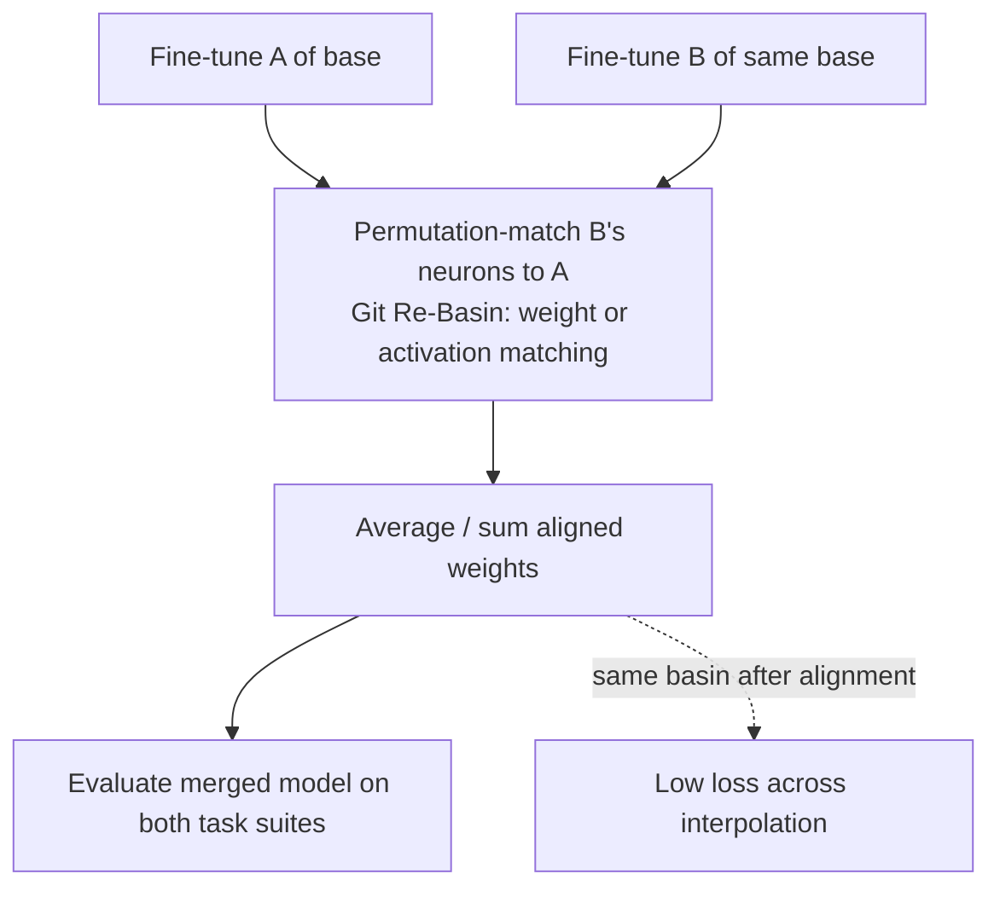
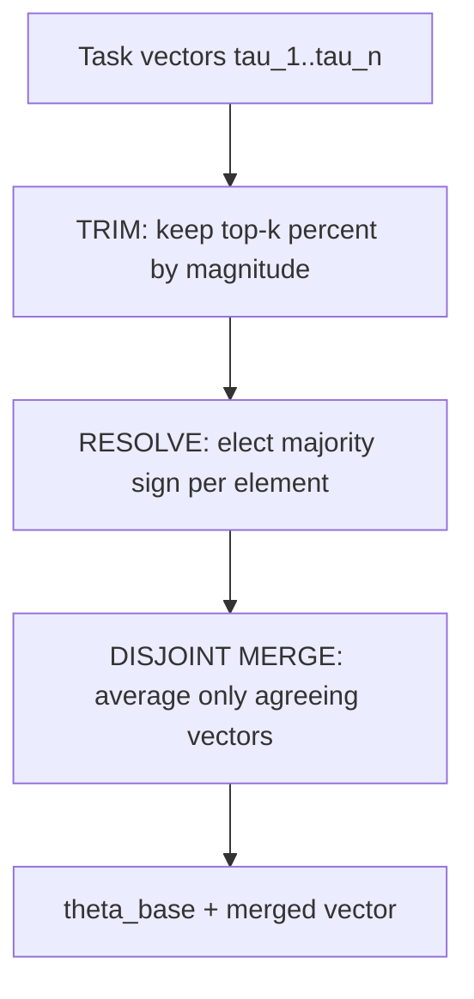

# Model Merging

## Overview

Model merging combines the weights of two or more fine-tuned models into one checkpoint that (ideally) inherits their skills — no training, no multi-task data. It works because fine-tunes of a shared base stay close to that base in weight space (fine-tuning changes are small and approximately additive), making **task arithmetic** meaningful: adding, averaging, or selectively pruning *task vectors* (Δ = fine-tuned − base). The mature toolkit is task-arithmetic (Ilharco et al., ICLR 2023), TIES-merging (NeurIPS 2023), DARE (2024), SLERP, and the **mergekit** library that implements them all as YAML configs. Interviews use merging to probe weight-space geometry (linear mode connectivity, permutation symmetries) and practical ML-ops judgment (when is merging cheaper than multi-task fine-tuning, and when does it silently fail?).

> **Interview Angle**: Expect two flavors: conceptual ("why can you add two models' weights at all?") and practical ("merge two LoRAs of the same base — what recipe?"). The first answer is task vectors + shared basin; the second is TIES/DARE defaults with magnitudes and sign-consensus pruning.

## Task Arithmetic: Weights as Skills

Ilharco et al. (2023) define the **task vector** \\( \tau = \theta_{ft} - \theta_{base} \\) and show:

- **Adding** \\( \theta_{base} + \sum_i \lambda_i \tau_i \\) produces a multi-task model (with λ≈1, up to dozens of vectors) that often beats multi-task fine-tuning at equal budget.
- **Negating** \\( \theta_{base} - \lambda\tau \\) *removes* a capability — unlearning-ish editing without retraining.
- The intuition: fine-tuning moves are small relative to pretraining displacement and largely non-interfering; the pretraining basin is wide and the task directions nearly orthogonal enough for linear combination to work.

```text
theta_merged = theta_base + lambda_1 * (theta_ft1 - theta_base)
                            + lambda_2 * (theta_ft2 - theta_base)
```

Two limitations frame every later method: **interference** (adding many vectors degrades accuracy as signs/opposing changes cancel) and **basin mismatch** (vectors from *different pretraining runs* do not live in a shared basin — averaging two Llama-2-7B fine-tunes is fine; averaging a Llama-2 and a Mistral fine-tune is not, without permutation alignment).

## Linear Mode Connectivity and Git Re-Basin

**Linear mode connectivity (LMC)**: two solutions of the same loss landscape are connected by a path of *linearly interpolated* points that stays low-loss. Frankle et al. (ICML 2020) showed LMC holds between fine-tunes **only after accounting for permutation symmetries** — two independently trained networks are equivalent up to hidden-unit reordering, and their raw weights may sit in *different* basins.

**Git Re-Basin** (Ainsworth et al., ICLR 2023) makes this practical: solve a **permutation matching** problem that aligns the neurons of model B to model A (layer-by-layer activation matching or weight matching), *then* merge. On aligned weights, naive averaging works dramatically better; the paper argues the "modular" loss basin picture — one basin up to permutation — explains both merging success and the failure of naive cross-run averaging.



For same-base LoRA/fine-tune merging (the common industrial case), runs share the base's basin and permutation alignment is usually unnecessary — LMC holds by default. Cross-run merging is where Re-Basin machinery is mandatory, and even then results are model-family-dependent.

## TIES-Merging: Trim, Resolve Signs, Disjoint Sharing

TIES (Yadav et al., NeurIPS 2023) fixed the two failure modes of naive vector addition:

1. **TRIM**: keep only the top-k% of each task vector by magnitude (e.g., k=20) — most of the Δ mass is noise-level churn.
2. **RESOLVE**: take the **majority sign** of the surviving elements across all task vectors — the sign of the *aggregate* update.
3. **DISJOINT MERGE**: for each element, average only the vectors whose sign agrees with the elected sign; discard the conflicting ones instead of letting them cancel.



TIES reported multi-task models that beat naive averaging by large margins as the number of tasks grows (its headline experiments: 20-task VisionTransformer suites where naive averaging collapses and TIES stays near dedicated-model accuracy). The knobs you tune in practice: trim ratio (denser merges → smaller k), scaling λ applied to the merged vector, and which modules to merge at all (often exclude embeddings and LM head).

## DARE: Drop And REscale

DARE (Yu et al., 2024, "Language Models are Super Mario") attacks redundancy instead of interference: most task-vector parameters are near-duplicates of base behavior. DARE **randomly drops** p fraction of Δ parameters (p=0.9 or 0.99 work for typical SFT models) and **rescales the survivors by 1/(1−p)** so the expected delta is preserved:

\\[ \Delta' = \frac{m \odot \Delta}{1 - p}, \qquad m_i \sim \mathrm{Bernoulli}(1-p) \\]

Dropped-then-rescaled vectors from multiple SFT models are then summed (with sign-consensus like TIES in the DARE-TIES variant). The striking claim: 90-99% of delta parameters can be dropped with negligible accuracy change for same-base SFT models — merging multiple SFT deltas becomes nearly free of interference. DARE is now a default preprocessing stage in mergekit recipes alongside TIES.

## SLERP: Spherical Interpolation for Two Models

SLERP (spherical linear interpolation, Shoemake 1985) interpolates *on the sphere* between two checkpoint tensors:

\\[ \mathrm{slerp}(\theta_A, \theta_B; t) = \frac{\sin((1-t)\Omega)}{\sin\Omega}\theta_A + \frac{\sin(t\Omega)}{\sin\Omega}\theta_B, \quad \cos\Omega = \frac{\theta_A \cdot \theta_B}{\|\theta_A\|\|\theta_B\|} \\]

Applied per-tensor, SLERP preserves the **norm/magnitude structure** of both parents (linear interpolation shrinks norms when the angle is wide — the geometric cause of "lerped models feel mushy") and follows the arc that stays near both parents' loss values. It is strictly a two-model method (no n-way), popularized in the open community for blending complementary 7B fine-tunes (e.g., an RP-style and a reasoning-style model at t=0.5), and it is the merge of choice when you have exactly two same-family checkpoints and want a mid-point behavior rather than a skill union.

### Method comparison

| Method | Inputs | Core operation | Best when | Failure mode |
|---|---|---|---|---|
| Task arithmetic (add/avg) | n vectors | Sum/mean of Δ + base | 2-5 same-base fine-tunes, quick wins | Interference/cancellation at larger n |
| TIES | n vectors | Trim → sign election → agree-only merge | Many tasks; collision-heavy merges | Over-trimming loses rare skills |
| DARE (+TIES) | n vectors | Random drop p, rescale, then TIES-style sum | Same-base SFT deltas, near-redundant params | Drop too aggressive on small models/tight deltas |
| SLERP | exactly 2 models | Per-tensor spherical interpolation | Two complementary checkpoints, mid-point behavior | Not n-way; needs shared base |
| Git Re-Basin | cross-run models | Permutation-align then average | Different pretraining runs of same size/arch | Matching is approximate; gains vary by family |
| Model soups | n fine-tunes (same init) | Plain weight average | Hyperparameter sweep members of one run | Not for heterogeneous tasks (that's TIES' job) |
| Linear (LoRA merge) | LoRA adapters | θ + Σ B_i A_i scaled | Standard PEFT deployment | Adapter interference across unrelated skills |

## mergekit: The Tooling

**mergekit** (Goddard et al., 2024, "MergeKit: A Toolkit for Merging Large Language Models") implements all of the above as declarative YAML. A production-flavored example — three code/math/chat SFTs of the same base, DARE-TIES:

```yaml
merge_method: dare_ties
base_model: meta-llama/Llama-2-7b-hf        # shared base is mandatory
dtype: bfloat16
parameters:
  int8_mask: true                            # sign-mask computed in int8 (memory)
  density: 0.55                              # DARE keep-ratio (1 - drop rate)
  normalize: true
models:
  - model: org/code-sft-7b
    parameters: { weight: 0.5 }
  - model: org/math-sft-7b
    parameters: { weight: 0.3 }
  - model: org/chat-sft-7b
    parameters: { weight: 0.2 }
# SLERP alternative for two models:
# merge_method: slerp; parameters: { t: [0.4, 0.6] }  (per-layer t)
```

Operational notes that separate novices from practitioners: merge in fp32/bf16 (fp16 rounding hurts sign elections), exclude `embed_tokens`/`lm_head` from merges when vocabularies were separately tuned, always evaluate the merged model on *held-out* suites for each parent skill (a merged model that regresses the weakest parent is the most common silent failure), and prefer LoRA-weight-space merges for adapters (cheaper, less interference).

## When Merging Works — and When It Fails

**Works**:

- Multiple SFTs/LoRAs of one base, each for a *different* skill (code, math, chat, languages). Task arithmetic/TIES/DARE routinely recover 90-100% of per-task performance in these settings.
- Model soups over a hyperparameter sweep of one training run — near-free accuracy gains (Wortsman et al., ICML 2022; WiSE-FT for robustness, 2022).
- Branch-Train-Merge style programs: train experts in parallel on data shards, merge (Li et al., 2022) — merging as a *distributed training strategy* rather than a post-hoc trick.

**Fails**:

- **Different bases/runs without alignment** — averaging two different 7B pretrains yields gibberish or a strong regression to one parent; Re-Basin helps but is not guaranteed.
- **RLHF/DPO-tuned pairs**: preference-optimized deltas are larger and more entangled; success is inconsistent — test before trusting community recipes.
- **Conflicting objectives** (a safety-tuned parent × a jailbreak-prone parent): merging can *average away* the safety behavior — a real alignment risk worth naming in interviews.
- **Skill interference at scale**: past ~8-10 heterogeneous vectors, expect degradation without per-vector weighting/trimming; the TIES sign election assumes roughly compatible update directions.

## Interview Questions

1. **Why is it legitimate to add two models' weights together at all?**
   Because both are fine-tunes of a shared pretrained base, and fine-tuning displaces weights by a small delta from that base. The deltas (task vectors) are approximately additive corrections in the same loss basin — linear mode connectivity means the linear path between them stays low-loss. Adding deltas composes corrections rather than mixing incompatible solutions; the pretraining provides the shared structure that makes the composition meaningful. Cross-run merges break exactly this premise, which is why they need permutation alignment (Git Re-Basin) to even begin to work.

2. **Walk through TIES-merging's three steps and what failure each fixes.**
   TRIM keeps the top-k% of each task vector by magnitude, fixing the fact that most delta components are noise that dilutes real updates. RESOLVE elects a majority sign per element across the trimmed vectors, fixing sign collisions that make sums cancel (the main cause of naive-averaging degradation at many tasks). DISJOINT MERGE averages only the vectors agreeing with the elected sign and discards the rest, preventing opposing updates from subtracting. Reported effect: multi-task merges that stay near dedicated-model accuracy where naive averaging collapses.

3. **What does DARE contribute, and why can you drop 90% of delta parameters?**
   DARE exploits redundancy: most parameters in an SFT delta are near-duplicates of base behavior or mutually substitutable, so randomly dropping a fraction and rescaling survivors by 1/(1−p) preserves the expected value of the update. Empirically p=0.9-0.99 is tolerable for same-base SFT models. After DARE, the surviving deltas are sparser, so multi-model sums interfere less — DARE is usually composed with TIES-style sign handling (DARE-TIES) and is a default stage in mergekit recipes.

4. **When would you choose SLERP over task arithmetic?**
   When you have exactly two same-family checkpoints and want a behavior *mid-point* rather than a union of skills: SLERP interpolates on the sphere, preserving tensor norms that linear averaging shrinks — that norm shrink is the geometric story behind "lerped models feel mushy." Typical use: blending a roleplay-tuned and a reasoning-tuned 7B at t=0.5. Task arithmetic/TIES remain the choice for n>2 or when the goal is skill union, since SLERP is inherently pairwise and per-tensor.

5. **You must merge a safety-tuned model with a capability-tuned model of the same base. What do you check?**
   First, evaluate both parent skills on held-out suites and the safety suite specifically — merging can average away safety behavior because safety deltas and capability deltas may be anti-correlated in weight space. Use conservative settings: low weight on the capability vector, TIES sign election with int8 masks, exclude embeddings/head, keep density moderate. Verify with adversarial/red-team prompts, not just benchmark averages. And consider the alternative: merge capability models first, then apply a light safety fine-tune on top — ordering matters because later training dominates behavior.

6. **How does merging show up as a training strategy rather than a post-hoc trick?**
   Branch-Train-Merge: fork a base into expert copies trained in parallel on disjoint data shards with no communication, then merge the deltas — embarrassingly parallel multi-task/domain training with merge as the reduction step. Model soups similarly treat averaging as a free ensemble: average the weights of a hyperparameter sweep's members and often beat the best individual. Both rely on the same shared-basin/additivity property; in interviews this reframes merging from a hack into a design option for distributed or budget-constrained training programs.

## Key Takeaways

- Task vectors (Δ = fine-tuned − base) are approximately additive within a shared pretraining basin — that additivity is the entire foundation of merging.
- TIES = trim magnitude → elect majority sign → merge agreeing vectors only; fixes cancellation that makes naive averaging collapse beyond a few tasks.
- DARE = random-drop p + rescale 1/(1−p); exploits SFT delta redundancy (p=0.9-0.99) and composes with TIES.
- SLERP = two-model spherical interpolation preserving norms; choose it for behavioral mid-points, not skill unions.
- LMC/Git Re-Basin: same-run fine-tunes share a basin by default; cross-run merges need permutation alignment and remain unreliable.
- mergekit operationalizes everything as YAML; merge in bf16+, mask int8, exclude embed/head when tuned, and always evaluate per-parent held-out suites.
- Merging fails across different bases, inconsistent RLHF deltas, and conflicting objectives — safety behavior can be averaged away, which is an alignment risk to state explicitly.

## References

- Ilharco et al., "[Editing Models with Task Arithmetic](https://arxiv.org/abs/2212.04089)" (ICLR 2023)
- Yadav et al., "[TIES-Merging: Resolving Interference When Merging Models](https://arxiv.org/abs/2306.01708)" (NeurIPS 2023)
- Yu et al., "[Language Models are Super Mario: Absorbing Abilities from Homologous Models as a Free Lunch](https://arxiv.org/abs/2311.03099)" (2024) — DARE
- Wortsman et al., "[Model soups: averaging weights of multiple fine-tuned models improves accuracy](https://arxiv.org/abs/2203.05482)" (ICML 2022)
- Wortsman et al., "[Robust fine-tuning of zero-shot models](https://arxiv.org/abs/2109.01903)" (CVPR 2022) — WiSE-FT
- Frankle et al., "[Linear Mode Connectivity and the Lottery Ticket Hypothesis](https://arxiv.org/abs/1912.05671)" (ICML 2020)
- Ainsworth, Hayase, Srinivasa, "[Git Re-Basin: Merging Models modulo Permutation Symmetries](https://arxiv.org/abs/2209.04836)" (ICLR 2023)
- Li et al., "[Branch-Train-Merge: Embarrassingly Parallel MultiTask Training](https://arxiv.org/abs/2208.03306)" (2022)
- Goddard et al., "[MergeKit: A Toolkit for Merging Large Language Models](https://arxiv.org/abs/2406.11537)" (2024)
- mergekit repository: [github.com/arcee-ai/mergekit](https://github.com/arcee-ai/mergekit)

## Cross-References

- [LoRA](../advanced/lora.md) — the adapter structure whose deltas merging composes
- [QLoRA](../advanced/qlora.md) — budget fine-tuning that feeds most real-world merge pipelines
- [RLHF](../llm-serving/rlhf.md) — the preference-tuning stage whose deltas merge least reliably
- [Distillation](../../ml/advanced/distillation.md) — the alternative way to combine model capabilities (data-space, not weight-space)
- [Mixture of Experts](../advanced/mixture-of-experts.md) — learned per-token combination of submodels vs static weight-space combination
- [Model Serving Architecture](../llm-serving/architecture.md) — where merged checkpoints land operationally
