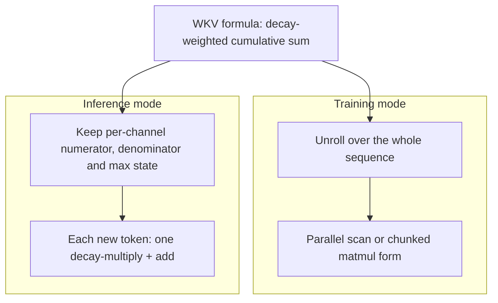
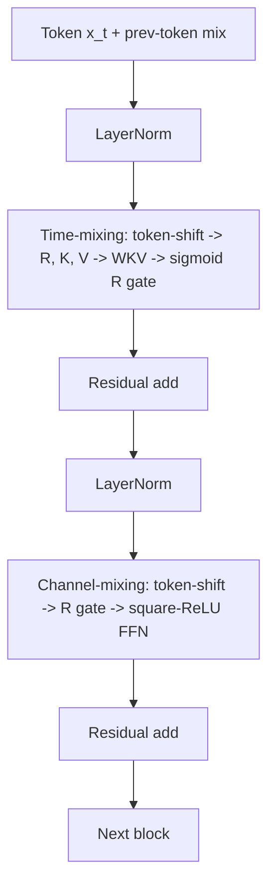

# RWKV (Attention-RNN Hybrid)

## Overview

RWKV (R-eceptance W-eighting K-ey V-alue) is the most battle-tested "attention-free" language model lineage: a transformer-style network whose sequence mixer, the **WKV operator**, behaves like attention during training (parallel over the sequence) but like an RNN during inference (constant-memory recurrence). Started by Bo Peng (BlinkDL) as a community effort and published at EMNLP 2023 Findings, RWKV-4 matched same-size GPT-2/3-class dense models on the Pile, and RWKV-5 "Eagle" / RWKV-6 "Finch" upgraded the state from vectors to matrices with data-dependent decay, closing much of the quality gap with Mamba-class models. For interviews, RWKV is the cleanest example of a *train-parallel / infer-recurrent* architecture and a case study in community-driven model development (everything is Apache 2.0, trained and released openly).

> **Interview Angle**: "RWKV and attention — same or different?" is a favourite discriminator. The correct answer: RWKV replaces softmax(QKᵀ)V with a linear, decay-weighted cumulative sum, which can be computed recurrently with O(1) state per layer — it is a first cousin of linear attention and (post-SSD) of Mamba-2.

## AFT Lineage: Attention Free Transformer

RWKV descends from Apple's **Attention Free Transformer (AFT)** (Zhai et al., 2021). AFT replaces attention with a position-weighted average of values:

\\[ y_t = \sigma(q_t) \odot \frac{\sum_{i=1}^{t} \exp(k_i + w_{ti})\, v_i}{\sum_{i=1}^{t} \exp(k_i + w_{ti})} \\]

where \\( w_{ti} \\) is a learned, shared relative-position bias. The key observation is that the softmax weights no longer depend on \\( q_t \\) — so the denominator/numerator sums can be accumulated incrementally. AFT-simple, AFT-conv (local bias), and AFT-ocl variants trade off locality and cost; all remove the \\( QK^\top \\) matrix entirely.

RWKV's insight was to restructure AFT into a formulation where the per-position weights factor into a product of per-token learnable gates — the **R (receptance) and K (key) vectors** — so the whole sequence mixing becomes a small set of *linear recurrences over channels*. That factorization is what turns "trainable in parallel" into "inferable in O(1) per token".

## The WKV Operator: Attention and RNN at Once

The RWKV-4 time-mixing channel computes, for each channel \\( c \\) (independently):

\\[ wkv_t = \frac{\sum_{i=1}^{t-1} e^{-(t-1-i)\,w + k_i}\, v_i + e^{u + k_t}\, v_t}{\sum_{i=1}^{t-1} e^{-(t-1-i)\,w + k_i} + e^{u + k_t}} \\]

- \\( w \\): learned per-channel decay (negative) — the memory horizon of that channel.
- \\( u \\): learned per-channel bonus for the current token (a "focus" term).
- \\( k_i, v_i \\): key and value vectors, exactly analogous to attention.
- The numerator is a decay-weighted sum of all past values: **attention-like read** of the entire history.

Two computation modes of the same formula:



During **training**, the operator is computed in parallel (a scan over \\( t \\) — RWKV ships both a serial-per-position CUDA kernel and a chunked parallel form). During **inference**, per channel we keep just the numerator state \\( a \\), denominator state \\( b \\), and a running max for the exp-shift trick:

```python
def wkv_step(state, k, v, w, u):
    a, b, p = state                      # numerator, denominator, running max
    wc = max(p, u + k)                   # numerically safe exp
    e1 = exp(p - wc); e2 = exp(u + k - wc)
    y = (a * e1 + e2 * v) / (b * e1 + e2)   # attention-like read of history
    wp = w                               # decay for the *past* accumulator
    wn = max(p + wp, k)                  # fold current token into state
    a = a * exp(p + wp - wn) + v * exp(k - wn)
    b = b * exp(p + wp - wn) + exp(k - wn)
    p = wn
    return y, (a, b, p)
```

That is the whole magic: **softmax attention's output can be expressed as a recurrence with O(1) state** once the query-dependence of the weights is removed. Memory per token drops from O(N) (KV cache) to a handful of vectors; compute per token from O(N) to O(D).

## The Full Block: Time-Mixing + Channel-Mixing

An RWKV block is a two-branch residual unit in transformer-block clothing:



Signature components:

- **Token shift** (time-first mixing): each projection mixes the current and previous token's features (`x_t * μ_xr + x_{t-1} * (1 - μ_xr)`), injecting adjacent-token context into every projection — a cheap, learnable replacement for part of attention's locality role.
- **Receptance gating**: output is multiplied by `sigmoid(r)` — a learned per-channel gate, structurally like GLA's gating and Mamba's SiLU gate.
- **Squared ReLU** channel-mixing FFN (GPT-2 era choice; later versions keep the same block layout with bigger hidden states).

### Versions: RWKV-4 → Eagle → Finch

| Version | State | Sequence mixer change | Scale trained | Notes |
|---|---|---|---|---|
| RWKV-4 (2023 paper) | Vector per channel | WKV with learned decay `w`, token shift | 14B on the Pile | First transformer-parity claim; EMNLP 2023 Findings |
| RWKV-5 "Eagle" | **Matrix** per channel (head dim 64) | Multi-headed WKV; state is a matrix `S` | 0.19B-7.5B | State capacity jumps from D to D×64; Lion optimizer |
| RWKV-6 "Finch" | Matrix + **data-dependent decay** | Decay becomes `exp(-softplus(a·b + w))` (token-dependent, like selective Δ) | 0.19B-14B | Dynamic recurrence; matches Mamba-2-class results on comparable data |
| RWKV-7 "Goose" (2025) | Generalized delta-rule state | In-context learning rates; expressivity beyond TC0 claims | Community releases | Research-stage; check repo for status |

The Eagle/Finch recurrence in matrix form: \\( S_t = \mathrm{diag}(d_t)\, S_{t-1} + k_t v_t^\top \\), read out as \\( y_t = r_t^\top S_t \\) — the same shape as linear attention's fast-weight matrix and GLA's gated update; Finch adds data-dependent \\( d_t \\). This convergence is worth stating explicitly in interviews: **RWKV-6, Mamba, GLA, and DeltaNet all landed on "gated matrix-valued state with input-dependent decay"** from different starting points.

## O(N) Inference Characteristics

- **State size**: RWKV-4 keeps ~3 vectors per layer per channel; Eagle/Finch keep one 64×64 matrix per head per layer. For a 7B-class Finch model this is single-digit GB in fp16 — versus a Llama-7B KV cache of ~14-16 GB at just 16K context (MHA-equivalent math; GQA variants lower it).
- **Throughput**: decode cost per token is one matvec against a fixed-size state — no attention over growing history, so latency does not drift upward with context length. Streaming generation to 100K+ tokens costs the same per token as token 1.
- **Prefill**: training-mode kernels process the prompt in parallel like a transformer, so prompt ingestion is not sequential.
- **Deployment**: runs everywhere RNNs run — CPU, WASM, on-device; the community's rwkv.cpp and web demos exploit the small constant state. Quantized (4-bit) RWKV models are a common edge demo because state, not cache, is the whole memory footprint.

## Community and Ecosystem

RWKV is unusual: an Apache 2.0, fully open foundation model program run by a volunteer community (the RWKV Foundation), with models, data recipes, and training logs published. Practical touchpoints:

- `BlinkDL/RWKV-LM` — reference implementation (PyTorch), CUDA WKV kernels, chat demos.
- Hugging Face Transformers has native `RwkvForCausalLM` support (RWKV-4/5/6 checkpoints load directly).
- rwkv.cpp / RWKV-CUDA / WebGPU ports for CPU and browser inference; LoRA fine-tuning tooling and a Japanese-language branch (CrowNiskey's releases) among many community derivatives.
- Papers: RWKV-4 (Peng et al., EMNLP 2023 Findings), Eagle & Finch (Peng et al., 2024).

The honest ecosystem caveat vs Llama-family: tooling breadth (serving systems, quantization suites, agent frameworks) is thinner, and the largest community-scale checkpoints trail frontier dense/MoE models on knowledge-heavy benchmarks; RWKV's niche is constant-memory streaming and edge deployment.

## Interview Questions

1. **Explain why removing the query from the attention weights makes O(1) inference possible.**
   In softmax attention the weight on value i depends on both the query at t and the key at i (q_t·k_i), so nothing can be accumulated before the query exists — you must store all K/V and recompute at every step. In AFT/RWKV the weights depend only on the key/position (k_i and the decay), so the weighted sum over values can be maintained as a running accumulator: each new token multiplies the accumulator by a decay and adds its own contribution. The output at t is then just a normalized read of that accumulator — a constant-size state, i.e., an RNN that was trained in parallel.

2. **What changed from RWKV-4 to RWKV-5/6, and why did it matter?**
   Two upgrades. RWKV-5 "Eagle" moved the recurrent state from a per-channel vector to a per-head 64×64 matrix (S_t = diag(d)S_{t-1} + k v^T), multiplying state capacity — the vector version saturates when too many facts must be remembered. RWKV-6 "Finch" made the decay data-dependent (exp(-softplus(a·b + w))), letting the model choose per token whether to hold or forget, the same "selectivity" Mamba introduced. Both changes are the same ones linear-attention and SSM lines converged on; they recovered quality while keeping the O(N) train-parallel / O(1) infer-recurrent profile.

3. **Compare RWKV's WKV operator with Mamba's selective scan.**
   Both are input-gated recurrences computed by parallel scans with O(1) inference state. Differences: WKV's state is a normalized weighted sum of values (an EMA-flavored attention read), with decay w learned per channel (Finch: per token); Mamba's state is a matrix h updated with Δ-scaled Ā, B̄ and read through C, with Δ controlling the timescale per channel per token. RWKV keeps an explicit current-token bonus u and receptance gate; Mamba uses a SiLU gate and conv mixing. Post-SSD (Mamba-2), both are understood as points in the gated-linear-attention family with scalar decays; the differences are largely parameterization.

4. **When would you actually deploy RWKV instead of a Llama-class model?**
   When memory-per-token or unbounded streaming dominates: always-on agents generating for hours (no cache growth), edge/mobile deployment (constant few-GB state, runs via rwkv.cpp on CPU), and high-concurrency chat with very long histories where KV cache economics kill batch sizes. It is the wrong pick when the workload is recall-heavy over long documents (exact retrieval of needles) or when you need the dense-model ecosystem (serving stacks, quantization, fine-tuning recipes). Hybrids cover the middle ground better today.

5. **What are RWKV's known failure modes?**
   The fixed-size state compresses history, so verbatim recall and copying degrade as the number of remembered items grows (same MQAR/copying gap as SSMs — WKV is a linear-attention read). Time-invariant decay in RWKV-4 limited long-range fidelity; matrix states and data-dependent decay (v5/v6) narrowed but did not eliminate it. Community-scale training also means data quality and scale lag the frontier: smaller effective world knowledge, and benchmark behavior is more sensitive to tokenizer/chat-template mismatches.

## Key Takeaways

- RWKV = AFT lineage restructured into gated linear recurrences; the WKV operator is "attention without the query" — trainable in parallel, inferable in O(1) state.
- The core trick: factor attention weights into per-token key/decay terms so the value sum becomes an accumulator; softmax normalization follows incrementally.
- RWKV-5/6 upgraded the state to matrices with data-dependent decay — the same "gated matrix state" design GLA, DeltaNet, and Mamba-2 converged on.
- Constant per-token memory and latency: no KV cache growth; the model streams indefinitely at fixed cost.
- Matrix-valued state (Eagle) was the capacity fix; data-dependent decay (Finch) was the selectivity fix — expect both to come up as "what fixed RWKV's weaknesses".
- Ecosystem: Apache 2.0 community program, native HF Transformers support, rwkv.cpp for edge; thinner serving tooling than Llama-family.
- Recall/copying gaps mirror other fixed-state models — the architecture's ceiling, not a bug.

## References

- Peng et al., "[RWKV: Reinventing RNNs for the Transformer Era](https://arxiv.org/abs/2305.13048)" (EMNLP 2023 Findings)
- Peng et al., "[Eagle and Finch: RWKV with Matrix-Valued States and Dynamic Recurrence](https://arxiv.org/abs/2404.05892)" (2024) — RWKV-5/6
- Zhai et al., "[An Attention Free Transformer](https://arxiv.org/abs/2108.04040)" (Apple, 2021) — AFT lineage
- Katharopoulos et al., "[Transformers are RNNs: Fast Autoregressive Transformers with Linear Attention](https://arxiv.org/abs/2006.16236)" (ICML 2020) — the linear-attention cousin
- Yang et al., "[Gated Linear Attention Transformers with Hardware-Efficient Training](https://arxiv.org/abs/2312.06635)" (ICML 2024) — the shared gated-matrix-state family
- Dao & Gu, "[Transformers are SSMs](https://arxiv.org/abs/2405.21060)" (ICML 2024) — duality framing that subsumes WKV-style recurrences
- RWKV reference implementation: [github.com/BlinkDL/RWKV-LM](https://github.com/BlinkDL/RWKV-LM)

## Cross-References

- [Mamba / SSM](./mamba-ssm.md) — the selective-scan sibling of the WKV recurrence
- [Linear Attention Variants](./linear-attention-variants.md) — GLA/DeltaNet/Based share RWKV's gated-state design space
- [SSM vs Attention](./ssm-vs-attention.md) — the recall gap that bounds all fixed-state models, RWKV included
- [Transformer Internals](../advanced/transformer-internals.md) — KV-cache economics that RWKV's O(1) state eliminates
- [RNN/LSTM](../../ml/deep-learning/rnn-lstm.md) — the recurrence lineage RWKV "reinvents" with train-parallel kernels
- [Position Encoding](../advanced/position-encoding.md) — how attention handles order that RWKV's decay/shift replaces
