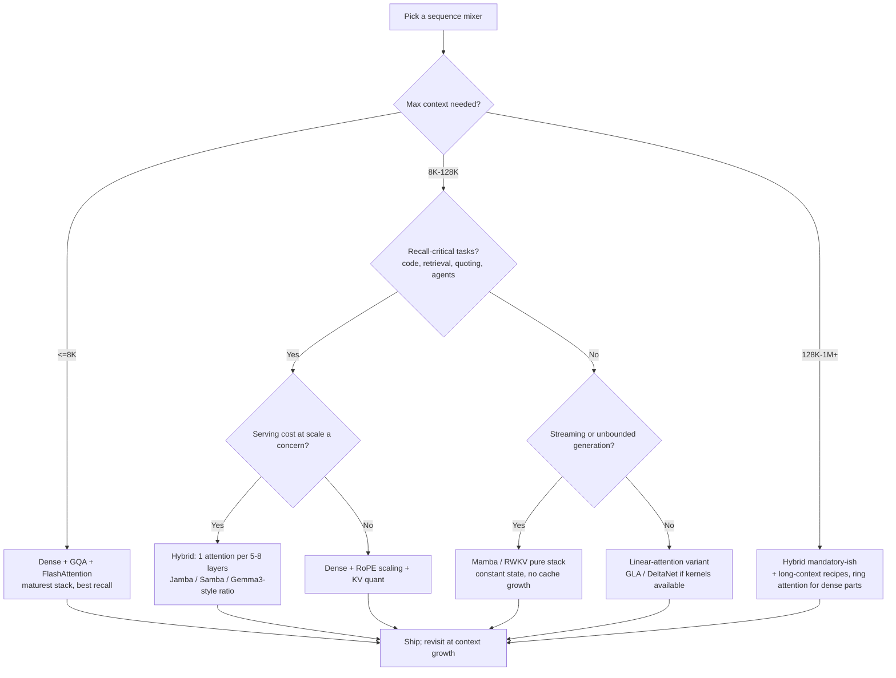

# SSM vs Attention: The Decision Page

## Overview

This is the decision-oriented comparison: given a workload, a budget, and a context-length target, which sequence-mixing architecture should you pick — softmax attention, a state space model (Mamba-class), a linear-attention variant, or a hybrid? The answer is governed by four measurable quantities: **compute scaling** (O(N²) vs O(N) prefill), **state growth** (KV cache O(N) vs fixed-size), **recall fidelity** (exact vs compressed — where the MQAR/copying results bite), and **kernel maturity** (FlashAttention's five-year head start vs the newer scan kernels). This page consolidates the numbers from the deep-dive pages into one comparison and a decision tree; read [mamba-ssm.md](./mamba-ssm.md), [linear-attention-variants.md](./linear-attention-variants.md), and [hybrid-architectures.md](./hybrid-architectures.md) for mechanism detail.

> **Interview Angle**: The question is rarely "which is better" — it is "which is better *for this workload*, and what evidence would change your mind?" Anchor every answer in the four quantities above, not in benchmark folklore.

## The Cost Model, Concretely

Let \\( N \\) = context length, \\( d \\) = hidden dim, \\( L \\) = layers, \\( n_{kv} \\) = KV heads, \\( d_h \\) = head dim, \\( N_{state} \\) = SSM state width per channel.

| Quantity | Softmax attention | Mamba-class SSM | Formula notes |
|---|---|---|---|
| Prefill FLOPs (mixer) | O(N²d) | O(N·d·N_state) | Attention: N² pair scores; SSM: scan over state per channel |
| Prefill at N=128K, d=4096 | ~64× the N=16K cost | 8× the N=16K cost | Quadratic vs linear: 128²/16² = 64 |
| Decode state (bytes/token) | 2·L·n_kv·d_h·bytes (grows) | L·d·N_state·bytes (fixed) | GQA-8, 32 layers, fp16: ~131 KB/token vs ~MBs total |
| Decode bandwidth/token | Read the whole KV cache | One state update | Bandwidth-bound decode is where attention hurts |
| Training parallelism | Full (FlashAttention) | Full (parallel scan / chunked) | Both saturate GPUs in 2024+ kernels |

Worked example (7B-class model, 32 layers, GQA-8, d_h=128, fp16): KV cache at 16K context ≈ 2 GB; at 128K ≈ 17 GB — per sequence. The Mamba equivalent keeps a constant ~2-4 GB of state regardless of context. This single arithmetic line is why long-context serving economics drove the hybrid wave: see [hybrid-architectures.md](./hybrid-architectures.md).

## The Recall Gap: MQAR, Copying, and State Capacity

The clearest qualitative difference is not speed — it is what happens to **associative recall** as the amount of required memory grows:

- **MQAR (multi-query associative recall)** — the Zoology benchmark (Arora et al., 2023): place key-value pairs in the prompt, then query them. Transformer accuracy is flat as pairs grow (the cache stores everything); linear/SSM accuracy degrades once required memory exceeds the model's effective state capacity. The Based paper formalized this: recall is governed by the **rank of the feature map / state**, which is why polynomial sketches help.
- **Copying** — "Repeat After Me" (Jelassi et al., ICML 2024): transformers can copy arbitrarily long spans via induction heads; SSMs with fixed state cannot (formally bounded), and the gap *widens* with length and vocabulary size. Code generation, quoting, and citation-style tasks inherit this weakness.
- **State tracking** — Merrill et al. (ICML 2024, "Illusion of State"): fixed-size-state models cannot express certain state-tracking languages that attention-with-CoT can; empirical gaps on parity/stack-style tracking tasks exist even at 2B scale, though small in many workloads.

The fair counterpoint: on **perplexity at long context and language modeling overall**, SSMs are competitive-to-better at ≤3B, and *most* real prompts do not require 100-pair exact recall. The gap is workload-conditional, not universal — which is exactly why the decision tree matters more than a winner.

## Throughput and Latency at Long Context

Published numbers to anchor the trade (each from its paper's setup — treat as regime-specific):

| Claim | Source setup | Number |
|---|---|---|
| Mamba-3B unbatched decode ~5× transformer-3B | Mamba paper, A100, 3B pair | ~135 vs ~60 tok/s |
| Mamba-2 trains 2-8× faster than Mamba-1 at same quality | SSD paper, ≤7B, Chinchilla protocol | 2-8× |
| Jamba ~3× throughput vs Mixtral-class at 128K | Jamba paper, long-context serving | up to 3× |
| Jamba fits 256K on one 80 GB GPU | Jamba-1.5-large (52B/9B active) | single-GPU claim |
| RecurrentGemma ~2-3× lower peak memory at 8K+ | Griffin paper/RecurrentGemma report | 2-3× |
| Samba near-flat perplexity to 1M tokens | Samba paper, PG19-style continuation | 1M-token extrapolation |
| Based ~8× throughput vs dense at matched quality, 8K+ | Based paper, linear path | up to ~8× |

Read these as one pattern: **at short context (≤8K) the families are within noise of each other** (FFN dominates FLOPs; FlashAttention is excellent); **past 32-128K, state growth dominates everything**, and any architecture that stops growing state wins disproportionately — which is the hybrid thesis.

## The Decision Tree

## When to Pick What: The Cheat Sheet

| Workload signature | Recommended architecture | Why | Existence proof |
|---|---|---|---|
| Chat/search ≤8K, high concurrency, quality-max | Dense + GQA/MLA | Kernel maturity, exact recall, cheap at this N | Llama-3, Qwen2.5 serving fleets |
| 8K-128K, recall-heavy (code, RAG, agents) at scale | Hybrid (1:7-1:8 attention:mixer) | 4-8× cache cut without recall loss | Jamba, Samba, NVIDIA 8B study |
| Streaming, unbounded generation, edge | Pure SSM (Mamba/RWKV) | Constant state and latency forever | rwkv.cpp edge demos, Mamba streaming |
| Multi-million-token context | Hybrid + long-context training; ring attention if pure-dense mandated | State growth is the binding constraint | Gemini 1.5 regime, Jamba 256K, LongRoPE |
| Summarization-style long input → short output, quality-tolerant | Linear attention / SSM | Prefill-linear dominates benefit; recall needs modest | Based, Mamba papers' LM results |
| Verbatim quoting/copying is the product | Dense attention (keep it) | Copying is formally hard for fixed state | Repeat After Me analysis |

## Hybrid as the Default Answer — and Its Caveats

The 2024-2025 literature converges on hybrids as the safest long-context choice, but carry the caveats:

1. **Ratio sensitivity is real but shallow**: 1-in-5 to 1-in-8 attention works across studies; below ~10% attention, needle/recall tasks degrade (NVIDIA 8B study); the margin to tune is not razor-thin.
2. **Tooling tax**: quantization, PEFT, and some serving paths are attention-first; hybrid kernels (FLA, mamba-ssm, vLLM's Mamba support) are good and improving but younger.
3. **Frontier-scale evidence is thin**: the strongest public >100B models are still dense/MoE-transformers; hybrid claims above ~50B total params rest on Jamba and MiniMax-01.
4. **Recall needs scale with product surface**: agentic workloads that quote code or documents push you back toward more attention layers than the minimum ratio.

## Interview Questions

1. **State the four quantities that decide attention vs SSM for a workload.**
   (1) Prefill compute: O(N²d) vs O(N·d·N_state) — matters past ~32K. (2) State growth: KV cache O(N) per token vs fixed-size state — dominates decode economics at long context. (3) Recall fidelity: exact (lossless cache) vs compressed (bounded state) — shows up on MQAR-style retrieval and copying. (4) Kernel/tooling maturity: FlashAttention-class polish vs younger scan kernels. Any defensible answer maps the workload onto these four and picks accordingly; everything else is benchmark folklore.

2. **Why do pure SSMs lose on associative recall but win on throughput — and why is that not contradictory?**
   They are different resources. Recall quality depends on how much *information about the past* the model can store losslessly: attention's KV cache grows with context, SSM state does not, so beyond capacity, SSM answers degrade (Zoology/Based, Repeat After Me). Throughput depends on *how much data must move* per token: attention reads a growing cache (bandwidth-bound decode), an SSM updates a fixed state. One architecture trades memory growth for speed; the other trades exactness. Contradiction would only arise if recall required more state than attention uses — it does not; attention is simply willing to pay for lossless storage.

3. **A team proposes replacing all attention layers with Mamba blocks in your 8B product model. What is your review?**
   Push back toward a hybrid. Evidence: pure-Mamba models at 8B lag on MMLU and recall/copy-heavy tasks (NVIDIA empirical study) while attention-every-5-8-layers hybrids match transformer quality; copying and code-retrieval gaps would hit the product where users notice. Keep ~12-20% attention layers (Jamba 1:7, Griffin 1:4-local, Gemma 3 1:6-global ratios), retain RoPE scaling and KV quantization for the surviving cache, and validate with depth-aware retrieval benchmarks (NIAH variants, RULER) plus your real workload traces before rollout.

4. **When is O(N²) attention actually fine, and what kills it in practice?**
   At N ≤ 8K, quadratic attention with FlashAttention is rarely the bottleneck: FLOPs are affordable, SRAM-resident kernels are near-IO-optimal, and the KV cache at 8K for a GQA-8 7B model is ~1 GB — manageable with paging and quantization. What kills it: (a) prefill cost grows 64× from 16K to 128K (quadratic), (b) decode reads the whole cache every token, so latency and batch-size ceilings scale with N, and (c) many concurrent long sequences multiply (b) into a memory wall. The failure is state growth and memory traffic, not the arithmetic itself.

5. **What evidence would make you revisit a hybrid choice in production?**
   Signals to monitor: recall-style failure rates in real prompts (quoting, identifier reuse, multi-hop references) rising as prompts lengthen — would justify more attention layers or stronger hybrid ratios; serving telemetry showing FFN/scan compute — not cache bandwidth — dominating decode, which would justify going further pure-SSM; and benchmark releases of pure-linear models closing the MQAR/copying gap at your scale. The decision is reversible at the ratio level (add/remove attention layers and retrain), so treat the architecture as a tunable operating point backed by measurement, not a one-time bet.

## Key Takeaways

- Decide on four quantities: prefill scaling, state growth, recall fidelity, kernel maturity — everything else follows.
- Attention: lossless O(N) state, exact recall, quadratic prefill; SSM/linear: fixed state, linear cost, bounded recall — the trade is structural, not tunable.
- MQAR/copying/state-tracking results are the evidence base for recall gaps; perplexity comparisons understate them.
- At ≤8K the families tie (FlashAttention + FFN dominance); past 32-128K, state growth dominates and fixed-state architectures win disproportionately.
- Hybrids with 12-20% attention layers are the empirical sweet spot: recall parity with 4-8× smaller caches (Jamba, Samba, Griffin, Gemma 3 ratios).
- Copying/verbatim workloads formally favor dense attention; streaming/edge workloads favor pure SSMs; the middle belongs to hybrids.
- Treat the architecture as a reversible operating point: monitor recall failures and serving telemetry, and retune the attention ratio with evidence.

## References

- Gu & Dao, "[Mamba: Linear-Time Sequence Modeling with Selective State Spaces](https://arxiv.org/abs/2312.00752)" (COLM 2024)
- Dao & Gu, "[Transformers are SSMs: ... Structured State Space Duality](https://arxiv.org/abs/2405.21060)" (ICML 2024)
- Arora et al., "[Zoology: Measuring and Improving Recall in Efficient Language Models](https://arxiv.org/abs/2312.04927)" (2023) — MQAR
- Arora et al., "[Simple linear attention language models balance the recall-throughput tradeoff](https://arxiv.org/abs/2402.18668)" (ICML 2024) — Based
- Jelassi, Brandfonbrener, Kakade, Malach, "[Repeat After Me: Transformers are Better than State Space Models at Copying](https://arxiv.org/abs/2402.01032)" (ICML 2024)
- Merrill, Petty, Sabharwal, "[The Illusion of State in State-Space Models](https://arxiv.org/abs/2404.08819)" (ICML 2024)
- Waleffe et al., "[An Empirical Study of Mamba-based Language Models](https://arxiv.org/abs/2406.07887)" (NVIDIA, NeurIPS 2024)
- Lieber et al., "[Jamba: A Hybrid Transformer-Mamba Language Model](https://arxiv.org/abs/2403.19887)" (AI21 Labs, 2024)
- De et al., "[Griffin: Mixing Gated Linear Recurrences with Local Attention for Efficient Language Models](https://arxiv.org/abs/2402.19427)" (DeepMind, 2024)
- Ren et al., "[Samba: Simple Hybrid State Space Models for Efficient Unlimited Context Language Modeling](https://arxiv.org/abs/2406.07522)" (Microsoft, 2024)
- Hoffmann et al., "[Training Compute-Optimal Large Language Models](https://arxiv.org/abs/2203.15556)" (2022) — Chinchilla
- Hsieh et al., "[RULER: What's the Real Context Size of Your Long-Context Language Models?](https://arxiv.org/abs/2404.06654)" (COLM 2024)

## Cross-References

- [Mamba / SSM](./mamba-ssm.md) — mechanism detail for the SSM side of this comparison
- [Linear Attention Variants](./linear-attention-variants.md) — the GLA/DeltaNet/Based family and chunked parallel form
- [Hybrid Architectures](./hybrid-architectures.md) — the pragmatic middle this page often recommends
- [FlashAttention](../advanced/flash-attention.md) — the kernel economics keeping dense attention competitive
- [KV Cache (serving)](../llm-serving/kv-cache.md) — the memory math behind the state-growth argument
- [Ring Attention](../advanced/ring-attention.md) — the distributed dense-attention escape hatch for 1M+ contexts
