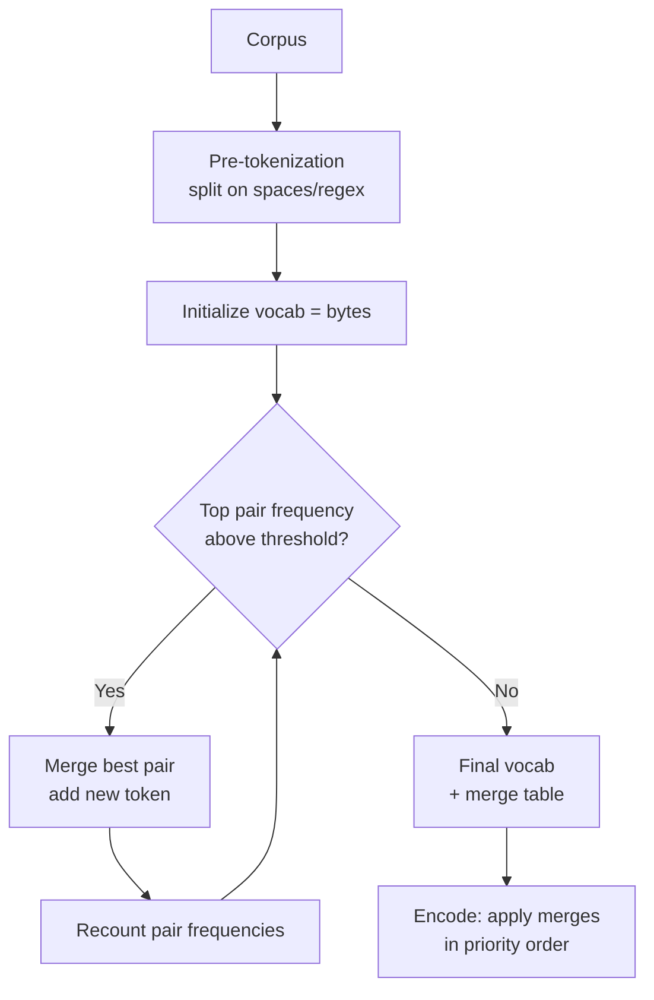
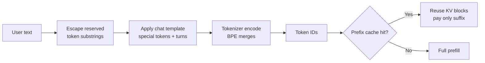

# Tokenizer Internals

## Overview

The tokenizer is the byte-level contract between text and the model: it decides what a "token" is, and therefore how many KV cache slots your prompt costs, why `"multiplied by three"` sometimes outperforms `"×3"`, and why German text costs 30-50% more than English at the same price. Despite being trivially small next to the model itself, tokenizer choices shape quality (arithmetic failures, code glitches), latency (tokens per second is a *tokenizer-dependent* number), and cost (billing is per token). Interviewers use tokenizer questions to test whether you understand that LLMs do not see characters — and that many "the model is dumb" anecdotes are actually tokenization artifacts.

> **Interview Angle**: The killer detail is fertility: the ratio of tokens to words (or characters) per language. The strongest answers connect tokenizer design to measurable system effects — KV cache size, TTFT for long prompts, cost per language — not just to the training algorithm.

## The Three Tokenizer Families

| Family | Mechanism | Used by | Notes |
|---|---|---|---|
| BPE (byte-level) | start from bytes, greedily merge most frequent pairs | GPT-2, GPT-4 (`cl100k`), Llama 3 (`tiktoken`-style) | any byte sequence representable; no UNK ever |
| WordPiece | greedy longest-match against learned vocab, `##` continuation markers | BERT, DistilBERT | needs `##` machinery; UNK possible |
| Unigram (SentencePiece) | start large, prune tokens that least raise likelihood; sampling-based segmentation | T5, Llama 1/2 (SP), many multilingual models | probabilistic segmentation; can sample sub-segmentations |
| Character / byte fallback | per-character or raw bytes for OOV | GPT-2 (bytes), SentencePiece `--byte_fallback` | handles any input; long sequences for rare scripts |

The BPE training loop is the whole algorithm: count adjacent pairs, merge the most frequent, repeat until the vocabulary reaches its target size (e.g. 50k-256k). Byte-level BPE (GPT-2's innovation) runs the same loop over *bytes* mapped to printable unicode placeholders, which guarantees round-trip fidelity — you can tokenize any file, emoji included, without an out-of-vocabulary path.

## Segmentation at Inference

Training produces a *merge table*; inference is greedy application in priority order (BPE), longest dictionary match (WordPiece), or Viterbi decoding over the unigram language model (SentencePiece). The practical consequence: **the same string can tokenize differently across models**, and even the same model may produce different segmentations under Unigram's sampling mode (rarely used at inference; determinism is preferred for caching). Prefix caching interacts directly with segmentation: a shared prompt prefix tokenizes identically, but a single character difference mid-sentence can re-segment the entire suffix, invalidating cache from that point.

## Why Fertility Matters

Fertility = tokens per word (or per 1,000 characters). English lands near 1.3 tokens/word for a 100k vocab; German, Spanish with diacritics, or Tamil can hit 2-4×, and code with deep indentation is worse. Consequences worth quoting:

- **Cost**: a 500-word German document billed at 2.2× English fertility costs ~2.2× as much for the same content.
- **Context budget**: 128k-token context holds ~30% less German than English text.
- **Latency**: prefill scales with tokens; decode speed in *words per second* scales inversely with fertility.
- **Fairness**: high-fertility languages get effectively shorter contexts and higher prices — a real ML-systems concern (tokenizer language parity is a benchmarkable property).

Numbers fail for a related reason: most BPE vocabs contain few multi-digit tokens, so `"1234"` may split into `"12"`, `"34"` — or worse, single digits with inconsistent groupings — which is one reason LLMs are unreliable at digit-level arithmetic (Llama 3 moved to 3-digit grouping; some models use special `10^k` numeric tokens).

## Special Tokens and Chat Templates

Beyond the merge table, the vocabulary reserves special tokens: BOS/EOS, padding, and — critically for modern serving — **chat and tool tokens**. Chat templates (ChatML, Llama-3 format) wrap turns in reserved markers like `<|im_start|>`, `<|end_of_turn|>`; tool calling adds `<|python_tag|>`-style markers. Two engineering traps: first, user text containing substrings that *look* like special tokens must be escaped or split (a prompt-injection vector and a correctness bug — most serving stacks now refuse or neutralize reserved sequences in user content); second, template drift changes the byte string of every request, silently invalidating provider-side prefix caches after a template update.

## Vocab Size and System Effects

Vocabulary size trades embedding-table memory against sequence length. Doubling vocab from 32k to 128k roughly doubles the output-embedding rows (tied or untied) and the LM head cost, but shortens typical sequences — fewer tokens for the same text means less attention compute and a smaller KV cache. Llama 3 chose 128k (from 32k) mainly for multilingual fertility and code; Mistral stayed smaller for efficiency. The optimum is workload-specific: a multilingual assistant benefits from a large vocab; a code-specialized CPU inference engine (llama.cpp, see [llama.cpp & GGUF](../llm-serving/llama-cpp-gguf.md)) may prefer 32k for a smaller LM head on tight memory.

| Vocab size | Typical fertility (EN) | Embedding memory (4k d, fp16) | Best for |
|---|---|---|---|
| 8k-16k | ~1.8 t/w | ~64-128 MB | tiny/edge models |
| 32k | ~1.4 t/w | ~256 MB | code-specialized, efficiency |
| 100k-128k | ~1.2 t/w | ~0.8-1 GB | multilingual, general assistants |
| 256k | ~1.1 t/w | ~2 GB | extreme multilingual (rare; diminishing returns) |

(Hardware numbers are for one 4,096-dim embedding table; tied embeddings halve the footprint.)

## Practical Toolkit

- **Counting**: `tiktoken` (OpenAI encodings), `transformers.AutoTokenizer` — but billing uses the *provider's* tokenizer, so measure with the one that invoices you.
- **Fast tokenizers**: HuggingFace `tokenizers` (Rust) parallelizes batching; the Python round-trip can dominate small-request latency otherwise.
- **Debugging**: `tokenizer.convert_ids_to_tokens` to see exact segmentation — the first step for any "the model miscounts letters" bug report.
- **Training your own**: SentencePiece or HF `tokenizers` on a domain corpus; watch for digit handling, whitespace preservation (default `▁`), and byte fallback on.
- **Cross-model portability is zero**: token IDs from one model mean nothing to another; never reuse cached token IDs across models or templates.

## Interview Questions

1. **Why does byte-level BPE mean there is no UNK token?** The base vocabulary is all 256 bytes, so any UTF-8 string — including emoji, binary, or unseen scripts — decomposes into byte tokens that are all in-vocabulary. Learned merges sit on top for common sequences. The trade is fertility: rare scripts fall back to long byte sequences, which is why byte fallback quality tracks the training corpus's language mix.
2. **A request that cost 100 tokens yesterday now costs 140 with the same text. Diagnose.** Three usual suspects: the chat template changed (different special-token framing or whitespace), a model/endpoint switch silently re-tokenized with a different vocab, or the text now includes characters that fall back to bytes (an emoji or Unicode normalization shift). Compare token IDs on the old and new stacks — the divergence point identifies which layer changed.
3. **How does tokenization interact with prefix caching economics?** The cache is keyed on exact token prefixes, so identical prompts share KV blocks and only the suffix prefills. But segmentation coupling means one changed character can re-segment the suffix and forfeit the cache from that point — which is why system prompts should be byte-stable, versions pinned, and variable content pushed to the end of the prompt (see [Prompt Caching](../prompting/prompt-caching.md)).
4. **Why are LLMs bad at arithmetic on large numbers, and what did model builders do about it?** BPE splits numbers into arbitrary digit groups ("12345" → "123", "45"), so digit-aligned structure the task needs is absent and identical digits get different representations by position. Mitigations: larger vocabularies with multi-digit tokens, fixed-width digit splitting (Llama 3), dedicated numeric tokens, or external tools (calculators/code) — the systems answer, since token fixes reduce but do not eliminate the failure.
5. **Your product is launching in Japanese; token cost is 3× English. Options?** Measure with the target model's tokenizer first (fertility is model-specific). Then: choose a model with a larger multilingual vocab, fine-tune the tokenizer (risky — changing vocab invalidates pretrained embeddings without continued training), route compression (pre-translate or summarize into a lower-fertility language for internal processing where quality allows), or negotiate byte-level billing. The honest answer: tokenizer parity is a selection criterion, not an afterthought.

## Key Takeaways

- Byte-level BPE guarantees no UNK; fertility (tokens per word) is the price, and it varies 2-4× across languages.
- Tokenizer choice directly scales cost, context budget, TTFT, and KV cache size — it is a systems parameter, not a detail.
- Special tokens and chat templates are part of the contract: escape reserved substrings in user input and pin template versions or caches break.
- Number tokenization explains classic arithmetic failures; fixes range from digit-grouping vocabs to tool calls.
- Always debug with `convert_ids_to_tokens`, and count tokens with the tokenizer that actually bills you.

## References

- GPT-2 byte-level BPE (Radford et al.): [github.com/openai/gpt-2](https://github.com/openai/gpt-2) and the `tiktoken` library: [github.com/openai/tiktoken](https://github.com/openai/tiktoken)
- SentencePiece (Unigram LM, Kudo & Richardson 2018): [github.com/google/sentencepiece](https://github.com/google/sentencepiece)
- SentencePiece paper: [arxiv.org/abs/1808.06226](https://arxiv.org/abs/1808.06226)
- HuggingFace tokenizers (Rust): [github.com/huggingface/tokenizers](https://github.com/huggingface/tokenizers)
- Llama 3 tokenizer (128k vocab, digit handling): [arxiv.org/abs/2407.21783](https://arxiv.org/abs/2407.21783)

## Cross-References

- [Tokenization (usage-level)](../llm-serving/tokenization.md) — the serving-oriented overview this page complements
- [Prompt Caching](../prompting/prompt-caching.md) — why byte-stable prompts matter for cache economics
- [llama.cpp & GGUF](../llm-serving/llama-cpp-gguf.md) — where tokenizer choice meets edge-device memory budgets
- [Transformer Internals](../advanced/transformer-internals.md) — the embedding/LM-head layers the vocabulary sizes
- [Engine Comparison](../llm-serving/engine-comparison.md) — serving stacks and their tokenizer-related features
