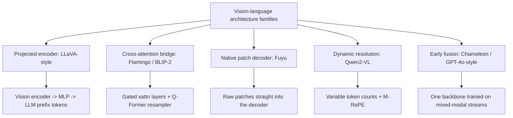
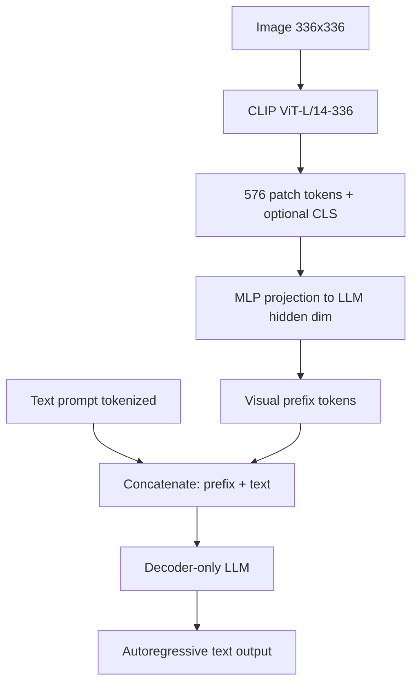
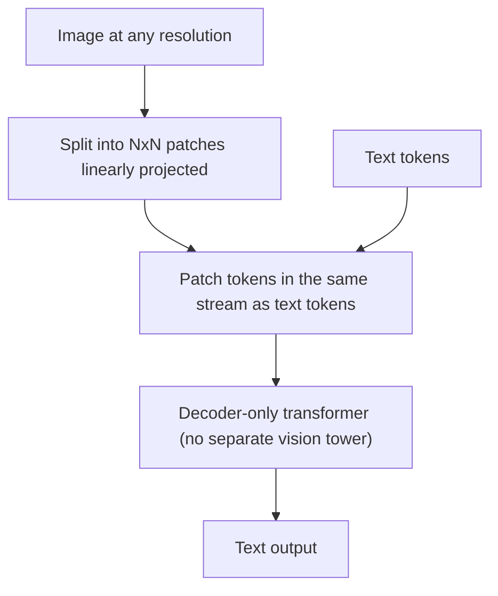

# Vision-Language Architectures

## Overview

Every vision-language model (VLM) answers two architectural questions: **how does an image become tokens the language model can consume**, and **where does cross-modal computation happen** — in a frozen adapter bolted onto the LLM (LLaVA), inside new cross-attention layers (Flamingo), or not at all, by making images just another token stream from the start (Fuyu, Chameleon, GPT-4o-style native multimodality). The spectrum from "adapter on a frozen LLM" to "single early-fusion backbone" is the single most useful mental model for VLM interviews; each point on it buys different training cost, resolution fidelity, and inference overhead. This page is the *architecture* deep dive — task taxonomy and training pipelines live in [VLMs](../multimodal/vlm.md).

> **Interview Angle**: "Compare LLaVA and Flamingo" is the canonical question. The answer should run through connection type (projected prefix tokens vs gated cross-attention), what stays frozen, token-count economics, and resolution handling — then land on why 2024's field moved to dynamic resolution and early fusion.

## The Design Space in One Diagram

## Contrastive Encoders: CLIP and SigLIP

Nearly every adapter-style VLM starts from a **contrastively trained dual encoder**, because contrastive pretraining makes image features linearly decodable into language space:

- **CLIP** (Radford et al., ICML 2021): 400M image-text pairs, InfoNCE loss over a batch similarity matrix, ViT-L/14 (336px) as the standard VLM backbone for years. The text tower is discarded at VLM time; the image tower becomes the "eyes."
- **SigLIP** (Zhai et al., ICCV 2023) replaces softmax InfoNCE with a **sigmoid loss** — pairwise binary classification instead of a global softmax over the batch. This decouples batch size from normalization (softmax needs large batches for negatives; sigmoid works with smaller batches and scales better), and SigLIP/SigLIP-2 are the 2024-2025 default encoders for open VLMs (PaLI-X, PaliGemma, Llava-OneVision-class stacks).

What interviewers probe: why *contrastive* encoders at all? Because the pretraining objective already aligns image semantics with text embeddings, a small projection suffices to map into LLM space — the expensive semantic alignment happened upstream. The cost: fixed square resolution, weak on text-in-image and counting (objective never asked), and one token per patch leads to huge token counts at high resolution.

## LLaVA: Linear Projection into a Frozen LLM

LLaVA (Liu et al., 2023) is the minimal design that proved the category: **CLIP ViT-L/14-336 → one/two-layer MLP projection → Vicuna/Llama**. Images become a *prefix* of embeddings in the LLM's input space; instruction tuning on GPT-4-generated caption/conversation data teaches the projection and (optionally) unfreezes parts of the LLM.

- **Token economics**: 576 tokens per image at 336px (24×24 patches) — cheap, but resolution-capped. LLaVA-1.5's answer was **AnyRes**: split higher-resolution images into a grid of 336px crops, encode each, pool/concatenate — variable token counts (roughly 288-576 per grid plus the global view) traded for readability of small text in screenshots and documents.
- **What trains**: the projection first (stage 1, caption data), then instruction data end-to-end or with the encoder frozen (stage 2). Training cost is tiny by LLM standards (LLaVA-1.5-13B: ~1-2 days on 8×A100-class hardware) — the reason the design became the open ecosystem's workhorse.
- **Weaknesses inherited from the design**: hallucination from coarse features, fixed aspect-ratio gymnastics (tiling), and the LLM never *looks* at raw pixels — everything passes through CLIP's representation bottlenecks.

## Flamingo: Gated Cross-Attention Into a Frozen LLM

Flamingo (Alayrac et al., DeepMind, NeurIPS 2022) kept the LLM frozen and injected vision through **new cross-attention layers interleaved between existing LM layers**, plus a **Perceiver Resampler** that compresses variable-length ViT features into exactly 64 learned query tokens.

- **Gated xattn-dense**: each new cross-attention block starts with a zero-initialized tanh gate \\( \gamma \\): output = \\( x + \tanh(\gamma) \cdot \mathrm{xattn}(x, v) \\). At init \\( \gamma = 0 \\), so the frozen LM is *identical to its pretrained self* on day one — training can only gradually open the visual channel. This is the stability trick to name in interviews.
- **Interleaved pretraining**: the resampler + xattn layers train on web-scale *interleaved* image-text documents (M3W) so the model learns image-text ordering and multi-image narratives — the source of Flamingo's celebrated few-shot multimodal ability (e.g., strong performance on VQA/captioning with a handful of in-context examples from 10B-class and 80B-class variants).
- **BLIP-2's Q-Former** (Li et al., ICML 2023) is the lighter-weight cousin: a small BERT-style resampler (32 queries, ~188M params) bridging frozen ViT to frozen OPT/FlanT5, trained in two stages — the pragmatic open-source alternative to Flamingo's 10B+ resampler stack.

**Trade-off vs LLaVA**: cross-attention decouples visual token count from context length (64 resampler tokens regardless of image complexity) and keeps the LM frozen (cheaper, preserves text quality), but adds parameters that must be trained from scratch and historically underperforms full-attention prefix fusion on dense visual detail — which is why LLaVA-style prefixing beat Flamingo-style bridging in most 2023-2024 open-model comparisons.

## Fuyu: Native Patch Decoder

Fuyu-8B (Adept AI, 2023) deletes the vision encoder entirely: **raw image patches are linearly projected and fed straight into the decoder-only LLM**, interleaved with text tokens in a single stream.

- **Why it is interesting architecturally**: no encoder means **no fixed resolution ceiling** — patch count scales with image size (arbitrary aspect ratios handled natively), there is no separate image-text alignment stage to train, and the same transformer attention does all cross-modal reasoning.
- **The costs**: the LLM's context must absorb every patch (a 1080p image at 16×16 patches is 4K+ tokens before any text), so throughput and memory are resolution-sensitive in a way projected designs cap; low-level visual skills (OCR-grade text reading) must be *learned* by the LLM rather than inherited from a pretrained encoder, which demands more data — and the public Fuyu-8B results were strong on UI/document tasks but behind encoder-based models on general benchmarks.

## Qwen2-VL: Dynamic Resolution and M-RoPE

Qwen2-VL (2024) industrialized the "native-ish" direction inside a standard LLaVA-style pipeline: the ViT is fed **patches of variable counts** — images are partitioned into 28×28 patch groups with a dynamic scheme so token count is proportional to image resolution (a 1-megapixel image ≈ 1.3K tokens; small images get few tokens), and video uses per-frame dynamic counts. Positional information is handled by **M-RoPE (multimodal RoPE)**: each token gets a 3-component rotary position — temporal index, height index, width index — decomposing RoPE's frequency spectrum across the three axes so videos keep temporal order and images keep 2D structure. Native support for arbitrary aspect ratios and resolutions (up to large document images) plus Naive Dynamic Resolution made Qwen2-VL the reference open design for document/UI agents, with Qwen2.5-VL extending the recipe. The interview-worthy point: **M-RoPE is the position-encoding answer to "how do 2D images live in a 1D sequence"** — connect it back to [Position Encoding](../advanced/position-encoding.md).

## Native Multimodal: Early Fusion (Chameleon, GPT-4o-style)

The frontier end of the spectrum trains **one transformer from scratch on mixed-modal token streams**: images are tokenized into discrete codes (VQ-VAE/VQGAN-style, e.g., 1024-8192 vocabularies) and interleaved with BPE text in one sequence.

- **Chameleon** (Meta, 2024): 7B/34B early-fusion models trained on mixed image-text; all-modal attention (every token attends to every token, image or text), QK-norm and revised layernorm placement for training stability — the paper's engineering story is that naive early fusion diverges without normalization care.
- **GPT-4o / Gemini-class** (closed): widely understood to follow the native/early-fusion pattern — a single backbone ingesting text, image, and audio tokens with per-modality tokenizers, enabling sub-second voice-to-voice latency because there is no pipeline of separate ASR → LLM → TTS models to pay.
- **Why early fusion wins when it works**: no information bottleneck between modalities (everything is tokens at one table), joint world modeling across modalities (image generation *and* understanding in one model), and simplest serving (one model). **Why it is expensive**: discrete image tokenizers lose fine detail (the tokenizer is a resolution/quality ceiling), training cost is full-pretraining scale, and mixed-modal data curation is the real moat.

### Family trade-off table

| Family | Representative | Vision→LLM interface | What trains | Resolution handling | Inference cost profile |
|---|---|---|---|---|---|
| Projected prefix | LLaVA-1.5/NeXT | Encoder features → MLP → prefix tokens | Projection (+LLM unfreeze) | AnyRes tiling | 300-3K visual tokens in context |
| Cross-attention bridge | Flamingo, BLIP-2 Q-Former | Resampler (64/32 queries) → gated xattn | Resampler + xattn only (LM frozen) | Resampler caps tokens | Fixed ~64 visual tokens; extra xattn FLOPs |
| Native patch decoder | Fuyu-8B | Raw patches linearly projected | Whole LLM end-to-end | Arbitrary (patch count scales) | Token count ∝ pixels² |
| Dynamic resolution | Qwen2-VL/2.5-VL | Encoder with variable patch counts + M-RoPE | Full fine-tune of pipeline | Native, token ∝ resolution | 1-4K tokens typical images |
| Early fusion | Chameleon, GPT-4o-style | Discrete image codes in one stream | Everything, from scratch | Bounded by tokenizer | Full-pretraining cost; one model serves all |

## Choosing a Point on the Spectrum

Decision heuristics that hold up in interviews and in practice:

- **Cheapest path to a working document/UI assistant**: LLaVA-style with SigLIP encoder + AnyRes-style tiling — mature recipes, low training cost, good OCR via high-res tiling.
- **Frozen LLM, minimal drift, many images per context**: cross-attention bridge (BLIP-2-class); accept detail loss for token savings.
- **Arbitrary resolutions with one consistent interface**: Qwen2-VL-style dynamic resolution — the current open-design default for agents that screenshot.
- **Product that must see, read, hear, and generate with one model and low latency**: early-fusion native multimodal — budget full-pretraining scale and tokenizer quality work.

## Interview Questions

1. **Compare LLaVA and Flamingo at the architecture level.**
   LLaVA maps ViT features through a small MLP into the LLM's *input embedding space* and prepends them as prefix tokens — the LLM's self-attention handles all cross-modal reasoning; training touches the projection and usually the LLM. Flamingo freezes the LM and injects vision via new gated cross-attention layers fed by a Perceiver Resampler (64 learned queries); the tanh gate starts at zero so training begins from the exact pretrained LM. Consequences: LLaVA is cheaper to train and better at dense visual detail (every visual token attends/attends-to everything), while Flamingo caps visual context cost (fixed 64 tokens), preserves the LM exactly, and enables interleaved multi-image few-shot — but its bottleneck resampler loses fine detail, which is why prefix-style designs dominated open VLMs after 2023.

2. **What problem does Flamingo's gated cross-attention solve?**
   Training-stability-with-frozen-weights: cross-attention layers inserted into a pretrained LM would otherwise perturb its behavior from step one and destroy the language ability you paid pretraining for. The zero-initialized tanh gate makes every new layer an exact identity at initialization, so the visual pathway opens only as gradients justify it. It is the same "start as identity" philosophy as zero-init residual adapters/LoRA-B-as-zero, applied to modality injection.

3. **Why did the field move from fixed-resolution encoders to dynamic resolution (Qwen2-VL-style)?**
   Fixed 336-448px encoders destroy small text and UI elements — exactly what document and agent workloads need — and tiling fixes resolution crudely while multiplying tokens. Dynamic resolution scales patch count with input resolution so a screenshot is read at native fidelity (token count ∝ area), M-RoPE (temporal/height/width position components) keeps 2D/3D structure in a 1D sequence, and training with a dynamic packing scheme keeps batch efficiency. The trade is variable context length per image, which serving must handle — a manageable cost compared to re-tile heuristics.

4. **What do you gain and lose by deleting the vision encoder (Fuyu-style)?**
   Gain: no resolution/aspect-ratio ceiling, no two-stage alignment training, one stream where attention does all cross-modal work, and simpler pipelines (single checkpoint, no encoder-specific serving). Lose: the encoder's cheap, pretrained visual semantics — the LLM must learn low-level vision (edges, OCR) from multimodal data, so you need far more data and compute for equal visual quality; and context/token costs scale directly with pixels, which an encoder's patch pooling previously capped. Fuyu-8B showed the design works especially well for document/UI understanding; general benchmarks lagged encoder-based peers at equal size.

5. **Where does early fusion beat adapter designs, and what is its central engineering risk?**
   Early fusion (Chameleon, GPT-4o-style) trains one backbone over mixed discrete-modality streams: no projection bottleneck, joint image understanding + generation, one serving stack, and (for audio) no cascade latency of ASR→LLM→TTS. The central risks are the discrete image tokenizer (a quality ceiling that caps fine detail and drives vocabulary/context costs) and training stability of mixed-modal attention at scale — Chameleon needed QK-norm and norm-placement revisions to prevent divergence. Plus full-pretraining data curation across modalities is the dominant cost.

## Key Takeaways

- The VLM design space is one spectrum: where does cross-modal computation happen — input projection (LLaVA), injected cross-attention (Flamingo/BLIP-2), nowhere-special (Fuyu patches), adaptive (Qwen2-VL), or fused from scratch (Chameleon/GPT-4o-style).
- Contrastive encoders (CLIP → SigLIP's sigmoid loss) supply cheap semantic alignment; their fixed resolution and objective-blind spots (text-in-image, counting) motivate everything downstream.
- LLaVA = encoder + MLP projection + instruction tuning; AnyRes tiling was the pragmatic fix for resolution; ~576 tokens per 336px image is the baseline economics.
- Flamingo's gated xattn (zero-init tanh) is the canonical "inject without breaking the frozen LM" trick; the Perceiver Resampler caps visual tokens at 64.
- Fuyu deletes the encoder: arbitrary resolution, single stream — paid for in data/compute and per-pixel context cost.
- Qwen2-VL's dynamic resolution + M-RoPE (time/height/width rotary components) is the current open reference for document/UI-grade VLMs.
- Early fusion removes all bottlenecks but inherits tokenizer ceilings and full-pretraining costs — the closed-frontier default, now entering open releases.

## References

- Radford et al., "[Learning Transferable Visual Models From Natural Language Supervision](https://arxiv.org/abs/2103.00020)" (ICML 2021) — CLIP
- Zhai et al., "[Sigmoid Loss for Language Image Pre-Training](https://arxiv.org/abs/2303.15343)" (ICCV 2023) — SigLIP
- Liu et al., "[Visual Instruction Tuning](https://arxiv.org/abs/2304.08485)" (NeurIPS 2023 oral) — LLaVA
- Liu et al., "[Improved Baselines with Visual Instruction Tuning](https://arxiv.org/abs/2310.03744)" (CVPR 2024) — LLaVA-1.5 / AnyRes
- Alayrac et al., "[Flamingo: a Visual Language Model for Few-Shot Learning](https://arxiv.org/abs/2204.14198)" (NeurIPS 2022)
- Li et al., "[BLIP-2: Bootstrapping Language-Image Pre-training with Frozen Image Encoders and Large Language Models](https://arxiv.org/abs/2301.12597)" (ICML 2023)
- Fuyu-8B announcement (Adept AI, 2023): [adept.ai/blog/fuyu-8b](https://www.adept.ai/blog/fuyu-8b)
- Wang et al., "[Qwen2-VL: Enhancing Vision-Language Model's Perception of the World at Any Resolution](https://arxiv.org/abs/2409.12191)" (2024)
- Team Chameleon, "[Chameleon: Mixed-Modal Early-Fusion Foundation Models](https://arxiv.org/abs/2405.09818)" (Meta, 2024)
- OpenAI, GPT-4o announcement (2024): [openai.com/index/hello-gpt-4o/](https://openai.com/index/hello-gpt-4o/)

## Cross-References

- [VLMs (task & training view)](../multimodal/vlm.md) — tasks, datasets, and training pipelines complementing this architecture view
- [CLIP](../vision/clip.md) — the contrastive encoder most of these architectures build on
- [Position Encoding](../advanced/position-encoding.md) — RoPE mechanics behind M-RoPE's multimodal extension
- [Transformer Internals](../advanced/transformer-internals.md) — KV-cache and token-count economics of visual prefixes
- [GPT-4V / multimodal SOTA](../multimodal/gpt4v.md) — closed-model capability landscape
- [ViT](../../ml/transformers/vit.md) — the patchification foundation all encoder-based designs inherit
