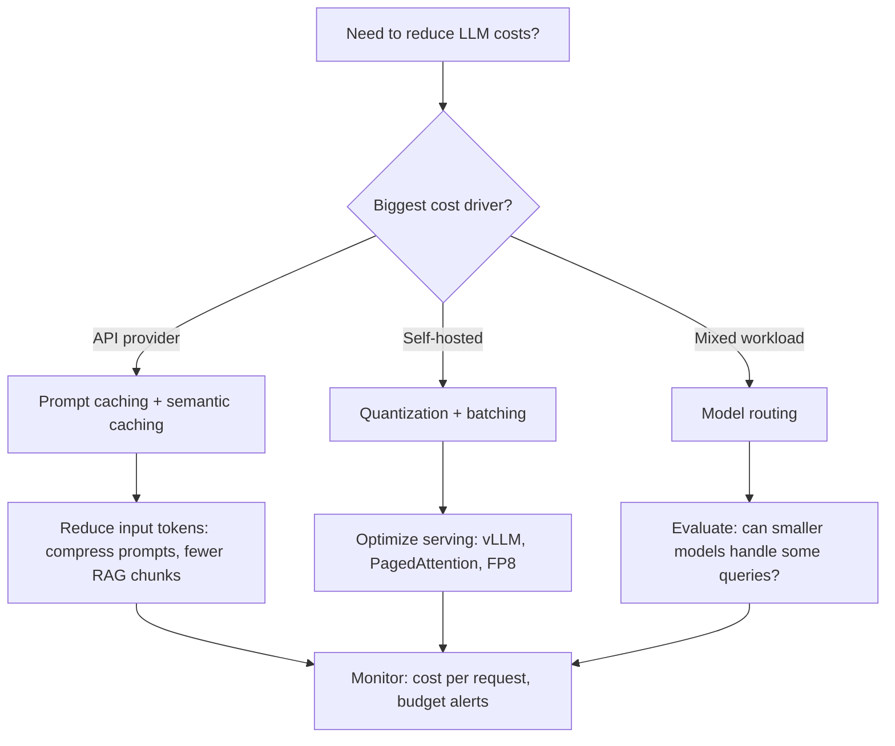

# LLM Cost Optimization

## Overview

LLM inference is expensive. A production application processing 1M requests/month can easily spend $10K-100K+ on API costs. This page covers the practical levers for reducing spend: token economics, caching, model routing, quantization, and batching. For deep dives on quantization and batching, see dedicated pages.

## Token Economics

### Pricing Structure

All major providers price by token, with output tokens costing 3-5× more than input tokens:

| Provider / Model | Input (per 1M tokens) | Output (per 1M tokens) | Ratio |
---|---|---|---|
| **GPT-4o** | $2.50 | $10.00 | 4× |
| **GPT-4o-mini** | $0.15 | $0.60 | 4× |
| **Claude 3.5 Sonnet** | $3.00 | $15.00 | 5× |
| **Claude 3 Haiku** | $0.25 | $1.25 | 5× |
| **Gemini 1.5 Pro** | $1.25 | $5.00 | 4× |
| **Gemini 1.5 Flash** | $0.075 | $0.30 | 4× |

*Prices as of mid-2025. Always verify at [OpenAI](https://platform.openai.com/pricing), [Anthropic](https://docs.anthropic.com/en/docs/about-claude/pricing), [Google](https://ai.google.dev/pricing).*

### Cost Per Request Estimation

```
cost = (input_tokens × input_price + output_tokens × output_price) / 1_000_000
```

| Scenario | Input | Output | GPT-4o Cost | GPT-4o-mini Cost |
---|---|---|---|---|
| Simple Q&A | 200 tok | 150 tok | $0.0020 | $0.00012 |
| RAG (5 chunks + query) | 3,000 tok | 500 tok | $0.0125 | $0.00075 |
| Long document summary | 50,000 tok | 2,000 tok | $0.1325 | $0.00795 |
| Agent (3 tool calls) | 6,000 tok | 1,500 tok | $0.0300 | $0.00180 |

**Key insight:** For RAG-heavy applications, input tokens dominate cost (retrieved context). For generation-heavy applications (summarization, code generation), output tokens dominate. Optimize the dominant dimension first.

## Caching Strategies

### Prompt Caching (Provider-Side)

Providers cache the KV cache for repeated prompt prefixes, eliminating redundant compute:

| Provider | Mechanism | Savings | How to Use |
---|---|---|---|
| **Anthropic** | Explicit cache control markers in API | 90% on cached tokens | Add `cache_control: {type: "ephemeral"}` to system prompt blocks |
| **OpenAI** | Automatic prefix caching | 50% on cached input tokens | Put static content at the beginning of the prompt; no code changes needed |
| **Google** | Context caching API | ~75% | Explicitly cache context objects with TTL |
| **vLLM (self-hosted)** | `--enable-prefix-caching` | 100% (no API cost, saves compute) | Enable flag at launch |

**Best practice:** Structure prompts so the system prompt, few-shot examples, and tool definitions form a static prefix that is cached across requests. Only the user query and retrieved RAG context should vary per request. Reference: [Anthropic Prompt Caching](https://docs.anthropic.com/en/docs/build-with-claude/prompt-caching).

### Semantic Caching (Application-Side)

Store LLM responses keyed by the semantic similarity of the input query. When a new query is semantically similar to a cached query, return the cached response instead of calling the LLM.

```
Query: "What is the refund policy?" → Cache miss → Call LLM → Cache result
Query: "How do I get a refund?" → Cosine sim > 0.95 → Cache hit → Return cached response
```

| Tool | Approach |
---|---|
| **GPTCache** | Embed queries, use vector similarity for cache lookup |
| **Custom (Redis + embeddings)** | Embed query, check Redis for similar vectors within threshold |
| **LiteLLM** | Built-in semantic caching support |

**Trade-offs:** Semantic caching saves cost and latency but risks stale responses when underlying data changes. Cache invalidation must be tied to data updates. Not suitable for highly personalized or time-sensitive queries.

## Model Routing

Not every query needs the most expensive model. Route queries to the cheapest model that can handle them:

| Query Complexity | Model | Cost Reduction vs GPT-4o |
---|---|---|
| Classification, extraction | GPT-4o-mini / Claude Haiku / Gemini Flash | 15-30× |
| Standard Q&A, summarization | GPT-4o / Claude 3.5 Sonnet | 1× (baseline) |
| Complex reasoning, coding | GPT-4o / Claude 3.5 Sonnet / o1 | 1× (baseline) |
| Simple routing / intent detection | Fine-tuned small model (Llama 3 8B) | 50-100× (self-hosted) |

### Router Implementation

```python
# Simple router pattern
def route_query(query: str) -> str:
    intent = lightweight_classifier(query)  # GPT-4o-mini or local model
    if intent in ["simple_qa", "classification", "extraction"]:
        return "gpt-4o-mini"
    elif intent in ["complex_reasoning", "code_generation"]:
        return "gpt-4o"
    elif intent in ["creative_writing", "brainstorming"]:
        return "claude-3.5-sonnet"
    else:
        return "gpt-4o"  # default to capable model
```

**Cascading routing** is more sophisticated: try the cheapest model first, then fall back to a more expensive one if the output quality is insufficient (measured by a lightweight quality classifier). This maximizes savings while maintaining quality.

## Quantization

Quantization reduces model precision (FP16 → INT8 → INT4) to shrink memory and compute requirements. Essential for self-hosted models; not applicable when using API providers.

| Method | Memory Reduction | Quality Impact | Best For |
---|---|---|---|
| **INT8** | 2× | <0.5% perplexity increase | Production GPU servers |
| **INT4 (AWQ/GPTQ)** | 4× | 2-4% perplexity increase | Consumer GPUs, cost-constrained servers |
| **GGUF Q4_K_M** | ~3.5× | 1.5% perplexity increase | CPU/edge (Ollama) |
| **FP8** | 2× | Near-lossless | H100/H200 GPUs (native hardware support) |

See [quantization.md](llm-serving/quantization.md) for full details on methods, benchmarks, and implementation.

## Batching

Batching processes multiple requests simultaneously, amortizing weight loading across the batch. This is the single most impactful optimization for self-hosted model throughput.

| Strategy | Throughput Gain | Latency Impact | Best For |
---|---|---|---|
| **Static batching** | 5-10× | High (wait for batch) | Offline processing |
| **Dynamic batching** (continuous batching) | 10-20× | Low | Real-time serving (vLLM, TGI) |
| **In-flight batching** | 15-25× | Very low | High-concurrency serving |

See [batching.md](llm-serving/batching.md) for full details on continuous batching, PagedAttention, and implementation.

## Cost Optimization Decision Framework



## Interview Questions

### Q1: How would you reduce LLM costs for a production RAG application spending $50K/month?
**Answer:** Systematic approach: (1) **Profile**: Identify where tokens are spent (input vs output, which queries are most expensive). (2) **Prompt caching**: Structure prompts with static prefix (system prompt + examples) for provider-side caching (50-90% savings on cached tokens). (3) **Model routing**: Classify query complexity; route simple queries to a cheaper model (GPT-4o-mini at 15× cheaper). (4) **Reduce context**: Rerank aggressively to use fewer retrieved chunks (5 instead of 15); truncate conversation history. (5) **Semantic caching**: Cache responses for common/similar queries. (6) **Output length control**: Set max_tokens and use concise system prompts. (7) **Monitor**: Track cost per request and set budget alerts. Expected savings: 50-80% without quality degradation.

### Q2: When would you choose self-hosting over API-based LLMs?
**Answer:** Self-host when: (1) **Data privacy** requires keeping data on-premises (healthcare, finance, defense). (2) **Volume** is high enough that GPU costs are cheaper than API costs (typically >1B tokens/month for a 7B model). (3) **Low latency** requirements make API round-trips unacceptable (sub-100ms TTFT). (4) **Customization** requires fine-tuned models not available through APIs. (5) **Vendor independence** is critical (avoid lock-in, ensure availability). Trade-offs: self-hosting requires ML infrastructure expertise, GPU procurement, model serving engineering, and operational overhead. For most startups, APIs are cheaper until significant scale.

### Q3: Explain prompt caching and semantic caching. When would you use each?
**Answer:** **Prompt caching** (provider-side): The LLM provider caches the KV cache for repeated prompt prefixes. If multiple requests share the same system prompt, the provider skips recomputing those attention layers. No code changes needed for OpenAI (automatic). Anthropic requires explicit cache markers. Best for: applications with large static system prompts and many concurrent requests. **Semantic caching** (application-side): Your application stores LLM responses keyed by query embeddings. When a new query is semantically similar (cosine similarity > threshold), return the cached response. Best for: FAQ-like traffic where many users ask similar questions. Key difference: prompt caching reduces compute cost per request at the provider level; semantic caching eliminates the LLM call entirely.

### Q4: How does output token pricing affect system design decisions?
**Answer:** Output tokens cost 3-5× more than input tokens, so output length is the dominant cost factor for generation tasks. System design implications: (1) Set `max_tokens` to the minimum needed — don't default to the model's maximum. (2) Use concise system prompts ("respond in under 100 words") to constrain output length. (3) For extraction/classification tasks, use structured outputs (JSON Schema) which produce minimal, predictable-length outputs. (4) For summarization, specify target length explicitly. (5) Monitor average output tokens per query type and set alerts on increases. A 20% increase in average output length can increase costs by 20-50% depending on the input/output ratio.

## References

1. OpenAI Pricing — https://platform.openai.com/pricing
2. Anthropic Pricing — https://docs.anthropic.com/en/docs/about-claude/pricing
3. Anthropic, "Prompt Caching" — https://docs.anthropic.com/en/docs/build-with-claude/prompt-caching
4. Google AI Pricing — https://ai.google.dev/pricing
5. LiteLLM — https://github.com/BerriAI/litellm
6. GPTCache — https://github.com/zilliztech/GPTCache

## Cross-References

- [Quantization →](llm-serving/quantization.md) Full quantization methods and benchmarks
- [Batching →](llm-serving/batching.md) Continuous batching and PagedAttention
- [Inference →](llm-serving/inference.md) Production inference optimization
- [vLLM →](llm-serving/vllm.md) High-throughput model serving
- [Prompt Caching →](llm-serving/prompt-engineering.md#prompt-caching) Caching in prompt design
- [RAG Cost →](rag-systems.md) RAG-specific cost optimization
