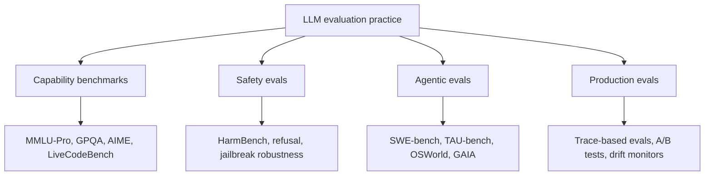
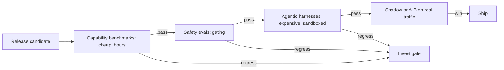

# LLM Evals: Benchmarks, Harnesses & Judged Evaluation

## Overview

This section is the deep-dive companion to two existing pages: [LLM Evaluation](../llm-serving/evaluation.md), which surveys what the major benchmarks measure, and [Agent Evaluation](../../ml/agents/evaluation.md), which defines what to measure when an agent takes multi-step actions. The angle here is the machinery underneath the scores: how the benchmark stack evolved past its saturated ancestors (MMLU → MMLU-Pro, HumanEval → LiveCodeBench → SWE-bench Verified), how evaluation harnesses execute tasks with statistical rigor and bounded cost, and how LLM-as-judge pipelines are calibrated against measured biases. Interviews for applied-AI and platform roles increasingly assume fluency here — "how do you know your eval number means anything?" is the standard follow-up to any claim of model quality — and this section trains exactly that answer: what each benchmark actually measures, how harnesses execute and gate, and where judged pipelines can and cannot be trusted.

## The Four Evaluation Domains

Modern LLM evaluation practice splits into four domains with different artifacts, different audiences, and different failure modes. Confusing them is a common interview error: a capability benchmark score says almost nothing about safety posture, and an offline benchmark says almost nothing about your production traffic.

| Domain | Question it answers | Representative suites | Primary failure mode | Covered in |
|---|---|---|---|---|
| Capability benchmarks | How strong is the model at knowledge, reasoning, math, code? | MMLU-Pro, GPQA Diamond, AIME, FrontierMath, LiveCodeBench | Saturation + data contamination → inflated, non-discriminating scores | [Benchmark Landscape](./benchmark-landscape.md) |
| Safety evals | Does the model harm users or comply with abuse? | HarmBench, TruthfulQA, BBQ, jailbreak suites | Adaptive attacks bypass static suites; scores decay after every model update | [LLM Evaluation](../llm-serving/evaluation.md), [LLM Security](../llm-security.md) |
| Agentic evals | Can the model complete multi-step tasks in real environments? | SWE-bench Verified, TAU-bench, OSWorld, AgentBench | Harness confounds (scaffold quality dominates model quality); expensive, high-variance runs | [Benchmark Landscape](./benchmark-landscape.md), [Eval Harnesses](./eval-harnesses.md) |
| Production evals | Is *this* system good for *our* traffic, this week? | Trace-derived eval sets, LLM-judge pipelines, A/B tests | Judge bias, distribution drift, no ground truth on open-ended outputs | [LLM-as-Judge Deep](./llm-as-judge-deep.md), [Agent Observability](../agentic/agent-observability.md) |

The four domains compose: a release candidate passes capability benchmarks first (cheap, automated), then safety evals (gating), then agentic harnesses (expensive, sandboxed), and finally shadow/A-B evaluation on production traffic (ground truth). Teams that skip a layer inherit its blind spot — shipping on benchmark scores alone is how a model that aces MMLU-Pro turns out to fail your customers' mixed-turn, tool-using workload.

## Gating Order in a Release Pipeline

Each stage is a filter with a different cost per decision, so the cheap instruments run first and the ground truth runs last. The arrows that return to "investigate" are where most of the engineering time actually goes.

The economics force this order. A full capability sweep is millions of tokens and finishes before lunch; a SWE-bench Verified run is ~100M tokens across 500 sandboxed trajectories; a shadow deployment costs an afternoon of traffic splitting but produces evidence no offline instrument can. Stage gates should require paired statistics (the eval did not regress beyond its confidence interval), not raw deltas — the math for that lives in [Eval Harnesses](./eval-harnesses.md).

## Reading Any Reported Score: Five Interview Questions

Treat every number in a model card or paper as a claim with hidden configuration. Five questions recover the missing context:

1. **Measured with what?** Which harness, which task revision, which prompt template, how many few-shot examples — the same benchmark moves by points across these choices (see [Eval Harnesses](./eval-harnesses.md)).
2. **Contaminated or not?** Was the test set published before the model's training cutoff? Static benchmarks from 2020-2021 (MMLU, HumanEval) are presumptively contaminated for post-2023 models; LiveCodeBench-style rolling sets are the defense.
3. **How saturated is the scale?** 92% on a benchmark whose second-best model scores 91% is marketing; 92% on a benchmark where the distribution spans 60-85% is signal.
4. **How big is N?** 198 GPQA items and 500 SWE-bench instances carry ±6-7 point confidence intervals — small-N deltas need paired statistics before they mean anything.
5. **Relative or absolute?** Human-vote and judge-based scores (Arena, judged evals) rank models relative to the current pool; they do not certify absolute fitness for your workload. The judge-calibration caveats are in [LLM-as-Judge Deep](./llm-as-judge-deep.md).

## Study Path by Interview Target

| If you are interviewing for... | Read in this order | The question you will get |
|---|---|---|
| Applied AI / ML engineer | [LLM Evaluation](../llm-serving/evaluation.md) → [Benchmark Landscape](./benchmark-landscape.md) → [LLM-as-Judge Deep](./llm-as-judge-deep.md) | "Which benchmarks would you run before swapping model providers, and why?" |
| Platform / infra | [Eval Harnesses](./eval-harnesses.md) → [Agent Evaluation](../../ml/agents/evaluation.md) → [Agent Observability](../agentic/agent-observability.md) | "How do you gate model and prompt changes in CI with evals?" |
| Product-facing LLM teams | [LLM-as-Judge Deep](./llm-as-judge-deep.md) → [Eval Harnesses](./eval-harnesses.md) | "Users say the new version is worse but the eval score went up — what do you check first?" |
| Agent-heavy roles | [Agent Evaluation](../../ml/agents/evaluation.md) → [Benchmark Landscape](./benchmark-landscape.md) (agentic section) → [Eval Harnesses](./eval-harnesses.md) (sandboxes) | "Why is your agent 85% in the demo and 55% in the benchmark?" |
| Research / evals engineer | All four, in page-map order | "Design an eval suite for a new model release under a $10K budget" |
| Safety engineer | [LLM-as-Judge Deep](./llm-as-judge-deep.md) → [LLM Security](../llm-security.md) | "Would you let an LLM judge sign off on a safety regression? Why not?" |

## Ten Terms You Will Need in the Interview

| Term | One-line definition | Where it bites |
|---|---|---|
| Saturation | Benchmarks where frontier scores cluster near the top stop discriminating | MMLU at 88-90% vs a 25% random baseline |
| Data contamination | Test items (or near-copies) leaked into training data | Static 2020-2021 benchmarks vs post-2023 models |
| pass@k | Probability at least one of k samples passes all tests | Code benchmarks; unbiased estimator over n samples |
| pass^k | Probability that ALL of k runs succeed | TAU-bench; reliability, not average quality |
| Effective context | The length where accuracy degrades, not the advertised window | RULER vs marketing context numbers |
| Scaffold confound | Agent harness quality dominating model quality in agentic scores | SWE-bench resolution rates across harnesses |
| Position bias | Judge verdicts depending on answer presentation order | Pairwise judged evals; fixed by swapping |
| Length-controlled win rate | Win rate after removing the length advantage | AlpacaEval 2.0; Arena-adjacent leaderboards |
| Cohen's kappa | Agreement corrected for chance, \\( \kappa = (p_o - p_e)/(1 - p_e) \\) | Validating any judge against humans |
| Bradley-Terry | Pairwise outcomes fitted into ratings | Chatbot Arena Elo-style scores, judge ensembles |

## Anti-Patterns This Section Exists to Kill

- **One benchmark decides a model choice.** MMLU-Pro tells you about knowledge robustness, nothing about your tool-using, citation-hungry, latency-bounded production workload — build the traffic-derived eval set in parallel.
- **Raw-delta comparisons.** "74% vs 71%" without N, CIs, and pairing is not evidence; on SWE-bench Verified (N=500) that gap is inside one confidence interval.
- **Unanchored judge scales.** 1-10 scores with no rubric, no anchors, and no swap testing drift with judge model updates and reward verbosity — then leak into product via RLHF-style optimization.
- **Ignoring the harness.** Comparing your team's number to a paper's number without matching prompt template, few-shot count, and scoring variant is comparing two different experiments.
- **Eval sets frozen at creation.** Contamination, drift, and optimizer pressure decay every static instrument; rotation and freshness are maintenance, not optional polish.
- **Reporting a mean over nondeterministic runs.** For agentic and sampled tasks, the tail is the product: report pass^k or CI bounds, not the average of one lucky run.
- **Trusting a leaderboard without asking who could submit, when, and privately.** Access asymmetry and selective disclosure are now documented parts of leaderboard dynamics, not conspiracy theories — treat ratings as one input among several.

## What to Verify Before Quoting Any Number

A closing checklist that compresses the whole section into sixty seconds of due diligence: name the harness and its version, name the few-shot count and prompt template, check the benchmark's release date against the model's training cutoff, compute the confidence interval implied by N, ask whether the comparison was paired on shared items, and ask whether the metric is executable, human, or judged — and if judged, whether the judge was ever calibrated against humans (κ, not raw agreement). A number that survives all six is quotable; one that fails any of them is a starting point for the follow-up question, and that distinction is what the interviewer is testing.

## Page Map

| Page | What it covers | Key artifacts |
|---|---|---|
| [Benchmark Landscape](./benchmark-landscape.md) | The benchmark stack by capability: knowledge (MMLU → MMLU-Pro), PhD science (GPQA Diamond), frontier math (AIME, FrontierMath), code (HumanEval → LiveCodeBench → SWE-bench Verified), agentic (AgentBench, TAU-bench, OSWorld), long context (RULER) — plus saturation status and leaderboard caveats | Benchmark table with task format + saturation; Arena/Elo dynamics |
| [Eval Harnesses](./eval-harnesses.md) | Harness engineering: lm-eval-harness task YAML, HELM scenarios, lighteval, OpenAI simple-evals; agentic sandboxes (SWE-bench Docker, OSWorld VMs); confidence intervals, paired bootstrap, IRT; run-cost engineering and the reproducibility checklist | Task YAML snippets; CI math with worked numbers |
| [LLM-as-Judge Deep](./llm-as-judge-deep.md) | Judge calibration: position/verbosity/self-preference biases with measured deltas, single vs pairwise vs reference-guided grading, judge ensembles, Cohen's kappa agreement math, when judges are safe vs dangerous | Calibrated judge pipeline diagram; kappa worked example |

## How This Section Differs from the Existing Pages

The repo keeps a deliberate split so no page duplicates another. Read them in this order when studying:

| Existing page | What it gives you | What this section adds |
|---|---|---|
| [LLM Evaluation](../llm-serving/evaluation.md) | Broad survey: benchmark names, scores, metric definitions (pass@k, BLEU/ROUGE), contamination basics | The *evolution story* (why each successor exists), saturation status, leaderboard statistics, and harness internals |
| [Agent Evaluation](../../ml/agents/evaluation.md) | Agent evaluation *dimensions* (quality, efficiency, safety) and metric formulas | The actual agentic benchmarks and their sandboxed execution machinery, plus the statistical treatment of high-variance agent runs |
| [RAG Evaluation](../retrieval-advanced/rag-evaluation.md) | Retrieval-specific metrics (faithfulness, recall@k, groundedness) | RULER as the long-context stress-test, cross-linked from the benchmark stack |
| [RLHF](../llm-serving/rlhf.md) | Preference data collection and alignment training | The evaluation questions alignment training then creates: reward models that drift, judges that get gamed |
| [Reward Models](../post-training/reward-models.md) | RM training (Bradley-Terry) and Goodhart curves | The *deployment-side* judge pipeline: calibration, ensembles, and judge-gaming defenses |

## Interview Questions

1. **We report MMLU = 92%. What should you ask next?** Ask which harness and prompt configuration produced it (MMLU scores swing several points between 0-shot and 5-shot and between harnesses), whether the model's training cutoff predates the benchmark (contamination), and what the successor benchmark says — MMLU is saturated, so 92% barely discriminates between frontier models. A strong candidate pivots immediately to MMLU-Pro (10 choices, reasoning-heavy, roughly 20 points lower for the same model) and to whether the target workload is multiple-choice at all. See [Benchmark Landscape](./benchmark-landscape.md).

2. **Why does agentic evaluation cost orders of magnitude more than a static benchmark run?** A static benchmark is one model call per item; an agentic benchmark is a full tool-use trajectory in a sandbox — Docker containers per SWE-bench instance, full Ubuntu VMs per OSWorld task, or an LLM user-simulator per TAU-bench episode. Each trajectory runs hundreds of thousands of tokens, nondeterminism forces multiple samples (hence pass^k), and the scaffold is a confound: the same model can swing 10+ points of resolution rate across agent harnesses. Budget the same rigor as a distributed-systems benchmark, not a unit test run. See [Eval Harnesses](./eval-harnesses.md).

3. **Your eval pipeline uses GPT-4-class judges scoring 1-10, and scores drift upward every release. What is going on?** Single absolute scores are the most fragile judge mode: they inherit verbosity and self-preference bias, they drift when the judge model itself is updated, and they are not calibrated across judge versions — an 8.3 means nothing three releases later. The fixes are pairwise comparisons with position swaps, reference-guided grading, judge ensembles with majority vote, and pinned rubrics; treat absolute judge thresholds as a deploy gate only after validating the judge's agreement with humans via Cohen's kappa, not raw percent agreement. See [LLM-as-Judge Deep](./llm-as-judge-deep.md).

4. **What is the difference between a capability benchmark and a leaderboard?** A benchmark is a fixed task distribution with a scoring protocol; a leaderboard is an aggregation policy over such scores (or over human votes, as in Chatbot Arena) with update dynamics of its own. Arena's Elo/Bradley-Terry ratings shift when models are added or withdrawn, style and length correlate with preference, and private-testing practices can advantage large labs — so the leaderboard measures a moving target. Any interview answer that treats "top of the leaderboard" as a stable fact should name at least one of these dynamics. See [Benchmark Landscape](./benchmark-landscape.md).

5. **A fine-tune improves your internal eval score from 71% to 74%. The team wants to ship today. What is your minimum bar before you agree?** First, the statistics: on a small internal set the 3-point delta may be inside the confidence interval — run the paired analysis (bootstrap or McNemar over the same items) before anything else. Second, the instrument: is the internal eval contaminated by the fine-tuning data, and does it cover the traffic the model will actually see? Third, the gate order: capability deltas do not excuse a safety regression, and one judged eval is not a deployment decision — pair it with an executable check or a shadow A/B. "Ship today" is a reasonable outcome; "ship because one number moved" is not.

## Key Takeaways

- Evaluation practice splits into capability benchmarks, safety evals, agentic evals, and production evals; each answers a different question and skipping one inherits its blind spot.
- Benchmarks saturate and contaminate on a clock — the useful signal lives in successors (MMLU-Pro, GPQA Diamond, LiveCodeBench, SWE-bench Verified), which are designed for harder discrimination or contamination resistance.
- Harnesses are engineering artifacts: task configs, sandboxes, caching, and statistical correction (CIs, paired bootstrap, IRT) determine whether a reported number is reproducible or noise.
- LLM judges are the only scalable option for open-ended output, but they carry measured position, verbosity, and self-preference biases — calibration work (swap, normalize, ensemble, rubric-pin) is mandatory, and absolute thresholds are the dangerous use.
- Cross-check every eval claim against the reproducibility checklist: model revision, few-shot config, sampling parameters, and harness version all move scores by more than the differences teams ship on.
- Stage evaluation like a release pipeline — capability, safety, agentic, then shadow/A-B — and gate each stage on paired statistics rather than raw deltas.
- Small benchmarks (GPQA Diamond: 198 items; a single AIME year: 30 problems) carry confidence intervals wider than most reported model gaps; N and pairing are part of reading any score.
- Judge-based and leaderboard scores are relative instruments: they rank within a pool and inherit judge biases, so they gate nothing consequential without calibration against humans (Cohen's kappa, not raw agreement).

## References

- MMLU — Hendrycks et al., *Measuring Massive Multitask Language Understanding*, ICLR 2021: <https://arxiv.org/abs/2009.03300>
- MMLU-Pro — Wang et al., 2024: <https://arxiv.org/abs/2406.01574>
- GPQA — Rein et al., *A Graduate-Level Google-Proof Q&A Benchmark*, 2024: <https://arxiv.org/abs/2311.12022>
- SWE-bench — Jimenez et al., ICLR 2024: <https://arxiv.org/abs/2310.06770>; leaderboard <https://www.swebench.com>
- Arena-Hard — Li et al., 2024: <https://arxiv.org/abs/2406.11939>
- MT-Bench / LLM-as-judge — Zheng et al., NeurIPS 2023: <https://arxiv.org/abs/2306.05685>
- lm-evaluation-harness (official repo): <https://github.com/EleutherAI/lm-evaluation-harness>
- HELM — Liang et al., *Holistic Evaluation of Language Models*, TMLR 2023: <https://crfm.stanford.edu/helm/> and <https://arxiv.org/abs/2211.09110>

## Cross-References

- [LLM Evaluation](../llm-serving/evaluation.md) — the broad survey this section deep-dives; start there for benchmark names and basic metrics
- [Agent Evaluation](../../ml/agents/evaluation.md) — agent evaluation dimensions and metric formulas that the agentic benchmark pages instantiate
- [RAG Evaluation](../retrieval-advanced/rag-evaluation.md) — retrieval-specific metrics; pairs with RULER for long-context claims
- [Reward Models](../post-training/reward-models.md) — the training-side preference architecture that LLM-as-judge deploys at inference time
- [Reward Hacking](../post-training/reward-hacking.md) — why models optimized against a judge eventually exploit it
- [Model Scorecards](../sota/README.md) — the frontier models whose reported numbers these pages teach you to interrogate
