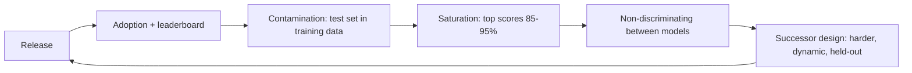
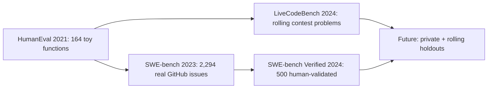
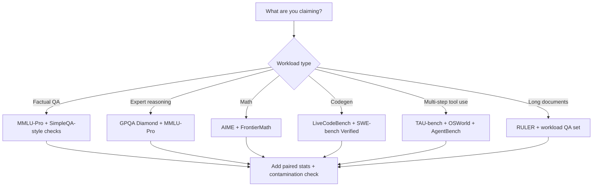

# Benchmark Landscape

## Overview

A benchmark is a fixed task distribution plus a scoring protocol; a benchmark *stack* is the evolving set of such instruments a lab runs to claim frontier status. This page walks the stack capability by capability — knowledge (MMLU → MMLU-Pro), PhD-level science (GPQA Diamond), competition and research math (AIME, FrontierMath), code (HumanEval → LiveCodeBench → SWE-bench Verified), agentic work (AgentBench, TAU-bench, OSWorld), and long context (RULER) — with each benchmark's task format, saturation status, and the reason its successor exists. The companion pages cover the execution machinery ([Eval Harnesses](./eval-harnesses.md)) and judged evaluation ([LLM-as-Judge Deep](./llm-as-judge-deep.md)); the broad survey lives in [LLM Evaluation](../llm-serving/evaluation.md).

Interviews probe whether you know *why* each generation of benchmarks was invented: every major successor answers a specific failure of its predecessor — prompt sensitivity, saturation, contamination, or format mismatch with real work.

## The Benchmark Lifecycle

Benchmarks decay on a predictable clock. Release takes months to saturate at frontier scale; contamination follows because test sets leak into web-scale training corpora; and scores stop discriminating long before the benchmark stops being quoted. Each transition motivates the next benchmark in the stack.

| Decay stage | Mechanism | Typical symptom | Designed-in defense |
|---|---|---|---|
| Contamination | Test items (or near-duplicates) in the pretraining corpus | Suspiciously high scores vs ability; exact-answer regurgitation | Rolling problems (LiveCodeBench), private holdouts, canary strings |
| Saturation | Task too easy for frontier models | Random-guess baseline 25%, frontier 88%+, spread < 3pp | More choices, harder items, reasoning-heavy distractors (MMLU-Pro) |
| Format mismatch | Multiple choice ≠ real work | Model ranks well but fails open-ended tasks | Generative formats, executable tests (SWE-bench), interactive environments (OSWorld) |
| Leaderboard gaming | Training on the judge or metric quirks | Style wins over substance | Length-controlled metrics, held-out prompts, blind human preference |

Three numbers anchor the clock in practice. Static knowledge benchmarks (MMLU, released 2020-2021) took roughly three years to go from frontier-challenge to saturated-and-contaminated for post-2023 models. Code benchmarks compressed that cycle — HumanEval lasted about two years before pass@1 saturation made headlines meaningless. Rolling instruments (LiveCodeBench, private holdouts) are the current equilibrium precisely because they invalidate the training-side copy faster than labs can memorize it. When you quote a benchmark score, its position on this clock is part of the score.

## Knowledge and Reasoning: MMLU → MMLU-Pro

**MMLU** (Hendrycks et al., ICLR 2021) is 14,042 four-option multiple-choice questions across 57 subjects from STEM to law and medicine, evaluated 0-shot or 5-shot. It built the universal baseline, but three flaws accumulated: it saturated (frontier models at 88-90% against a 25% random baseline), it was heavily contaminated (published and mirrored everywhere since 2020), and its accuracy was surprisingly prompt-sensitive — one MMLU-Pro finding is that simply varying the number of answer options from 4 to 12 changed some models' scores by 20-75% on identical questions, exposing fragile memorization rather than knowledge.

**MMLU-Pro** (Wang et al., 2024) redesigned the instrument rather than just refreshing it: 12,032 questions across 14 domains, **10 answer choices instead of 4** (random baseline drops from 25% to 10%), distractors harvested from the original options plus model-generated confusers, and roughly triple the share of questions requiring stepwise reasoning to eliminate plausible options. The prompt-sensitivity problem was directly addressed by making the task harder to game via option elimination. The effect on scores was dramatic: models that scored high-80s on MMLU dropped to the 60s on MMLU-Pro at launch, reopening headroom that MMLU had lost. MMLU-Pro is now the standard knowledge benchmark in frontier model cards.

| Property | MMLU | MMLU-Pro |
|---|---|---|
| Questions | 14,042 | 12,032 |
| Choices per question | 4 | 10 |
| Random baseline | 25% | 10% |
| Domains | 57 subjects | 14 domains (merged) |
| Reasoning demand | Mostly recall | Reasoning-heavy distractors |
| Prompt sensitivity | High (score shifts 20-75% with option count) | Measurably reduced |
| Saturation (frontier) | 88-90% — saturated | 75-85% and still discriminating |

## PhD-Level Science: GPQA Diamond

**GPQA** (Rein et al., 2024) is the "Google-proof" benchmark: questions written by PhD-level domain experts in biology, physics, and chemistry, designed so that a skilled non-expert with unrestricted web access still fails. The validation loop is the interesting engineering: each question had to satisfy a machine-learning validator (a fine-tuned GPT-4-style model must fail it), a non-expert validator (skilled non-experts cap near **34%** even with the open web), and an expert validator (experts agree at **~65%**). **GPQA Diamond** is the 198-question subset where both expert validation rounds passed cleanly; the full set has 448 questions. GPT-4 managed roughly **36%** at launch — barely above the non-expert ceiling — which is exactly the discrimination frontier labs wanted.

The benchmark matters because it resists the two standard escape routes: brute-force retrieval (non-experts with web access still fail) and shallow memorization (ML validators fail it). Its weakness is size — 198 questions means a 95% confidence interval on a single model's score is roughly ±7 points, so GPQA differences under ~10 points between models are statistically meaningless without careful treatment (see the CI math in [Eval Harnesses](./eval-harnesses.md)).

## Frontier Math: AIME and FrontierMath

**AIME** (American Invitational Mathematics Examination) problems became the standard competition-math probe: short problems with an integer answer in 0-999, which makes them *machine-checkable without an LLM judge* — extract the final boxed integer and compare. Each year's exam contributes 30 problems (two sittings of 15), so labs report AIME 2024 / AIME 2025 splits; sampling-and-consistency (majority vote over k samples, as in self-consistency decoding) materially raises reported scores. Saturation is arriving: reasoning-tuned models went from near-0% to near-100% on the 2024 split within roughly a year, and contamination concerns shadow any published exam that has been on the internet since the 1980s.

**FrontierMath** (Epoch AI, 2024) is the deliberate over-correction: several hundred research-mathematics-level problems, each requiring hours for professional mathematicians, held out under an NDA-style protocol so training-set leakage is structurally excluded. At launch **GPT-4o solved under 2%**; frontier reasoning models later reached on the order of 20-25% on the post-launch split. The trade-offs are instructive: private holdouts resist contamination but cost transparency (independent verification is limited by the protocol), and items are so hard that per-problem scoring noise dominates — a handful of solved problems swings the aggregate.

## Code: HumanEval → LiveCodeBench → SWE-bench Verified

The code stack shows the cleanest evolution chain, from toy functions to real repository work:

- **HumanEval** (Chen et al., Codex paper, 2021): 164 hand-written Python function-completion problems with unit tests, scored by **pass@k** — the probability that at least one of k samples passes, computed with the unbiased estimator from the paper. It launched the era but is now saturated (frontier pass@1 above 90%) and heavily contaminated (memorized solutions are trivially verifiable online).
- **LiveCodeBench** (2024) is the contamination-resistant answer: it *continuously* harvests new problems from LeetCode, AtCoder, and Codeforces with publication timestamps, then evaluates each model only on problems published **after** that model's training cutoff. Rolling windows keep the test set moving; the timestamp filter is the defense. The measured gap between pre-cutoff and post-cutoff performance quantifies exactly how much contamination inflated a model's static score.
- **SWE-bench** (Jimenez et al., ICLR 2024) moves from standalone functions to real software engineering: 2,294 task instances drawn from actual GitHub issues across 12 popular Python repositories, where the model must produce a patch that makes the issue's tests pass without breaking existing tests. **SWE-bench Verified** (OpenAI, 2024) is the 500-instance subset human-validated to remove underspecified or broken tasks — it is the number labs now report. Resolution rates are scaffold-dependent (the same model can differ by double digits across agent harnesses) and each run is an agentic trajectory, not a single completion; the sandbox machinery is covered in [Eval Harnesses](./eval-harnesses.md) and the agent side in [SWE Agents](../agentic/swe-agents.md).

| Benchmark | Task format | Scoring | Contamination posture | Status |
|---|---|---|---|---|
| HumanEval | Python function completion | pass@k on unit tests | None (published 2021) | Saturated, contaminated |
| LiveCodeBench | Competitive programming | Unit tests | Rolling post-cutoff windows | Active, contamination-resistant |
| SWE-bench Verified | Real repo issue → patch | FAIL_TO_PASS / PASS_TO_PASS tests | Semi-private variants exist | The de-facto agentic code standard |

## Agentic: AgentBench, TAU-bench, OSWorld

**AgentBench** (Liu et al., ICLR 2024) was the first broad agentic sweep: 8 environments including an operating system, databases, knowledge graphs, web browsing, and games, exposing the capability gap between chat performance and tool-using performance — early models that looked strong on chat benchmarks lost tens of points when actions had consequences across turns.

**TAU-bench** (Sierra, 2024) targets the production-critical case of tool-agent-user interaction: the agent must resolve a customer request (retail and airline domains) *through* tools *while* negotiating with an LLM-simulated user whose instructions shift mid-conversation. Its headline metric is **pass^k** — the probability that the agent succeeds in all of k independent runs — which punishes variance rather than averaging over it. A model with 80% single-run success scores only ~33% at pass^3, a brutal but honest representation of what "reliably" means for production deployment.

**OSWorld** (Xie et al., NeurIPS 2024) is the full-desktop benchmark: 369 real computer tasks on Ubuntu (Chrome, LibreOffice, GIMP, VLC, VS Code) driven through screenshots and OS-level actions, with executable setup scripts and state-based validators. It established the gap that matters for computer-use products: at launch the best model scored around **12%** vs a **72%** human baseline. The conceptual evaluation dimensions (quality, efficiency, safety, reliability) these benchmarks instantiate are defined in [Agent Evaluation](../../ml/agents/evaluation.md); the browser/desktop action surface is treated in [Browser & Computer Use](../agentic/browser-and-computer-use.md).

**GAIA** (Mialon et al., 2024) rounds out the family from the assistant side: several hundred everyday questions whose answers are easy for humans (low 90s%) and hard for models (GPT-4 with plugins scored ~15% at launch), because each task chains reasoning, web or file access, and multi-modal reading into a multi-step trajectory. GAIA's contribution was demonstrating that *humans-outperform-models* orderings are possible on realistic assistant tasks — the inversion that justified the entire agentic benchmark investment above.

## Long Context: RULER

**RULER** (NVIDIA, 2024) replaced the single-needle test as the honest long-context instrument. It generates synthetic tasks in four families — retrieval (multi-needle and variable), multi-hop tracing (variable tracking across references), aggregation (counts, common words), and QA over long synthetic documents — and *tunes the task length per model* to find where accuracy actually degrades. The punchline that changed marketing copy into engineering discussion: several models advertising 128K-256K windows had **effective context lengths a fraction of the advertised window** once aggregation and multi-hop tasks were included. RULER belongs on this page because it is a benchmark with a generation methodology, not a static dataset — the production implications of its findings are argued out in [Long Context vs RAG](../retrieval-advanced/long-context-vs-rag.md).

## Why Multiple Choice Lost Its Throne

The MMLU-to-MMLU-Pro transition is the visible edge of a deeper critique of multiple-choice evaluation that shaped the whole modern stack:

- **Format mismatch.** Real LLM workloads are generative; picking one of N options exercises elimination and recognition, not composition. Models that ranked options well failed free-response versions of the same questions.
- **Elimination strategies.** With 4 options, ruling out two implausible answers leaves a 50% guess; with 10 options, elimination must be evidence-driven, which is why MMLU-Pro's option expansion moved the task from recall toward reasoning.
- **Scoring quirks.** Loglikelihood-based MC scoring has variants — raw likelihood vs length-normalized (`acc` vs `acc_norm`) — that order models differently, and prompt-format changes swing results; the response surface under the score is wider than the differences teams quote.
- **Contamination surface.** A fixed MC test set is maximally compressible into a training corpus: question + options + answer letter is a few hundred bytes of easy memorization.

The successors that replaced MC where it mattered did so by changing the *evidence standard*: executable tests (code, math integers, system state), expert-validated open questions (GPQA), and human preference over real generations (Arena). Multiple choice survives as a cheap screening instrument — and as the contamination canary — not as the headline metric of frontier claims.

## Safety and Robustness Evals in the Stack

Safety evaluation is its own discipline with its own pages (the survey lives in [LLM Evaluation](../llm-serving/evaluation.md); attack surfaces in [LLM Security](../llm-security.md)), but the benchmark landscape is incomplete without naming why safety benchmarks behave differently from capability ones: their test distributions are adversarial, so they decay faster than any capability benchmark, and their ground truth is contested — refusal, harmlessness, and over-refusal trade off against helpfulness, so a single aggregate number is not well-defined. The three families worth recognizing in an interview:

| Family | Examples | Instrument logic | Core limitation |
|---|---|---|---|
| Static harm benchmarks | TruthfulQA, BBQ | Fixed prompts, classified responses | Fast saturation; train-once-bypass-forever |
| Red-team / jailbreak suites | HarmBench and successors | Attack library evaluated for compliance rate | Arms race: adaptive attackers move the pass rate |
| Over-refusal checks | XSTest-style sets | Benign lookalike prompts, measure unnecessary refusals | Smaller N; measures the other side of the trade-off |

The structural point: capability benchmarks fail loudly (scores stop improving), safety benchmarks fail silently (a static suite reports 98% while an adaptive attack bypasses it). That asymmetry is why serious safety evaluation is red-team-shaped — human-driven, continuously renewed, never a single number — and why this section's headline benchmarks are all capability or agentic instruments.

## The Master Table

| Benchmark | Capability | Task format | Scoring | Saturation status |
|---|---|---|---|---|
| MMLU | Broad knowledge | 4-choice MC, 57 subjects | Accuracy | Saturated (88-90%), contaminated |
| MMLU-Pro | Knowledge + reasoning | 10-choice MC, 14 domains | Accuracy | Discriminating (75-85%) |
| GPQA Diamond | PhD science | Expert-written MC | Accuracy | Frontier 60-80%; small N (198) |
| AIME 2024/25 | Competition math | Integer answer 0-999 | Exact match | Rapidly saturating |
| FrontierMath | Research math | Multi-hour problems | Problem solved | <2% at launch; ~20-25% now |
| HumanEval | Codegen | 164 Python functions | pass@k | Saturated, contaminated |
| LiveCodeBench | Codegen | Rolling contest problems | Unit tests | Active, contamination-resistant |
| SWE-bench Verified | Software engineering | Real GitHub issues → patches | Test-suite resolution | Active; 20-70% and rising |
| AgentBench | Tool use, 8 environments | Interactive episodes | Environment-specific | Partially saturated |
| TAU-bench | Tool + user interaction | Customer-service episodes | pass^k, policy checks | Active, low scores |
| OSWorld | Desktop computer use | 369 Ubuntu tasks | Executable validators | Low (<60% vs 72% human) |
| RULER | Long context | Synthetic retrieval/aggregation | Tuned-length accuracy | Active by design |
| MT-Bench | Multi-turn quality | 80 two-turn prompts | LLM judge (1-10) | Saturated for frontier; judge-bias bound |
| AlpacaEval 2.0 | Instruction following | Open-ended vs reference | Length-controlled win rate | Active; judge-gaming pressure |
| IFEval | Verifiable instructions | Constraint-following prompts | Programmatic checks | Active, executable |
| TruthfulQA | Truthfulness | Adversarial short-form QA | Judge + human subset | Partially saturated |

Reading the table as a portfolio: executable-scoring rows (math integers, unit tests, state validators, programmatic checks) are the most durable instruments because their ground truth cannot be argued with; judged-scoring rows (MT-Bench, AlpacaEval) are the most gameable and must be re-validated whenever either judge or candidate models change — the calibration machinery for that is the subject of [LLM-as-Judge Deep](./llm-as-judge-deep.md).

## Leaderboard Caveats: Chatbot Arena Dynamics

Chatbot Arena (LMArena) collects millions of blind pairwise human votes and fits a rating — originally online Elo, now a Bradley-Terry model with confidence intervals — producing the single most-cited "which model is better" signal. The dynamics deserve as much attention as the ratings:

- **Style beats substance in single votes.** Users favor longer, nicely-formatted, confident answers; length and markdown density correlate with win rate, which is why Arena-adjacent leaderboards ship length-controlled win rates and why [LLM-as-Judge Deep](./llm-as-judge-deep.md) treats verbosity bias as a first-class problem.
- **Ratings are relative, not absolute.** Bradley-Terry scores shift when any model joins or leaves the pool; withdrawing a strong model changes everyone else's relative standing. A rating is a statement about the *current pool*, not a fixed quality number.
- **The vote distribution is not uniform.** Real traffic is skewed toward coding, writing, and model-comparison prompts; category-level ratings and aggregate ratings diverge, and a model can be top-3 overall while weak in a category you care about.
- **Prompts are public-adjacent.** Arena prompts get scraped and recirculated, creating slow contamination pressure that pushes labs toward private holdouts — the same clock that drives the benchmark lifecycle above.
- **Access asymmetry is now documented.** The *Leaderboard Illusion* analysis (2025) reports that large labs tested many private variants and selectively disclosed before public release, gaining rating advantages unavailable to everyone else. Treat leaderboard deltas as evidence, not verdicts.

The practical interview answer: use Arena-style human preference for *relative, open-ended* quality ("does the new release feel better?"), and use executable benchmarks for *absolute, verifiable* claims — and never let a single leaderboard decide a production model choice, because your traffic distribution is not their vote distribution.

## Decontamination Engineering

Contamination is not a binary; it is a spectrum detected with a toolbox. Every serious lab runs some variant of these checks over training data, and interviewers increasingly expect candidates to name them:

| Technique | How it works | Catches | Limits |
|---|---|---|---|
| N-gram overlap | Flag training docs sharing long n-grams (13+ grams) with test items | Verbatim leakage, copied solutions | Paraphrased contamination slips through; near-duplicate threshold tuning is fiddly |
| Embedding similarity | Nearest-neighbor search between test items and training corpus | Paraphrase-level reuse | Expensive at corpus scale; false positives on generic phrasing |
| MinHash / LSH near-dup detection | Fingerprint-based duplicate clustering across corpora | Reused benchmark documents at scale | Needs tuned similarity bands; misses short excerpts |
| Canary strings | Unique GUIDs embedded in test files; check for regurgitation | Direct memorization of the test file | Only proves what it proves: one string, not the answer content |
| Time-split evaluation | Test only on items published after the model's cutoff | The whole class of leakage | Requires rolling benchmark design (LiveCodeBench) and per-model bookkeeping |
| Held-out private sets | Problems never released, run server-side | Everything public | Costs transparency; independent verification limited (FrontierMath protocol) |

The diagnostic that ties it together is the **train-test interplay check**: if a model scores far higher on items verifiably published before its cutoff than on post-cutoff items of the same difficulty (the LiveCodeBench measurement), the pre-cutoff number is contaminated. The same logic in reverse — improvement over time on a fixed set with no corresponding ability gain elsewhere — is the tell interviewers look for when a candidate quotes suspicious benchmark jumps.

Frontier practice has converged on layering these defenses rather than choosing one: public versions of benchmark items for community benchmarking, private held-out variants (SWE-bench's private splits, FrontierMath's protocol, internal question banks) for the numbers that actually gate releases, and canary conventions so researchers can check whether specific test files circulated. The open questions — who audits the private numbers, and what an independent party can reproduce at all — are exactly the leaderboard-transparency debates above wearing a lab coat.

## Choosing Benchmarks for a Workload

Interviewers often invert the question: not "what does benchmark X measure" but "my workload is Y, what do I run?" The selection logic follows the workload, not the leaderboard:

Two rules survive contact with reality. First, **the closest proxy is your own eval set**: 200-500 items drawn from real traffic, versioned, and paired against the model swap — public benchmarks contextualize, they do not decide. Second, **match the scoring mechanism to the claim**: if your workload's answers are verifiable (integers, code, state changes), prefer executable scoring; if they are open-ended, you are choosing a judge pipeline and must budget its calibration ([LLM-as-Judge Deep](./llm-as-judge-deep.md)).

### Reading a Saturation Curve

Saturation is a claim about the *distribution of scores*, not one model's number, and the reading skill is recognizing the three phases. In the opening phase (2021-era HumanEval, 2023-era GPQA), scores scatter widely and rise release-over-release — maximum discriminative power. In the compression phase (MMLU-Pro today), the frontier bunches within a few points while the middle of the field lags — still useful for separating tiers, no longer for ranking within the frontier. In the saturated phase (MMLU, HumanEval), the top decile is within noise of the ceiling and movement between releases is inside the benchmark's own measurement error. The practical rule: a benchmark earns its compute budget while the frontier spread exceeds roughly twice the binomial confidence interval; when it does not, replace it — which is exactly the lifecycle that opened this page.

## Interview Questions

1. **MMLU is saturated — what actually replaced it, and what design choices made the replacement harder?** MMLU-Pro. Three deliberate changes: answer options grew from 4 to 10, cutting the random baseline from 25% to 10% and making lucky guessing worthless; distractors were engineered to require eliminating plausible but wrong options stepwise, tripling the reasoning-heavy share; and the redesign reduced prompt sensitivity that plagued MMLU, where merely changing the option count moved scores by 20-75%. The result: a model that scored ~87 on MMLU lands in the 60s on MMLU-Pro, reopening discrimination. If you need expert-level discrimination instead, GPQA Diamond (198 questions, expert-validated, google-proof) is the sharper but noisier instrument.

2. **How does LiveCodeBench resist contamination, and what is the trade-off?** It harvests new problems continuously from LeetCode, AtCoder, and Codeforces with publication timestamps and evaluates each model only on problems published after its training cutoff — a rolling window that no fixed dataset can match. The trade-off is comparability: a "LiveCodeBench score" is only meaningful relative to a stated problem window and cutoff, so leaderboard rows must be time-aligned; and contest-style problems differ from production code tasks, which is why SWE-bench Verified (real repo issues, test-suite resolution) occupies the agentic end of the code stack.

3. **Why do labs report pass^k for TAU-bench instead of average success rate?** Because production agents must succeed on *every* run, not on average. pass^k is the probability that all k independent attempts succeed; assuming independence it decays like success^k, so 80% single-run success becomes ~33% at k=3. Average success hides the variance that customers experience as flakiness; pass^k exposes it directly. The same logic — report tail behavior, not the mean — applies to OSWorld task completion and to any agentic eval where a retry is not free.

4. **GPQA Diamond has 198 questions. A model B scores 5 points above model A. Is B better?** Not demonstrably. With N=198, the standard error at p≈0.65 is sqrt(0.65×0.35/198) ≈ 3.4 points, so the 95% CI on each score is roughly ±6.6 points — a 5-point gap is well inside the noise. The correct move is a paired test: both models answer the same 198 items, and a paired bootstrap or McNemar's test over discordant items can separate them if B wins consistently on the items A misses. Small-N benchmarks demand paired statistics, never eyeballed deltas. (The math is worked in [Eval Harnesses](./eval-harnesses.md).)

5. **A vendor's model card claims a 1M-token context window. What benchmark evidence would you demand?** RULER-style results: accuracy across retrieval, multi-hop tracing, aggregation, and QA task families, with the task length tuned per model to find the effective context length — the point where accuracy drops below threshold. Single-needle retrieval at 1M tokens certifies almost nothing (it is a bandwidth test); aggregation and multi-hop failures at the same length are the realistic signal. Cross-check with the cost arithmetic of actually stuffing 1M tokens versus retrieving 10K, because even a genuine 1M window is rarely the cheapest correct architecture.

6. **Why is Chatbot Arena's Elo not just "a better MMLU"?** Because it measures a different construct — human preference over open-ended responses — with entirely different statistics and failure modes. Ratings are relative to the current model pool (Bradley-Terry refit shifts everyone when a model enters or exits), votes are style-correlated (length, formatting, confidence), traffic skews toward coding and writing prompts, and recent analyses document private-testing advantages for large labs. It is the best scalable proxy for "which answer will users prefer," and simultaneously a moving target that cannot certify correctness, safety, or fitness for your distribution.

## Key Takeaways

- Benchmarks decay via contamination, saturation, and format mismatch; every major successor (MMLU-Pro, GPQA Diamond, LiveCodeBench, SWE-bench Verified) is a designed response to a named predecessor failure.
- MMLU-Pro's core moves are 10 choices (baseline 10%) and reasoning-heavy distractors; GPQA Diamond's core move is expert-vs-non-expert validation with a google-proof bar.
- Frontier math went from machine-checkable competition problems (AIME, integer 0-999) to NDA-held-out research problems (FrontierMath, <2% at launch) as models ate the easy end.
- The code stack runs HumanEval (saturated) → LiveCodeBench (rolling, post-cutoff) → SWE-bench Verified (500 real repo issues); agentic code scores are scaffold-dependent, so always name the harness.
- Agentic benchmarks (AgentBench, TAU-bench, OSWorld) trade static datasets for environments with executable validators, and pass^k makes reliability — not average quality — the reported quantity.
- RULER measures effective context, not advertised context, by tuning task length per model across retrieval, multi-hop, aggregation, and QA families.
- Decontamination is a toolbox — n-gram overlap, embedding search, canaries, time splits, private holdouts — and the train-test interplay diagnostic beats any single check.
- Benchmark selection follows the workload: match the capability, match the scoring mechanism to the claim, and treat your own versioned traffic-derived eval set as the deciding instrument.
- Leaderboards are aggregation policies with their own dynamics: relative ratings, style-correlated votes, skewed traffic, and documented access asymmetry — cite them as evidence, never as verdicts.

## References

- MMLU — Hendrycks et al., ICLR 2021: <https://arxiv.org/abs/2009.03300>
- MMLU-Pro — Wang et al., *MMLU-Pro: A More Robust and Challenging Multi-Task Language Understanding Benchmark*, 2024: <https://arxiv.org/abs/2406.01574>
- GPQA — Rein et al., *A Graduate-Level Google-Proof Q&A Benchmark*, 2024: <https://arxiv.org/abs/2311.12022>
- FrontierMath — Glazer et al., Epoch AI, 2024: <https://arxiv.org/abs/2411.04872>; project page <https://epoch.ai/frontiermath>
- HumanEval (Codex) — Chen et al., *Evaluating Large Language Models Trained on Code*, 2021: <https://arxiv.org/abs/2107.03374>
- LiveCodeBench — Jain et al., 2024: <https://arxiv.org/abs/2403.07974>; rolling leaderboard <https://livecodebench.github.io/>
- SWE-bench — Jimenez et al., ICLR 2024: <https://arxiv.org/abs/2310.06770>; leaderboard <https://www.swebench.com>; OpenAI, *Introducing SWE-bench Verified*: <https://openai.com/index/introducing-swe-bench-verified/>
- AgentBench — Liu et al., ICLR 2024: <https://arxiv.org/abs/2308.03688>; repo <https://github.com/THUDM/AgentBench>
- TAU-bench — Barres et al., Sierra, 2024: <https://arxiv.org/abs/2406.12045>; repo <https://github.com/sierra-research/tau-bench>
- OSWorld — Xie et al., NeurIPS 2024: <https://arxiv.org/abs/2404.07972>; project page <https://os-world.github.io/>
- RULER — Hsieh et al., *RULER: What's the Real Context Size of Your Long-Context Language Models?*, 2024: <https://arxiv.org/abs/2404.06654>; repo <https://github.com/NVIDIA/RULER>
- Chatbot Arena — Chiang et al., 2024: <https://arxiv.org/abs/2403.04132>; live leaderboard <https://lmarena.ai>
- Arena-Hard — Li et al., 2024: <https://arxiv.org/abs/2406.11939>
- GSM8K — Cobbe et al., 2021: <https://arxiv.org/abs/2110.14168>
- GAIA — Mialon et al., 2024: <https://arxiv.org/abs/2311.12983>
- IFEval — Zhou et al., 2024: <https://arxiv.org/abs/2311.07911>
- TruthfulQA — Lin et al., 2022: <https://arxiv.org/abs/2109.07958>
- Singh et al., *The Leaderboard Illusion*, 2025 (arXiv preprint).

## Cross-References

- [LLM Evaluation](../llm-serving/evaluation.md) — the survey page with benchmark scores and metric definitions (pass@k, BLEU/ROUGE)
- [Eval Harnesses](./eval-harnesses.md) — how these benchmarks are actually executed: task YAML, sandboxes, confidence intervals
- [LLM-as-Judge Deep](./llm-as-judge-deep.md) — the calibration machinery behind Arena-style and Arena-Hard-style judged rankings
- [Agent Evaluation](../../ml/agents/evaluation.md) — the dimension framework (quality, efficiency, safety) the agentic benchmarks instantiate
- [SWE Agents](../agentic/swe-agents.md) — the agent scaffolds whose quality dominates SWE-bench resolution rates
- [Long Context vs RAG](../retrieval-advanced/long-context-vs-rag.md) — the systems argument RULER's effective-context findings feed into
- [Model Scorecards](../sota/README.md) — the frontier models whose benchmark claims this page teaches you to interrogate
