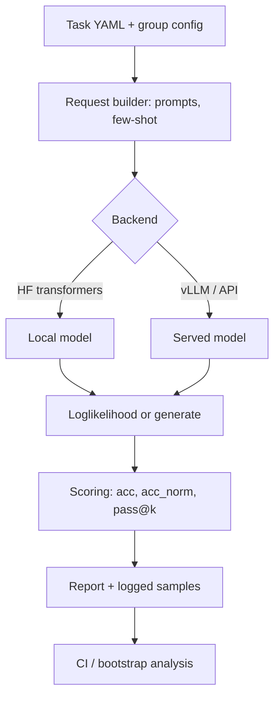
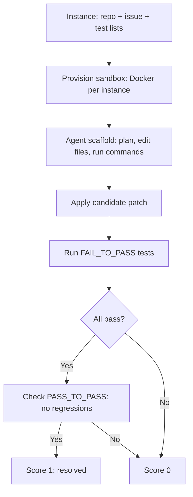
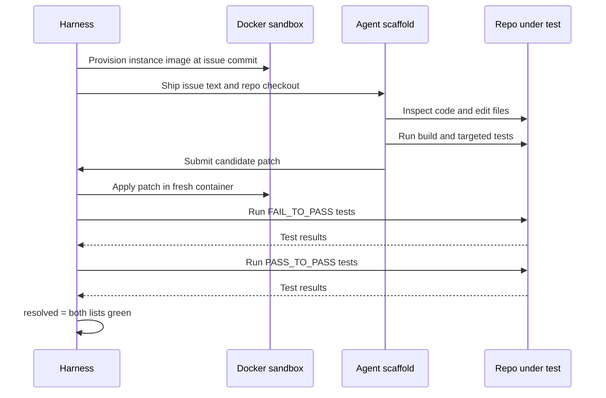

# Eval Harnesses

## Overview

A benchmark defines *what* to measure; a harness is the engineering system that actually executes it — resolving tasks, building prompts, calling models, scoring outputs, and attaching uncertainty. The same model on the same benchmark can differ by several points across harnesses, prompt formats, and sampling configurations, which means harness fluency is a prerequisite for reading any reported score. This page covers the four general-purpose harnesses (lm-eval-harness, HELM, lighteval, OpenAI simple-evals), the sandboxed harnesses for agentic work (SWE-bench, OSWorld, TAU-bench), the statistics that turn raw scores into evidence (confidence intervals, paired bootstrap, item-response theory), and the cost and reproducibility engineering that keeps large eval campaigns viable. The benchmark stack itself is mapped in [Benchmark Landscape](./benchmark-landscape.md); judge calibration has its own page in [LLM-as-Judge Deep](./llm-as-judge-deep.md).

## lm-evaluation-harness: Tasks as YAML

EleutherAI's lm-evaluation-harness is the de-facto standard behind most published academic LLM numbers. The v0.4 rewrite (documented in *Lessons from the Trenches on Reproducible Evaluation of Language Models*, 2024) made every task a declarative YAML file rather than Python code, which is what makes "read the task definition to know what a score measured" practical.

A task definition pins the dataset, the prompt template, the target, the few-shot policy, and the metric:

```yaml
task: mmlu_pro_physics
dataset_path: TIGER-Lab/MMLU-Pro
test_split: test
fewshot_split: validation
num_fewshot: 5
output_type: multiple_choice
doc_to_text: "Question: {{question}}\nA. {{choices[0]}}\nB. {{choices[1]}}\n..."
doc_to_choice: "{{['A','B','C','D','E','F','G','H','I','J']}}"
doc_to_target: "{{answer_index}}"
metric_list:
  - metric: acc
    aggregation: mean
  - metric: acc_norm
    aggregation: mean
```

The execution pipeline is a straight line from config to report, and every stage is where numbers silently diverge between teams:



Operational details that matter in practice:

- **Backends**: `--model hf` (transformers), `--model vllm` (fast local batch inference), or a server/API adapter. Loglikelihood scoring (multiple choice) and generation (free-form) have different cost profiles and different sampling requirements.
- **Few-shot control**: `--num_fewshot N` samples from `fewshot_split`; the same model at 0-shot vs 5-shot can differ by points, so the shot count is part of the result, not a detail.
- **`--log_samples`**: writes every prompt, model output, and score to disk — the single most valuable flag for debugging and for offline re-scoring later.
- **`--cache_requests`**: caches scored requests to a SQLite file so a crashed or extended campaign resumes without paying twice; invalidation must be handled when task definitions change.
- **Task groups**: `--tasks mmlu_pro` resolves to a group config over 14 domain tasks, letting teams run and report a suite as one unit while keeping per-domain numbers.
- **Chat templates**: `--apply_chat_template` switches from raw-completion scoring to chat-formatted prompting; instructed models score differently under each, another silent confound.

## HELM: Scenarios × Metrics × Perturbations

HELM (CRFM, Stanford) took a different slice of the problem: instead of maximum task coverage, it runs a fixed, holistic matrix. The 2023 paper evaluated 30 models over **42 scenarios** spanning **7 metrics** — accuracy, calibration, robustness, fairness, bias, toxicity, and efficiency — and applied deliberate *perturbations* (typos, dialect variation, synonym swaps) to measure how brittle each model's accuracy is. The contribution is the evaluation *shape*: one model is not one number but a scenario × metric matrix, and robustness cells are as decision-relevant as accuracy cells. HELM Lite distills the matrix for cost; the leaderboard remains the reference implementation of "calibration and robustness belong in the headline table."

### How HELM Defines a Scenario

A HELM scenario is not a dataset — it is a (dataset, formatting, instruction) triple: the raw data, how items become prompts, how the model's output maps to a request (multiple choice, generation, scoring), and which labels count as correct. Metrics are then computed *per scenario*, so calibration can be reported on a knowledge scenario while toxicity is reported on an open-ended one. That decomposition is what made perturbation analysis possible: rerun the same scenario with controlled input corruptions and read the accuracy drop as a robustness measurement — an idea most subsequent harnesses borrowed.

### lighteval vs simple-evals: Two Philosophies

The two smaller harnesses embody opposite bets. **lighteval** (Hugging Face) bets on integration: shared model-loading, comparison tooling across checkpoints, and custom task classes that plug into the same API as the benchmarks — the right choice for teams sweeping dozens of fine-tuned checkpoints per day during training. **simple-evals** (OpenAI) bets on transparency: a handful of self-contained Python modules with the exact prompts used in OpenAI's own reporting, no framework, no abstraction — the right choice when the question is "what *precisely* did that reported number measure?" Read simple-evals even if you run lm-eval; the diff between the two prompts is often the missing explanation for a reproduction gap.

| Harness | Scope | Task definition | Best used for |
|---|---|---|---|
| lm-eval-harness | Broadest academic coverage (hundreds of tasks) | YAML per task | Reproducing paper numbers; pre/post-training regression |
| HELM | Fixed holistic matrix, multi-metric | Python scenario configs | Calibration/robustness/bias axes, not just accuracy |
| lighteval | HF-integrated, comparison-oriented | Custom task classes or YAML | Fast sweeps across checkpoints during training |
| simple-evals | Small set, minimal code | Self-contained Python modules | Reading exact OpenAI-style eval prompts; quick ports |
| OpenCompass | Large suite, CN ecosystem | Config-based | Broad coverage with strong multilingual tasks |
| Inspect AI (UK AISI) | Eval framework with sandboxing + agents | Python solvers/scorers | Safety evals and agentic tasks with tool execution |

**simple-evals** deserves a read regardless of which harness you run: OpenAI's implementation is deliberately minimal — each eval is a readable Python module (MMLU-Pro, DROP, MGSM, SimpleQA, HumanEval among others) with the exact prompt engineering used in OpenAI's own reporting. When a paper's number does not reproduce, diffing simple-evals' prompt against your harness's prompt is frequently the answer. **Inspect AI** matters for the safety-eval side: it standardizes agents, tool execution, sandboxing, and scorers in one framework, which static academic harnesses were never designed to do.

## Agentic Harnesses: Sandboxes Are the Harness

Agentic benchmarks replaced "call the model once" with "run a whole software system per task." The harness *is* an execution environment, and its fidelity bounds the benchmark's validity.



- **SWE-bench**: each of the 2,294 instances (500 in Verified) is provisioned in its own **Docker container** with the repo at the issue's commit. An agent scaffold reads the issue, edits files, and submits a patch; the harness applies the patch and runs the repository test suite against two lists — **FAIL_TO_PASS** (must start failing, end passing) and **PASS_TO_PASS** (must keep passing). This makes scoring *executable and objective*: an LLM judge never decides whether a bug fix works. The engineering costs are real: container images per repo, long timeouts, and per-trajectory token bills that dwarf any static benchmark.
- **OSWorld**: full **Ubuntu VMs** with pre-task setup scripts (open this file, set that preference), screenshot-driven observation, and post-task validators that check *system state* (the file exists, the setting changed) rather than model text. At launch the best model scored ~12% vs ~72% for humans — a gap driven jointly by GUI grounding and long-horizon planning.
- **TAU-bench**: no file system at all, but a hostile-for-your-own-good ingredient — an **LLM-simulated user** who behaves like a real customer, plus a written policy document the agent must respect (refunds only with order ID, etc.). Scoring combines database state checks (did the reservation actually change?) with policy-compliance checks, and reports **pass^k** — success in all of k runs — because reliability, not average quality, is the deployment question. Simulation variance (the user LLM is stochastic) adds a second error bar that must itself be measured.

The confound to state out loud in any interview: in agentic evals, **scaffold quality can dominate model quality**. The same checkpoint measured through different agent loops can swing double-digit resolution rates, so headline numbers are claims about a *system*, not a model.

The full SWE-bench lifecycle, end to end, shows why a single agentic eval run is a small distributed-systems exercise:



Note the two-container pattern in serious harnesses: development happens in one sandbox the agent can dirty, scoring happens in a fresh container so the patch — not the agent's leftover process state — is what is being tested. That distinction is exactly the one production CI makes between a build environment and a test environment.

## Evals in CI: Gating Model and Prompt Changes

Harnesses earn their keep when they run *before* merge, not in a quarterly report. The pattern that works:

- **Tiered suites.** A smoke tier (50-200 items, minutes, every PR) catches format breakage and catastrophic regressions; a full tier (thousands of items, nightly) catches distributional drift; an agentic tier (weekly or on-demand) catches interaction regressions without taxing every commit.
- **Gates on paired deltas, not raw scores.** The gate condition is "new − old ≥ −ε on shared items with the paired test excluding a loss", not "score ≥ X" — otherwise normal benchmark noise blocks releases or, worse, gets the threshold loosened until it is meaningless.
- **Logged samples as artifacts.** Every CI eval run stores prompts, outputs, and verdicts; a regression triage starts by diffing failed items between two runs, not by re-running blind.
- **Judge pinning.** If CI uses a judged metric, the judge model version and prompt hash are pinned dependencies; an implicit judge upgrade silently re-baselines every gate in the repo.

```python
# Minimal CI gate over shared-item results
delta = new_acc - old_acc                    # point estimate
lo, hi = paired_bootstrap_ci(new_res, old_res, n=10_000)
if lo < -EPSILON:                            # e.g. EPSILON = 0.5 points
    fail(f"eval regression: {delta:+.1f} pts, 95% CI [{lo:+.1f}, {hi:+.1f}]")
```

The one-line takeaway for interviews: evals in CI convert model quality from a quarterly debate into a per-change statistic — the same transformation lint and tests gave source code, with the statistical machinery this page's next section supplies.

### Choosing an Inference Backend

The backend decision interacts with both cost and numerics, and it is worth being able to name the trade-offs:

| Backend | Strengths | Watch out for |
|---|---|---|
| HF transformers (`--model hf`) | Reference numerics; widest model support | Slowest; sequential-friendly only |
| vLLM (`--model vllm`) | 10×+ throughput on batched scoring | Minor numeric differences vs HF on loglikelihoods |
| API / served endpoints | No local GPU; matches production path | Cost per token; rate limits; provider-side model updates |
| In-process (training code) | Zero serialization; exact training numerics | Eval code entangled with training loop; hardest to version |

The numerics point deserves emphasis because it surprises people: dtype, kernel versions, and batching can shift loglikelihoods by enough to move MC accuracy a few tenths of a point — irrelevant for ranking tiers, decisive when two models differ by 0.3 points on a saturated benchmark. Record the backend and dtype in every report; treat sub-point differences across different backends as unmeasured.

## Statistical Rigor: Error Bars, Paired Tests, IRT

A benchmark score is a sample proportion; reporting it without uncertainty is the most common quantitative failure in model comparisons.

**Binomial confidence intervals.** For N items with observed proportion p̂, the standard error is \\( \\mathrm{SE} = \\sqrt{\\hat{p}(1-\\hat{p})/N} \\), and the 95% interval is approximately \\( \\hat{p} \\pm 1.96\\,\\mathrm{SE} \\). Worked examples:

| Benchmark | N | p̂ | 95% CI half-width |
|---|---|---|---|
| SWE-bench Verified | 500 | 0.50 | ±4.4 pts |
| GPQA Diamond | 198 | 0.65 | ±6.6 pts |
| MMLU (full test) | 14,042 | 0.85 | ±0.6 pts |
| AIME 2024 (30 problems) | 30 | 0.70 | ±16.4 pts |

The AIME row is the cautionary tale: a 30-item benchmark at 70% has a confidence interval wider than the gap between most model pairs — which is why labs aggregate over multiple years or report over sampled problem sets, and why single-exam champion claims are statistically empty.

**Paired comparisons.** Overlapping unpaired CIs understate what you know, because models fail on largely the *same* items. The right tool is a test conditioned on the same items: **McNemar's test** for binary outcomes (compare counts of items where only A passes vs only B passes) or a **paired bootstrap** — resample items with replacement, recompute the score difference on each resample, and read the 2.5th/97.5th percentiles of the difference distribution. If that interval excludes zero, the ordering is real. A 2-point gap that comes from B consistently winning on 40 discordant items is strong evidence; a 2-point gap from coin-flip noise is not.

**Sampling nondeterminism.** Generation under temperature > 0 adds a second variance term. Code benchmarks handle it with **pass@k** — the probability that at least one of k samples passes — computed with the unbiased estimator from the Codex paper over n total samples with c correct ones:

\\[ \\text{pass@}k = \\mathbb{E}\\left[1 - \\frac{\\binom{n-c}{k}}{\\binom{n}{k}}\\right] \\]

For pass@1 with temperature, sample N times and average; for temperature 0, run the whole benchmark again with a different seed to bound run-to-run jitter before claiming a model delta.

**Item-response theory (IRT).** Classical scoring weights every item equally and assumes items are interchangeable. IRT models \\( P(\\text{correct} \\mid \\theta) \\) as a logistic function of the item's difficulty and discrimination parameters plus the model's ability θ, which lets you (a) estimate ability from fewer items (adaptive, CAT-style evaluation), (b) flag items that do not behave (negative discrimination usually means a broken or contaminated item), and (c) compare models on a common ability scale even when they see different item subsets. It is standard psychometrics, and it is slowly entering LLM evaluation as benchmarks grow too expensive to run in full.

## Common Failure Modes of Homegrown Harnesses

Teams that roll their own harness re-discover the same five bugs. The table doubles as a review checklist for any harness you inherit:

| Failure mode | Symptom | Root cause | Fix |
|---|---|---|---|
| Prompt-format drift | Scores move after unrelated code changes | Prompt template built inline, not versioned | Task YAML/config files committed and diffed like code |
| Answer extraction bugs | Correct answers scored wrong (especially MC) | Regex over model text, brittle to format | Prefer loglikelihood scoring for MC; normalize via harness primitives |
| Silent dataset updates | Baseline numbers shift without a model change | Pulling `main` of a dataset by revision-less reference | Pin dataset revision hashes |
| Judge re-baselining | All gates flip green/red after a judge update | Judge model version implicit | Pin judge model + prompt hash; re-run golden items |
| Caching staleness | Edited task still scores as before | Cache keyed without task-config hash | Include task hash in cache keys; bust on config change |

The pattern across all five rows: the harness is software, so it gets the same discipline as software — versioning, pinning, and change detection — plus the statistical layer software does not need because software tests are deterministic and benchmark scores are not.

## Run-Cost Engineering

Large eval campaigns are compute budgets, and the levers are well understood:

| Lever | Mechanism | Typical saving |
|---|---|---|
| Request caching | SQLite/JSON cache keyed on (model, prompt, sampling params); `--cache_requests` | 100% on resumed/extended runs |
| `--predict_only` + offline scoring | Generate once, re-score repeatedly as scoring code evolves | Avoids re-inference during scoring iteration |
| Sampling budgets | Fixed k per task, temperature 0 by default, k>1 only where pass@k is the metric | Direct token cost |
| Item subsets | HELM Lite-style curation or IRT-informed item selection | 5-10× for statistically similar precision |
| Batched local backends | vLLM behind lm-eval instead of per-request APIs | 10×+ throughput, no per-token pricing |
| Loglikelihood scoring | Score all MC options in one batched pass instead of generating | Eliminates decoding cost on MC tasks |

Rough arithmetic grounds the agentic case: a SWE-bench Verified run at 500 instances × ~200K tokens per trajectory ≈ 100M tokens — thousands of dollars per full pass at API prices before failures and retries, versus millions of tokens total for full MMLU. This is why agentic campaigns are subsampled, cached aggressively, and why the reproducibility discipline below is not optional.

The same arithmetic for a static benchmark shows the cost structure is different in kind, not just degree. MMLU-Pro with 5-shot prompting: 12,032 items × ~1.5K prompt tokens ≈ 18M input tokens — but loglikelihood scoring of 10 options means *no generation at all*, so the run is input-dominated and batchable through a local vLLM backend for the price of GPU-hours. The lesson: multiple-choice benchmarks are bandwidth problems, agentic benchmarks are session problems, and picking the harness backend (loglikelihood vs generate) is a cost decision as much as a modeling one.

## Reproducibility Checklist

Every eval report should carry enough metadata to be re-executed bit-for-bit-ish. The checklist below matches what the lm-eval v0.4 paper argues every result should disclose:

1. **Model identity**: exact checkpoint or HF revision hash — not "Llama-3-70B" but the commit.
2. **Harness version**: lm-eval/HELM/Inspect release or commit; task YAML files are versioned too, and task definitions change.
3. **Prompt configuration**: num_fewshot, few-shot split, chat template applied or not, system prompt.
4. **Sampling parameters**: temperature, top-p, max tokens, stop sequences; temperature 0 for deterministic scoring tasks.
5. **Numerics**: dtype (bfloat16 vs float16 shifts loglikelihoods), batch size, backend (HF vs vLLM) — noted as known numeric confounds.
6. **Dataset revision**: HF dataset revision hash; datasets get silently updated.
7. **Seeds**: few-shot sampling seed, generation seeds, bootstrap seeds.
8. **Logged samples**: `--log_samples` output archived so scores can be re-audited and re-scored offline.
9. **Uncertainty**: CIs per score, paired tests for comparisons, and the N behind every number.
10. **Contamination posture**: model training cutoff vs benchmark release, any decontamination checks run.

A result without these ten fields is a marketing claim. The reproducibility paper behind lm-eval v0.4 exists precisely because published numbers turned out to be non-reproducible across harnesses and prompt formats — the gap is routinely several points, larger than most ship/no-ship decisions.

## Interview Questions

1. **The same model reports 76.2% on MMLU-Pro in one paper and 73.8% in another. Give five plausible causes.** (1) Few-shot count: 0-shot vs 5-shot moves scores by points. (2) Chat template: raw completion vs chat-formatted prompting changes instruction-following behavior. (3) Scoring variant: exact-match of the letter vs answer-content normalization vs loglikelihood ranking. (4) Harness task definition version — MMLU-Pro prompt formats were revised across harness releases. (5) Sampling: temperature > 0 adds run variance. The fix is the reproducibility checklist: pin model revision, harness version, few-shot, template, and sampling params, and demand logged samples when numbers disagree.

2. **Model A scores 49.0% on SWE-bench Verified, model B scores 52.0%. Can you ship B?** A single score's 95% CI at N=500 is about ±4.4 points, so the raw CIs overlap heavily — but the unpaired interval is the wrong tool. Compute a paired comparison: both models run the same 500 instances, so resample instances and look at the bootstrap distribution of the 3-point difference, or run McNemar's test on the discordant items. Agentic instances are also correlated (same scaffold, same repos), which the pairing captures. If the paired interval excludes zero and the cost/latency trade-off holds, the 3 points are real; otherwise the honest answer is "indistinguishable, decide on other axes."

3. **Why is executable scoring (unit tests, state validators) so central to agentic benchmarks, and where does it fall short?** Because it removes the judge from the loop: SWE-bench resolves via FAIL_TO_PASS/PASS_TO_PASS test lists and OSWorld validates system state, so "did it work" is a mechanical check, not an opinion. It falls short in three ways: tests can be satisfied without a genuine fix (overfitting the test suite), state validators under-specify the *quality* dimension (the report is saved but is it any good?), and policy/safety dimensions (TAU-bench's compliance checks) still require judgment — which is where LLM judges re-enter, with all their calibration requirements.

4. **When would you choose HELM-style holistic evaluation over lm-eval-harness coverage, and what does each optimize?** Choose HELM when the decision requires the *shape* of failure, not just accuracy: its scenario × metric × perturbation matrix surfaces calibration, robustness (accuracy under typos and dialect shift), bias, and toxicity in one table — valuable for a model selection decision with real users. Choose lm-eval-harness when you need breadth and reproduction: hundreds of YAML-defined tasks, standard prompt configurations, the format most papers report, and cheap integration into CI for pre/post-training regression. Many teams do both: HELM-style axes on a few scenarios for decision context, lm-eval breadth for regression screening.

5. **Your eval budget is $5,000 and the full agentic suite costs $40,000. What do you cut, in what order?** First, cache and resume — a crashed rerun is pure waste, and `--predict_only` plus offline scoring avoids re-inference while iterating on scoring. Second, subsample statistically: 250 instances at ±6 points is often enough to order models, and IRT-informed item selection preserves precision with fewer items. Third, restrict expensive agentic runs to the instances that discriminate (pilot on 50, keep the informative subset), and drop temperature > 0 except where pass@k is the reported metric. Fourth, batch through a local vLLM backend instead of API pricing where licensing allows. Never cut: logged samples, seeds, and the paired analysis — they cost nothing and carry all the evidence.

6. **What does item-response theory buy you that classical accuracy does not?** Three things. First, efficiency: with difficulty/discrimination parameters fitted, ability θ can be estimated from adaptively chosen item subsets, cutting run cost at equal precision. Second, item QA: items with negative discrimination (stronger models fail them more often) are usually broken, ambiguous, or contaminated — IRT finds them automatically, classical scoring hides them. Third, comparability: θ is a common ability scale, so models evaluated on overlapping-but-different item subsets remain comparable. The cost is fitting assumptions — IRT presumes a single latent dimension, which broad knowledge benchmarks violate — so it complements, not replaces, plain accuracy reporting.

## Key Takeaways

- The harness is part of the measurement instrument: task YAML, few-shot config, chat template, backend, and dtype each move scores by more than many ship decisions — pin everything.
- lm-eval-harness made tasks declarative YAML with `--log_samples` and request caching; HELM's contribution is the scenario × metric × perturbation matrix that surfaces robustness and calibration alongside accuracy.
- Agentic harnesses are sandboxed systems (Docker per SWE-bench instance, Ubuntu VMs per OSWorld task, LLM user-simulators in TAU-bench) with executable scoring; scaffold quality is a confound that can dominate model quality.
- Report uncertainty always: binomial CIs (±4.4 pts on SWE-bench Verified at 50%, ±16 pts on a 30-problem AIME split), paired bootstrap or McNemar for comparisons, pass@k with the unbiased estimator under sampling.
- IRT adds adaptive item selection, broken-item detection, and cross-subset comparability — psychometrics entering LLM evaluation as benchmarks get expensive.
- Cost engineering is part of eval design: caching, predict-only generation, statistical subsampling, and local batched backends are the difference between a $40K campaign and a $5K one.
- The reproducibility checklist (model revision, harness version, prompts, sampling, numerics, dataset revision, seeds, logged samples, CIs, contamination posture) separates evidence from marketing.
- Evals belong in CI as tiered suites gated on paired deltas, with logged samples as artifacts and judge configs pinned like dependencies.

## References

- lm-evaluation-harness (official repo and docs): <https://github.com/EleutherAI/lm-evaluation-harness>
- Biderman et al., *Lessons from the Trenches on Reproducible Evaluation of Language Models*, 2024: <https://arxiv.org/abs/2405.14782>
- HELM — Liang et al., *Holistic Evaluation of Language Models*, TMLR 2023: <https://crfm.stanford.edu/helm/>; paper <https://arxiv.org/abs/2211.09110>
- lighteval (official repo): <https://github.com/huggingface/lighteval>
- OpenAI simple-evals (official repo): <https://github.com/openai/simple-evals>
- OpenCompass (official repo): <https://github.com/open-compass/OpenCompass>
- Inspect AI — UK AI Safety Institute: <https://inspect.aisi.org.uk/>; repo <https://github.com/UKGovernmentBEIS/inspect_ai>
- SWE-bench — Jimenez et al., ICLR 2024: <https://arxiv.org/abs/2310.06770>; harness docs <https://www.swebench.com>
- OSWorld — Xie et al., NeurIPS 2024: <https://arxiv.org/abs/2404.07972>; project page <https://os-world.github.io/>
- TAU-bench — Sierra Research, 2024: <https://github.com/sierra-research/tau-bench>; paper <https://arxiv.org/abs/2406.12045>
- HumanEval / pass@k estimator — Chen et al., 2021: <https://arxiv.org/abs/2107.03374>
- RULER — Hsieh et al., 2024: <https://arxiv.org/abs/2404.06654>
- Miller, *Adding Error Bars to Evals: A Statistical Approach to Language Model Evaluations*, 2024 (arXiv preprint).

## Cross-References

- [Benchmark Landscape](./benchmark-landscape.md) — the benchmark stack these harnesses execute, with saturation status per benchmark
- [LLM-as-Judge Deep](./llm-as-judge-deep.md) — judge calibration; the Cohen's kappa math extends this page's agreement statistics
- [LLM Evaluation](../llm-serving/evaluation.md) — the survey page: benchmark categories and metric definitions at overview level
- [Agent Evaluation](../../ml/agents/evaluation.md) — the evaluation-dimension framework the agentic harnesses instantiate
- [SWE Agents](../agentic/swe-agents.md) — the agent scaffolds whose design choices dominate SWE-bench numbers
- [Reward Hacking](../post-training/reward-hacking.md) — why optimizing against any eval (harness or judge) eventually corrupts it
- [Sandboxed Execution](../agentic/sandboxed-execution.md) — the isolation technologies (microVM, gVisor) behind safe agentic harnesses
