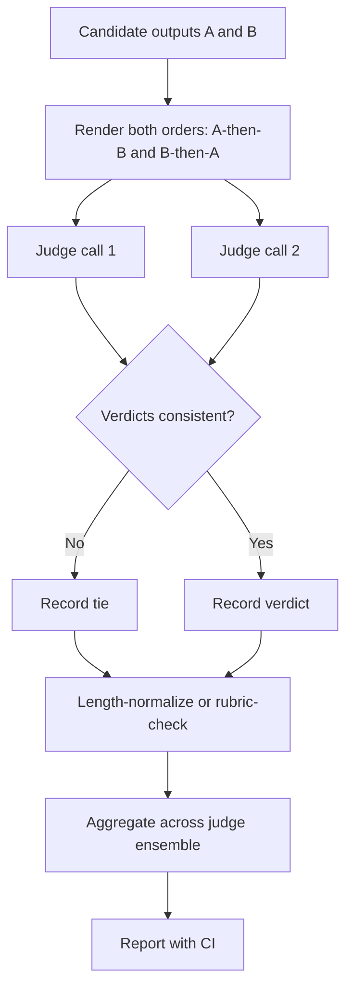
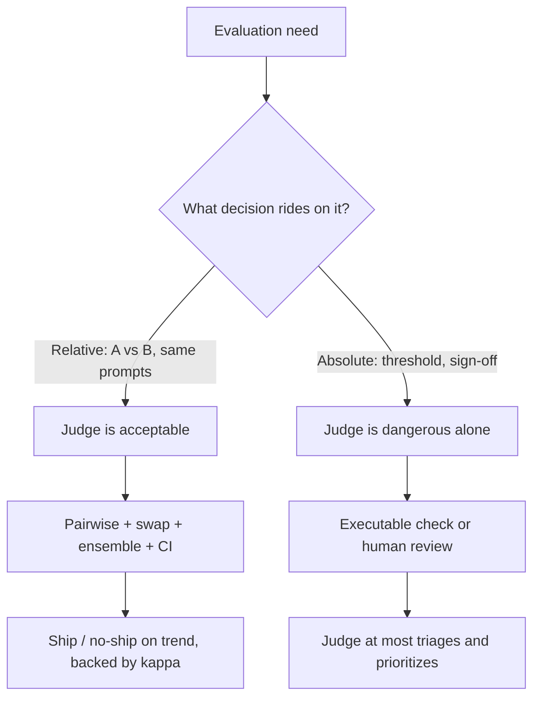

# LLM-as-Judge Deep

## Overview

An LLM judge is a language model prompted to score, rank, or grade the outputs of other models — the only scalable evaluation primitive for open-ended tasks where no unit test exists. It is also the most abused primitive: judges carry measured position, verbosity, and self-preference biases worth tens of points in some regimes, they drift when the judge model changes, and models optimized against them learn to exploit them. This page treats the judge as an instrument to be calibrated: grading modes and their trade-offs, the bias measurements with their deltas, mitigation techniques (position swaps, length normalization, rubric pinning, ensembles), the agreement statistics that tell you whether calibration worked, and the deployment rule separating safe from dangerous uses. The benchmark context is in [Benchmark Landscape](./benchmark-landscape.md); the harness engineering around judges is in [Eval Harnesses](./eval-harnesses.md).

## Grading Modes: Single, Pairwise, Reference-Guided

The first calibration decision is the response format the judge is asked to produce, because each mode fails differently.

| Mode | Judge prompt shape | Strengths | Weaknesses | Used by |
|---|---|---|---|---|
| Single-answer scoring | "Rate this response 1-10 on criteria X" | Cheap (one output per item); produces absolute scores | Scale unanchored, drifts across judge versions; worst bias exposure | Early MT-Bench style grading, internal quality gates |
| Pairwise comparison | "Which response is better, A or B?" | Comparative judgments are more consistent than absolute ones; feeds Bradley-Terry/Elo rankings | Position bias; ties handling; 2× outputs per comparison | Chatbot Arena, AlpacaEval, Arena-Hard |
| Reference-guided | "Given this reference answer, grade the response" | Anchors the scale to a gold standard; catches factual misses | Requires references; judge may overweight surface similarity to reference | AlpacaEval (vs GPT-4 reference), factual evals |
| Rubric checklist | "Verify each of these N criteria independently" | Decomposes quality into checkable atoms; auditable; more human-agreeable | Rubric design cost; misses holistic properties | Production eval pipelines, Inspect-style scorers |

The practical ordering for reliability is roughly: rubric checklist > reference-guided > pairwise > single-answer. Single-answer scoring is the most convenient and the least trustworthy, because nothing anchors the scale: an "8" from a judge prompted one way is an "8" from no other configuration, and the same judge model updated two minor versions later produces a different distribution over the same outputs. Pairwise improves consistency because comparison is cognitively easier than absolute assignment, but it inherits position bias — which the next section quantifies.

## Anatomy of a Production Judge Prompt

Most homegrown judge failures are prompt failures. A calibrated pairwise judge prompt has five load-bearing elements, each closing a named bias channel:

```text
You are an impartial evaluator comparing two AI assistant responses.

## Criteria (rubric-pinned, versioned in the eval repo)
1. Factual accuracy relative to the provided reference material.
2. Directly addresses the user's actual request.
3. No invented facts, citations, or tool results.
4. Concision: no padding, restating the question, or filler.

## Anchors (score-point examples)
- A response that invents a citation fails criterion 3 regardless of style.
- A correct answer in half the length beats a correct padded one (criterion 4).

## Input
Question: {question}
Response A: {response_a}
Response B: {response_b}

## Procedure
Reason privately about each criterion for A and B first.
Then output JSON only:
{"criteria": {"accuracy": "A"|"B"|"tie", ...}, "verdict": "A"|"B"|"tie",
 "confidence": 0.0-1.0}
```

The design choices map one-to-one onto the failure modes: the pinned rubric removes scale drift between judge releases; anchors give the scale a ground truth inside the prompt; criteria-first JSON forces per-criterion reasoning *before* the verdict (verdict-then-justification measurably degrades quality); the explicit concision criterion counters verbosity bias inside the rubric rather than hoping the model ignores length; and the structured output makes verdicts machine-checkable so the pipeline can enforce schema, not just read prose. What the prompt cannot fix — position slotting and self-family preference — is fixed in the pipeline around it, which is why the next two sections exist.

### Reference-Guided Grading in Practice

When a gold reference exists — a human-written ideal answer, a verified fact sheet, a canonical support ticket resolution — hand it to the judge and change the question from "which is better" to "how does each response deviate from the reference". The reference anchors the knowledge dimension that single-answer judging floats on, and it neutralizes the judge's own knowledge ceiling: the judge no longer needs to *know* whether a citation is real, only whether it matches the reference's citations. A minimal factual-accuracy checker shows the shape:

```text
Reference (verified): {gold_answer_with_citations}
Candidate: {model_output}

List every factual claim in the candidate that contradicts the reference,
then every claim the reference does not support. Output JSON:
{"contradicted": [...], "unsupported": [...], "faithful": true|false}
```

This is the AlpacaEval trick generalized — its win rates are computed against GPT-4's own reference answer — and it is the standard bridge between open-ended generation and anything resembling ground truth. Its limits: a reference must exist and be trusted (which is work), and faithfulness to a reference is not the same as quality — a response can be perfectly faithful and useless, so reference-guided checks usually feed *one criterion* of a rubric, not the whole verdict.

## Measured Biases and Their Deltas

The canonical measurements come from the MT-Bench paper (Zheng et al., NeurIPS 2023), which validated GPT-4 as a judge against ~23K human preferences and then probed where it breaks.

- **Position bias.** Judges prefer whichever answer occupies a particular slot (commonly the first presented). Swapping the order of the two candidates and re-asking flips the verdict in a substantial fraction of decisions — on the order of one-fifth to one-third depending on judge model and task family, with the flip rate highest for weaker judges and for ties-adjacent pairs. Uncorrected, this converts presentation order into a systematic score component.
- **Verbosity bias.** Judges prefer longer answers even when the extra length adds nothing — the MT-Bench authors demonstrated judges endorsing a long but flawed answer over a correct short one when prompted with a deliberately flawed long candidate. This interacts with production reality: systems trained or selected under verbose-biased judges inflate length, which is exactly the reward-hacking pattern in [Reward Hacking](../post-training/reward-hacking.md).
- **Self-preference / self-enhancement.** Judges favor their own stylistic fingerprints: the MT-Bench measurements show GPT-4 grading its own outputs higher than human judges do, in the neighborhood of a 10% swing, and later work documented the same self-family preference across model families. Any eval where the judge and the candidate share a lineage inherits this correlation.
- **Knowledge limits.** Judges cannot reliably evaluate what they do not know — expert-domain answers that exceed judge competence get graded on plausibility and style, not correctness. This is the failure mode reference-guided grading and executable scoring exist to backstop.

| Bias | Measured effect (MT-Bench paper and follow-ups) | First-order mitigation |
|---|---|---|
| Position | Order swap flips verdicts in ~20-35% of uncorrected cases | Swap both orders; require consistent verdict else "tie" |
| Verbosity | Long flawed answers beat short correct ones | Length-controlled win rates (AlpacaEval 2.0) |
| Self-preference | Judge favors own-family outputs by ~10 points | Judge from an unrelated family; ensemble |
| Knowledge ceiling | Grades beyond its competence on expert content | Reference-guided grading, executable checks |

The meta-failure ties all four together: judge scores are *confounded proxies*, where the correlation between the proxy and true quality degrades exactly when the stakes rise. The taxonomy below is worth memorizing as a diagnostic checklist — most judge incidents a team will ever hit is one of these five rows:

| Failure | Symptom in the metrics | Root cause | Detection signal |
|---|---|---|---|
| Position lock | Verdict distribution depends on slot assignment | Slot preference, not quality | Swap test: verdict flip rate |
| Length gaming | Win rate tracks output length growth | Verbosity bias + optimizer feedback | Win rate vs length regression slope |
| Family favoritism | Same-family candidates win ties suspiciously often | Self-preference | Cross-family judge audit on labeled subset |
| Rubric drift | Same items score differently across months | Unpinned scale, judge model updates | Golden-item suite re-run per release |
| Comprehension ceiling | Scores correlate with confidence, not correctness | Judge lacks domain knowledge | Agreement with experts by domain stratum |

## Bias Mitigation Techniques



- **Swap both orders (position debias).** Run every comparison twice with candidates reversed; count only consistent verdicts, mapping inconsistencies to ties. This costs 2× judge calls and removes most position signal. Skipping it is the single most common flaw in homegrown judge pipelines.
- **Tie policy.** The tie is a first-class outcome, not a failure: swaps convert borderline pairs into ties, and ties contribute to neither win rate nor ranking fit. The design decision is what to do with them — exclude from rankings but report the tie rate (transparent), or break ties with a second criteria pass (costlier, less honest). A pipeline that cannot produce ties is usually one that has not looked for position bias yet.
- **Length normalization.** AlpacaEval 2.0's length-controlled win rate is the reference implementation: a regression-style debiasing that estimates the win rate a model would get *if its outputs were not systematically longer*, reducing the correlation between length and win rate dramatically. The lesson generalizes: if a style covariate (length, markdown density, hedging count) predicts judge verdicts, control for it explicitly in the metric rather than hoping prompting fixes it.
- **Rubric pinning.** Replace "rate 1-10" with a versioned rubric: fixed criteria, anchored examples per score point, and per-criterion binary or ordinal checks. Pinning the rubric text in your repo and versioning it with your evals removes most cross-release drift, because the instrument no longer lives inside the judge model's head. Anchored scales (show the judge what a 3 looks like) measurably improve agreement with human raters.
- **Structured verdicts + reasoning.** Ask for criteria-by-criteria judgments in structured output (JSON) with brief per-criterion reasoning before the verdict — order matters: verdict-then-reasoning is worse. Temperature 0 for scoring reproducibility.
- **Judge choice.** Run the judge from a model family unrelated to the candidates, and record the judge's identity as metadata; a judge upgrade is a breaking change to your eval pipeline and should be treated like a schema migration, with re-validation against the human-labeled subset.

## Judge Ensembles

A single judge is a single point of failure; an ensemble averages away some idiosyncratic bias — if, and only if, the biases are not correlated.

- **Majority vote over judges.** Run k ≥ 3 judges from *different* model families and take majority verdict per comparison. This suppresses any single judge's quirks (position flips, house style) and costs k× judge calls — usually cheap relative to candidate inference, since judge prompts are short.
- **Heterogeneous pools.** The anti-pattern is ensembling GPT-4o, GPT-4.1, and GPT-4.5: shared training lineage means shared biases, and the ensemble inherits them. Heterogeneity across families is the property that buys bias reduction; diversity within a family buys mostly variance reduction.
- **Aggregation options.** Majority vote for verdicts; mean or trimmed-mean for numeric scores; Bradley-Terry fitting when many pairwise verdicts must collapse into a ranking (the same statistics Chatbot Arena applies to human votes). Weighted schemes exist but add a tuning surface that usually exceeds their benefit.
- **Disagreement as a signal.** Record per-item judge disagreement; high-disagreement items are precisely where the rubric is ambiguous or the candidates are too close to call. Route them to human review instead of letting the ensemble's vote hide them — the disagreement rate is also your cheapest early-warning signal that a judge update changed behavior.

### The Correlated-Bias Trap

Ensemble math assumes errors are partly independent; judge biases violate that assumption in a specific, predictable way. Every judge trained on internet-overlapping data shares a style prior (confident, structured, hedged-but-long answers read as better), so verdict correlations across judges are high exactly on the items where the style prior is decisive — which are the items where you most need the ensemble to help. The symptom is easy to spot: ensemble agreement with humans improves barely or not at all over the best single judge, while ensemble *stability* improves (same verdict on re-run). Stability without accuracy means the ensemble converged on a shared error. The escape routes are input-side rather than model-side: debias the inputs before voting (swaps, length control, reference material), so the residual per-judge errors that voting averages away are actually idiosyncratic.

## From Verdicts to Rankings: Aggregation Mechanics

Pairwise verdicts are not yet a leaderboard; something must turn N(N-1)/2 comparisons into ratings. The standard instrument is the Bradley-Terry model: each model i gets a latent strength r_i, and the probability that i beats j is `P(i>j) = 1 / (1 + 10^((r_j - r_i)/400))` — logistic in the strength difference, calibrated so 400 rating points correspond to roughly 10:1 odds. Fitting (logistic regression on the win/loss matrix, or the classic Elo online update for streaming votes) yields scores plus standard errors; Chatbot Arena applies exactly this machinery to human votes, and judge-generated pairwise verdicts can ride the same pipeline, which is how Arena-Hard produces its ratings from 500 prompts.

The statistics carry two obligations. First, report rating *confidence intervals*: with few comparisons per pair (always true at the top of a leaderboard where strong models rarely meet weak ones), rating SEs are large, and adjacent ranks are routinely within noise — the honest reading of "rank 3 vs rank 4" is usually "indistinguishable". Second, remember the model is relative: adding or removing any model refits every strength, so a rating is a statement about the current pool. Both obligations apply unchanged when the comparisons come from judges rather than humans — the judge layer adds bias, it does not remove the sampling uncertainty underneath.

## Agreement with Humans: Cohen's Kappa

Percent agreement overstates judge quality because two raters agree by chance even on random data. Cohen's kappa corrects for chance agreement:

\\[ \\kappa = \\frac{p_o - p_e}{1 - p_e} \\]

where \\( p_o \\) is observed agreement and \\( p_e \\) the chance-expected agreement computed from each rater's marginal distribution: \\( p_e = \\sum_i p_{A,i}\\, p_{B,i} \\) over outcome classes i.

**Worked example.** Two raters (a human expert and your judge pipeline) each classify 200 pairwise comparisons as "A better" or "B better". Observed agreement \\( p_o = 0.85 \\). Marginals: rater 1 splits 0.60/0.40, rater 2 splits 0.65/0.35. Then \\( p_e = 0.60 \\times 0.65 + 0.40 \\times 0.35 = 0.39 + 0.14 = 0.53 \\), giving

\\[ \\kappa = \\frac{0.85 - 0.53}{1 - 0.53} = \\frac{0.32}{0.47} \\approx 0.68 \\]

The 85% headline agreement is only "substantial" agreement (κ ∈ 0.61-0.80 on the conventional Landis-Koch bands) after chance correction — and when one class dominates (e.g., a judge that says "A better" 90% of the time), \\( p_e \\) inflates and kappa exposes how little information the agreement actually carries. For k ≥ 3 raters use Fleiss' kappa; for partial-credit ordinal scales use Krippendorff's α. The engineering workflow: label 100-300 items with humans once, compute kappa per judge configuration (prompt variant × judge model), and keep the configuration with the best kappa — re-running it after every judge model update.

### A Worked Calibration Run

The workflow end to end, with the numbers a real team would produce:

| Step | Operation | Result |
|---|---|---|
| 1 | Label 200 real production outputs with two human raters | Human-human agreement 0.79, κ = 0.61 — the ceiling your judge should approach |
| 2 | Run naive judge (single prompt, one order) | Agreement with humans 0.83, κ = 0.64 |
| 3 | Position-swap audit | 27% of verdicts flip under reordering — position bias confirmed |
| 4 | Adopt swap-both-orders, ties on inconsistency | Agreement 0.84, κ = 0.70, flip rate now structural (converted to ties) |
| 5 | Add pinned rubric + criteria-first JSON | κ = 0.74 |
| 6 | Ensemble two unrelated judge families, majority vote | κ = 0.77 — approaching the human-human ceiling |

Two lessons hide in the table. First, the biggest single jump came from the mechanical fix (swap + tie policy), not from a fancier prompt — instrumentation beats incantation. Second, the human-human ceiling (κ = 0.61 here) is the honest target: a judge exceeding *its own humans'* agreement is usually a sign the judge is grading something easier than what the humans were asked to grade, not that it became superhuman.

## When Judges Are Acceptable vs Dangerous



**Acceptable — relative comparisons.** "Is the new prompt version better than the old one?" "Did this fine-tune regress helpfulness?" Pairwise judged comparisons over the same item set, with swap debiasing and a paired bootstrap over verdicts, are well-conditioned: most biases act as (approximately) shared noise on both candidates and largely cancel in the difference. Arena-Hard demonstrated the ceiling of this approach: 500 genuinely difficult prompts mined from real Chatbot Arena traffic, judged pairwise against a fixed baseline, reached **~89% agreement** with the full human-vote Arena leaderboard at a tiny fraction of the traffic cost. That is the strongest public evidence that a calibrated judge pipeline can substitute for massive human preference collection on *relative* questions.

**Dangerous — absolute thresholds.** "Deploy if the judge scores ≥ 8/10." Absolute judged scores are unanchored across judge versions, prompt rewordings, and candidate distributions; the threshold that meant quality last quarter drifts silently. The dangerous uses share a pattern: the judge is the *only* instrument, the decision is binary and consequential, and the failure (a confident wrong verdict) is invisible. Never route safety sign-offs, compliance checks, or customer-facing SLA claims through an unvalidated judge; backstop them with executable checks or human review, and let the judge triage — sort the 10,000 outputs so the 200 worst reach a human.

**The gaming endgame.** Any judge that gates a reward signal becomes an optimization target. Models post-trained against judge-style rewards find the biases — length, hedging, sycophantic openers, citation-stuffed paragraphs — and the judge's correlation with true quality decays while its score climbs. The defenses (fresh held-out eval items, ensemble heterogeneity, length control, periodic human audits, and rotating judges) are the same mechanisms as the [Reward Hacking](../post-training/reward-hacking.md) defenses, applied at evaluation time. This is Goodhart's law with a token bill, and every eval that feeds an optimizer eventually meets it.

### The Judge-Based Benchmarks Worth Knowing by Name

Three instruments define the judged-evaluation canon, and each embodies one design lesson:

| Benchmark | Judged quantity | Judge setup | Design lesson |
|---|---|---|---|
| MT-Bench | 1-10 quality over 80 two-turn prompts | GPT-4 single-answer grading | Validated the judge against ~23K human votes — and measured its biases |
| AlpacaEval 2.0 | Win rate vs a reference model | Pairwise vs reference, length-controlled | Showed that controlling one covariate (length) rescues a leaderboard |
| Arena-Hard | Win rate vs GPT-4 baseline | Pairwise judge over 500 curated hard prompts | Item curation beats item count: 500 hard prompts ≈ full Arena rankings |

Each also documents its own aging: MT-Bench's absolute scores saturated and its judge is now outdated; AlpacaEval's length control was a response to gaming pressure; Arena-Hard inherits Arena's style dynamics while compressing its cost by orders of magnitude. When an interviewer asks "why not just use GPT-4 as a judge?", any one of these three is the counter-example with numbers attached.

## Cost Model of Judged Evals

Judge calls are cheap per call and dangerous in aggregate; budgeting them is part of pipeline design:

| Configuration | Judge calls per item | Relative cost | Bias exposure |
|---|---|---|---|
| Single-answer, single judge | 1 | 1× | Highest (unanchored scale + all biases) |
| Pairwise, one order | 1 | ~1× | Position bias uncorrected |
| Pairwise, both orders | 2 | 2× | Position debiased; ties surfaced |
| Pairwise both orders + 3-judge ensemble | 6 | 6× | Position + family biases averaged |
| Rubric checklist (4-8 criteria) | 1 | ~1-2× | Scale drift removed; knowledge ceiling remains |

Two cost notes. First, judge prompts are short relative to candidate outputs, and verdict prompts with identical candidates repeat identically across runs — cache them keyed on (judge model, prompt hash), exactly like the harness caching in [Eval Harnesses](./eval-harnesses.md). Second, spend the ensemble budget on *disagreement analysis*, not just averaging: the 5% of items where three judges disagree are the items your rubric is silently ambiguous about, and they are cheaper to fix at the rubric than to dilute with more judges.

In production, judged evals attach to the observability layer rather than running as a separate lab: traces from real traffic are sampled nightly, the judge scores them against the pinned rubric, and drift in the score distribution is a monitored signal — the same alerting philosophy as latency or error-rate SLOs, described in [Agent Observability](../agentic/agent-observability.md). The judge then becomes part of the feedback loop: samples where the judge flags a regression are routed to human review, and the human verdicts flow back into the kappa audit. That closed loop — judge triage, human adjudication, calibration refresh — is the difference between an eval pipeline and a dashboard nobody trusts after the first model update.

## Interview Questions

1. **Why is pairwise judging more reliable than 1-10 scoring, and what bias does it introduce?** Comparison is an easier judgment than absolute assignment: raters (human or model) are inconsistent at placing items on an unanchored numeric scale but consistent at ordering two items at once, so pairwise verdicts show higher inter-rater reliability. The introduced bias is positional — the judge prefers a slot, flipping verdicts in roughly a fifth to a third of cases when order changes — plus tie-handling ambiguity. The standard fix is to run both orders and keep only consistent verdicts, mapping disagreements to ties, then aggregate verdicts with Bradley-Terry fitting if a ranking is needed.

2. **Your judge agrees with humans on 85% of comparisons. Your lead says that's fine — human inter-rater agreement is only 81%. What do you say?** Percent agreement is not the right statistic: it includes chance agreement, which inflates when the response distribution is skewed. Compute Cohen's kappa — with a skewed distribution, chance-expected agreement \\( p_e \\) can be 0.5+, turning an 85% raw agreement into κ ≈ 0.68 ("substantial" but not stellar, and on a skewed distribution possibly worse). The 81% human-human number is also raw agreement between trained raters. The correct move: label 100-300 items, compute kappa for both the judge and a second human against the gold labels, and only then decide whether the judge is calibrated enough for the decision at hand.

3. **How does Arena-Hard get ~89% agreement with Chatbot Arena using 500 prompts and an LLM judge?** Three design choices. First, item selection: prompts are mined from real Arena traffic and chosen for high discrimination (models disagree on them), so easy consensus questions don't waste the budget. Second, pairwise-against-baseline: every model is compared to the same GPT-4 baseline rather than scored absolutely, converting quality into a win-rate on a common reference. Third, judge debiasing: consistent handling of position and length effects, with the win rate aggregated the same way Arena aggregates human votes. The lesson generalizes to production: curate discriminating items, compare to a fixed reference, debias the judge, and you approximate a much larger human evaluation.

4. **Where exactly does an LLM judge fail on expert content, and what is the backstop?** On content beyond the judge's competence, the judge grades plausibility and style instead of correctness — it cannot distinguish a subtly wrong derivation from a correct one, so verbosity and fluency dominate the verdict. Backstops: reference-guided grading (supply the gold answer and ask for deviation assessment), executable checks where a checker can be written (math: verify the final integer; code: run the tests), or routing low-confidence/high-stakes items to human experts. The tell-tale in your metrics: judge scores on expert domains correlate with length but not with ground truth — worth measuring once per domain.

5. **A teammate proposes ensembling five judge models, all fine-tuned from the same base family, to fix position bias. What's your assessment?** Ensembling reduces idiosyncratic noise but not shared bias: models from one lineage share position preference, verbosity preference, and house style, so the ensemble's verdict is more stable and still wrong in the same direction. Position bias specifically is better fixed by construction — run both orders and require consistency — which is cheaper than five judge calls. Heterogeneous ensembles (different families) do buy real bias reduction; same-lineage ensembles buy variance reduction you could have gotten from majority-voting five order-swapped runs of one judge. Spend the budget on heterogeneity and swaps, not redundancy.

6. **When is it acceptable to deploy a model based purely on judged eval scores, and when is it not?** Acceptable: relative, reversible decisions — choosing between two prompt versions, ranking checkpoints in an experiment, trend detection across releases with the judge held fixed. Not acceptable: irreversible or consequential gates — safety sign-offs, compliance claims, SLA commitments, or any absolute threshold, because judged absolute scores drift across judge updates and candidate distributions. The middle ground for production is the triage pattern: judge ranks and filters, executable checks or humans decide; and any judged metric feeding an optimizer (RLHF, prompt search) needs freshness (new held-out items), heterogeneity (ensemble), and periodic human audits, or it will be gamed into meaninglessness.

## Key Takeaways

- Judge reliability ordering: rubric checklist > reference-guided > pairwise > single-answer; unanchored 1-10 scores are the most convenient and least trustworthy mode.
- The three measured biases have concrete magnitudes: position swaps flip ~20-35% of uncorrected verdicts, verbosity bias lets long flawed answers beat short correct ones, and self-preference swings ~10 points toward the judge's own family.
- Position debias by running both orders and keeping consistent verdicts; control style covariates explicitly (length-controlled win rates) instead of trusting prompt fixes; pin and version rubrics to kill cross-release drift.
- Ensembles help only when heterogeneous — same-lineage judge pools share their biases; majority vote across families plus disagreement routing to humans is the production default.
- Report judge-human agreement as Cohen's kappa, never raw percent agreement: κ = (p_o − p_e)/(1 − p_e), and the chance correction matters more the more skewed the verdict distribution is.
- Judges are sound for relative comparisons (Arena-Hard reached ~89% agreement with Arena votes using 500 curated prompts) and dangerous as absolute thresholds or unreviewed safety sign-offs.
- A judge that gates a reward is an attack surface: length/style gaming is the eval-time face of reward hacking, defended by held-out freshness, ensemble heterogeneity, and human audits.
- Judge-call budgets scale with debiasing: pairwise-both-orders doubles cost, a 3-judge ensemble sextuples it — cache verdict prompts and spend the budget on heterogeneous judges and disagreement analysis, not redundant same-family calls.

## References

- Zheng et al., *Judging LLM-as-a-Judge with MT-Bench and Chatbot Arena*, NeurIPS 2023: <https://arxiv.org/abs/2306.05685>
- Chatbot Arena — Chiang et al., *Chatbot Arena: An Open Platform for Evaluating LLMs by Human Preference*, 2024: <https://arxiv.org/abs/2403.04132>; live leaderboard <https://lmarena.ai>
- Arena-Hard — Li et al., *From Crowdsourced Data to High-Quality Benchmarks*, 2024: <https://arxiv.org/abs/2406.11939>
- AlpacaEval 2.0 / length-controlled win rate — Dubois et al., *Length-Controlled AlpacaEval*, 2024: <https://arxiv.org/abs/2404.04475>; project page <https://tatsu-lab.github.io/alpaca_eval/>
- OpenAI simple-evals (reference judge implementations): <https://github.com/openai/simple-evals>
- Inspect AI (UK AISI) — scorers and sandboxed agent evaluation: <https://inspect.aisi.org.uk/>
- Cohen, *Weighted Kappa: Nominal Scale Agreement with Provision for Scaled Disagreement or Partial Credit*, Psychological Bulletin, 1968.
- Landis & Koch, *The Measurement of Observer Agreement for Categorical Data*, Biometrics, 1977.

## Cross-References

- [Benchmark Landscape](./benchmark-landscape.md) — Arena and Arena-Hard dynamics from the leaderboard-statistics side
- [Eval Harnesses](./eval-harnesses.md) — the harness engineering (logged samples, CIs, paired tests) this page's calibration workflow plugs into
- [LLM Evaluation](../llm-serving/evaluation.md) — the overview-level treatment of LLM-as-judge with the basic prompt example
- [Reward Models](../post-training/reward-models.md) — the Bradley-Terry preference architecture judges share, and RM-vs-judge trade-offs
- [Reward Hacking](../post-training/reward-hacking.md) — the optimization pathology that judge-gated metrics eventually hit
- [Agent Observability](../agentic/agent-observability.md) — where judged evals attach to production traces as trace-derived evals
- [RAG Evaluation](../retrieval-advanced/rag-evaluation.md) — judged faithfulness/groundedness scoring in retrieval pipelines
