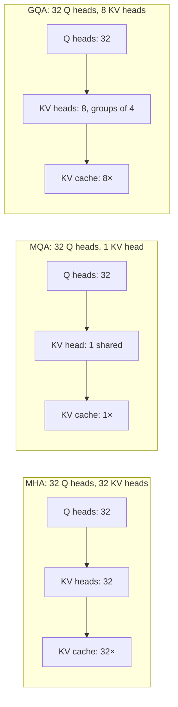
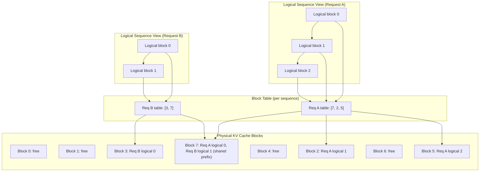
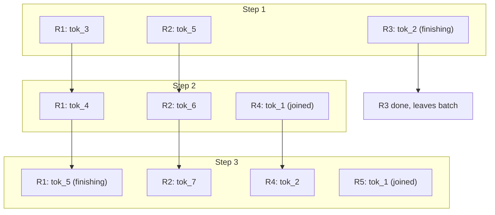
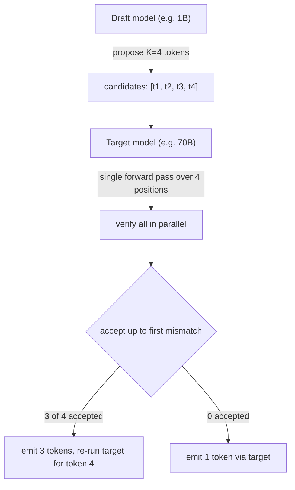
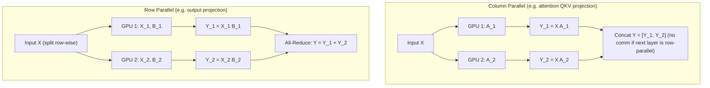

# LLM Infrastructure

## Overview

This page is the unified deep dive for everything that sits between a trained model checkpoint and a production-grade LLM API: tokenizers, attention variants, KV cache, PagedAttention, batching, quantization, speculative decoding, parallelism, and serving frameworks. These systems-level concerns dominate the cost, latency, and throughput of every real LLM deployment and are among the most frequently asked topics in ML infrastructure interviews. For deeper sub-topic coverage, follow the cross-references at the end of each section.

## The Inference Bottleneck

Autoregressive LLM decoding is **memory-bandwidth bound**, not compute bound. Each generated token requires reading the entire model weight matrix from GPU HBM, but only performs a tiny amount of arithmetic on it. The two phases of a single request have very different cost profiles:

| Phase | Operation | Bottleneck | Parallelizable? |
|---|---|---|---|
| **Prefill** | Process prompt (T tokens at once) | Compute bound (large matmul) | Yes — all T tokens in parallel |
| **Decode** | Generate one token at a time | Memory bound (read weights for 1 token) | No — strictly sequential |

```
arithmetic_intensity_prefill ≈ T × FLOPs_per_token / weight_bytes_read   (high → compute bound)
arithmetic_intensity_decode  ≈ FLOPs_per_token / weight_bytes_read       (low → memory bound)
```

At batch size 1, an A100/H100 spends >95% of decode time waiting on HBM bandwidth. This single observation motivates almost every technique below: batching raises arithmetic intensity, quantization shrinks the bytes read, KV cache prevents redundant computation, PagedAttention prevents fragmentation, and speculative decoding trades extra compute for fewer sequential decode steps.

## Tokenization

Tokenization converts raw text into integer IDs. The choice of algorithm determines vocabulary efficiency, multilingual support, code handling, and per-token API cost. See [tokenization.md](llm-serving/tokenization.md) for the full deep dive.

| Algorithm | Mechanism | Granularity | Used By |
|---|---|---|---|
| **BPE** | Iteratively merge most frequent adjacent pair | Subword | GPT-2/3/4, LLaMA, Mistral, Claude |
| **WordPiece** | Merge pair maximizing likelihood of corpus | Subword (similar to BPE) | BERT, DistilBERT |
| **Unigram** | Start from large vocab, prune tokens maximizing likelihood | Subword (probabilistic) | T5, ALBERT, mBART |
| **SentencePiece** | Framework implementing BPE or Unigram on raw bytes | Subword (whitespace-agnostic) | T5, LLaMA 1/2, Mistral |
| **tiktoken** | Fast BPE implementation in Rust/Python | Subword | GPT-4o, GPT-3.5-turbo, text-embedding-ada-002 |

**BPE (Byte Pair Encoding).** Initialize the vocabulary with all single characters (or bytes), then iteratively merge the most frequent adjacent pair until the target vocabulary size is reached. Merges are stored as an ordered list; encoding is greedy left-to-right with the merge rank. Sennrich et al., 2016.

**SentencePiece.** A tokenizer-agnostic framework that treats input as a raw byte stream, eliminating the need for pre-tokenization by whitespace. This makes it language-agnostic: it handles Chinese, Japanese (no spaces), and code uniformly. SentencePiece can wrap either BPE (LLaMA 1) or Unigram (T5). Kudo & Richardson, 2018.

**Unigram Language Model.** Starts from a large candidate vocabulary and iteratively prunes tokens whose removal least decreases the likelihood of the training corpus under a unigram LM. Produces a probabilistic tokenizer that can sample multiple segmentations — useful for robustness. Kudo, 2018.

**tiktoken.** OpenAI's production BPE implementation: a ~100K-vocab BPE encoder optimized for multilingual text and code, exposed via the `tiktoken` Python/Rust package. It is the reference tokenizer for GPT-4o and is 3-6× faster than HuggingFace's tokenizers for the same vocab.

**Interview key points:**
- API pricing is per-token; GPT-3's 50K vocab tokenizes Korean/Hindi 2-3× less efficiently than GPT-4o's 100K vocab — directly affecting cost.
- BPE is deterministic; Unigram can sample (used in T5 pretraining for augmentation).
- `tiktoken.cl100k_base` (GPT-4, GPT-3.5-turbo) and `o200k_base` (GPT-4o) are different BPE merges.

## Attention Variants

The multi-head attention (MHA) cost grows quadratically with context length and the KV cache grows linearly. Recent variants trade a small quality loss for large KV cache savings, which directly increases the number of concurrent requests a serving system can hold.

\\[
\text{KV cache size} = 2 \cdot L \cdot n_{kv} \cdot d_h \cdot T \cdot b
\\]

where \\( L \\) is layer count, \\( n_{kv} \\) is the number of KV heads, \\( d_h \\) is head dim, \\( T \\) is sequence length, and \\( b \\) is batch size.

| Variant | KV Heads | KV Cache vs MHA | Quality | Used By |
|---|---|---|---|---|
| **MHA** (Multi-Head Attention) | \\( n_{heads} \\) | 1.0× (baseline) | Best | GPT-2/3, original Transformer |
| **MQA** (Multi-Query) | 1 | \\( 1/n_{heads} \\) | Notable drop | PaLM, Falcon, StarCoder |
| **GQA** (Grouped-Query) | \\( g \\) for \\( 1 < g < n_{heads} \\) | \\( g/n_{heads} \\) | Near-MHA | LLaMA 2/3, Mistral, Qwen 2 |
| **MLA** (Multi-head Latent Attention) | Compressed into low-rank latent | ~5-13× smaller than MHA | Near-MHA | DeepSeek-V2, DeepSeek-V3 |
| **Sliding Window** | Same as base | O(window) per layer | Good for long context | Mistral 7B (SWA), Gemma 2 |

**MQA** (Shazeard et al., 2019) shares a single K and V head across all query heads. Drastic KV cache reduction but quality degrades on long contexts. **GQA** (Ainslie et al., 2023) interpolates: use \\( g \\) KV heads shared across groups of \\( n_{heads}/g \\) query heads. GQA with \\( g=8 \\) recovers nearly all of MHA's quality while shrinking KV cache 4-8× — LLaMA-2 70B uses GQA-8.

**MLA** (DeepSeek-V2, 2024) compresses the KV cache into a low-rank latent vector via down-projection, then up-projects per layer at attention time. Achieves ~93% KV cache reduction with quality comparable to MHA — the key enabler of DeepSeek's 128K context.

**Sliding Window Attention (SWA).** Each token attends only to the previous W tokens (e.g. W=4096). Stack L layers and the effective receptive field becomes \\( L \cdot W \\) tokens, but per-layer KV cache stays O(W). Used by Mistral 7B and Gemma 2. Reference: Beltagy et al., "Longformer", 2020.



## KV Cache

The KV cache stores the K and V projections for every previously generated token so that decode is O(T) per step rather than O(T²). See [kv-cache.md](llm-serving/kv-cache.md) for the full deep dive.

**Memory formula (FP16, single sequence):**

```
KV_bytes = 2 × n_layers × n_kv_heads × head_dim × seq_len × 2 (bytes)
```

For LLaMA-2 7B (MHA, 32 layers, 32 heads, dim 128) at seq_len=4096: ~3.3 GB KV cache — almost a quarter of the 14 GB model itself. Switching to GQA-8 cuts this to ~840 MB.

### Compute Bound vs Memory Bound

| Phase | Reads | Computes | Bound By |
|---|---|---|---|
| Prefill (prompt of T tokens) | Weights once | T tokens × full forward | **Compute** (large GEMM) |
| Decode (1 token) | Weights + full KV cache | 1 token × full forward | **Memory bandwidth** |

This asymmetry is why **continuous batching** can interleave prefill and decode across requests — the GPU has spare compute during others' decode steps.

### Prefix Caching

If many requests share a common prefix (system prompt, few-shot examples, tool definitions), the KV cache for that prefix can be reused across requests, eliminating redundant prefill computation.

| Provider | Mechanism | Savings |
|---|---|---|
| **Anthropic** | Explicit `cache_control` markers | 90% on cached input tokens |
| **OpenAI** | Automatic prefix caching (≥1024 tokens) | 50% on cached input tokens |
| **vLLM** | `--enable-prefix-caching` (automatic, hash-based) | 100% compute savings on hit |
| **SGLang** | Radix tree of KV caches (shared across requests) | Highest hit rate of OSS servers |

## PagedAttention

PagedAttention (Kwon et al., "Efficient Memory Management for Large Language Model Serving with PagedAttention", SOSP 2023) is the core innovation behind vLLM. It solves two problems with traditional KV cache allocation:

1. **Internal fragmentation**: traditional serving pre-allocates KV cache for the maximum sequence length per request. A request that generates 50 tokens but was allocated for 2048 wastes 97% of its KV cache memory.
2. **External fragmentation**: variable-length requests leave holes that cannot fit new requests even when total free memory is sufficient.

PagedAttention borrows **OS virtual memory** concepts: divide KV cache into fixed-size **blocks** (typically 16 tokens each), and use a **block table** per sequence to map logical token positions to physical blocks. Blocks are allocated on demand and freed when a sequence finishes.



**Shared prefix = copy-on-write.** Two requests that share a system prompt share the same physical blocks for that prefix. When either request diverges (its first unique token), only the new block is allocated and the divergent block is copied — exactly like fork() in Unix.

**Results from the paper:** 2-4× throughput improvement over HuggingFace Transformers and 2-3× over TGI on popular models, with no quality loss. Reference: [vLLM project](https://docs.vllm.ai); survey: "Efficient Memory Management for Large Language Model Serving: A Survey" (Miao et al., 2024).

## Batching Strategies

Batching amortizes weight loading across multiple sequences — the single most impactful throughput optimization. See [batching.md](llm-serving/batching.md) for the full deep dive.

| Strategy | Throughput Gain | Latency | Best For |
|---|---|---|---|
| **Static batching** | 5-10× | High (waits for full batch + padding) | Offline batch jobs |
| **Dynamic batching** (request-level) | 8-12× | Moderate (timeout-based) | Near-real-time serving |
| **Continuous batching** (iteration-level) | 10-20× | Low (per-token iteration) | Real-time serving (vLLM, TGI) |
| **In-flight batching** (TRT-LLM) | 15-25× | Very low | High-concurrency serving |

**Continuous batching** (also called iteration-level or dynamic batching) is the key innovation. Instead of waiting for a batch to fill and processing all sequences to completion, the scheduler makes a per-token decision: at each decode step, finished sequences leave the batch and waiting sequences join. There is no padding waste and no head-of-line blocking.



**Chunked prefill.** A long prompt's prefill can monopolize the GPU for hundreds of ms, stalling decode of in-flight requests. Chunked prefill (vLLM `--enable-chunked-prefill`) splits a large prefill into chunks of N tokens (e.g. 512) and interleaves them with decode steps, bounding decode latency under prefill pressure.

## Quantization

Quantization reduces weight (and optionally activation) precision to shrink memory and accelerate decode. See [quantization.md](llm-serving/quantization.md) for the full deep dive.

```
memory_7B_FP16 = 14 GB     memory_7B_INT4 = 3.5 GB    memory_70B_FP16 = 140 GB    memory_70B_INT4 = 35 GB
```

| Method | Bits | What It Quantizes | Calibration | Quality | Best For |
|---|---|---|---|---|---|
| **GPTQ** | 4 / 3 | Weights (PTQ) | Yes (~128 samples) | Good | GPU servers, fast to apply |
| **AWQ** | 4 | Weights (PTQ, salient channels) | Yes (~128 samples) | Slightly better than GPTQ | GPU servers, popular default |
| **SmoothQuant** | 8 | Weights + activations (PTQ) | Yes | Excellent | INT8 weight × activation (W8A8) |
| **bitsandbytes NF4** | 4 (NormalFloat) | Weights (PTQ, no calibration) | No | Good | QLoRA fine-tuning, quick load |
| **GGUF / GGML** | 2-8 (k-quants) | Weights (PTQ) | No | Varies by Q level | CPU + edge (Ollama, llama.cpp) |
| **FP8** (H100 native) | 8 | Weights + activations | Optional | Near-lossless | H100/H200 production |
| **QAT** | 4-8 | Weights + activations (during training) | N/A (training) | Best at low bits | Rare for LLMs (cost) |

**GPTQ** (Frantar et al., "GPTQ: Accurate Post-Training Quantization for Generative Pre-trained Transformers", ICLR 2023). Layer-wise quantization using the Hessian to redistribute quantization error: process one layer at a time, quantize weights in groups of 128 columns, and use the inverse Hessian to update unquantized weights to compensate. Takes ~1-4 hours on a single GPU for a 70B model.

**AWQ** (Lin et al., "AWQ: Activation-aware Weight Quantization for LLM Compression and Acceleration", MLSys 2024). Observes that a small fraction of "salient" weight channels (those activated by large activation magnitudes) carry most of the signal. AWQ scales these channels up before quantization (and scales activations down correspondingly) so they survive INT4 rounding. Slightly outperforms GPTQ on perplexity and is the default in many serving stacks.

**SmoothQuant** (Xiao et al., "SmoothQuant: Accurate and Efficient Post-Training Quantization for Large Language Models", 2022). Migrates quantization difficulty from activations to weights: activations have a few large outliers that destroy INT8 accuracy, so SmoothQuant scales those channels down (multiplying the corresponding weight column up by the same factor) before INT8. Enables W8A8 — fully INT8 weights and activations — which lets you use Tensor Cores at full speed.

**bitsandbytes NF4** (Dettmers et al., "QLoRA", NeurIPS 2023). 4-bit NormalFloat: a quantization data type whose buckets are matched to the normal distribution of LLM weights, giving better fidelity than uniform INT4. No calibration data needed — load and serve. The reference implementation of QLoRA fine-tuning.

**GGUF** (formerly GGML). llama.cpp's container format with a family of k-quantization levels (Q2_K, Q3_K_M, Q4_K_M, Q5_K_M, Q6_K, Q8_0). Q4_K_M is the most popular sweet spot — ~3.5× memory reduction with ~1.5% perplexity increase over FP16. Runs on CPU, Apple Silicon, and CUDA; the default for Ollama and LM Studio.

## Speculative Decoding

Speculative decoding trades extra compute for fewer sequential decode steps, breaking the memory-bandwidth bottleneck. The core idea: a small **draft model** proposes K candidate tokens cheaply, the large **target model** verifies them in a single forward pass (parallel over the K positions), and tokens are accepted up to the first mismatch.

**Why this works:** verifying K tokens in one forward pass costs roughly the same as generating 1 token (memory-bound regime — extra compute is nearly free). If the draft model is well-aligned, 3-5 tokens per step are typically accepted, giving 2-3× wall-clock speedup with zero quality change (rejection sampling preserves the target distribution exactly).



| Method | Draft Source | Speedup | Quality | Reference |
|---|---|---|---|---|
| **Speculative decoding** (small draft model) | Separate small LM | 2-3× | Exact (same distribution) | Leviathan et al., 2023; Chen et al., 2023 |
| **Medusa** | Multiple extra heads on target | 2-3× | Exact (tree attention) | Cai et al., 2024 |
| **EAGLE / EAGLE-2** | Autoregressive draft head + tree | 3-4× | Exact | Li et al., 2024 |
| **Self-speculative** | Skip layers of same model | 1.5-2× | Approximate | LayerSkip, 2024 |

**Leviathan et al.** ("Fast Inference from Transformers via Speculative Decoding", 2023) and **Chen et al.** ("Accelerating Large Language Model Decoding with Speculative Sampling", 2023) independently introduced the framework in early 2023; both prove that rejection sampling makes the output distribution identical to the target model. **Medusa** trains extra prediction heads on the target model so no separate draft model is needed; combined with tree-attention verification, this avoids the cost of running two models.

## Parallelism Strategies

For models that don't fit on a single GPU (70B FP16 = 140 GB > 80 GB A100), or for throughput beyond one GPU's capacity, distribute the workload across multiple GPUs. See [tensorrt.md](llm-serving/tensorrt.md), [inference.md](llm-serving/inference.md), and the [MoE section](moe/architecture.md).

| Strategy | What It Splits | Communication | Best For |
|---|---|---|---|
| **Tensor parallelism (TP)** | Each layer's matmul | All-reduce per layer (high BW) | Single-node, NVLink GPUs |
| **Pipeline parallelism (PP)** | Layers across GPUs | Activations between stages (low BW) | Multi-node training |
| **Expert parallelism (EP)** | MoE experts across GPUs | All-to-all per MoE layer | MoE inference & training |
| **Sequence parallelism (SP)** | Sequence dim across GPUs | All-reduce over sequence | Long-context training |
| **Data parallelism (DP)** | Full model replicas | Gradient sync (training only) | Training throughput |

**Tensor parallelism** (Megatron-LM, Shoeybi et al., 2019). Splits each weight matrix across GPUs:



Column-parallel followed by row-parallel is the canonical Megatron attention/FFN pattern: the column-parallel split is "free" (no communication) because the next row-parallel layer can consume the sharded input directly, and only one all-reduce is needed at the end of the block. This requires high-bandwidth, low-latency interconnect — TP is almost always confined to a single node with NVLink/NVSwitch (8 GPUs).

**Sequence parallelism** (Korthikanti et al., 2023). Extends TP by also sharding the sequence dimension for LayerNorm and Dropout (which are not compute-bound), reducing activation memory and the all-reduce communication volume. Combined with TP, this enables training 100K+ token contexts.

**Pipeline parallelism.** Splits layers across GPUs in a sequence: GPU 1 runs layers 1-8, GPU 2 runs layers 9-16, etc. Each microbatch flows through stages like an assembly line. Naive PP has high bubble (idle time); **1F1B** scheduling and **interleaved PP** (Megatron-LM) reduce the bubble. Communication is small (just activations between stages), so PP works across nodes — but adds latency proportional to the number of stages, making it more attractive for training than for inference.

**Expert parallelism (EP).** For Mixture-of-Experts models (Mixtral, DeepSeek-MoE), each expert is placed on a different GPU. The router sends each token to the GPU hosting its chosen expert via an all-to-all, the expert computes, and another all-to-all returns the outputs. EP is the dominant parallelism for serving MoE models and is covered in depth in [MoE architecture](moe/architecture.md) and [Mixtral](moe/mixtral.md).

## Serving Frameworks

| Framework | Strongest Suit | Quantization | Batching | Notable Features |
|---|---|---|---|---|
| **vLLM** | High-throughput OSS serving | AWQ, GPTQ, FP8, INT8 | Continuous + PagedAttention | Prefix caching, chunked prefill, LoRA, spec decoding |
| **TGI** (HuggingFace) | Easy HF integration, OpenAI API | bitsandbytes, GPTQ, AWQ | Continuous batching | Flash Attention, Rust router, HF Inference Endpoints |
| **TensorRT-LLM** | Lowest latency on NVIDIA HW | FP8, INT8 SmoothQuant, INT4 AWQ | In-flight batching | Kernel fusion, custom attention kernels, PagedAttention |
| **Triton + TRT-LLM** | Multi-model production serving | Any TRT-LLM supports | In-flight batching | Model repository, metrics, ensemble pipelines |
| **SGLang** | Structured generation, programs | FP8, AWQ, GPTQ | Continuous batching | RadixAttention (prefix cache), JSON/regex-constrained decode |
| **llama.cpp / Ollama** | Local + CPU + Apple Silicon | GGUF (Q2-Q8) | Simple batching | Edge deployment, ~zero ops, GGUF ecosystem |

**vLLM** (Kwon et al., SOSP 2023). The reference open-source high-throughput server. PagedAttention + continuous batching + prefix caching + chunked prefill make it the default choice for self-hosting open models on NVIDIA GPUs. Documentation: [docs.vllm.ai](https://docs.vllm.ai).

**TGI** (Text Generation Inference). HuggingFace's production server. Tight integration with the HF Hub, Rust-based request router, and OpenAI-compatible API. Used by HF Inference Endpoints. Documentation: [huggingface.co/docs/text-generation-inference](https://huggingface.co/docs/text-generation-inference).

**TensorRT-LLM**. NVIDIA's library of highly optimized LLM kernels — kernel fusion, custom attention variants (XQA for long context), FP8 and INT4 support, and in-flight batching. Lowest latency on H100/H200 but requires compiling a model-specific engine. Documentation: [github.com/NVIDIA/TensorRT-LLM](https://github.com/NVIDIA/TensorRT-LLM).

**Triton Inference Server + TRT-LLM**. NVIDIA's model-serving framework: handles model repository, HTTP/gRPC, metrics, multi-model concurrency, and ensemble pipelines. TRT-LLM plugs in as a backend. Used in production by Anthropic, OpenAI-style deployments, and most enterprise NVIDIA stacks.

**SGLang** (Zheng et al., 2023). Adds two key innovations: (1) **RadixAttention** — a radix tree of KV caches shared across requests, giving the highest prefix-cache hit rate of any OSS server; (2) front-end language for structured programs that compile into optimized server-side execution plans. Best for structured generation (JSON, regex-constrained, tool calls).

## Model Routing and Gateways

A production LLM platform serves many models (small + large, general + code, cheap + premium) and must route each request to the right backend. The **model gateway** is the API front door: it handles auth, rate limiting, observability, fallback, and routing across all downstream model servers.

| Routing Strategy | Mechanism | When to Use |
|---|---|---|
| **Static routing** | Hard-coded model per endpoint | Simple apps with one model |
| **Intent-based routing** | Lightweight classifier picks model by query type | Mixed workloads (Q&A vs code vs vision) |
| **Cost-aware routing** | Pick cheapest model meeting quality SLA | Cost optimization at scale |
| **Cascade routing** | Try small model first, escalate on low confidence | Maximize savings while preserving quality |
| **Prefix-aware routing** | Send requests sharing a prefix to the same replica | Raises prefix-cache hit rate |
| **Latency-aware routing** | Pick least-loaded / lowest-queue replica | Hit p99 latency SLAs |

**Gateway responsibilities:**
- **Unified API**: OpenAI-compatible interface in front of vLLM, TGI, TRT-LLM, and provider APIs (Anthropic, Google, OpenAI).
- **Fallback & retry**: route to backup replica or alternate model on 5xx / timeout.
- **Semantic caching**: short-circuit repeated or near-duplicate queries without hitting the model.
- **Token accounting & billing**: per-tenant usage, budget enforcement, rate limits.
- **Observability**: structured logs, traces (OpenTelemetry), token-level metrics, model-quality scoring.

Popular gateway / router options include **LiteLLM** (unified OpenAI-style proxy across 100+ providers), **OpenRouter** (hosted multi-model routing), **Kong AI Gateway**, **Portkey**, and **Cloudflare AI Gateway**. For self-hosted multi-model serving behind one gateway, the pattern is: gateway → (vLLM for OSS models, TGI for HF integration, TRT-LLM for latency-critical paths, provider APIs for frontier models).

## Inference Optimization Checklist

Ordered roughly by impact-per-effort:

1. **Batch continuously** — switch from static to continuous batching (10-20× throughput).
2. **Quantize** — INT4 (AWQ/GPTQ) for memory, FP8 for latency on H100 (2-4× memory, ~2× throughput).
3. **Enable prefix caching** — for workloads with shared system prompts (50-90% prefill savings).
4. **Use FlashAttention-2/3** — kernel fusion halves KV cache memory and accelerates attention 2-4×.
5. **Chunked prefill** — bounds decode latency under prefill pressure (vLLM `--enable-chunked-prefill`).
6. **Speculative decoding** — for latency-sensitive single-stream workloads (2-3× TTFT-to-completion).
7. **Tensor parallelism** — for models that don't fit on one GPU (TP=2/4/8 within an NVLink node).
8. **GQA / MLA** — choose model architectures with grouped-query or latent attention for long context.
9. **Prefix-aware load balancing** — route requests with shared prefixes to the same replica (raises cache hit rate).
10. **FP8 on H100/H200** — near-lossless 2× memory and throughput over FP16.

## Interview Questions

### Q1: Why is autoregressive LLM decode memory-bandwidth bound, and what are the implications for system design?
**Answer:** Each decode step generates exactly one token but must read the entire model weight matrix from HBM to compute it. The arithmetic intensity (FLOPs / byte read) is tiny — the GPU spends >95% of decode time on memory transfer, not compute. Implications: (1) batching multiple requests amortizes the weight read across them, raising arithmetic intensity; (2) quantization (INT4, FP8) shrinks the bytes read; (3) speculative decoding trades extra compute (cheap, since GPU is idle on compute) for fewer sequential decode steps; (4) hardware with high HBM bandwidth (H100: 3.35 TB/s) is disproportionately valuable for LLM serving. Prefill, by contrast, is compute-bound (large matmul over T tokens).

### Q2: How does PagedAttention work, and why does it improve throughput 2-4×?
**Answer:** PagedAttention applies OS virtual memory to KV cache. Instead of pre-allocating a contiguous buffer for each request's max sequence length, it divides KV cache into fixed-size blocks (e.g. 16 tokens) and uses a per-sequence **block table** to map logical token positions to physical blocks. Blocks are allocated on demand and freed at sequence end. This eliminates (1) internal fragmentation (no padding to max length — typical 60-80% of KV cache was wasted), (2) external fragmentation (non-contiguous free blocks are fine — the block table handles indirection), and (3) enables shared-prefix copy-on-write: two requests sharing a system prompt share physical blocks until they diverge. Result: near-zero waste, 2-4× throughput. Reference: Kwon et al., SOSP 2023.

### Q3: Compare MHA, MQA, GQA, and MLA. When would you choose each?
**Answer:** All four are attention variants trading KV cache size for quality. **MHA** (n_kv = n_heads) is the baseline; highest quality, largest KV cache. **MQA** (n_kv = 1) shares one KV head across all query heads — drastic cache reduction but quality drops noticeably on long contexts. **GQA** (n_kv = g, 1 < g < n_heads) interpolates: groups of query heads share a KV head; with g=8 it recovers nearly all of MHA's quality while shrinking the cache 4-8×. **MLA** (DeepSeek-V2) compresses KV into a low-rank latent vector, achieving ~93% reduction with quality comparable to MHA — at the cost of more complex kernels. Practical guidance: GQA-8 is the safe default for new models (LLaMA-2/3, Mistral, Qwen 2 all use it); MLA when you need 128K+ context on a single GPU; MQA only for short-context code models (StarCoder).

### Q4: Explain continuous batching and why it outperforms static batching.
**Answer:** Static batching fills a batch of N requests, processes them all to completion, then starts the next batch. Problems: (1) short requests wait for the longest, (2) requests are padded to the longest sequence, wasting compute, (3) new requests can't join a running batch. **Continuous batching** schedules at the per-token iteration level: at each decode step, the scheduler re-evaluates the batch — finished requests leave, waiting requests join, no padding is needed because each request tracks its own position. This keeps the GPU saturated (high arithmetic intensity via amortization) while bounding per-request latency. Combined with PagedAttention (so joining/leaving doesn't fragment memory), this is what makes vLLM and TGI achieve 10-20× the throughput of static-batched HF Transformers.

### Q5: Compare GPTQ, AWQ, SmoothQuant, and bitsandbytes NF4. When would you pick each?
**Answer:** All are post-training weight quantization methods. **GPTQ** uses the Hessian to redistribute quantization error layer-by-layer; fast to apply (~hours for 70B), good INT4 quality, requires ~128 calibration samples. **AWQ** identifies "salient" weight channels (activated by large activations) and scales them up before quantization; slightly better perplexity than GPTQ and a popular default for vLLM. **SmoothQuant** is unique in quantizing activations too — it migrates quantization difficulty from outlier activations to weights, enabling W8A8 INT8 with Tensor Cores at full speed; best for H100 production latency. **bitsandbytes NF4** uses a 4-bit NormalFloat data type matched to weight distributions, requires no calibration, loads instantly — the default for QLoRA fine-tuning and quick experimentation. Practical recipe: NF4 for iteration, AWQ/GPTQ INT4 for serving memory savings, SmoothQuant W8A8 or FP8 for serving latency on H100.

### Q6: How does speculative decoding preserve the target model's output distribution?
**Answer:** Through rejection sampling. The draft model proposes K tokens \\( (t_1, ..., t_K) \\); the target model evaluates probabilities \\( p_i \\) for each position in a single forward pass. For each proposed token, accept it with probability \\( \min(1, p_i / q_i) \\) where \\( q_i \\) is the draft's probability. If accepted, move to the next token. If rejected, resample from the residual distribution \\( (p_i - q_i) / (1 - q_i) \\) and stop. Leviathan et al. (2023) and Chen et al. (2023) independently proved this preserves the exact target distribution. The wall-clock speedup comes from the target model verifying K tokens in roughly the time it would take to generate 1 (because decode is memory-bound — the extra compute is nearly free).

### Q7: Why is tensor parallelism almost always confined to a single node, while pipeline parallelism can span multiple nodes?
**Answer:** Tensor parallelism shards each weight matrix and requires an all-reduce after every transformer block (to combine the row-parallel outputs). All-reduce is high-bandwidth and latency-sensitive — it needs to happen L times per forward pass (L = layers). This is only practical over NVLink/NVSwitch within a node (300-900 GB/s, microsecond latency). Across nodes (InfiniBand at 50-100 GB/s, millisecond latency), the all-reduce overhead would dominate. Pipeline parallelism, by contrast, only sends activations between stages — small tensors, infrequent (once per stage per microbatch). This makes PP viable across nodes. The standard recipe for multi-node training is TP within a node, PP across nodes, and DP across groups — exactly Megatron-LM's 3D parallelism.

### Q8: Compare vLLM, TGI, and TensorRT-LLM. Which would you choose for a production RAG API on H100s?
**Answer:** All three support continuous batching and PagedAttention-style memory management. **vLLM** is open-source Python, easiest to operate, has the widest model coverage, supports prefix caching, chunked prefill, AWQ/GPTQ/FP8, LoRA, and speculative decoding — best when you need flexibility and fast iteration. **TGI** integrates tightly with the HuggingFace Hub, has a Rust router for high concurrency, and exposes an OpenAI-compatible API — best when you're already in the HF ecosystem. **TensorRT-LLM** compiles a model-specific engine with fused kernels, FP8, INT4 AWQ, and in-flight batching — lowest latency on H100 but requires engine build per model, harder to operate, and tighter model support. For a production RAG API on H100s with shared system prompts (common in RAG): start with vLLM + `--enable-prefix-caching --enable-chunked-prefill` for the fastest path to production. If latency SLA is sub-100ms TTFT and you outgrow vLLM, migrate to TRT-LLM. TGI is the choice if you're on HF Inference Endpoints or want their router.

## References

1. Kwon et al., "Efficient Memory Management for Large Language Model Serving with PagedAttention", SOSP 2023 — [arXiv:2309.06180](https://arxiv.org/abs/2309.06180)
2. vLLM Documentation — [docs.vllm.ai](https://docs.vllm.ai)
3. HuggingFace Text Generation Inference — [huggingface.co/docs/text-generation-inference](https://huggingface.co/docs/text-generation-inference)
4. NVIDIA TensorRT-LLM — [github.com/NVIDIA/TensorRT-LLM](https://github.com/NVIDIA/TensorRT-LLM)
5. Frantar et al., "GPTQ: Accurate Post-Training Quantization for Generative Pre-trained Transformers", ICLR 2023 — [arXiv:2210.17323](https://arxiv.org/abs/2210.17323)
6. Lin et al., "AWQ: Activation-aware Weight Quantization for LLM Compression and Acceleration", MLSys 2024 — [arXiv:2306.00978](https://arxiv.org/abs/2306.00978)
7. Xiao et al., "SmoothQuant: Accurate and Efficient Post-Training Quantization for Large Language Models", 2022 — [arXiv:2211.10438](https://arxiv.org/abs/2211.10438)
8. Dettmers et al., "QLoRA: Efficient Finetuning of Quantized LLMs", NeurIPS 2023 — [arXiv:2305.14314](https://arxiv.org/abs/2305.14314)
9. Leviathan et al., "Fast Inference from Transformers via Speculative Decoding", 2023 — [arXiv:2211.17192](https://arxiv.org/abs/2211.17192)
10. Chen et al., "Accelerating Large Language Model Decoding with Speculative Sampling", 2023 — [arXiv:2302.01318](https://arxiv.org/abs/2302.01318)
11. Cai et al., "Medusa: Simple LLM Inference Acceleration Framework with Multiple Decoding Heads", 2024 — [arXiv:2401.10774](https://arxiv.org/abs/2401.10774)
12. Ainslie et al., "GQA: Training Generalized Multi-Query Transformer Models from Multi-Head Checkpoints", EMNLP 2023 — [arXiv:2305.13245](https://arxiv.org/abs/2305.13245)
13. Shazeer et al., "Fast Transformer Decoding: One Write-Head is All You Need", 2019 — [arXiv:1911.02150](https://arxiv.org/abs/1911.02150)
14. DeepSeek-AI, "DeepSeek-V2: A Strong, Economical, and Efficient Mixture-of-Experts Language Model", 2024 — [arXiv:2405.04434](https://arxiv.org/abs/2405.04434)
15. Shoeybi et al., "Megatron-LM: Training Multi-Billion Parameter Language Models Using Model Parallelism", 2019 — [arXiv:1909.08053](https://arxiv.org/abs/1909.08053)
16. Korthikanti et al., "Reducing Activation Recomputation in Large Transformer Models", MLSys 2023 — [arXiv:2205.05198](https://arxiv.org/abs/2205.05198)
17. Zheng et al., "SGLang: Efficient Execution of Structured Language Model Programs", NeurIPS 2024 — [arXiv:2312.07104](https://arxiv.org/abs/2312.07104)
18. Sennrich et al., "Neural Machine Translation of Rare Words with Subword Units", ACL 2016 — [arXiv:1508.07909](https://arxiv.org/abs/1508.07909)
19. Kudo & Richardson, "SentencePiece: A simple and language independent subword tokenizer and detokenizer", EMNLP 2018 — [arXiv:1808.06226](https://arxiv.org/abs/1808.06226)
20. Miao et al., "Efficient Memory Management for Large Language Model Serving: A Survey", 2024 — [arXiv:2312.05185](https://arxiv.org/abs/2312.05185)

## Cross-References

- [LLM Fundamentals →](fundamentals.md) Tokenization overview, position encodings, training pipeline
- [Tokenization →](llm-serving/tokenization.md) Full BPE / SentencePiece / Unigram deep dive
- [KV Cache →](llm-serving/kv-cache.md) Memory math, GQA savings, optimization
- [Batching →](llm-serving/batching.md) Static, dynamic, continuous batching details
- [Quantization →](llm-serving/quantization.md) GPTQ, AWQ, SmoothQuant, GGUF implementation
- [Speculative Decoding →](llm-serving/speculative-decoding.md) Draft models, Medusa, EAGLE
- [vLLM →](llm-serving/vllm.md) PagedAttention implementation and operation
- [TGI →](llm-serving/tgi.md) HuggingFace serving
- [TensorRT-LLM →](llm-serving/tensorrt.md) NVIDIA inference optimization
- [Inference →](llm-serving/inference.md) Production inference optimization
- [MoE Architecture →](moe/architecture.md) Expert parallelism and routing
- [Mixtral →](moe/mixtral.md) Production MoE case study
- [Cost Optimization →](cost-optimization.md) Prompt caching, model routing, cost levers
- [LLM Architecture →](llm-serving/architecture.md) Transformer internals, attention, FFN
