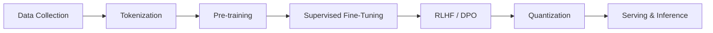
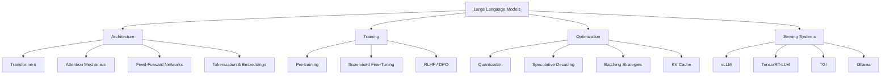
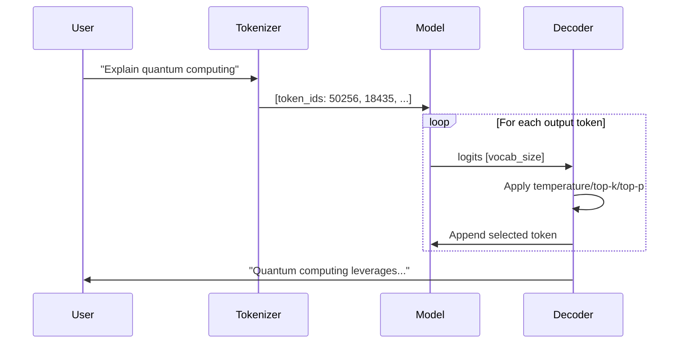

# Large Language Models (LLMs)

## Overview

Large Language Models (LLMs) are neural networks trained on massive text corpora to understand and generate human language. They form the backbone of modern AI systems — from chatbots and code assistants to autonomous agents and scientific discovery tools.

For placement interviews, LLMs sit at the intersection of **deep learning**, **systems engineering**, and **product design**. Interviewers expect you to understand both the theory (transformers, attention, training) and the engineering (inference optimization, serving infrastructure, cost).

## What Makes LLMs "Large"?

| Property | Small Models (<1B) | LLMs (1B–100B+) |
|---|---|---|
| Parameters | Millions | Billions to trillions |
| Training data | Task-specific corpora | Internet-scale (trillions of tokens) |
| Capability | Narrow (classification, NER) | General (reasoning, code, math) |
| Emergent abilities | Few | CoT, in-context learning, instruction following |
| Compute | Single GPU | Thousands of GPUs for weeks/months |

## The LLM Pipeline

## Core Concepts Map

## How LLMs Work (High Level)

1. **Tokenization**: Text is split into subword tokens (BPE, WordPiece)
2. **Embedding**: Tokens are mapped to dense vectors
3. **Transformer layers**: Multiple layers of self-attention + feed-forward networks
4. **Next token prediction**: The model outputs a probability distribution over the vocabulary
5. **Decoding**: A strategy (greedy, top-k, top-p, beam search) selects the next token
6. **Autoregressive generation**: The selected token is appended, and the process repeats

## Key Metrics

| Metric | What It Measures | Typical Values |
|---|---|---|
| **Perplexity** | How "surprised" the model is by text | Lower = better (10–30 for good LLMs) |
| **Tokens/sec** | Inference throughput | 10–100+ tokens/sec per user |
| **Time to First Token (TTFT)** | Latency before first output | 100ms–2s depending on prompt length |
| **Inter-Token Latency** | Time between consecutive tokens | 20–100ms |
| **VRAM Usage** | GPU memory required | 7B @ FP16 ≈ 14GB, @ INT4 ≈ 4GB |
| **Cost per 1M tokens** | API pricing | $0.10–$60+ depending on model |

## Interview Questions

### Q1: What is the fundamental difference between traditional NLP models and LLMs?
**Answer:** Traditional NLP models are trained for specific tasks (classification, NER) with task-specific architectures and labeled data. LLMs are pre-trained on massive unlabeled corpora using self-supervised learning (next token prediction), giving them general language understanding. They can perform many tasks through prompting or fine-tuning without task-specific architectures. The key insight is that scaling data + parameters + compute leads to emergent capabilities not present in smaller models.

### Q2: Why are LLMs typically decoder-only rather than encoder-decoder?
**Answer:** Decoder-only architectures (GPT family) are preferred because:
1. **Simplicity**: A single stack handles both understanding and generation
2. **Scaling efficiency**: Empirically scales better with compute
3. **In-context learning**: The autoregressive nature naturally supports few-shot learning
4. **Training efficiency**: Every token provides a training signal (predicting the next token)

Encoder-decoder models (T5, BART) are better for tasks with clear input-output structure (translation, summarization) but are less flexible as general-purpose models.

### Q3: What are emergent abilities in LLMs?
**Answer:** Emergent abilities are capabilities that appear only at certain model scales, not present in smaller models. Examples include chain-of-thought reasoning, multi-step math, and code generation. The key debate is whether these are truly emergent (phase transitions) or whether they appear gradually and only become measurable above certain thresholds.

## Common Mistakes

- ❌ Confusing model size (parameters) with model capability (architecture, data, and training matter too)
- ❌ Assuming bigger models are always better (a well-trained 7B can outperform a poorly trained 70B on specific tasks)
- ❌ Ignoring tokenization when estimating costs or context length
- ❌ Forgetting that LLMs are probabilistic — they don't "know" facts, they generate likely continuations

## Summary

LLMs are transformer-based models trained at scale on internet text. The pipeline flows from data → tokenization → pre-training → fine-tuning → alignment → serving. Understanding the full stack — from attention mechanisms to inference optimization — is essential for placement interviews.

## Cross-References

- [Architecture →](architecture.md) Deep dive into transformer internals
- [Pre-training →](pretraining.md) How LLMs learn from text
- [SFT →](sft.md) Making LLMs follow instructions
- [RLHF →](rlhf.md) Aligning LLMs with human preferences
- [Inference →](infference.md) Serving LLMs efficiently
- [Serving Systems →](systems.md) Production deployment
- [ML Transformers](../ml/transformers/README.md)
- [Cloud GPU](../cloud/virtualization/README.md)
- [ML System Design](../ml/system-design/model-serving.md)
