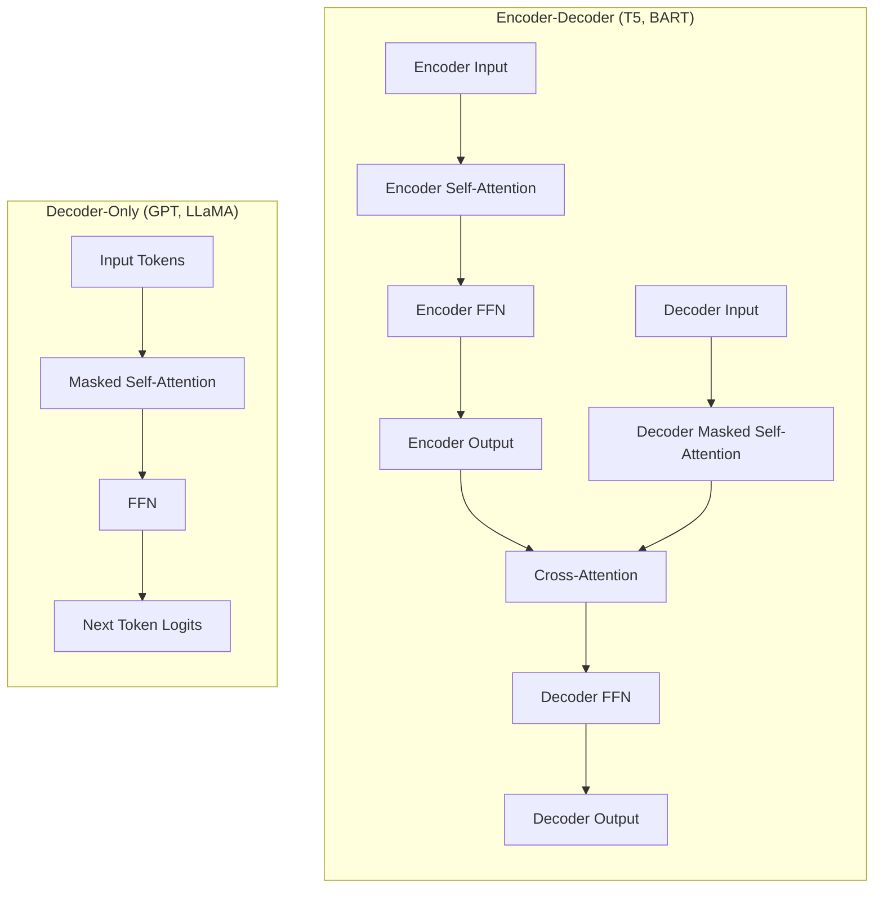
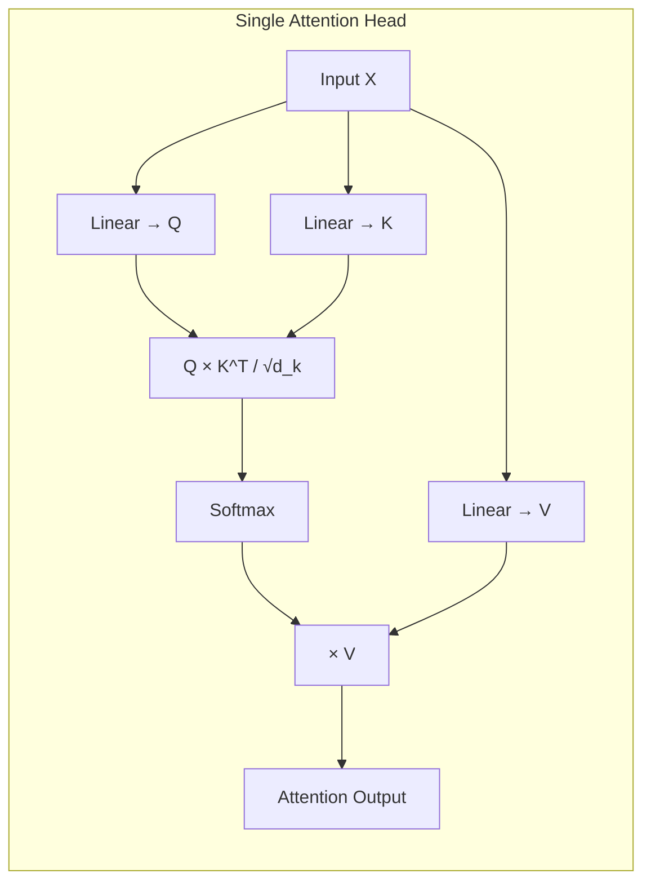
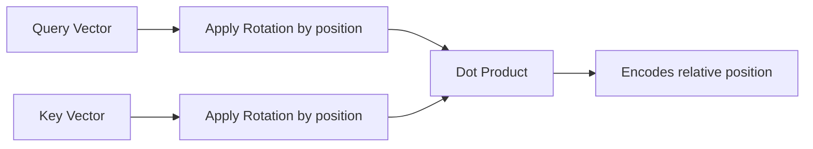
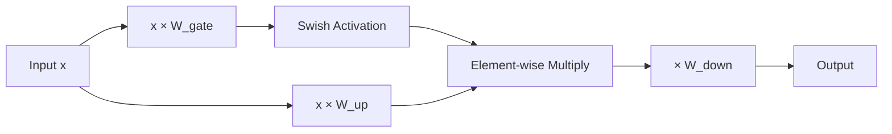
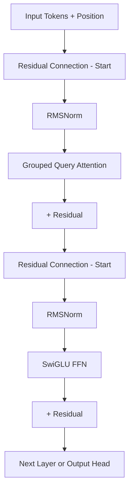
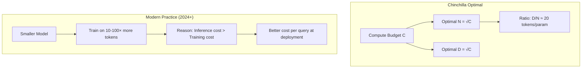
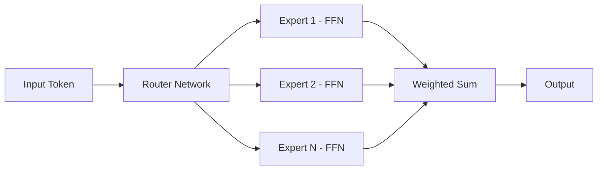
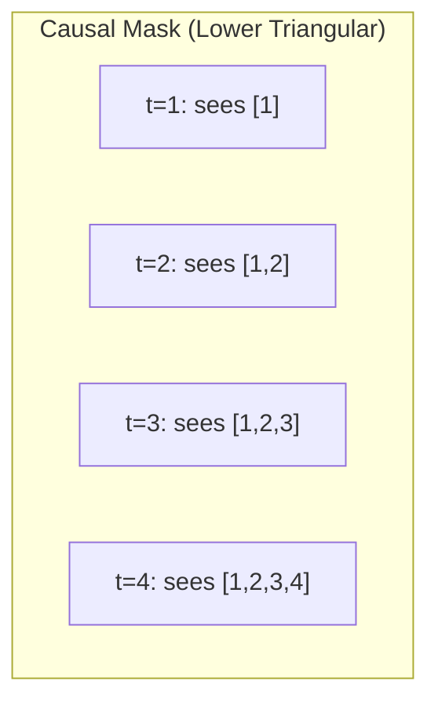

# LLM Architecture

## Overview

The Transformer architecture (Vaswani et al., 2017) is the foundation of all modern LLMs. Understanding its components — self-attention, feed-forward networks, positional encoding, and normalization — is critical for interviews. This page covers decoder-only (GPT-style), encoder-decoder (T5-style), and the key architectural choices that make LLMs work.

## Transformer Architecture Variants



| Variant | Models | Use Case |
|---|---|---|
| **Decoder-only** | GPT-4, LLaMA, Mistral, Claude | General-purpose generation |
| **Encoder-decoder** | T5, BART, Flan-T5 | Seq2seq tasks (translation, summarization) |
| **Encoder-only** | BERT, RoBERTa | Understanding tasks (classification, NER) |

Modern LLMs are overwhelmingly **decoder-only** due to scaling advantages and simpler training.

## Self-Attention Mechanism

Self-attention is the core innovation. Each token can attend to all other tokens to build contextual representations.

### Scaled Dot-Product Attention

```
Attention(Q, K, V) = softmax(QK^T / √d_k) V
```

Where:
- **Q (Query)**: "What am I looking for?"
- **K (Key)**: "What do I contain?"
- **V (Value)**: "What information do I provide?"
- **d_k**: Dimension of keys (scaling factor prevents vanishing gradients in softmax)



### Multi-Head Attention

Instead of one attention function, we run **h parallel attention heads** with different learned projections:

```
MultiHead(Q, K, V) = Concat(head_1, ..., head_h) W^O
where head_i = Attention(QW_i^Q, KW_i^K, VW_i^V)
```

Each head learns different attention patterns:
- Some heads attend to nearby tokens (local syntax)
- Some attend to distant tokens (long-range dependencies)
- Some attend broadly (semantic similarity)

### GQA (Grouped Query Attention)

A key optimization in modern LLMs (LLaMA 2, Mistral):

| Attention Type | Q heads | KV heads | Memory |
|---|---|---|---|
| **MHA** (Multi-Head) | h | h | Highest |
| **MQA** (Multi-Query) | h | 1 | Lowest |
| **GQA** (Grouped Query) | h | g (1 < g < h) | Balanced |

GQA groups query heads to share KV heads, reducing KV cache memory by 4–8× with minimal quality loss.

## Positional Encoding

Transformers have no inherent notion of token order. Positional encodings inject this information.

### RoPE (Rotary Position Embeddings)

Used by LLaMA, Mistral, and most modern LLMs:

```
RoPE(x, pos) = x · cos(pos · θ) + rotate(x) · sin(pos · θ)
```

**Key properties:**
- Encodes **relative** position (attention between tokens depends on their distance, not absolute position)
- Naturally extends to longer sequences (NTK-aware scaling, YaRN)
- Applied directly to Q and K vectors



### ALiBi (Attention with Linear Biases)

Used by BLOOM, MPT. Adds a position-dependent bias to attention scores:

```
score(i,j) = q_i · k_j - m · |i - j|
```

Simple, extrapolates to longer sequences, but slightly less effective than RoPE in practice.

## Feed-Forward Network (FFN)

After attention, each token passes through an FFN that performs "thinking" on the attended information.

### Standard FFN

```
FFN(x) = W₂ · ReLU(W₁ · x + b₁) + b₂
```

Hidden dimension is typically 4× the model dimension (e.g., 4096 → 16384).

### SwiGLU (Modern)

Used by LLaMA, Mistral, Gemma:

```
SwiGLU(x) = (Swish(xW₁) ⊙ xV) W₂
```

Where ⊙ is element-wise multiplication. SwiGLU consistently outperforms ReLU FFN with the same parameter count.



## Normalization

### RMSNorm (Root Mean Square Layer Normalization)

Used by LLaMA, Mistral (replaces LayerNorm):

```
RMSNorm(x) = x / √(mean(x²) + ε) · γ
```

- No mean-centering (simpler, faster)
- No bias term
- ~10% faster than LayerNorm with equivalent quality

### Pre-Norm vs Post-Norm

```mermaid
graph TD
    subgraph "Pre-Norm (LLaMA, GPT)"
        PN_IN[Input] --> PN_NORM[Norm]
        PN_NORM --> PN_ATTN[Attention]
        PN_ATTN --> PN_ADD1[+ Residual]
        PN_ADD1 --> PN_NORM2[Norm]
        PN_NORM2 --> PN_FFN[FFN]
        PN_FFN --> PN_ADD2[+ Residual]
    end

    subgraph "Post-Norm (Original Transformer)"
        PO_IN[Input] --> PO_ATTN[Attention]
        PO_ATTN --> PO_ADD1[+ Residual]
        PO_ADD1 --> PO_NORM1[Norm]
        PO_NORM1 --> PO_FFN[FFN]
        PO_FFN --> PO_ADD2[+ Residual]
        PO_ADD2 --> PO_NORM2[Norm]
    end
```



**Pre-norm** is more stable during training (gradients flow through residual connections) and is standard in modern LLMs.

## Full Transformer Block (Modern LLM)



A typical LLaMA-style block:
1. RMSNorm → GQA → residual add
2. RMSNorm → SwiGLU FFN → residual add
3. Repeat × N layers (32–80+ layers)

## Model Size Calculations

### Parameter Count

For a decoder-only transformer with:
- **L** layers
- **d** = model dimension
- **d_ff** = FFN dimension (typically 8/3 × d for SwiGLU)
- **V** = vocabulary size
- **h** = number of attention heads
- **d_head** = dimension per head (d / h)

**Detailed parameter breakdown per layer:**

```
Attention:
  Q projection: d × d           = d²
  K projection: d × d_kv        = d × d_kv  (d_kv = d with MHA, d/h × g with GQA)
  V projection: d × d_kv        = d × d_kv
  O projection: d × d           = d²
  Total attention: 2d² + 2d × d_kv

FFN (SwiGLU — 3 weight matrices):
  W_gate:  d × d_ff
  W_up:    d × d_ff
  W_down:  d_ff × d
  Total FFN: 3 × d × d_ff

RMSNorm: 2 × d (per-layer scale parameters, no bias)
```

**Total parameters:**
```
P ≈ L × (2d² + 2d·d_kv + 3d·d_ff + 2d) + V × d + d  (final norm + embeddings)
```

**Simplified rule of thumb:** For a 7B model with d=4096, L=32, d_ff=11008 (SwiGLU):
- Attention per layer: ~2 × 4096² + 2 × 4096² ≈ 134M (with MHA)
- FFN per layer: ~3 × 4096 × 11008 ≈ 135M
- Total per layer: ~269M
- Embeddings: 128256 × 4096 ≈ 525M (LLaMA 3 vocab)
- 32 layers × 269M + 525M ≈ 9.1B

Note: Actual 7B models are slightly smaller because GQA reduces KV parameters.

### Memory Estimation

| Precision | Bytes per Parameter | 7B Model | 13B Model | 70B Model | 405B Model |
|---|---|---|---|---|---|
| FP32 | 4 | 28 GB | 52 GB | 280 GB | 1620 GB |
| FP16/BF16 | 2 | 14 GB | 26 GB | 140 GB | 810 GB |
| INT8 | 1 | 7 GB | 13 GB | 70 GB | 405 GB |
| INT4 | 0.5 | 3.5 GB | 6.5 GB | 35 GB | 203 GB |

**Rule of thumb**: Memory (GB) ≈ Parameters (B) × Bytes_per_param

**Total GPU memory for inference** = Model weights + KV cache + Activations + Overhead
```
total_memory = P × bytes + KV_cache + ~10-20% overhead
```

For a 70B model at FP16 serving 32 concurrent requests with 4K context:
- Weights: 140 GB
- KV cache (GQA-8): 32 × 0.4 GB = 12.8 GB
- Overhead: ~15 GB
- **Total: ~168 GB** → needs 3× A100 80GB or 2× H100 80GB

## Scaling Laws

Scaling laws (Kaplan et al., 2020; Hoffmann et al., 2022) describe how model performance (loss) improves with more parameters, data, and compute.

### Kaplan Scaling Laws (OpenAI, 2020)

```
L(N) ∝ N^(-0.076)
L(D) ∝ D^(-0.095)
L(C) ∝ C^(-0.050)
```

Where L = loss, N = parameters, D = data tokens, C = compute (FLOPs).

**Key insight**: Performance improves as a power law with each factor. Doubling parameters reduces loss by ~5%.

### Chinchilla Scaling Laws (DeepMind, 2022)

The Chinchilla paper (Hoffmann et al., 2022) corrected the Kaplan findings:

**Compute-optimal training:**
```
N_opt ∝ C^0.5
D_opt ∝ C^0.5
```

**Rule of thumb**: For compute-optimal training, use ~20 tokens per parameter.

| Model Size | Optimal Training Tokens | Compute (FLOPs) |
|---|---|---|
| 1B | 20B tokens | ~6 × 10²⁰ |
| 7B | 140B tokens | ~4 × 10²¹ |
| 13B | 260B tokens | ~8 × 10²¹ |
| 70B | 1.4T tokens | ~4 × 10²³ |

**Chinchilla vs Kaplan:**
- Kaplan suggested training large models on less data
- Chinchilla showed smaller models trained on more data perform better at the same compute budget
- Chinchilla (70B, 1.4T tokens) outperformed Gopher (280B, 300B tokens) despite being 4× smaller

**Modern practice**: Most 2024-2025 models train far beyond Chinchilla-optimal (e.g., LLaMA 3 8B trained on 15T tokens, 75× the Chinchilla ratio). The reasoning: inference cost dominates over training cost for deployed models, so over-training smaller models is more cost-effective.



### Scaling Laws and Emergent Abilities

As models scale, they exhibit **emergent abilities** — capabilities that appear suddenly at certain scales:

| Ability | Approximate Scale | Example |
|---|---|---|
| Basic instruction following | 1-3B | Simple QA |
| Chain-of-thought reasoning | 7-13B | Math word problems |
| In-context learning | 13-70B | Few-shot without fine-tuning |
| Complex reasoning | 70B+ | Multi-step planning |
| Theory of mind | 100B+ | Understanding others' perspectives |

**Caveat**: Wei et al. (2022) documented emergent abilities, but Schaeffer et al. (2023) argued some "emergence" is a metric artifact — smooth per-token improvements can appear sudden with threshold metrics.

## Modern Model Architectures (2024-2025)

### Model Size Comparison

| Model | Params | Layers | d_model | Heads | KV Heads | FFN dim | Context | Vocab |
|---|---|---|---|---|---|---|---|---|
| LLaMA 3 8B | 8B | 32 | 4096 | 32 | 8 (GQA) | 14336 | 128K | 128K |
| LLaMA 3 70B | 70B | 80 | 8192 | 64 | 8 (GQA) | 28672 | 128K | 128K |
| LLaMA 3 405B | 405B | 126 | 16384 | 128 | 8 (GQA) | 53248 | 128K | 128K |
| Mistral 7B | 7B | 32 | 4096 | 32 | 8 (GQA) | 14336 | 32K | 32K |
| Mixtral 8x7B | 47B | 32 | 4096 | 32 | 8 (GQA) | 14336 | 32K | 32K |
| Qwen 2.5 72B | 72B | 80 | 8192 | 64 | 8 (GQA) | 29568 | 128K | 152K |
| DeepSeek V3 | 671B | 61 | 7168 | 128 | 1 (MLA) | 18432 | 128K | 129K |
| Gemma 2 27B | 27B | 46 | 4608 | 32 | 16 (GQA) | 36864 | 8K | 256K |

### DeepSeek MLA (Multi-head Latent Attention)

DeepSeek V2/V3 introduced **MLA**, a radical compression of the KV cache:

```
Standard MHA: Store K, V ∈ R^{d} per token per layer
GQA: Store K, V ∈ R^{d_kv} where d_kv < d
MLA: Store c_t ∈ R^{d_c} where d_c << d_kv
     K = W_UK × c_t,  V = W_UV × c_t  (up-project at attention time)
```

MLA compresses KV into a low-dimensional latent vector, then up-projects when needed. This achieves **~93% KV cache compression** vs MHA while maintaining quality.

| Method | KV per token (7B-scale) | Compression vs MHA |
|---|---|---|
| MHA | 0.5 MB | 1× |
| GQA-8 | 0.125 MB | 4× |
| MQA | 0.016 MB | 32× |
| MLA | ~0.03 MB | ~17× |

### MoE (Mixture of Experts) Architecture

Models like Mixtral 8x7B and DeepSeek V3 use MoE:



**Key properties:**
- Total parameters >> Active parameters (Mixtral: 47B total, ~13B active per token)
- Each token routed to top-k experts (typically k=2)
- Training is cheaper (fewer FLOPs per token)
- Inference is faster (fewer active parameters)
- Challenge: Load balancing across experts

See [MoE section →](../moe/architecture.md) for details.

## Decoder-Only Training Details

### Causal Language Modeling Objective

Decoder-only models train with next-token prediction:

```
L = -Σ log P(x_t | x_1, ..., x_{t-1})
```

The causal mask ensures each position can only attend to previous positions:



### Why Decoder-Only Won

| Property | Decoder-Only | Encoder-Decoder |
|---|---|---|
| **Simplicity** | One model, one objective | Two models, cross-attention |
| **Scaling** | Scales more predictably | Harder to scale both parts |
| **In-context learning** | Natural (prompt = context) | Requires task-specific formatting |
| **Unified interface** | Text-in, text-out | Needs task prefixes |
| **Training efficiency** | Every token is a training example | Only decoder tokens generate loss |

The simplicity of decoder-only models makes them easier to scale, and scaling is what matters most for capability.

## Interview Questions

### Q1: Why is self-attention O(n²) and what are the implications?
**Answer:** Self-attention computes pairwise interactions between all n tokens, giving O(n²d) complexity. This means:
- Doubling context length quadruples compute
- For a 100K context, that's 10B attention computations
- This is why long-context LLMs are expensive and why KV cache matters
- Mitigations: FlashAttention (hardware-aware), sparse attention (Longformer), linear attention (Mamba)

### Q2: What is FlashAttention and why does it matter?
**Answer:** FlashAttention (Dao et al., 2022) is an IO-aware exact attention algorithm. Instead of materializing the full n×n attention matrix in HBM (GPU main memory), it tiles the computation to use SRAM (on-chip memory), reducing memory from O(n²) to O(n) and improving speed by 2–4×. It doesn't approximate — it's mathematically identical to standard attention but more efficient.

### Q3: Why do modern LLMs use SwiGLU instead of ReLU in FFNs?
**Answer:** SwiGLU (Shazeer, 2020) combines Swish activation with a gating mechanism. The gating allows the network to selectively pass information. Empirically, SwiGLU achieves better perplexity than ReLU/GELU FFNs with the same parameter count. The trade-off is slightly more computation (three weight matrices instead of two), but the quality improvement is worth it.

### Q4: Compare RoPE and ALiBi for positional encoding.
**Answer:**
- **RoPE**: Encodes absolute position via rotation, but dot product captures relative position. Supports NTK-aware scaling for context extension. Used by LLaMA, Mistral.
- **ALiBi**: Adds linear bias to attention scores based on distance. Simpler, naturally extrapolates. Used by MPT, BLOOM.
- RoPE generally performs slightly better and is more widely adopted. ALiBi is simpler but less flexible.

### Q5: How does GQA reduce memory compared to MHA?
**Answer:** In MHA with h heads, each layer stores h key-value pairs per token. GQA groups query heads into g groups, each sharing one set of KV heads. For h=32, g=8: KV cache is reduced by 4×. This directly reduces the memory bottleneck during inference (KV cache can dominate memory for long sequences) with <1% quality degradation in practice.

## Common Mistakes

- ❌ Confusing encoder-only (BERT) with decoder-only (GPT) architectures
- ❌ Forgetting the scaling factor √d_k in attention (without it, softmax saturates)
- ❌ Thinking attention is the only bottleneck — FFN contains 2/3 of parameters
- ❌ Ignoring that residual connections are essential for training deep transformers
- ❌ Confusing pre-norm and post-norm ordering

## Summary

Modern LLMs use decoder-only transformers with: multi-head/grouped-query attention, RoPE positional encoding, SwiGLU FFN, RMSNorm, and pre-norm residual connections. Understanding the math behind attention, the role of FFNs, and how model size translates to memory and compute is essential for interviews.

## References

1. Vaswani et al., "Attention Is All You Need", NeurIPS 2017
2. Brown et al., "Language Models are Few-Shot Learners" (GPT-3), NeurIPS 2020
3. Kaplan et al., "Scaling Laws for Neural Language Models", 2020
4. Hoffmann et al., "Training Compute-Optimal Large Language Models" (Chinchilla), 2022
5. Touvron et al., "LLaMA: Open and Efficient Foundation Language Models", 2023
6. Touvron et al., "LLaMA 2: Open Foundation and Fine-Tuned Chat Models", 2023
7. Dubey et al., "The Llama 3 Herd of Models", 2024
8. DeepSeek-AI, "DeepSeek-V2: A Strong, Economical, and Efficient Mixture-of-Experts Language Model", 2024
9. Shazeer, "GLU Variants Improve Transformer", 2020
10. Su et al., "RoFormer: Enhanced Transformer with Rotary Position Embedding", 2021
11. Dao et al., "FlashAttention: Fast and Memory-Efficient Exact Attention", 2022
12. Wei et al., "Emergent Abilities of Large Language Models", 2022
13. Schaeffer et al., "Are Emergent Abilities of Large Language Models a Mirage?", 2023

## Cross-References

- [KV Cache →](kv-cache.md) How attention states are cached during inference
- [Tokenization →](tokenization.md) How text becomes tokens
- [Embeddings →](embeddings.md) Dense and sparse representations
- [Quantization →](quantization.md) Reducing precision for efficiency
- [vLLM →](vllm.md) PagedAttention for efficient serving
- [MoE Architecture →](../moe/architecture.md) Mixture of Experts detail
- [ML Transformers](../ml/transformers/architecture.md)
- [Attention Mechanism](../ml/deep-learning/attention.md)
- [GPU Architecture](../cloud/virtualization/README.md)
