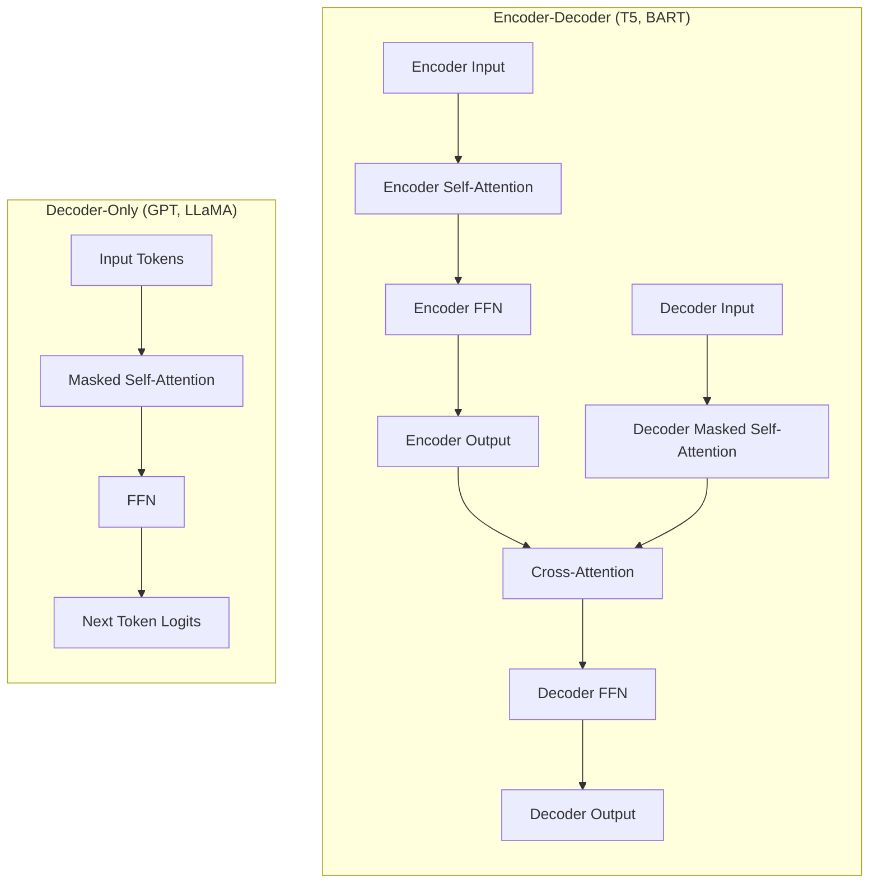
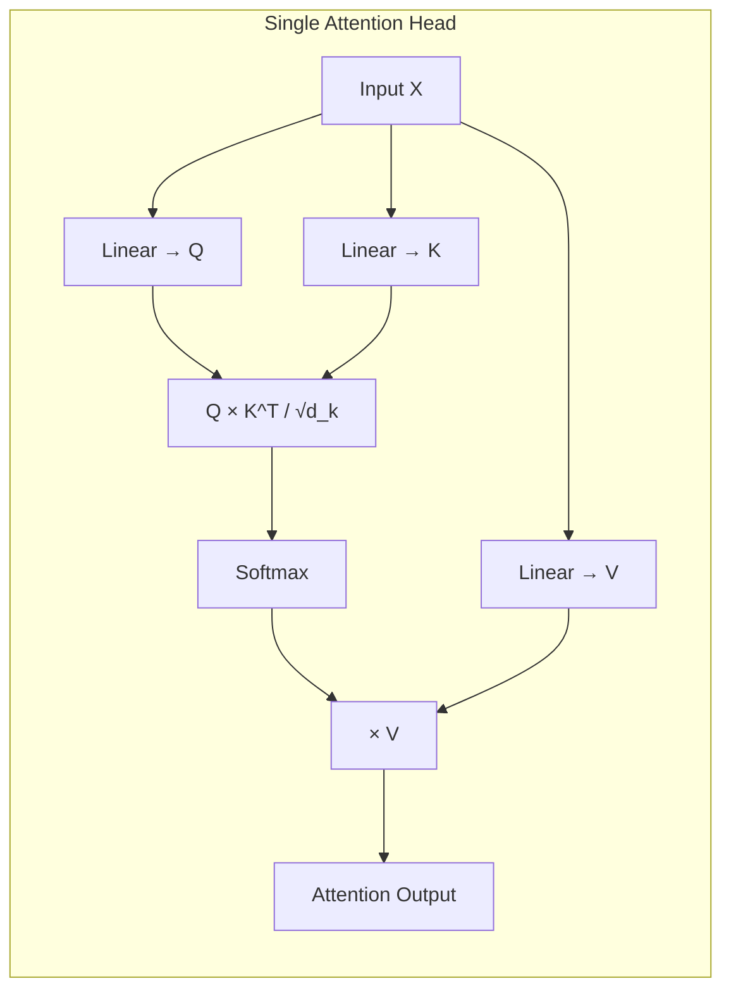
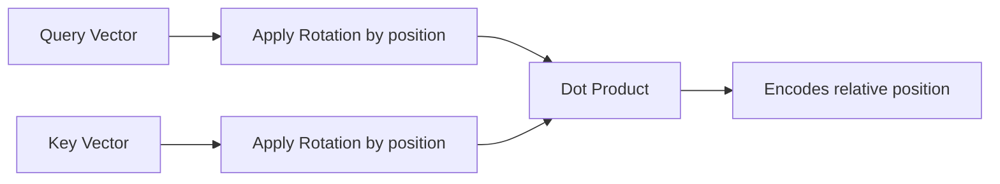
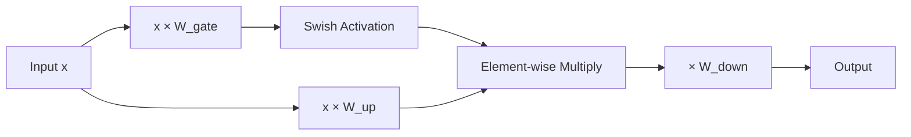
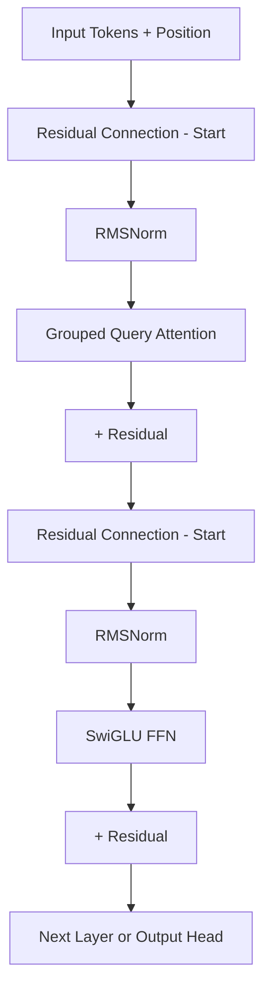

# LLM Architecture

## Overview

The Transformer architecture (Vaswani et al., 2017) is the foundation of all modern LLMs. Understanding its components — self-attention, feed-forward networks, positional encoding, and normalization — is critical for interviews. This page covers decoder-only (GPT-style), encoder-decoder (T5-style), and the key architectural choices that make LLMs work.

## Transformer Architecture Variants



| Variant | Models | Use Case |
|---|---|---|
| **Decoder-only** | GPT-4, LLaMA, Mistral, Claude | General-purpose generation |
| **Encoder-decoder** | T5, BART, Flan-T5 | Seq2seq tasks (translation, summarization) |
| **Encoder-only** | BERT, RoBERTa | Understanding tasks (classification, NER) |

Modern LLMs are overwhelmingly **decoder-only** due to scaling advantages and simpler training.

## Self-Attention Mechanism

Self-attention is the core innovation. Each token can attend to all other tokens to build contextual representations.

### Scaled Dot-Product Attention

```
Attention(Q, K, V) = softmax(QK^T / √d_k) V
```

Where:
- **Q (Query)**: "What am I looking for?"
- **K (Key)**: "What do I contain?"
- **V (Value)**: "What information do I provide?"
- **d_k**: Dimension of keys (scaling factor prevents vanishing gradients in softmax)



### Multi-Head Attention

Instead of one attention function, we run **h parallel attention heads** with different learned projections:

```
MultiHead(Q, K, V) = Concat(head_1, ..., head_h) W^O
where head_i = Attention(QW_i^Q, KW_i^K, VW_i^V)
```

Each head learns different attention patterns:
- Some heads attend to nearby tokens (local syntax)
- Some attend to distant tokens (long-range dependencies)
- Some attend broadly (semantic similarity)

### GQA (Grouped Query Attention)

A key optimization in modern LLMs (LLaMA 2, Mistral):

| Attention Type | Q heads | KV heads | Memory |
|---|---|---|---|
| **MHA** (Multi-Head) | h | h | Highest |
| **MQA** (Multi-Query) | h | 1 | Lowest |
| **GQA** (Grouped Query) | h | g (1 < g < h) | Balanced |

GQA groups query heads to share KV heads, reducing KV cache memory by 4–8× with minimal quality loss.

## Positional Encoding

Transformers have no inherent notion of token order. Positional encodings inject this information.

### RoPE (Rotary Position Embeddings)

Used by LLaMA, Mistral, and most modern LLMs:

```
RoPE(x, pos) = x · cos(pos · θ) + rotate(x) · sin(pos · θ)
```

**Key properties:**
- Encodes **relative** position (attention between tokens depends on their distance, not absolute position)
- Naturally extends to longer sequences (NTK-aware scaling, YaRN)
- Applied directly to Q and K vectors



### ALiBi (Attention with Linear Biases)

Used by BLOOM, MPT. Adds a position-dependent bias to attention scores:

```
score(i,j) = q_i · k_j - m · |i - j|
```

Simple, extrapolates to longer sequences, but slightly less effective than RoPE in practice.

## Feed-Forward Network (FFN)

After attention, each token passes through an FFN that performs "thinking" on the attended information.

### Standard FFN

```
FFN(x) = W₂ · ReLU(W₁ · x + b₁) + b₂
```

Hidden dimension is typically 4× the model dimension (e.g., 4096 → 16384).

### SwiGLU (Modern)

Used by LLaMA, Mistral, Gemma:

```
SwiGLU(x) = (Swish(xW₁) ⊙ xV) W₂
```

Where ⊙ is element-wise multiplication. SwiGLU consistently outperforms ReLU FFN with the same parameter count.



## Normalization

### RMSNorm (Root Mean Square Layer Normalization)

Used by LLaMA, Mistral (replaces LayerNorm):

```
RMSNorm(x) = x / √(mean(x²) + ε) · γ
```

- No mean-centering (simpler, faster)
- No bias term
- ~10% faster than LayerNorm with equivalent quality

### Pre-Norm vs Post-Norm

```mermaid
graph TD
    subgraph "Pre-Norm (LLaMA, GPT)"
        PN_IN[Input] --> PN_NORM[Norm]
        PN_NORM --> PN_ATTN[Attention]
        PN_ATTN --> PN_ADD1[+ Residual]
        PN_ADD1 --> PN_NORM2[Norm]
        PN_NORM2 --> PN_FFN[FFN]
        PN_FFN --> PN_ADD2[+ Residual]
    end

    subgraph "Post-Norm (Original Transformer)"
        PO_IN[Input] --> PO_ATTN[Attention]
        PO_ATTN --> PO_ADD1[+ Residual]
        PO_ADD1 --> PO_NORM1[Norm]
        PO_NORM1 --> PO_FFN[FFN]
        PO_FFN --> PO_ADD2[+ Residual]
        PO_ADD2 --> PO_NORM2[Norm]
    end
```



**Pre-norm** is more stable during training (gradients flow through residual connections) and is standard in modern LLMs.

## Full Transformer Block (Modern LLM)



A typical LLaMA-style block:
1. RMSNorm → GQA → residual add
2. RMSNorm → SwiGLU FFN → residual add
3. Repeat × N layers (32–80+ layers)

## Model Size Calculations

### Parameter Count

For a model with:
- **L** layers
- **d** = model dimension
- **d_ff** = FFN dimension (typically 8/3 × d for SwiGLU)
- **V** = vocabulary size

```
Parameters ≈ L × (12d² + 12d × d_ff) + V × d
```

**Simplified rule of thumb:** For a 7B model with d=4096, L=32:
- Attention per layer: ~4 × d² = ~67M
- FFN per layer: ~3 × 2 × d × d_ff ≈ ~178M
- Total per layer: ~245M
- 32 layers: ~7.8B ✓

### Memory Estimation

| Precision | Bytes per Parameter | 7B Model | 70B Model |
|---|---|---|---|
| FP32 | 4 | 28 GB | 280 GB |
| FP16/BF16 | 2 | 14 GB | 140 GB |
| INT8 | 1 | 7 GB | 70 GB |
| INT4 | 0.5 | 3.5 GB | 35 GB |

**Rule of thumb**: Memory (GB) ≈ Parameters (B) × Bytes_per_param

## Interview Questions

### Q1: Why is self-attention O(n²) and what are the implications?
**Answer:** Self-attention computes pairwise interactions between all n tokens, giving O(n²d) complexity. This means:
- Doubling context length quadruples compute
- For a 100K context, that's 10B attention computations
- This is why long-context LLMs are expensive and why KV cache matters
- Mitigations: FlashAttention (hardware-aware), sparse attention (Longformer), linear attention (Mamba)

### Q2: What is FlashAttention and why does it matter?
**Answer:** FlashAttention (Dao et al., 2022) is an IO-aware exact attention algorithm. Instead of materializing the full n×n attention matrix in HBM (GPU main memory), it tiles the computation to use SRAM (on-chip memory), reducing memory from O(n²) to O(n) and improving speed by 2–4×. It doesn't approximate — it's mathematically identical to standard attention but more efficient.

### Q3: Why do modern LLMs use SwiGLU instead of ReLU in FFNs?
**Answer:** SwiGLU (Shazeer, 2020) combines Swish activation with a gating mechanism. The gating allows the network to selectively pass information. Empirically, SwiGLU achieves better perplexity than ReLU/GELU FFNs with the same parameter count. The trade-off is slightly more computation (three weight matrices instead of two), but the quality improvement is worth it.

### Q4: Compare RoPE and ALiBi for positional encoding.
**Answer:**
- **RoPE**: Encodes absolute position via rotation, but dot product captures relative position. Supports NTK-aware scaling for context extension. Used by LLaMA, Mistral.
- **ALiBi**: Adds linear bias to attention scores based on distance. Simpler, naturally extrapolates. Used by MPT, BLOOM.
- RoPE generally performs slightly better and is more widely adopted. ALiBi is simpler but less flexible.

### Q5: How does GQA reduce memory compared to MHA?
**Answer:** In MHA with h heads, each layer stores h key-value pairs per token. GQA groups query heads into g groups, each sharing one set of KV heads. For h=32, g=8: KV cache is reduced by 4×. This directly reduces the memory bottleneck during inference (KV cache can dominate memory for long sequences) with <1% quality degradation in practice.

## Common Mistakes

- ❌ Confusing encoder-only (BERT) with decoder-only (GPT) architectures
- ❌ Forgetting the scaling factor √d_k in attention (without it, softmax saturates)
- ❌ Thinking attention is the only bottleneck — FFN contains 2/3 of parameters
- ❌ Ignoring that residual connections are essential for training deep transformers
- ❌ Confusing pre-norm and post-norm ordering

## Summary

Modern LLMs use decoder-only transformers with: multi-head/grouped-query attention, RoPE positional encoding, SwiGLU FFN, RMSNorm, and pre-norm residual connections. Understanding the math behind attention, the role of FFNs, and how model size translates to memory and compute is essential for interviews.

## Cross-References

- [KV Cache →](kv-cache.md) How attention states are cached during inference
- [Tokenization →](tokenization.md) How text becomes tokens
- [Embeddings →](embeddings.md) Dense and sparse representations
- [Quantization →](quantization.md) Reducing precision for efficiency
- [vLLM →](vllm.md) PagedAttention for efficient serving
- [ML Transformers](../../ml/transformers/architecture.md)
- [Attention Mechanism](../../ml/deep-learning/attention.md)
- [GPU Architecture](../../cloud/virtualization/README.md)
