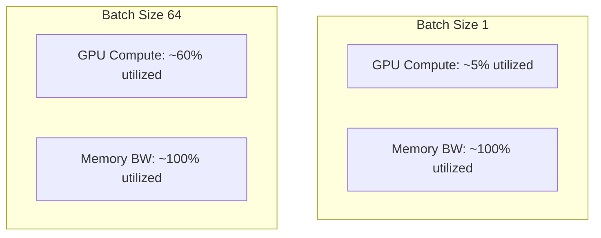
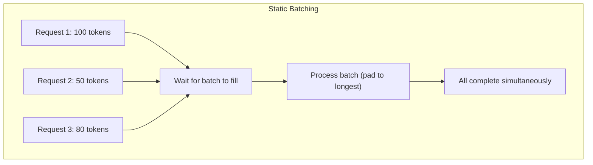
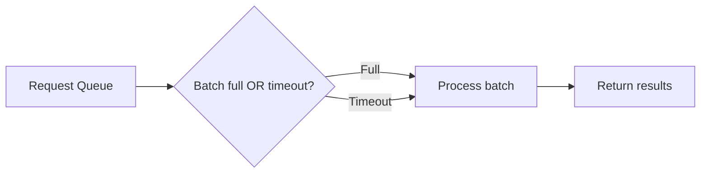
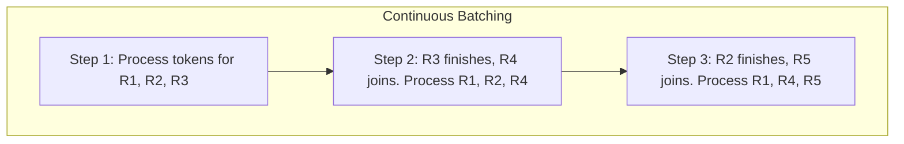
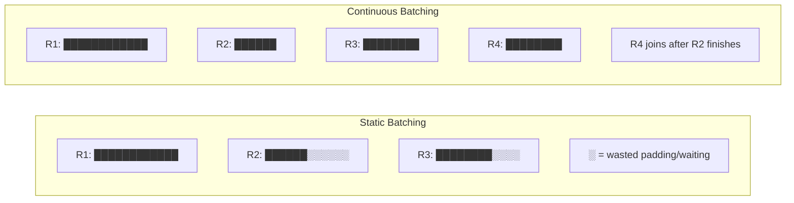
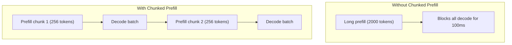
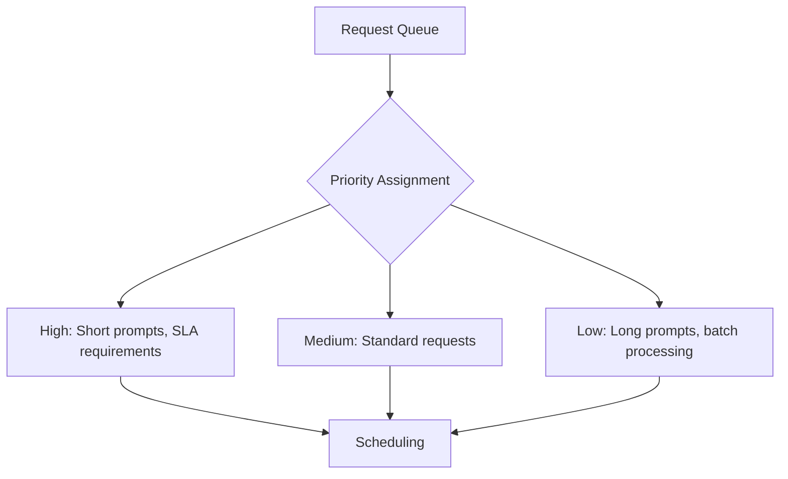

# Batching Strategies

## Overview

Batching is the most important optimization for LLM inference throughput. Since decode is memory-bandwidth bound, processing multiple requests simultaneously amortizes the cost of reading model weights across many sequences. The right batching strategy can improve throughput by 10-20×.

## Why Batching Matters

### The Arithmetic Intensity Problem

During decode with batch_size=1:
- Read: Full model weights (~14 GB for 7B FP16)
- Compute: One token's worth (~0.001 GFLOPs)
- Arithmetic intensity: Extremely low → memory-bandwidth bound

With batch_size=64:
- Read: Same model weights
- Compute: 64 tokens' worth
- Arithmetic intensity: 64× higher → better GPU utilization

## Batching Strategies

### Static Batching

Simplest approach — wait for a full batch, process together:

**Problems:**
- Short requests wait for the longest request to finish (padding waste)
- New requests can't join a running batch
- Latency is determined by the slowest request

### Dynamic Batching

Wait up to T seconds or until batch is full:

Better than static, but still has the padding problem and can't add requests mid-batch.

### Continuous Batching (Iteration-Level Batching)

The key innovation for LLM serving. Instead of batching at the request level, batch at the **token iteration level**:

**Key differences from static batching:**
- Requests can join/leave the batch at any iteration
- No padding waste (each request is at its own position)
- No waiting for the longest request
- GPU utilization stays high throughout

### Comparison

| Metric | Static | Dynamic | Continuous |
|---|---|---|---|
| **Throughput** | Low | Medium | High |
| **Latency** | High | Medium | Low |
| **GPU utilization** | ~30% | ~50% | ~80%+ |
| **Requests/sec** | 1× | 2-3× | 5-20× |

## Chunked Prefill

A technique to prevent long prefills from blocking decode:

**Benefits:**
- Prevents prefill from monopolizing the GPU
- Reduces TPOT variance (more consistent token latencies)
- Enables mixing prefill and decode in the same batch

## Priority-Based Batching

## Preemption

When GPU memory is full, preempt lower-priority requests:

| Strategy | How It Works |
|---|---|
| **Recomputation** | Discard KV cache, recompute when resumed |
| **Swap** | Move KV cache to CPU, swap back when resumed |

Recomputation is simpler and often faster for short sequences. Swapping is better for long sequences where recomputation is expensive.

## Interview Questions

### Q1: What is continuous batching and why is it important?
**Answer:** Continuous batching (also called iteration-level batching) allows requests to join and leave the batch at every decode iteration, rather than waiting for the entire batch to complete. This means:
1. Short requests don't wait for long ones
2. New requests can be served immediately when a slot opens
3. GPU utilization stays high (no idle time between batches)
4. Throughput increases 5-20× compared to static batching

It was introduced by Orca (Yu et al., 2022) and is implemented in vLLM, TGI, and TensorRT-LLM.

### Q2: Why does batching improve throughput more for LLMs than for traditional ML models?
**Answer:** LLM decode is memory-bandwidth bound — each step reads the full model weights but only computes one token. With batch_size=1, GPU compute utilization is ~5%. Batching amortizes the weight reads across many sequences, increasing arithmetic intensity. Traditional ML models (CNNs, etc.) are often compute-bound even with batch_size=1, so batching helps less.

### Q3: What is chunked prefill and when is it useful?
**Answer:** Chunked prefill breaks long prefill computations into smaller chunks interleaved with decode batches. Without it, a 2000-token prefill blocks all decode for 100ms+, causing latency spikes for other requests. With chunked prefill, the GPU alternates between prefill chunks and decode iterations, maintaining consistent decode latency. It's essential for mixed workloads with varying prompt lengths.

### Q4: How does preemption work in LLM serving?
**Answer:** When GPU memory is full (KV cache exhausted), the scheduler must evict requests to make room. Two strategies:
- **Recomputation**: Discard the KV cache. When the request is resumed, recompute the prefill. Simple but wastes compute.
- **Swap**: Copy KV cache to CPU memory. When resumed, swap back. Saves compute but adds PCIe transfer overhead.
The choice depends on sequence length (recompute for short, swap for long) and available CPU memory.

## Common Mistakes

- ❌ Using static batching in production (massive throughput loss)
- ❌ Not accounting for variable prompt lengths in capacity planning
- ❌ Setting batch size too large (OOM from KV cache)
- ❌ Ignoring preemption when KV cache memory is exhausted
- ❌ Not using chunked prefill for mixed workloads

## Summary

Batching is the most impactful optimization for LLM inference. Continuous batching allows requests to join/leave at every iteration, achieving 5-20× throughput improvement over static batching. Chunked prefill prevents long prompts from blocking decode. Preemption handles memory pressure by evicting and resuming requests.

## Cross-References

- [Inference →](inference.md) Why decode is memory-bound
- [KV Cache →](kv-cache.md) Memory that limits batch size
- [vLLM →](vllm.md) Implementation of continuous batching
- [Speculative Decoding →](speculative-decoding.md) Alternative to batching for latency
- [Inference](./inference.md)
- [vLLM](./vllm.md)
- [Concurrency Thread Pools](../concurrency/thread-pools.md)
- [Cloud Auto Scaling](../cloud/aws/ec2.md)

