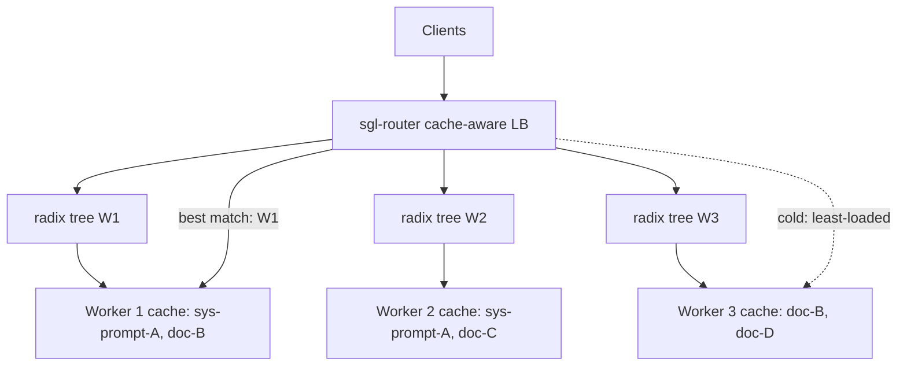
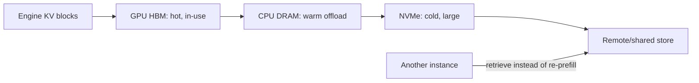
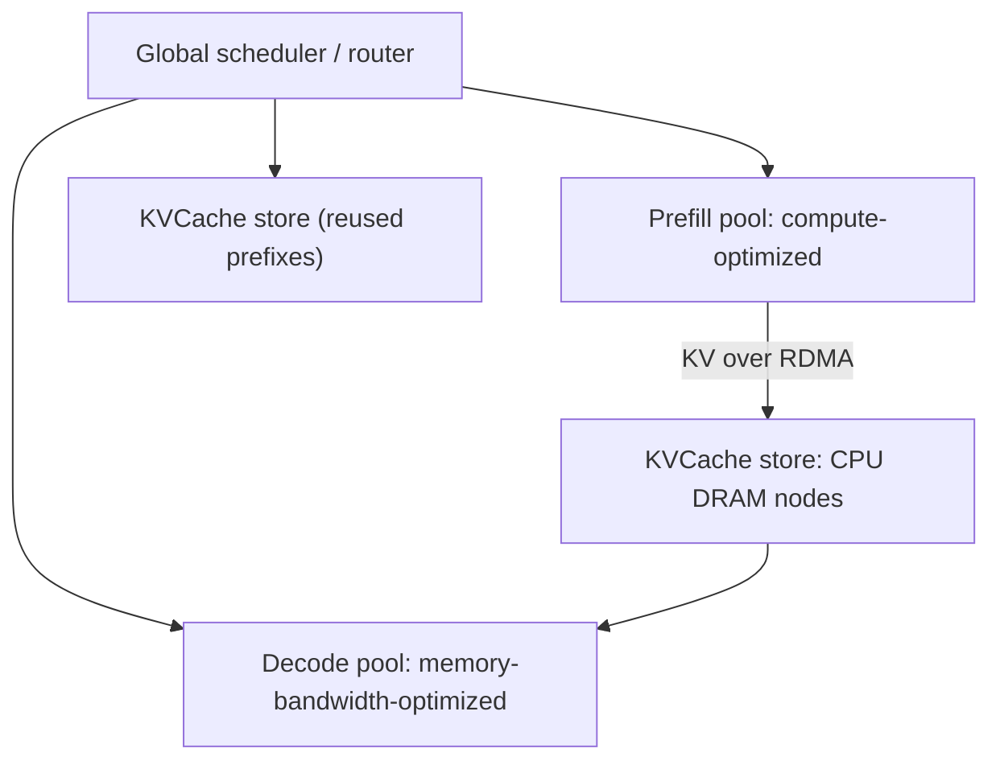
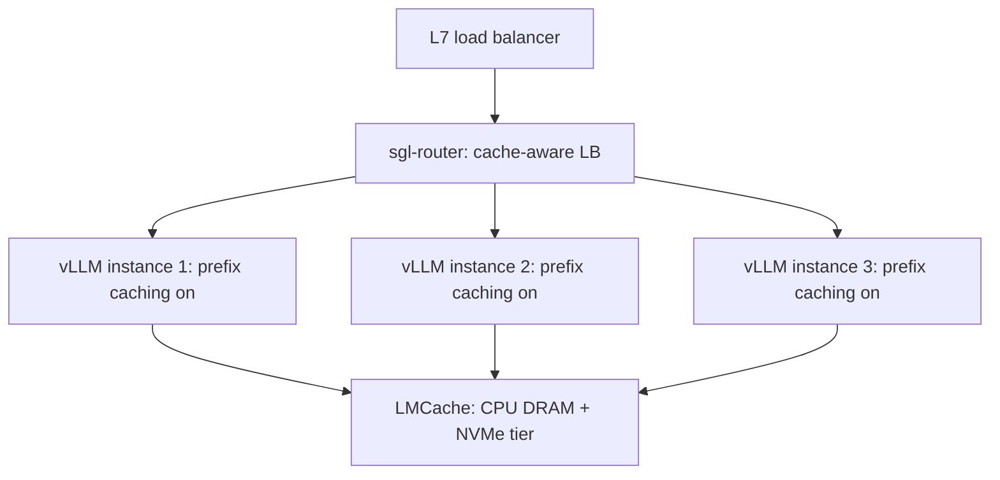

# Cache-Aware Routing

## Overview

KV cache is only as valuable as your ability to route requests to where it already lives. Cache-aware routing places each request on the instance that already holds the longest matching prefix in GPU memory — trading perfect load balance for huge first-token savings. This page covers the TTFT math that justifies the trade, the SGLang router's cache-aware load balancer, LMCache and Mooncake for cross-instance KV reuse, and the eviction policies that decide whether any of it works under churn. Interviews probe it in system design: "design a multi-instance LLM serving cluster for chat" or "why did our p99 TTFT spike after adding more replicas".

## Why Prefix Locality Matters: The TTFT Math

Time-to-first-token is dominated by prefill, and prefill cost scales linearly with prompt length:

\\[ \text{prefill FLOPs} \approx 2 \times P \times n_{prompt} \\]

where \\( P \\) is parameter count. On cache hit for a shared prefix, the engine skips prefill for the cached span entirely and pays only decode-time attention over the existing KV.

Worked example — Llama-3.1-70B, 4,096-token prompt, 8×H100 with tensor parallelism (effective ~30-40% MFU on ~8 PFLOPS bf16, i.e. ~2.5-3 PFLOPS usable):

\\[ 2 \times 70\times10^9 \times 4096 \approx 5.7\times10^{14} \text{ FLOPs} \Rightarrow \sim 200\text{ ms prefill} \\]

If 90% of the prompt (a system prompt plus few-shot block or a RAG corpus digest) is already cached, only ~410 tokens need computing — roughly **20 ms** of prefill. The full span:

| Cached prefix fraction | Prefill tokens | Prefill time (70B, 8×H100) | Speedup |
|---|---|---|---|
| 0% (cold) | 4,096 | ~200 ms | 1× |
| 50% | 2,048 | ~100 ms | 2× |
| 90% | 410 | ~20 ms | ~10× |
| 99% (multi-turn, tiny delta) | 41 | ~2 ms | ~100× |

The second effect is subtler and hits *throughput*: a prefill of 4k tokens also occupies the batch's compute for that duration, delaying every other request's decode steps. Cutting redundant prefill improves p99 for everyone, not just the cache-hit requester. This is why multi-turn chat is the canonical case: clients re-send the entire conversation each turn, so without routing or KV reuse, turn \\( k \\) re-prefills \\( O(k \cdot L) \\) tokens the instance already computed last turn.

## The Routing Problem

A naive load balancer (round-robin or least-connections) actively destroys locality: it spreads N copies of a shared system prompt across N replicas, multiplying warmup cost and diluting each replica's cache across more distinct prefixes, which lowers per-replica hit rate and increases evictions. The spectrum of strategies:

| Strategy | Mechanism | Cache hit rate | Load balance | Failure modes |
|---|---|---|---|---|
| Round-robin / random | Ignore content | Low-moderate | Even | Locality destroyed by design |
| Session affinity (sticky) | Hash user/session ID → instance | High *within* a conversation | Uneven (hot users) | Affinity breaks on scale-in; hot spots |
| Prefix-hash | Hash first K tokens / system prompt → instance | High for stable prefix set | Uneven (popular prefixes) | Collisions; blind to actual cache state |
| Cache-aware (content match) | Route to instance with longest cached prefix | Highest | Approximate (eviction-aware) | Router state; cold-start thrash |
| Least-loaded | Queue depth only | None | Even | Baseline for stateless serving |

Session affinity and prefix-hash are both "deterministic placement" schemes: they guess where the KV lives from a key. Cache-aware routing instead *tracks* where it actually lives.

## SGLang Router: Cache-Aware Load Balancing

The SGLang project ships **sgl-router**, a Rust/Tokio load balancer for SGLang workers whose default policy is cache-aware (docs: [docs.sglang.ai](https://docs.sglang.ai/), source: [github.com/sgl-project/sglang](https://github.com/sgl-project/sglang)). Design:

1. The router maintains an **approximate radix tree per worker** summarizing which token prefixes that worker's RadixAttention cache currently holds (workers report their cache state; the router does not store KV itself).
2. On a request, the router computes the **longest prefix match** against each worker's tree.
3. If the best match exceeds a configured threshold, route there — the cached span will be reused instead of recomputed.
4. If no meaningful match exists (cold prefix), fall back to **balance-oriented routing** (shortest queue / least pending requests) so cold traffic doesn't pile onto one worker.

This is two-phase routing: content-aware placement when reuse is likely, load-aware placement otherwise. It pairs with SGLang's worker-side **RadixAttention** — a radix tree over KV blocks where shared prefixes share physical blocks and eviction is LRU over leaf nodes — so the router's tree is a mirror of real on-GPU state (PagedAttention-style memory background: [vLLM](./vllm.md), [KV Cache](./kv-cache.md)).



Trade-off the router accepts: cache-aware placement is *imperfect* load balancing. A worker holding a giant shared prefix becomes a magnet; the router mitigates by (a) only preferring a worker when the matched prefix is long enough to beat the extra queueing delay, and (b) balancing cold requests. The general rule: prefer cache affinity when the reuse value (saved prefill ms) exceeds the marginal queue delay (approximately queue depth × decode step time).

## Session Affinity vs Prefix-Hash: Trade-offs

**Session affinity** (sticky routing by user/session ID) is the right default for conversational products: each turn's payload is a superset of the previous turn's messages, so the same instance always has the KV. Costs: load skew from hot users, and affinity is a lie during scale events — when an instance is replaced or a replica is added, sticky sessions land cold and pay full re-prefill (drain/consistent hashing softens but does not remove this). It also couples routing to client identity, which you may not have (API gateways see bearer tokens, not sessions).

**Prefix-hash** routes on content (hash of the first N tokens or of the system prompt) instead of identity: any request sharing a prompt lands together, without session state. Costs: hash slots are static — a popular prefix's slot becomes hot, an unpopular one strands capacity; the hash cannot see actual cache occupancy or evictions; and it works badly when prefixes evolve (RAG: the retrieved-document block changes per query, so the shared span is only the system prompt — hash *that*, not the whole prompt).

| Concern | Session affinity | Prefix-hash | Cache-aware |
|---|---|---|---|
| Router state | None (hash of ID) | None (hash of content) | Per-worker radix trees |
| Multi-turn hit rate | Near 100% | Only if history hashes stable | Near 100% |
| Cold-start behavior | Worst case: full re-prefill after failover | Deterministic re-warm | Falls back to load-based |
| Hot-spot risk | Hot users | Hot prefixes | Managed via threshold + fallback |
| Operational complexity | Low | Low | Medium (state sync, config) |

Real deployments often combine them: sticky within a conversation window, prefix-hash on the system prompt across conversations, with a load-based escape hatch.

## LMCache: Cross-Instance KV Reuse

Routing can only exploit KV that already sits in some GPU's memory. [LMCache](https://github.com/LMCache/LMCache) adds a **KV storage layer** underneath the engines: it exports computed KV blocks and reloads them later, on any instance, from a tiered store.



Key ideas:

- **Offload tiers**: KV moves GPU HBM → CPU DRAM → NVMe (→ remote), so a prefix evicted from GPU to make room for live requests can be paged back in far faster than recomputing prefill.
- **Cross-instance reuse**: KV produced by instance A (e.g., a 50k-token document digest prefilled by whoever saw it first) is retrieved by instance B — locality no longer depends on the router hitting the same replica.
- **Bandwidth-efficient transfer**: the associated CacheGen work (Liu et al., "CacheGen: Fast Context Loading for Language Model Applications", 2023) encodes KV tensors into compact bitstreams so large contexts can be streamed over constrained links faster than re-prefilling them.
- **Engine integration**: LMCache plugs into vLLM as a KV-transfer connector (used by vLLM's experimental disaggregated prefill), so the engine treats external KV as another block source — see vLLM's disaggregated prefill docs: [docs.vllm.ai/en/latest/features/disagg_prefill.html](https://docs.vllm.ai/en/latest/features/disagg_prefill.html).

The routing implication: with an LMCache-style layer, "cache-aware" routing relaxes from "route to the instance holding the KV" to "route to the least-loaded instance and pull the KV" — placement freedom returns, at the cost of a KV-transfer hop (milliseconds over RDMA/NVMe vs hundreds of ms of re-prefill).

## Mooncake: KVCache-Centric Cluster Architecture

[Mooncake](https://github.com/Mooncake-Labs/mooncake) (Moonshot AI) inverts the usual design: the **KV cache is the central resource of the cluster**, not a per-instance byproduct. It serves Kimi with a disaggregated architecture described in "Mooncake: A KVCache-centric Disaggregated Architecture for LLM Serving" (Qin et al., FAST 2025, [arxiv.org/abs/2407.00079](https://arxiv.org/abs/2407.00079)):



Components relevant to routing:

- **Disaggregated prefill/decode pools** with the KV cache transferred between them over RDMA — the pool split itself is covered in [Prefill-Decode Disaggregation](../advanced/distributed/prefill-decode-disaggregation.md); Mooncake's contribution is making the KV store, not the pools, the organizing object.
- **Joint scheduling**: the global scheduler routes each request considering both load *and* where the reusable KV sits, because a "balanced" placement that discards a 100% prefix hit is a net loss.
- **Local-first-global-hash (LHG)** scheduling: prefer the local node already holding the prefix; fall back to a global hash ring for load spreading — explicitly a hybrid of affinity and hashing.
- **Early rejection**: under overload, the scheduler rejects requests predicted to miss their TTFT SLO *before* consuming prefill/decode resources, rather than degrading everyone's latency.

Reported results: ~75% more requests served on real Kimi workloads and up to a 525% throughput increase in long-context scenarios versus an LDSched-style baseline. The architectural lesson for interviews: at scale, KV locality is valuable enough to reorganize the cluster around it — routing stops being an L7 load-balancer afterthought and becomes a resource-scheduler decision.

## Eviction and Admission Control

Cache-aware routing assumes the cache *keeps* what matters. That is an eviction-policy property:

- **What SGLang evicts**: RadixAttention marks radix nodes as locked while an in-flight request uses them; unlocked leaves are evicted LRU. Popular system prompts survive because they are re-hit constantly; one-off prefixes are leaf nodes that age out.
- **What vLLM evicts**: automatic prefix caching tracks blocks by content hash; evicted-but-referenced blocks are recomputed on demand, and blocks are reclaimed LRU-style when the pool is short (block management in [KV Cache](./kv-cache.md)).
- **What Mooncake/LMCache evict**: the store tier (DRAM/NVMe) evicts by value — frequency × length of the reusable span — not purely recency, since storing a 100k-token one-off document is expensive real estate.

**Cache pollution** is the operational failure mode: a burst of unique long prompts evicts hot shared prefixes, hit rates collapse, and every request pays full prefill — often coinciding with the traffic spike that caused it. Mitigations:

| Mitigation | Mechanism |
|---|---|
| Admission threshold | Only insert a prefix into the cache if length ≥ L tokens (short spans aren't worth bookkeeping) |
| Reuse-based admission | Cache on second sighting, not first (protects against one-off churn) |
| Pinning | Reserve blocks for known-shared prompts (system prompt, few-shot templates) |
| Separate pools | Partition capacity between "shared prompt cache" and "per-request KV" so churn can't evict the former |
| Router-level hint | The SGLang router's threshold prevents cold requests from landing on (and evicting from) the currently hottest worker |

Eviction interacts with routing: cache-aware routing *creates* the skew (one hot worker) that eviction policy must then survive. A deployment that adds prefix routing without revisiting eviction limits typically shows great hit rates in demos and collapse under real bursty load.

## Monitoring the Cache

Cache-aware routing introduces metrics that must be watched as SLO inputs, not curiosities:

| Metric | Source | Alert threshold signal |
|---|---|---|
| Prefix cache hit rate (tokens reused / tokens prompted) | Engine metrics (vLLM counters, SGLang logs) | Falling hit rate at rising load = pollution or eviction churn |
| Per-worker cache occupancy | Worker introspection (`/metrics`, radix-tree size) | One worker at 100% while peers idle = routing skew |
| KV block utilization / eviction rate | Paged-KV engine metrics | Sustained near-100% = thrashing; eviction rate spike = cold wave |
| TTFT p50 vs p99 split by "new conversation" vs "continuation" | Router/observability layer | Continuations slower than new = affinity broken (scale-in, failover) |
| Router match-length distribution | sgl-router stats | Median match length shrinking = shared prefixes missing the cache |

The last row is the router's own health check: cache-aware routing pays for itself only while the *matched length* distribution stays fat. If the median best-match length collapses, either the traffic mix changed (new product surface, new prompt templates) or eviction is winning — and the fix is admission control or capacity, not more replicas.

A practical observability split: the load balancer should emit routing decisions (which worker, why — cache-match vs load-fallback), and the engine should emit cache behavior (hits, evictions, occupancy). Correlating the two is how you distinguish "router is fine, cache is thrashing" from "router is shattering locality".

## Putting It Together: A Reference Architecture

A production multi-instance stack that uses every mechanism on this page:



Configuration sketch for the SGLang case:

```bash
# Three SGLang workers, each with radix-cache prefix reuse
python -m sglang.launch_server --model meta-llama/Llama-3.1-8B-Instruct \
  --port 30000 --mem-fraction-static 0.8

# Router in front, cache-aware policy (default), load-aware fallback
python -m sglang_router.launch_router --worker-urls http://localhost:30000 \
  http://localhost:30001 http://localhost:30002 --host 0.0.0.0 --port 8080
```

Design decisions, in the order you'd defend them in a review:

1. **Enable in-engine prefix caching first** — it is free and captures intra-instance reuse; routing only matters once you have multiple instances to place work on.
2. **Add cache-aware routing when TTFT distribution splits** — measure the continuation-vs-new-conversation gap; route when the gap exceeds the skew cost.
3. **Add KV offload (LMCache) when the prefix set exceeds one GPU's cache** — the working set of shareable prefixes, not the request rate, decides this.
4. **Consider disaggregation (Mooncake-style) when prefill and decode contention diverge** — the pool split and the routing decision become one scheduler problem ([Prefill-Decode Disaggregation](../advanced/distributed/prefill-decode-disaggregation.md)).
5. **Revisit eviction policy at each step** — every layer that caches (engine radix cache, offload tier, router affinity) needs its own admission and eviction rules, or the newest layer simply relocates the thrash.

## Common Mistakes

- ❌ Adding cache-aware routing before enabling in-engine prefix caching — there is nothing to route to; the router's trees stay empty and it degrades to load balancing with extra state.
- ❌ Reading a high hit rate as success while p99 TTFT climbs — hits on short prefixes save little; weight hits by reusable length.
- ❌ Sticky sessions without a drain plan — scale-in and failover strand conversations on dead workers and re-prefill everything; pair affinity with session handoff or KV offload.
- ❌ Caching every prefix by default — one-off long documents pollute the cache and evict the hot system prompt; use length thresholds and reuse-based admission.
- ❌ Benchmarking with synthetic traffic that reuses one system prompt — it overstates cache-aware gains; replay real prompt traces with realistic prefix diversity.
- ❌ Ignoring the router as a failure domain — it holds live cache-state; a router restart should fall back to load-based routing, not drop traffic.

## Interview Questions

1. **Why does a cache-aware load balancer often beat round-robin even though round-robin balances perfectly?** Because prefill dominates TTFT and is redundant when the KV for a shared prefix already exists. A 4k-token prompt on a 70B model costs ~200 ms of prefill cold but ~20 ms at 90% cache hit — and the redundant prefill also stalls other requests in the batch. Routing each request to the instance holding its longest cached prefix converts that 200 ms into 20 ms; round-robin spreads the same prompt across replicas, multiplying warmup cost and diluting every replica's cache. The router deliberately sacrifices perfect balance when the reuse value exceeds the marginal queueing delay.

2. **How does the SGLang router decide where to send a request?** It keeps an approximate radix tree per worker mirroring what that worker's RadixAttention cache holds, computes the longest prefix match for each candidate, and routes to the best match when the match length exceeds a threshold. When no worker has a meaningful match, it falls back to load-based routing (shortest queue), so cold traffic still spreads evenly. It is a two-phase policy: content-aware when reuse is likely, load-aware otherwise. The router tracks cache state, not KV data — the KV always stays in the worker's GPU memory.

3. **Your multi-turn chat TTFT grows linearly with conversation length. Diagnose.** The client re-sends the full message history each turn, so without KV reuse every turn re-prefills the entire conversation — turn k costs O(k·L) prefill tokens. Fixes in order of cost: enable prefix caching in the engine (reuse within one instance); add session-affinity or prefix-hash routing so turns land on the instance that already holds the KV; deploy an LMCache-style offload layer so KV survives eviction and even instance restarts. Also cap `session_len`/history trimming so the client-side payload doesn't grow unboundedly.

4. **When would you choose session affinity over content-based cache-aware routing?** Session affinity when conversations are long-lived and the router lacks visibility into worker cache state: it needs no cache tracking, gives near-perfect multi-turn hits, and is trivially implementable with a consistent hash of the session ID. Content-based cache-aware routing wins when many *distinct* clients share prefixes (same product, same system prompt) — affinity can't exploit that cross-user reuse because user IDs differ. Hot users and scale-in breakage are affinity's structural costs; router state and eviction interplay are cache-aware's.

5. **What is Mooncake and why make the KV cache the cluster's central object?** Mooncake is Moonshot AI's serving architecture for Kimi: prefill and decode run in separate pools, and KV caches move between them over RDMA through a dedicated KVCache store tier built from CPU DRAM nodes. Making KV the first-class resource lets the global scheduler jointly optimize placement for load *and* reuse (local-first-global-hash scheduling), and enables early rejection of requests that would miss SLO under overload. It reported ~75% more requests on real workloads and up to 525% throughput gains in long-context scenarios — evidence that at scale, KV locality is worth reorganizing the cluster around.

6. **What is cache pollution and how do you defend against it?** A burst of unique long prompts floods the prefix cache with one-off spans, evicting hot shared prefixes (system prompts, few-shot templates); hit rates collapse exactly when load spikes, so every request re-prefills and p99 TTFT explodes. Defenses: admission control (only cache spans above a length threshold, or cache on second sighting), pinning known-shared prefixes, splitting capacity between a protected shared-prompt pool and general KV, and LRU-with-value eviction (frequency × reusable length) in offload stores like LMCache. Router thresholds help too, by keeping cold traffic off the hottest worker.

## Key Takeaways

- TTFT ≈ prefill, and prefill is \\( 2 \times P \times n \\) FLOPs: a 90% prefix hit on a 4k prompt for a 70B model cuts ~200 ms to ~20 ms, and removes batch stalls for everyone else.
- Naive load balancing destroys locality; cache-aware routing (SGLang sgl-router: per-worker radix trees, longest-prefix match, load-based fallback) trades some balance for large reuse gains.
- Session affinity is the cheap default for multi-turn chat; prefix-hash exploits cross-user shared prompts without session state; cache-aware routing adapts to actual cache occupancy — they combine.
- LMCache turns KV into a movable resource (GPU → CPU DRAM → NVMe → remote), decoupling routing from KV placement; integrates with vLLM as a KV-transfer connector.
- Mooncake (FAST 2025) makes the KVCache store the cluster's central resource — disaggregated prefill/decode, RDMA KV transfer, LHG routing, early rejection; ~75% more requests, up to 525% long-context throughput.
- Eviction policy is load-bearing: LRU over radix leaves, content-hash block reclamation, value-based store eviction — plus admission thresholds and pinning to survive cache pollution under bursty load.

## References

- SGLang documentation (router, RadixAttention, cache-aware load balancing): [docs.sglang.ai](https://docs.sglang.ai/)
- SGLang repository (sgl-router, radix cache implementation): [github.com/sgl-project/sglang](https://github.com/sgl-project/sglang)
- LMCache repository (KV storage layer, offload tiers, engine connectors): [github.com/LMCache/LMCache](https://github.com/LMCache/LMCache)
- Mooncake repository (KVCache-centric serving, transfer engine): [github.com/Mooncake-Labs/mooncake](https://github.com/Mooncake-Labs/mooncake)
- R. Qin, Z. Li, W. He, et al., "Mooncake: A KVCache-centric Disaggregated Architecture for LLM Serving", FAST 2025: [arxiv.org/abs/2407.00079](https://arxiv.org/abs/2407.00079)
- vLLM documentation — Disaggregated Prefill with KV connectors (LMCache, Mooncake): [docs.vllm.ai/en/latest/features/disagg_prefill.html](https://docs.vllm.ai/en/latest/features/disagg_prefill.html)
- Kwon et al., "Efficient Memory Management for Large Language Model Serving with PagedAttention", SOSP 2023: [arxiv.org/abs/2309.06180](https://arxiv.org/abs/2309.06180)
- Liu et al., "CacheGen: Fast Context Loading for Language Model Applications", 2023 (no URL cited; see LMCache repo links)

## Cross-References

- [vLLM →](./vllm.md) — automatic prefix caching and paged KV: the single-instance half of this story
- [KV Cache →](./kv-cache.md) — block management and eviction mechanics underneath every cache hit
- [Batching →](./batching.md) — why redundant prefill stalls the whole batch, not just one request
- [Prefill-Decode Disaggregation →](../advanced/distributed/prefill-decode-disaggregation.md) — the pool-split architecture Mooncake routes for
- [LLM Serving Systems Overview →](./systems.md) — where the router sits in the full serving stack
- [Engine Comparison →](./engine-comparison.md) — which engines expose the prefix-caching hooks these routers exploit
