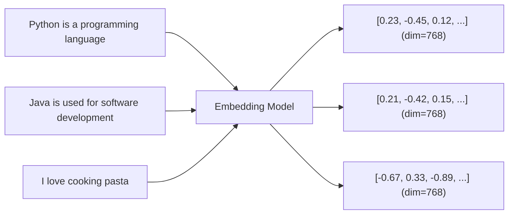
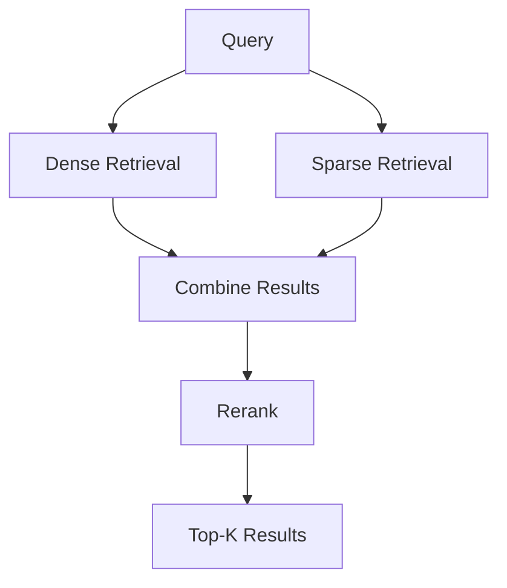
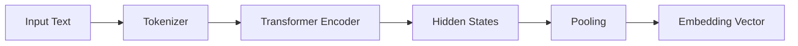
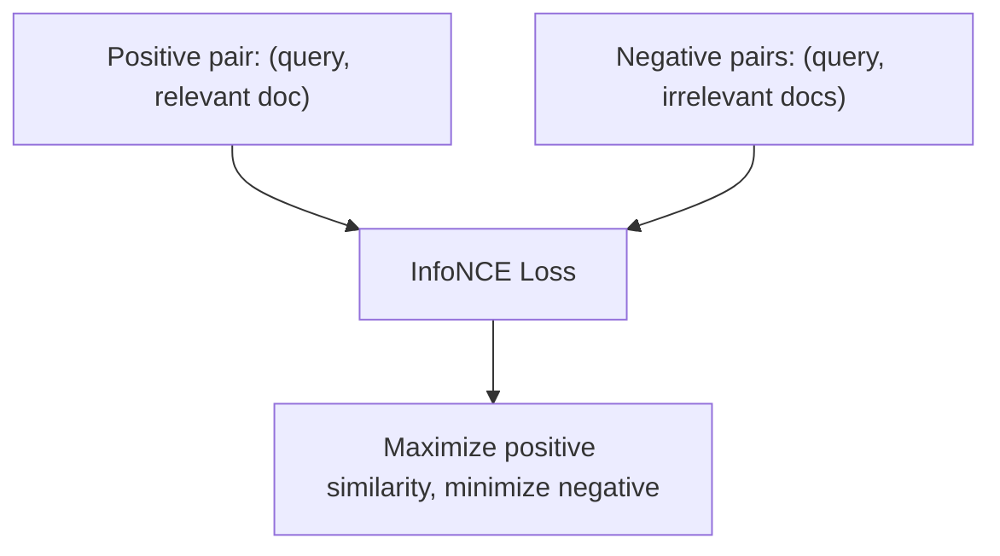
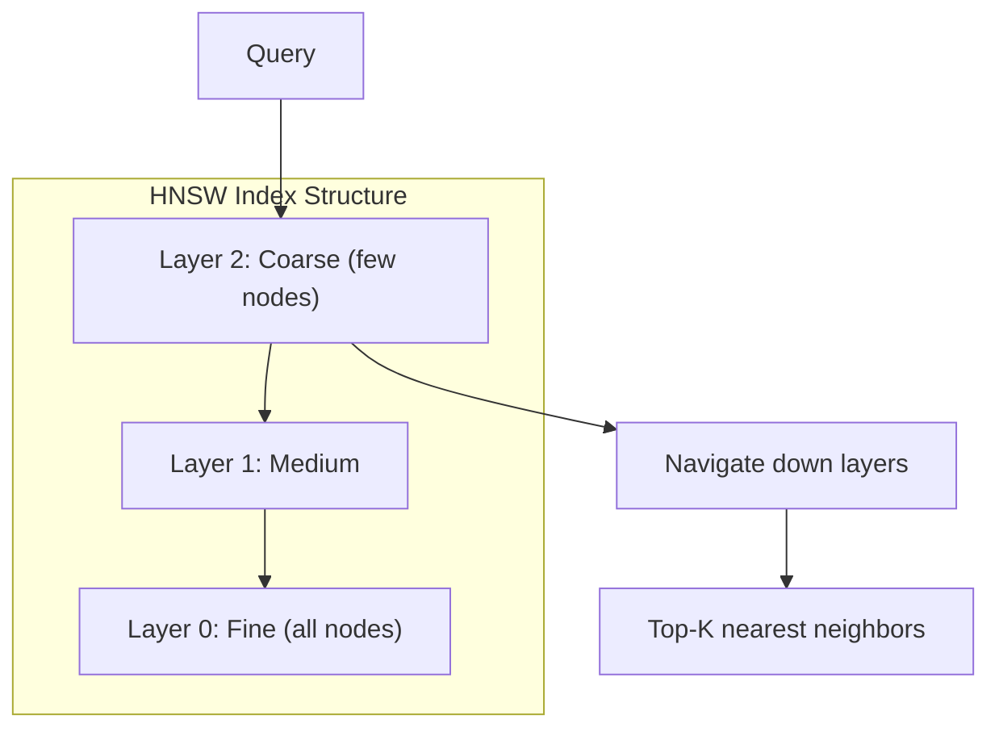

# Embeddings

## Overview

Embeddings are dense vector representations of text that capture semantic meaning. They are the foundation of semantic search, RAG, recommendation systems, and many NLP applications. Understanding embeddings — how they're created, stored, searched, and evaluated — is essential for building AI-powered applications.

## What Are Embeddings?



Similar texts produce similar vectors. This enables:
- **Semantic search**: Find documents by meaning, not just keywords
- **Clustering**: Group similar documents
- **Classification**: Use embeddings as features
- **RAG**: Retrieve relevant context for LLMs

## Types of Embeddings

### Dense Embeddings

Standard neural network embeddings — every dimension has a value:

```python
embedding = [0.23, -0.45, 0.12, 0.67, -0.89, ...]  # 768 floats
```

| Model | Dimensions | Max Tokens | Quality |
|---|---|---|---|
| **OpenAI text-embedding-3-small** | 1536 | 8191 | Good |
| **OpenAI text-embedding-3-large** | 3072 | 8191 | Excellent |
| **Cohere embed-v3** | 1024 | 512 | Excellent |
| **BGE-M3** | 1024 | 8192 | Excellent (multilingual) |
| **E5-mistral-7b** | 4096 | 32768 | State-of-art |
| **Nomic Embed v1.5** | 768 | 8192 | Good, open-source |

### Sparse Embeddings

Most dimensions are zero — like a weighted bag-of-words:

```python
sparse = {142: 0.23, 5671: 0.45, 12045: 0.12}  # index: weight
```

**SPLADE** learns sparse representations that expand query terms with related words.

### Hybrid Embeddings

Combine dense and sparse for best results:



## Embedding Models Architecture



**Pooling strategies:**
- **CLS token**: Use the [CLS] token's hidden state (BERT-style)
- **Mean pooling**: Average all token hidden states (most common)
- **Last token**: Use the last token's hidden state (LLM-style)

### Training with Contrastive Learning



```
L = -log(exp(sim(q, d+) / τ) / Σ exp(sim(q, d_i) / τ))
```

## Vector Databases

| Database | Type | Key Feature | Scale |
|---|---|---|---|
| **Pinecone** | Managed | Serverless, easy | Billions |
| **Weaviate** | Self-hosted/Managed | Hybrid search, modules | Billions |
| **Qdrant** | Self-hosted/Managed | High performance, Rust | Billions |
| **Chroma** | Embedded | Simple, lightweight | Millions |
| **Milvus** | Self-hosted | GPU support, scalable | Billions |
| **pgvector** | PostgreSQL extension | Existing PG infra | Millions |
| **FAISS** | Library | Meta, CPU/GPU | Billions |

### Index Types

| Index | Method | Query Time | Accuracy |
|---|---|---|---|
| **Flat** | Exact search | O(n) | 100% |
| **IVF** | Cluster + search nearest | O(n/k) | 95%+ |
| **HNSW** | Graph-based navigation | O(log n) | 99%+ |
| **PQ** | Product quantization | O(n/k) | 90%+ |

### HNSW (Most Common)



## Dimensionality Reduction

For cost savings, reduce embedding dimensions:

| Technique | How | Trade-off |
|---|---|---|
| **Matryoshka** | Use first N dimensions | Minimal quality loss |
| **PCA** | Linear projection | Small quality loss |
| **Quantization** | INT8/INT4 storage | ~1% quality loss |

OpenAI's text-embedding-3 models support Matryoshka — you can use 256, 512, 1024, or 1536 dimensions.

## Interview Questions

### Q1: What is the difference between dense and sparse embeddings?
**Answer:**
- **Dense**: Every dimension has a value. Captures semantic meaning. "Car" and "automobile" have similar vectors. Created by neural networks.
- **Sparse**: Most dimensions are zero. Captures keyword overlap. Like a weighted bag-of-words. Created by BM25 or SPLADE.
- **Why both matter**: Dense misses exact keyword matches (a product ID won't semantically match). Sparse misses semantic similarity. Hybrid retrieval combines both for best results.

### Q2: How do you choose an embedding model?
**Answer:** Consider:
1. **Quality vs cost**: OpenAI large > small, but more expensive
2. **Max token length**: Longer context for RAG (BGE-M3: 8K, E5: 32K)
3. **Multilingual**: BGE-M3, Cohere embed-v3 for non-English
4. **Self-hosted vs API**: OpenAI/Cohere are APIs; BGE, E5, Nomic can be self-hosted
5. **Dimensions**: Higher = better quality but more storage and slower search
6. **Latency**: Smaller models are faster for real-time applications

### Q3: Explain HNSW indexing for vector search.
**Answer:** HNSW builds a multi-layer graph where each node is a vector and edges connect similar vectors. The top layers have few nodes (coarse), bottom layers have all nodes (fine). Search starts at the top layer, greedily navigating to closer nodes, then descends to finer layers. This achieves O(log n) query time with >99% recall. Trade-offs: higher M (connections per node) = better recall but more memory; higher ef_construction = better index quality but slower build.

### Q4: What is Matryoshka representation learning?
**Answer:** Matryoshka embeddings are trained so that any prefix of the vector (first 256, 512, 1024, etc. dimensions) is also a good embedding. This means you can trade quality for speed/cost by using fewer dimensions. OpenAI's text-embedding-3 models support this. For example, 256 dimensions might give 95% of the quality of 1536 dimensions at 6× less storage and faster search.

## Common Mistakes

- ❌ Not normalizing embeddings before cosine similarity (results are wrong)
- ❌ Using the wrong embedding model for queries vs documents (must use same model)
- ❌ Not accounting for max token length (long documents get truncated)
- ❌ Storing millions of embeddings without a vector database (linear scan is too slow)
- ❌ Ignoring hybrid search (missing keyword matches)

## Summary

Embeddings convert text to semantic vectors. Dense embeddings capture meaning; sparse capture keywords. Vector databases (Pinecone, Qdrant, Weaviate) with HNSW indexing enable fast similarity search. The choice of embedding model depends on quality, cost, language, and deployment constraints.

## Cross-References

- [RAG →](rag.md) Primary use case for embeddings
- [Tokenization →](tokenization.md) How text is split before embedding
- [Architecture →](architecture.md) How transformer encoders work
- [RAG](./rag.md)
- [Tokenization](./tokenization.md)
- [ML Feature Engineering](../ml/foundations/feature-engineering.md)
- [Vector Search](../ml/system-design/search-ranking.md)

