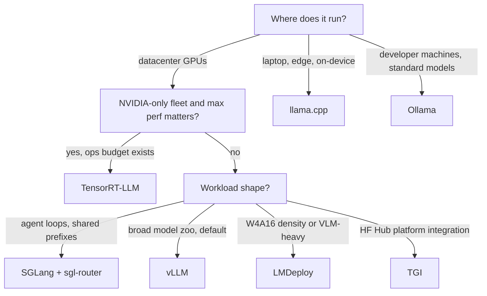

# Serving Engine Comparison

## Overview

Seven engines cover nearly every production LLM deployment: vLLM, SGLang, TensorRT-LLM, TGI, LMDeploy, llama.cpp, and Ollama. They share the same textbook optimizations (continuous batching, paged KV cache, prefix reuse) but differ in kernel strategy, hardware envelope, quantization depth, structured output, and — the underrated column — operational burden. This page is the decision matrix; the individual engines live in their own pages. Interviews ask this directly: "which serving engine would you pick and why" — and grade whether you ask about workload, hardware, and team size before answering.

## The Contenders in One Paragraph Each

- **vLLM** ([vLLM page](./vllm.md)) — the de facto default. PagedAttention, continuous batching, widest model coverage, the largest community, and an OpenAI-compatible server that everything else benchmarks against. Apache-2.0.
- **SGLang** ([docs.sglang.ai](https://docs.sglang.ai/)) — the throughput challenger. RadixAttention gives it the strongest prefix-cache story, its Rust scheduler is aggressively optimized, and sgl-router adds cache-aware load balancing across instances. Apache-2.0.
- **TensorRT-LLM** ([TensorRT-LLM page](./tensorrt.md)) — NVIDIA's compiled-engine stack: builds a per-model/per-GPU optimized engine (fusion, FP8/FP4, in-flight batching) for maximum single-fleet performance at the cost of build and ops complexity. Apache-2.0.
- **TGI** ([TGI page](./tgi.md)) — Hugging Face's server: Rust router + Python workers, tight Hub integration, the natural pick when your pipeline lives in the HF ecosystem. Apache-2.0.
- **LMDeploy** ([LMDeploy page](./lmdeploy.md)) — InternLM's toolkit: TurboMind persistent-kernel engine plus a PyTorch engine, best-in-class W4A16/AWQ density and VLM serving. Apache-2.0.
- **llama.cpp** ([llama.cpp/GGUF page](./llama-cpp-gguf.md)) — the CPU/edge reference: ggml + GGUF, every backend from AVX2 to Metal to CUDA, GBNF grammars, single MIT-licensed binary.
- **Ollama** ([Ollama page](./ollama.md)) — llama.cpp wrapped in a managed desktop runtime: model registry, Modelfile, one-command UX. For developer machines, not server fleets. MIT.

## Architecture Matrix

| Engine | Core language | Scheduler | KV cache | Kernel strategy | Parallelism |
|---|---|---|---|---|---|
| vLLM | Python + CUDA kernels | Python, iteration-level | Paged blocks (PagedAttention) | Hand-written CUDA + CUDA graphs | TP, PP, EP, experimental CPU/TPU |
| SGLang | Python + Rust router + CUDA | Rust router, overlapped Python sched | Radix tree over paged blocks | FlashInfer/CUDA kernels, zero-overhead scheduling | TP, PP, EP, DP-attention |
| TensorRT-LLM | C++ runtime, Python driver | C++ executor (in-flight batching) | Paged KV in built engine | Compiled engine: fused kernels per model×GPU | TP, PP, EP, Multi-node |
| TGI | Rust router + Python workers | Rust router, continuous batching | Paged (v2 rewrite) | FlashAttention, cust. kernels | Shard across GPUs |
| LMDeploy | C++/CUDA (TurboMind) + Python engine | Persistent C++ loop / Python | Paged, quantizable (INT8/4) | Fused weight-only-INT4 GEMMs | TP |
| llama.cpp | C/C++ (ggml) | C loop, slots + continuous batching | Simple contiguous per-slot cache | Hand-written SIMD/GPU kernels per backend | Layer split only (no true TP) |
| Ollama | Go wrapper over llama.cpp | llama.cpp's | llama.cpp's | llama.cpp's | llama.cpp's |

The architecture column that predicts most behavior is **where the scheduling loop runs**: engines that keep it in C++/Rust near the kernels (TurboMind, TensorRT-LLM, SGLang's router) win per-step overhead; Python-loop engines (vLLM) recover the gap with CUDA graphs and overlap but carry more interpreter jitter under bursty load.

## Feature Matrix

Status as of late 2025 — verify current docs before quoting in an interview; this space moves quarterly.

| Capability | vLLM | SGLang | TRT-LLM | TGI | LMDeploy | llama.cpp | Ollama |
|---|---|---|---|---|---|---|---|
| Continuous batching | ✅ | ✅ | ✅ | ✅ | ✅ | ✅ (slots) | ❌ |
| Paged KV cache | ✅ | ✅ | ✅ | ✅ | ✅ | ❌ | ❌ |
| Prefix caching | ✅ | ✅ (radix) | ✅ | ❌ | ✅ | partial (prompt cache) | ❌ |
| Chunked prefill | ✅ | ✅ | ✅ | ❌ | ❌ | ❌ | ❌ |
| Speculative decoding | ✅ (draft, n-gram, EAGLE, Medusa) | ✅ (EAGLE) | ✅ (draft, Medusa, EAGLE) | ✅ (n-gram, Medusa) | partial | ✅ (draft model) | ❌ |
| Weight quantization | GPTQ, AWQ, FP8, INT8, bitsandbytes | GPTQ, AWQ, FP8 | FP8, INT8, INT4-AWQ, FP4 (Blackwell) | GPTQ, AWQ, EETQ, bitsandbytes | AWQ W4A16 (native) | GGUF K/I-quants | GGUF via llama.cpp |
| KV cache quantization | FP8, INT8 | FP8 | FP8, INT8 | ❌ | INT8, INT4 | q8_0/q4_0 | q8_0/q4_0 |
| Structured output | ✅ (xgrammar, outlines, guidance) | ✅ (xgrammar) | partial | ✅ (grammar) | partial | ✅ (GBNF native) | ✅ (JSON schema) |
| Multimodal serving | ✅ broad VLM zoo | partial | partial | partial | ✅ strong (InternVL lineage) | ✅ (mmproj) | ✅ (vision models) |
| OpenAI-compatible API | ✅ | ✅ | ✅ (partial surface) | ✅ | ✅ (+gRPC) | ✅ | ✅ |
| True tensor parallelism | ✅ | ✅ | ✅ | ✅ | ✅ | ❌ (layer split) | ❌ |

Reading the matrix: **structured output** and **prefix caching** are the two columns that silently decide proofs-of-concept. An agent pipeline that needs guaranteed JSON and re-sends giant shared prompts is a different engine choice than a batch summarizer — the former eliminates TGI-for-grammar-only and Ollama immediately; the latter rewards SGLang's radix cache or vLLM + a cache-aware router ([Cache-Aware Routing](./cache-aware-routing.md)). Deep decoding-mechanics background: [Structured Output & Decoding](../advanced/structured-output-decoding.md).

## Hardware and Licensing

| Engine | NVIDIA | AMD | Apple/CPU | License | Ops burden |
|---|---|---|---|---|---|
| vLLM | ✅ primary | ✅ ROCm | experimental CPU | Apache-2.0 | Moderate: pip install, frequent releases, many knobs |
| SGLang | ✅ primary | ✅ | ❌ | Apache-2.0 | Moderate + router component |
| TensorRT-LLM | ✅ only | ❌ | ❌ | Apache-2.0 | High: engine builds per model×GPU, container workflow |
| TGI | ✅ | ✅ | limited | Apache-2.0 | Moderate: docker-first |
| LMDeploy | ✅ | limited | ❌ | Apache-2.0 | Moderate: pip install |
| llama.cpp | ✅ | ✅ Vulkan/ROCm | ✅ Metal + CPU | MIT | Low: one binary |
| Ollama | ✅ | ✅ | ✅ | MIT | Lowest: managed app |

Two licensing notes worth raising proactively: every engine here is permissive (Apache-2.0/MIT) — licensing almost never decides this choice, unlike model weights. And "ops burden" compounds: TensorRT-LLM's per-model engine builds mean every model upgrade or GPU generation change re-runs compilation and re-validation, which is a real team cost that raw throughput numbers don't show.

## Decision Flowchart

Worked through the common cases:

- **Startup serving Llama/Qwen-class models on rented A100/H100s**: vLLM. Ecosystem, docs, hiring pool; switch later only with measured evidence.
- **Agent platform with 8k-token shared system prompts and multi-turn sessions**: SGLang (radix cache + cache-aware router), or vLLM with `--enable-prefix-caching` behind an LMCache/routing layer — [Cache-Aware Routing](./cache-aware-routing.md).
- **Dedicated NVIDIA fleet, frozen model list, latency SLOs, staffed platform team**: TensorRT-LLM; the build complexity is amortizable at that scale.
- **Product is multimodal (InternVL/Qwen-VL) or lives and dies by W4A16 GPU density**: LMDeploy.
- **On-device, BYO hardware, offline, or embedded**: llama.cpp; Ollama if a managed developer runtime suffices.
- **Hugging Face Hub-centric platform (Inference Endpoints, Enterprise Hub)**: TGI.

## Benchmarking Before You Commit

All seven engines publish or imply superiority; none of those numbers transfer cleanly. The confounders: prompt/output length distribution (prefill-heavy vs decode-heavy), batch arrival pattern (closed-loop benchmark vs open-loop Poisson), quantization format, and concurrency level. A defensible process:

1. Fix the workload: real prompt traces, open-loop arrival, your SLOs (TTFT p50/p99, TPOT, goodput).
2. Use a harness that speaks OpenAI to any engine (vLLM's `benchmark_serving.py` works against all seven).
3. Compare at *matched goodput*, not matched batch size.
4. Re-test after each engine upgrade — kernel wins appear and disappear release to release.

Expect single-digit-to-1.5× deltas between the GPU engines on the same hardware; any claim above that should trigger suspicion about benchmark conditions.

## Scenario Matrix

The flowchart compresses to a lookup table for the workloads that come up most:

| Scenario | Engine pick | Deciding factor |
|---|---|---|
| Default open-model serving, 1-8 GPUs | vLLM | Ecosystem, coverage, hiring pool |
| Agent loops, huge shared system prompts | SGLang (+sgl-router) | RadixAttention + cache-aware placement |
| Frozen model list, latency SLO, staffed platform team | TensorRT-LLM | Compiled kernels, FP8/FP4, in-flight batching |
| HF Hub-native platform / Inference Endpoints | TGI | Hub integration, Rust router maturity |
| InternLM stack, VLM-heavy product, W4A16 density | LMDeploy | TurboMind AWQ kernels, InternVL lineage |
| On-device, offline, BYO-hardware, embedded | llama.cpp | GGUF + every backend, MIT, single binary |
| Developer laptops, demos, CI test doubles | Ollama | Zero-config model management |
| Massive fleet of cheap CPU boxes, small models | llama.cpp server | Horizontal scale of per-user latency wins |
| Structured-output-critical pipeline (guaranteed JSON) | vLLM / SGLang / llama.cpp | Native grammar-constrained decoding |

## Migration and Multi-Engine Reality

Real organizations run **more than one engine**, and the architecture should expect it:

- **The API boundary is the standardization point.** Every engine here speaks (a superset of) the OpenAI wire format, so placing a thin gateway in front lets you run llama.cpp for a small internal tool and vLLM for the flagship model behind one client library. The cost is losing engine-specific endpoints (vLLM's extra sampling params, llama.cpp slots, Ollama's Modelfile APIs) behind lowest-common-denominator schemas.
- **Migration triggers**: a VLM enters the roadmap (vLLM/LMDeploy), concurrency outgrows llama-server slots (vLLM/SGLang), an NVIDIA fleet consolidates and perf-per-dollar matters (TensorRT-LLM), or the model zoo churns faster than per-engine ports allow (consolidate on vLLM).
- **Model artifacts are not portable**: GGUF does not run on vLLM; a TurboMind store does not run on TGI; TensorRT-LLM engines are per-GPU-architecture. Keep the HF (or FP16 GGUF) checkpoint as the source of truth and treat engine artifacts as build outputs — this is the same discipline as container images built from source per platform.
- **Evaluation must be engine-independent**: decode order differs (batching, sampling implementations, template application), so hold out a fixed eval set and re-run it after any engine change; silent quality shifts from sampler differences are common and easy to miss.

## When to Build Your Own Engine

The default answer is **don't** — and having a reason ready is the interview point. Legitimate cases:

- **Novel hardware or exotic target**: no engine supports your DSP/NPU/ASIC, and the vendor SDK won't. Building on ggml (as llama.cpp did) is the proven path.
- **Cluster-scale architecture research**: if your contribution is the scheduler (Mooncake's KVCache-centric design, PD-disaggregation variants), you build the orchestration layer — but note these projects still reuse standard engines or kernels for the model execution itself.
- **Hard real-time or safety-embedded constraints**: a fixed static batch, no dynamic allocation, WCET-analyzable execution — none of the engines prioritize this.
- **You control an extreme, stable workload** where a 2× kernel win at one batch shape is worth a team: the "one model, one shape, one GPU" case that TensorRT-LLM's compiled-engine model already serves — so even here, build a *compiler pipeline*, not an engine.

The cost side is what people underestimate: PagedAttention, continuous batching, prefix caching, speculative decoding, structured output, and a new-model port treadmill are table stakes that took the open-source engines years and thousands of contributors. The standard play is fork-and-extend (most "custom engines" in production are vLLM/SGLang forks with a proprietary scheduler patch), not greenfield. If asked "would you build your own", the strong answer ends: "I'd first measure whether vLLM or SGLang with a custom router meets the SLO — the engine is commodity; the routing, capacity planning, and evaluation around it are where differentiation lives."

## Common Mistakes

- ❌ Choosing by peak throughput numbers — a 1.5× throughput win means nothing if the engine lacks the structured-output, prefix-caching, or multimodal feature your product needs.
- ❌ Treating engine choice as permanent — standardize on the OpenAI-compatible API and re-benchmark quarterly; the leaderboard moves release to release.
- ❌ Comparing engines at max batch size instead of matched goodput — closed-loop benchmarks at full batch reward engines that over-admit and blow p99.
- ❌ Ignoring ops burden in the decision — TensorRT-LLM's per-model×GPU engine builds and llama.cpp's zero-config binary are opposite cost structures that throughput charts never show.
- ❌ Porting GGUF files to GPU engines or vice versa — artifacts are engine-specific; keep the HF checkpoint as the source of truth and rebuild per engine.
- ❌ Running seven engines "to keep options open" — each is a dependency to upgrade, secure, and evaluate; pick one primary and one escape hatch.

## Interview Questions

1. **Pick an engine for each: a 3-person startup serving Qwen-32B on 2×A100; a bank's on-prem air-gapped deployment on CPU servers; an agent platform with 100M requests/day of shared-prompt traffic.** Startup: vLLM — one GPU node, continuous batching and AWQ/GPTQ support out of the box, no ops team to fight TensorRT-LLM builds. Bank on CPU: llama.cpp with GGUF Q4_K_M or Q8_0 — it is the only mature CPU path, single binary fits air-gapped constraints, GBNF covers structured output. Agent platform: SGLang — RadixAttention maximizes the shared-prefix reuse, and sgl-router provides cache-aware balancing across the fleet; pair with LMCache-style offload if the prefix set exceeds one GPU's cache. The pattern: match engine to constraint (ops capacity, hardware envelope, workload shape), not to benchmarks.

2. **vLLM and TensorRT-LLM both do paged KV and continuous batching — where does TensorRT-LLM's advantage actually come from?** From compilation: TRT-LLM builds a static engine per model×GPU that fuses kernel sequences (attention + layernorm + quant ops), selects tile configs offline, and uses FP8 tensor cores end-to-end, while vLLM discovers fusion at runtime from more general kernels plus CUDA graphs. The compiled approach eliminates launch and dispatch overheads and picks per-shape kernels — worth ~1.2-2× on fixed shapes. The cost is exactly that rigidity: new model or GPU generation means a rebuild, and dynamic workloads (wildly varying batch shapes) erode the advantage.

3. **Why is Ollama the wrong answer for production serving even though it's the most popular local tool?** Ollama wraps llama.cpp for single-user ergonomics: it inherits llama.cpp's simple (non-paged) KV cache, has no real continuous batching, no cross-request prefix cache, no metrics surface to speak of, and manages models one-at-a-time with a keep-alive lifecycle. Under multi-tenant load its throughput collapses versus paged engines. Its job is developer experience: `ollama pull`/`run`, Modelfile, OpenAI-compatible API on localhost. Production wants the same API surface from vLLM/SGLang/TGI with a scheduler that treats requests as a shared resource.

4. **What feature gaps most often force an engine switch mid-project?** Structured output and prefix caching, in that order of surprise. Teams discover late that guaranteed JSON needs xgrammar/outlines/GBNF-class masking, not prompt engineering — and engine support ranges from native (llama.cpp, SGLang, vLLM) to absent. Second, multimodal: adding a VLM to a text-only deployment sometimes means a different engine (LMDeploy, vLLM's VLM zoo) rather than a config change. Third, quantization: a capacity-driven move to W4A16 is trivial in LMDeploy/llama.cpp and more involved elsewhere. This is why the recommendation is to standardize on the OpenAI-compatible API and keep the engine swappable behind it.

5. **How do you run an honest engine bake-off?** Fix the workload first: replay real prompt traces with open-loop (Poisson) arrivals, measure TTFT p50/p99, TPOT, and goodput at target SLOs — not throughput at max batch. Use one harness speaking the OpenAI API so all candidates are measured identically (vLLM's `benchmark_serving.py` works against every engine here). Compare at matched goodput, include quantized and unquantized variants only if both are deployable, and pin versions — kernel-level wins move between releases. Finally, weigh ops cost in the result: a 10% throughput win does not pay for a per-model engine-build pipeline if you ship new models weekly.

6. **When is building your own serving engine justified?** Narrowly: unsupported hardware (build on ggml like llama.cpp did), scheduler-centric research at cluster scale (Mooncake built a KVCache-centric architecture but still executes models with standard machinery), hard real-time constraints with static execution, or an extreme stable workload where a compiled one-shape pipeline pays. Everything else should fork vLLM/SGLang and patch the scheduler — reimplementing PagedAttention-class memory management, continuous batching, speculative decoding, and the model-port treadmill costs engineer-years for capability the forks already have. The differentiating layers are routing, capacity planning, and evaluation, which sit *around* the engine.

## Key Takeaways

- The seven engines split along one axis first: where they run (datacenter GPU fleet → vLLM/SGLang/TRT-LLM/TGI/LMDeploy; laptop/edge → llama.cpp/Ollama).
- Second axis is workload shape: shared-prefix/agent traffic favors SGLang's radix cache and cache-aware routing; multimodal and W4A16 density favor LMDeploy; frozen-model max perf favors TensorRT-LLM; HF Hub integration favors TGI.
- The feature columns that silently force switches are structured output, prefix caching, and multimodal — check them before the throughput charts.
- All engines are Apache-2.0/MIT; licensing never decides this. Ops burden does: TRT-LLM's per-model engine builds are a standing team cost.
- Benchmark honestly: real traces, open-loop arrival, matched goodput, pinned versions — README numbers (including LMDeploy's up-to-1.8×-over-vLLM) are directional only.
- Build-your-own is justified for novel hardware, scheduler research, or hard real-time; otherwise fork-and-extend vLLM/SGLang — the engine is commodity, the surrounding platform is the differentiation.

## References

- vLLM docs and repository: [docs.vllm.ai/en/latest](https://docs.vllm.ai/en/latest/), [github.com/vllm-project/vllm](https://github.com/vllm-project/vllm)
- SGLang docs and repository: [docs.sglang.ai](https://docs.sglang.ai/), [github.com/sgl-project/sglang](https://github.com/sgl-project/sglang)
- TensorRT-LLM docs and repository: [nvidia.github.io/TensorRT-LLM](https://nvidia.github.io/TensorRT-LLM/), [github.com/NVIDIA/TensorRT-LLM](https://github.com/NVIDIA/TensorRT-LLM)
- LMDeploy repository: [github.com/InternLM/lmdeploy](https://github.com/InternLM/lmdeploy)
- llama.cpp repository: [github.com/ggml-org/llama.cpp](https://github.com/ggml-org/llama.cpp)
- Ollama docs and repository: [docs.ollama.com](https://docs.ollama.com/), [github.com/ollama/ollama](https://github.com/ollama/ollama)
- Kwon et al., "Efficient Memory Management for Large Language Model Serving with PagedAttention", SOSP 2023: [arxiv.org/abs/2309.06180](https://arxiv.org/abs/2309.06180)
- Zheng et al., "Efficiently Programming Large Language Models using SGLang", 2023: [arxiv.org/abs/2312.07104](https://arxiv.org/abs/2312.07104)
- R. Qin, Z. Li, W. He, et al., "Mooncake: A KVCache-centric Disaggregated Architecture for LLM Serving", FAST 2025: [arxiv.org/abs/2407.00079](https://arxiv.org/abs/2407.00079)

## Cross-References

- [vLLM →](./vllm.md) — the default engine, in depth
- [TensorRT-LLM →](./tensorrt.md) — NVIDIA's compiled-engine stack
- [TGI →](./tgi.md) — Hugging Face serving
- [LMDeploy →](./lmdeploy.md) — TurboMind, W4A16, VLM serving
- [llama.cpp and GGUF →](./llama-cpp-gguf.md) — CPU/edge inference and the GGUF format
- [Ollama →](./ollama.md) — managed local runtime over llama.cpp
- [Batching →](./batching.md) — continuous batching mechanics every engine implements
- [KV Cache →](./kv-cache.md) — paged vs simple KV memory management
- [LLM Serving Systems Overview →](./systems.md) — the serving stack above the engine layer
- [Speculative Decoding →](./speculative-decoding.md) — the draft/verify loop in the feature matrix
- [Structured Output & Decoding →](../advanced/structured-output-decoding.md) — constrained decoding internals
- [Cache-Aware Routing →](./cache-aware-routing.md) — fleet-level prefix reuse in front of any engine
