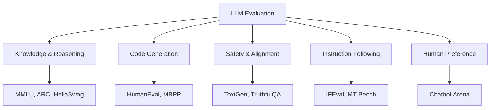
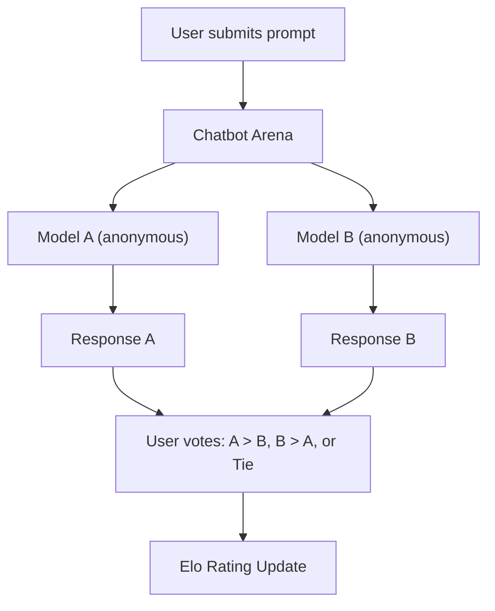
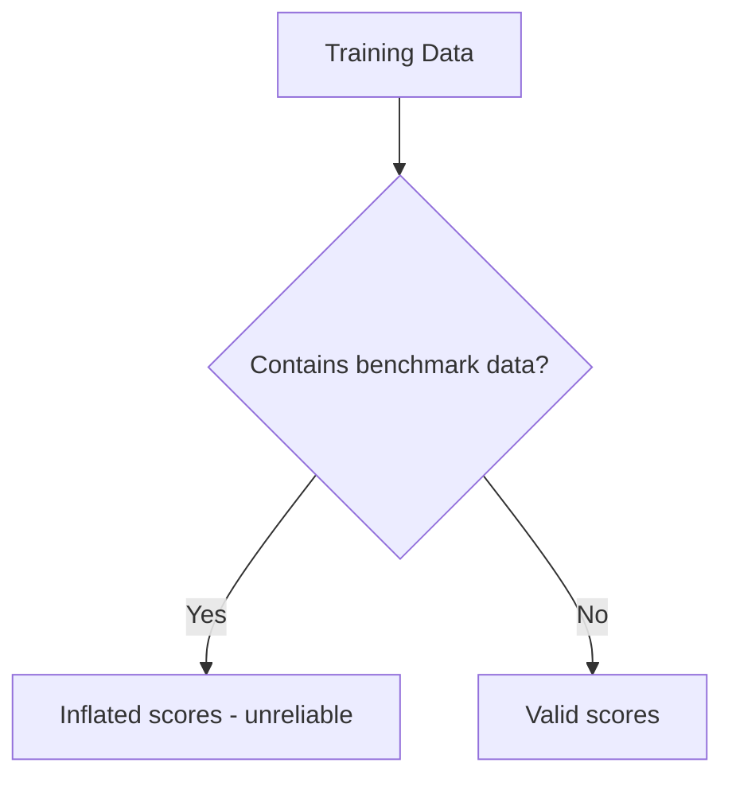

# LLM Evaluation

## Overview

LLM evaluation measures model quality across different capabilities: knowledge, reasoning, coding, safety, and instruction following. Since LLMs are general-purpose, evaluation requires diverse benchmarks. Understanding evaluation is essential for model selection, fine-tuning validation, and production monitoring.

## Evaluation Categories



## Major Benchmarks

### Knowledge & Reasoning

| Benchmark | Task | Size | What It Tests |
|---|---|---|---|
| **MMLU** | Multiple choice QA | 57 subjects | Broad knowledge |
| **MMLU-Pro** | Harder multiple choice | 14K questions | Deep reasoning |
| **ARC** | Science QA | 7.7K questions | Grade school science |
| **HellaSwag** | Sentence completion | 10K | Common sense |
| **WinoGrande** | Coreference resolution | 1.7K | Common sense reasoning |
| **TruthfulQA** | Truthfulness | 817 | Hallucination resistance |
| **GPQA** | Graduate-level QA | 448 | Expert knowledge |

### Code Generation

| Benchmark | Task | What It Tests |
|---|---|---|
| **HumanEval** | Python function completion | Code generation (164 problems) |
| **MBPP** | Python function from description | Code generation (974 problems) |
| **SWE-bench** | Real GitHub issues | Software engineering |
| **LiveCodeBench** | Competitive programming | Dynamic, contamination-resistant |

### Instruction Following

| Benchmark | Task | What It Tests |
|---|---|---|
| **MT-Bench** | Multi-turn conversation | Instruction following, quality |
| **IFEval** | Verifiable instructions | Format compliance |
| **AlpacaEval** | Head-to-head vs reference | General quality |
| **Arena-Hard** | Challenging prompts | Robust quality |

### Safety & Alignment

| Benchmark | Task | What It Tests |
|---|---|---|
| **ToxiGen** | Toxic text generation | Harmful content |
| **BBQ** | Bias benchmark | Social bias |
| **HarmBench** | Jailbreak resistance | Safety robustness |

## MMLU (Massive Multitask Language Understanding)

The most widely cited LLM benchmark. Tests knowledge across 57 subjects:

```
Question: What is the capital of France?
A) London  B) Berlin  C) Paris  D) Madrid
Answer: C
```

| Subject Area | Examples |
|---|---|
| STEM | Physics, Chemistry, Biology, Math |
| Humanities | History, Philosophy, Law |
| Social Sciences | Psychology, Economics, Geography |
| Other | Professional (medicine, accounting) |

**MMLU Scores (approximate):**
| Model | MMLU Score |
|---|---|
| GPT-4 | ~86% |
| Claude 3.5 Sonnet | ~88% |
| LLaMA-3 70B | ~82% |
| LLaMA-3 8B | ~66% |
| Random baseline | ~25% |

## HumanEval

Tests code generation by asking the model to complete Python functions:

```python
def has_close_elements(numbers: List[float], threshold: float) -> bool:
    """Check if in given list of numbers, are any two numbers closer 
    to each other than given threshold.
    >>> has_close_elements([1.0, 2.0, 3.0], 0.5)
    False
    >>> has_close_elements([1.0, 2.8, 3.0, 4.0, 5.0, 2.0], 0.3)
    True
    """
    # Model generates the implementation here
```

**pass@k**: Probability that at least one of k generated samples passes all tests.

| Model | pass@1 |
|---|---|
| GPT-4 | ~86% |
| Claude 3.5 Sonnet | ~92% |
| LLaMA-3 70B | ~62% |
| LLaMA-3 8B | ~38% |

## MT-Bench

Multi-turn conversation benchmark by LMSYS:

```
Turn 1: "Write a poem about the ocean."
Turn 2: "Now rewrite it in the style of Shakespeare."
```

Evaluated by GPT-4 on a 1-10 scale across categories: writing, roleplay, reasoning, math, coding, extraction, STEM, humanities.

## Chatbot Arena

The gold standard for LLM evaluation:



**Why it's the gold standard:**
- Real users, real prompts
- Blind comparison (users don't know which model)
- Elo rating system (like chess rankings)
- Hard to game (diverse prompts, human judges)

## Evaluation Methods

### Automated Metrics

| Metric | Use Case | Limitation |
|---|---|---|
| **Perplexity** | Language modeling quality | Doesn't measure usefulness |
| **BLEU** | Translation quality | Poor correlation with quality |
| **ROUGE** | Summarization | Only measures overlap |
| **pass@k** | Code generation | Only tests correctness |
| **Exact match** | QA, extraction | Too strict for generative tasks |

### LLM-as-Judge

Use a strong LLM (GPT-4) to evaluate weaker models:

```python
prompt = """
Rate the following response on a scale of 1-10:

Question: {question}
Response: {response}

Criteria: helpfulness, accuracy, depth, clarity.
"""
```

**Pros:** Scalable, can evaluate open-ended responses
**Cons:** May have biases (prefer verbosity, certain styles), not perfect

### Human Evaluation

Gold standard but expensive:
- **Side-by-side**: Compare two model outputs
- **Likert scale**: Rate individual outputs (1-5)
- **A/B testing**: Production comparison with real users

## Contamination

A critical issue in LLM evaluation:

**Data contamination** occurs when benchmark test data appears in the model's training data, inflating scores.



**Mitigations:**
- Dynamic benchmarks (LiveCodeBench, fresh problems)
- Canary strings (detect if models memorize test data)
- Hold-out test sets (never published)
- Decontamination checks (n-gram overlap detection)

## Interview Questions

### Q1: How would you evaluate an LLM for production use?
**Answer:** A comprehensive evaluation includes:
1. **Task-specific benchmarks**: MMLU (knowledge), HumanEval (code), MT-Bench (conversation)
2. **Safety evaluation**: TruthfulQA, bias benchmarks, jailbreak resistance
3. **Human evaluation**: Side-by-side comparison with current model on real use cases
4. **Production metrics**: Latency, throughput, cost, user satisfaction
5. **Domain-specific tests**: Custom test set for your specific use case
6. **Edge cases**: Adversarial inputs, out-of-distribution queries

### Q2: What is the problem with MMLU and how do you address it?
**Answer:** MMLU has several problems:
- **Contamination**: Widely published, likely in training data
- **Multiple choice**: Doesn't test generation quality
- **Static**: Doesn't evolve with model capabilities
- **Saturation**: Top models score 85%+, discriminating power is low

Address with: MMLU-Pro (harder), dynamic benchmarks, human evaluation, and Arena-style comparisons.

### Q3: What is pass@k and how is it calculated?
**Answer:** pass@k measures code generation quality. For a problem, generate k samples and check how many pass all unit tests:
```
pass@k = E[1 - C(n-c, k) / C(n, k)]
```
where n = total samples, c = correct samples, k = samples drawn. This gives the probability that at least one of k samples is correct. pass@1 is the most practical (one attempt), pass@10 shows the model's best-case capability.

### Q4: Why is Chatbot Arena considered the gold standard?
**Answer:** Arena is the gold standard because:
- **Real users**: Diverse, real-world prompts (not synthetic benchmarks)
- **Blind comparison**: Users don't know which model they're evaluating
- **Statistical rigor**: Elo rating system with many comparisons
- **Hard to game**: Can't train specifically for Arena (prompts are diverse)
- **Continuous**: New evaluations constantly update rankings
- **Correlated with real preference**: Arena rankings match production user preferences

## Common Mistakes

- ❌ Relying on a single benchmark (MMLU alone doesn't tell the full story)
- ❌ Not checking for data contamination (inflated scores)
- ❌ Ignoring safety evaluation in favor of capability benchmarks
- ❌ Comparing models on different evaluation setups (different prompts, sampling)
- ❌ Over-relying on automated metrics (BLEU/ROUGE correlate poorly with quality)

## Summary

LLM evaluation requires multiple benchmarks covering knowledge (MMLU), code (HumanEval), conversation (MT-Bench), safety (TruthfulQA), and human preference (Arena). No single benchmark is sufficient. Data contamination is a major concern. Production evaluation should combine automated benchmarks with human evaluation and real-user metrics.

## Cross-References

- [RAG →](rag.md) RAG-specific evaluation
- [RLHF →](rlhf.md) Alignment evaluation
- [Agent Evaluation →](../agents/evaluation.md) Agent-specific metrics
- [Monitoring →](../mlops/monitoring.md) Production model monitoring
