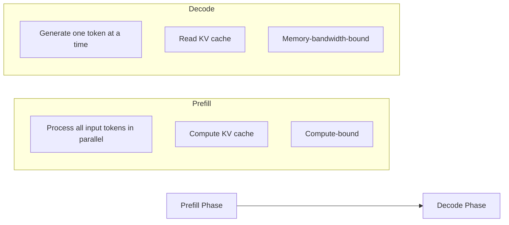
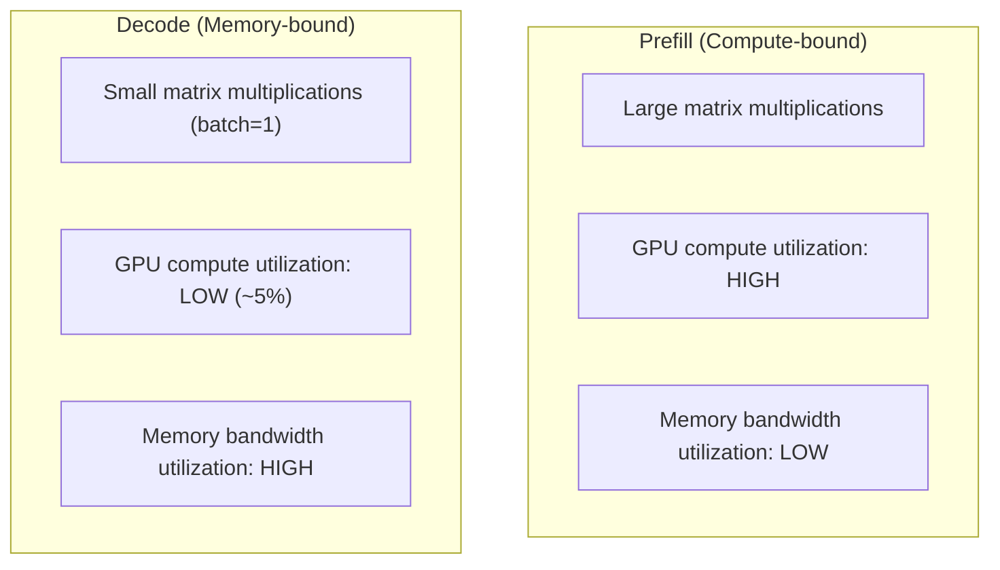
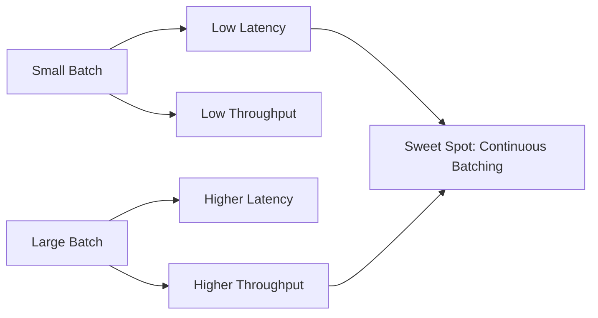
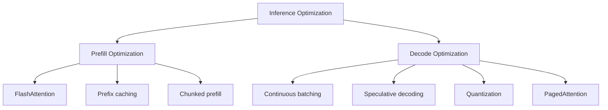
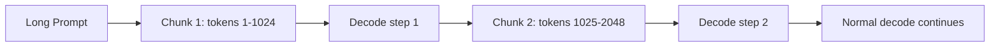
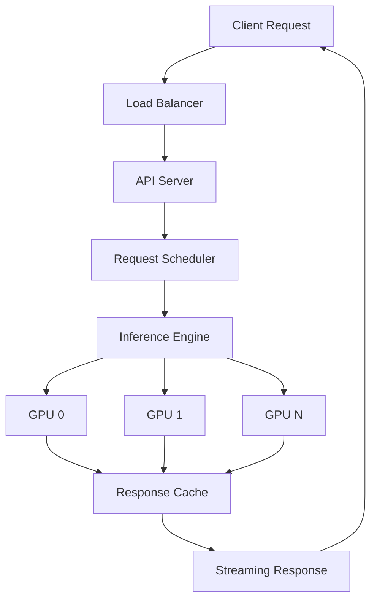
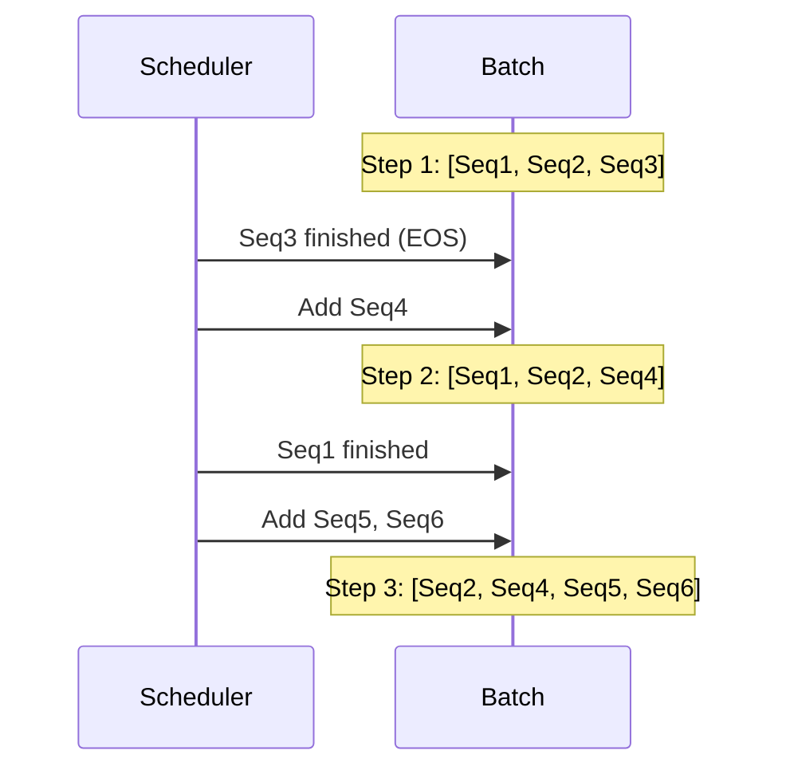

# LLM Inference Overview

## Overview

LLM inference is the process of generating text from a trained model. Unlike training (which happens once), inference happens millions of times in production. Understanding inference is critical because it determines **latency** (how fast users get responses), **throughput** (how many users can be served), and **cost** (GPU expenses).

## Inference Phases



### Prefill Phase

- Processes **all input tokens** simultaneously (parallel)
- Computes the KV cache for all layers
- **Compute-bound**: Matrix multiplications dominate
- Latency depends on prompt length (longer prompt = longer prefill)
- TTFT (Time to First Token) ≈ prefill time

### Decode Phase

- Generates **one token per step** (autoregressive)
- Reads the entire KV cache at each step
- **Memory-bandwidth-bound**: Reading KV cache dominates
- Latency depends on output length and KV cache size
- Inter-token latency ≈ decode time per token

## The Inference Bottleneck



**Key insight**: During decode with batch_size=1, the GPU is mostly reading memory, not computing. This is why batching is so important — it amortizes the memory reads across many sequences.

## Autoregressive Generation

```python
# Simplified inference loop
def generate(model, prompt_tokens, max_new_tokens):
    # Prefill: process entire prompt
    logits, kv_cache = model.forward(prompt_tokens)
    next_token = sample(logits[:, -1, :])
    
    tokens = [next_token]
    for _ in range(max_new_tokens):
        # Decode: process one token, using cached KV
        logits, kv_cache = model.forward(next_token, kv_cache=kv_cache)
        next_token = sample(logits[:, -1, :])
        
        if next_token == EOS_TOKEN:
            break
        tokens.append(next_token)
    
    return tokens
```

### Decoding Strategies

| Strategy | How It Works | Output Quality | Diversity |
|---|---|---|---|
| **Greedy** | Always pick highest probability | Deterministic, often repetitive | None |
| **Top-k** | Sample from top k tokens | Good | Moderate |
| **Top-p (nucleus)** | Sample from smallest set with cumulative prob ≥ p | Best | Good |
| **Temperature** | Scale logits by T before softmax | Varies | T>1: more diverse, T<1: more focused |
| **Beam search** | Track top-b candidates | High quality | Low |

### Temperature

```
P(token_i) = exp(logit_i / T) / Σ exp(logit_j / T)
```

- T = 1.0: Standard (model's learned distribution)
- T < 1.0: More confident, less diverse (good for factual Q&A)
- T > 1.0: More random, more diverse (good for creative writing)
- T → 0: Equivalent to greedy

## Key Performance Metrics

| Metric | Definition | Target |
|---|---|---|
| **TTFT** | Time to first token (prefill latency) | < 500ms |
| **TPOT** | Time per output token (decode latency) | < 50ms |
| **Throughput** | Tokens generated per second (total) | Maximize |
| **Requests/sec** | Concurrent requests served | Maximize |
| **VRAM usage** | GPU memory consumed | Minimize |
| **Cost per token** | GPU cost / tokens generated | Minimize |

### The Latency-Throughput Trade-off



## Memory Usage During Inference

### Components

| Component | Size | Notes |
|---|---|---|
| **Model weights** | Parameters × bytes_per_param | 7B @ FP16 = 14 GB |
| **KV cache** | O(batch × layers × seq_len × d × 2) | Dominates for long sequences |
| **Activations** | Small during inference | Larger during prefill |
| **Overhead** | CUDA kernels, fragmentation | ~10-20% |

### KV Cache Memory Formula

```
KV_cache = 2 × num_layers × num_kv_heads × head_dim × seq_len × batch_size × bytes_per_param
```

For LLaMA-7B (32 layers, 32 heads, 128 dim, FP16):
- Per token: 2 × 32 × 32 × 128 × 2 bytes = 524,288 bytes ≈ 0.5 MB
- 4K context: 0.5 MB × 4096 = 2 GB per sequence
- 32K context: 16 GB per sequence!

This is why KV cache optimization is critical — see [KV Cache →](kv-cache.md).

## Prefill vs Decode Optimization



| Optimization | Targets | Speedup |
|---|---|---|
| **FlashAttention** | Prefill | 2-4× |
| **Continuous batching** | Throughput | 5-20× |
| **Quantization** | Memory, decode speed | 1.5-3× |
| **Speculative decoding** | Decode latency | 2-3× |
| **PagedAttention** | Memory efficiency | 2-4× more concurrent requests |
| **Prefix caching** | Repeated prompts | 5-10× for shared prefixes |

## Detailed Memory Analysis

### Prefill Memory Breakdown

During prefill, the model processes all input tokens in parallel:

```
Memory_prefill = Model_weights + KV_cache_partial + Activations + Attention_matrix
```

| Component | Size | Notes |
|---|---|---|
| Model weights | P × bytes | Static, loaded once |
| KV cache (partial) | Growing with tokens | Allocated per-layer as tokens processed |
| Activations | batch × seq_len × d × layers | Peak during attention computation |
| Attention matrix | batch × heads × seq_len² | O(n²) — the bottleneck for long prompts |

**FlashAttention eliminates the attention matrix** from HBM, reducing peak memory from O(n²) to O(n).

### Decode Memory Breakdown

During decode, only one token is processed at a time:

```
Memory_decode = Model_weights + Full_KV_cache + Tiny_activations
```

| Component | Size | Notes |
|---|---|---|
| Model weights | P × bytes | Same as prefill |
| KV cache (full) | 2 × L × H_kv × d_head × total_seq_len × batch × bytes | Dominant component |
| Activations | batch × 1 × d × layers | Negligible |

**Key insight**: During decode, KV cache typically exceeds model weights in memory consumption for long sequences or large batches.

### Practical GPU Memory Planning

For LLaMA-3-8B (8B params, 32 layers, 8 KV heads, 128 head dim, GQA):

```
Weights (FP16):    8B × 2 bytes = 16 GB
Weights (INT8):    8B × 1 byte  = 8 GB
Weights (INT4):    8B × 0.5 bytes = 4 GB

KV cache per token (FP16): 2 × 32 × 8 × 128 × 2 = 131,072 bytes = 128 KB
KV cache per token (INT8): 64 KB

4K context, batch=1:   128 KB × 4096 = 512 MB
32K context, batch=1:  128 KB × 32768 = 4 GB
128K context, batch=1: 128 KB × 131072 = 16 GB

4K context, batch=32:  512 MB × 32 = 16 GB
```

**A100 80GB budget (FP16 weights):**
```
80 GB total - 16 GB weights = 64 GB for KV cache
64 GB / 128 KB per token = 512K tokens total across all batches
Batch of 32 × 4K context = 128K tokens → fits easily
Batch of 32 × 32K context = 1M tokens → doesn't fit!
```

This is why PagedAttention, KV cache quantization, and GQA are essential for production serving.

## Speculative Decoding

Speculative decoding accelerates autoregressive generation by using a smaller "draft" model to generate candidate tokens, then verifying them in parallel with the target model:


**How it works:**
1. Draft model (e.g., 1B) generates K tokens autoregressively (fast)
2. Target model (e.g., 70B) verifies all K tokens in one forward pass (parallel)
3. Accept the longest correct prefix, reject from first mismatch
4. Repeat

**Key insight**: Verification is as cheap as generating one token (same matrix multiplications), but we check K tokens at once.

| Metric | Without Speculative | With Speculative (K=5) |
|---|---|---|
| Tokens per step | 1 | ~3-4 (depends on acceptance rate) |
| Latency per token | 1× | ~0.3-0.4× |
| Compute cost | 1× | ~1.2× (draft model overhead) |

**Acceptance rate** depends on how well the draft model approximates the target. For tasks with predictable output (code, structured data), acceptance is high (~80-90%). For creative text, it's lower (~50-70%).

**Variants:**
- **Medusa**: Adds multiple prediction heads to the target model (no separate draft model)
- **EAGLE**: Uses feature-level drafting for higher acceptance rates
- **Self-speculative**: Uses early exit from the target model as the draft

## Chunked Prefill

For very long prompts, chunked prefill splits the input into chunks processed across multiple decode steps:



**Benefits:**
- Prevents long prefill from blocking other requests
- Interleaves prefill with decode for other sequences
- Reduces TTFT variance in batched serving

Used by Sarathi-Serve (2024) and integrated into vLLM.

## Production Serving Architecture



### Continuous Batching (Iteration-Level Scheduling)

Traditional batching waits for all sequences to finish before starting new ones. Continuous batching adds/removes sequences at every decode step:



**Impact**: 5-20× throughput improvement over static batching because GPUs are never idle waiting for the longest sequence.

## Interview Questions

### Q1: Why is LLM inference memory-bandwidth bound?
**Answer:** During the decode phase, the model generates one token at a time. Each step requires reading the entire model weights and KV cache, but only performs a small amount of computation (one token's worth). The arithmetic intensity (FLOPs / bytes read) is very low — typically <1. Modern GPUs can compute 300+ TFLOPS but only read 1-3 TB/s from memory. When the roofline model shows we're below the compute-memory boundary, we're memory-bandwidth bound.

### Q2: What is the difference between prefill and decode phases?
**Answer:**
- **Prefill**: Processes all input tokens in parallel. It's compute-bound (large matrix multiplications). Latency depends on prompt length. This is when the KV cache is initially computed.
- **Decode**: Generates one token at a time autoregressively. It's memory-bandwidth bound (reading KV cache dominates). Latency per token is roughly constant. This is where most of the user-perceived latency occurs.

Optimizing these phases requires different techniques: FlashAttention for prefill, continuous batching and quantization for decode.

### Q3: How does temperature affect LLM output?
**Answer:** Temperature T scales the logits before softmax: P(token) = exp(logit/T) / Σexp(logit_j/T).
- T=1: Original distribution (standard behavior)
- T<1: Sharper distribution, more confident, less diverse, good for factual tasks
- T>1: Flatter distribution, more random, more diverse, good for creative tasks
- T→0: Approaches greedy decoding (always pick highest probability)

### Q4: What is TTFT vs TPOT and which matters more?
**Answer:**
- **TTFT (Time to First Token)**: Prefill latency. Users wait for this before seeing any output. Important for perceived responsiveness.
- **TPOT (Time Per Output Token)**: Decode latency per token. Determines how fast the response "streams." Important for reading experience.

For chat applications, both matter. TTFT should be <500ms, TPOT should be <50ms (faster than reading speed). For batch processing, throughput matters more than individual latency.

## Common Mistakes

- ❌ Forgetting that decode is memory-bandwidth bound (adding compute doesn't help)
- ❌ Ignoring KV cache memory (it dominates for long sequences)
- ❌ Not batching requests (massive GPU underutilization)
- ❌ Using FP32 for inference (FP16/BF16 is sufficient and 2× faster)
- ❌ Measuring only throughput without considering latency

## Summary

LLM inference has two phases: compute-bound prefill and memory-bound decode. The key metrics are TTFT, TPOT, throughput, and cost. Optimization strategies target different phases: FlashAttention for prefill, continuous batching and quantization for decode. Speculative decoding accelerates decode by 2-3× using a draft model. PagedAttention and chunked prefill enable efficient long-context serving. Understanding the memory-bandwidth bottleneck and KV cache memory math is essential for capacity planning and efficient serving.

## References

1. Kwon et al., "Efficient Memory Management for Large Language Model Serving with PagedAttention" (vLLM), SOSP 2023
2. Leviathan et al., "Fast Inference from Transformers via Speculative Decoding", ICML 2023
3. Chen et al., "Accelerating Large Language Model Decoding with Speculative Sampling", 2023
4. Cai et al., "Medusa: Simple LLM Inference Acceleration Framework with Multiple Decoding Heads", 2024
5. Agrawal et al., "Sarathi-Serve: Efficient Chunked-Prefill-based LLM Inference", 2024
6. Dao, "FlashAttention-2: Faster Attention with Better Parallelism and Work Partitioning", 2023
7. Yu et al., "EAGLE: Speculative Sampling Requires Rethinking Feature Uncertainty", 2024

## Cross-References

- [KV Cache →](kv-cache.md) Memory management during inference
- [Quantization →](quantization.md) Reducing memory and improving speed
- [Speculative Decoding →](speculative-decoding.md) Faster decode
- [Batching →](batching.md) Throughput optimization
- [vLLM →](vllm.md) Production inference engine
- [Architecture →](architecture.md) Model architecture details
- [Cloud GPU](../cloud/virtualization/README.md)
