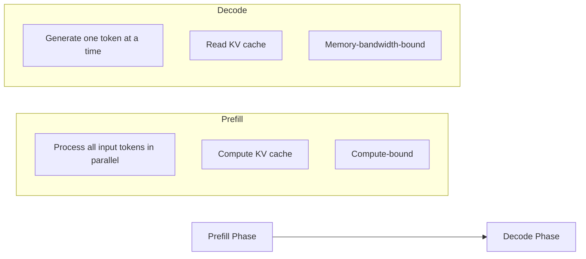
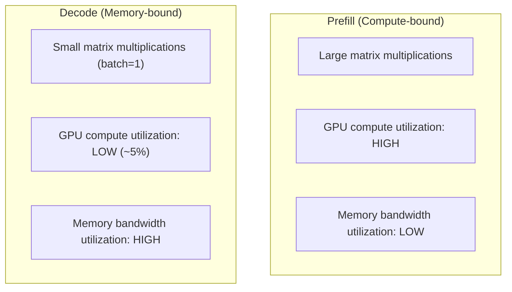
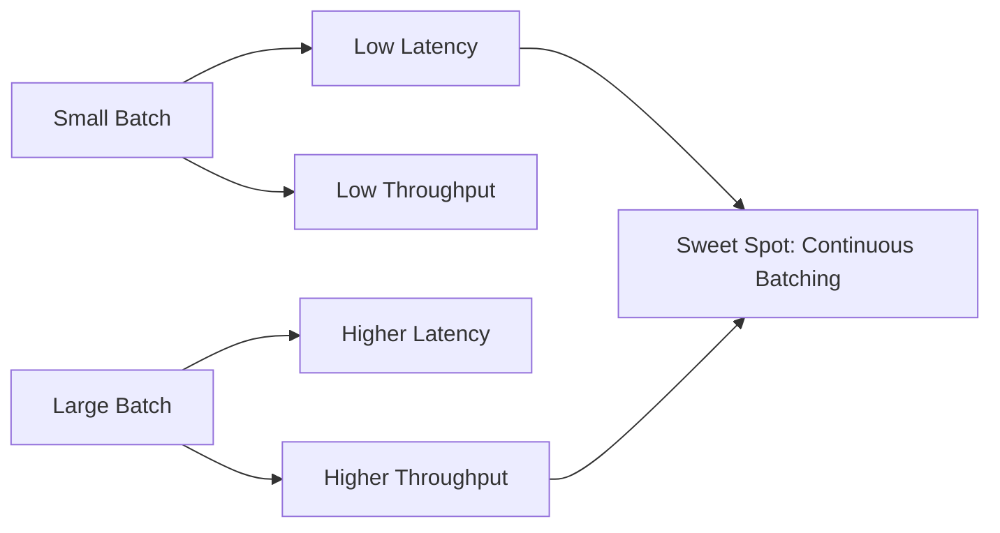
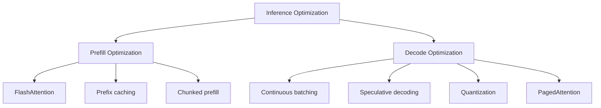

# LLM Inference Overview

## Overview

LLM inference is the process of generating text from a trained model. Unlike training (which happens once), inference happens millions of times in production. Understanding inference is critical because it determines **latency** (how fast users get responses), **throughput** (how many users can be served), and **cost** (GPU expenses).

## Inference Phases



### Prefill Phase

- Processes **all input tokens** simultaneously (parallel)
- Computes the KV cache for all layers
- **Compute-bound**: Matrix multiplications dominate
- Latency depends on prompt length (longer prompt = longer prefill)
- TTFT (Time to First Token) ≈ prefill time

### Decode Phase

- Generates **one token per step** (autoregressive)
- Reads the entire KV cache at each step
- **Memory-bandwidth-bound**: Reading KV cache dominates
- Latency depends on output length and KV cache size
- Inter-token latency ≈ decode time per token

## The Inference Bottleneck



**Key insight**: During decode with batch_size=1, the GPU is mostly reading memory, not computing. This is why batching is so important — it amortizes the memory reads across many sequences.

## Autoregressive Generation

```python
# Simplified inference loop
def generate(model, prompt_tokens, max_new_tokens):
    # Prefill: process entire prompt
    logits, kv_cache = model.forward(prompt_tokens)
    next_token = sample(logits[:, -1, :])
    
    tokens = [next_token]
    for _ in range(max_new_tokens):
        # Decode: process one token, using cached KV
        logits, kv_cache = model.forward(next_token, kv_cache=kv_cache)
        next_token = sample(logits[:, -1, :])
        
        if next_token == EOS_TOKEN:
            break
        tokens.append(next_token)
    
    return tokens
```

### Decoding Strategies

| Strategy | How It Works | Output Quality | Diversity |
|---|---|---|---|
| **Greedy** | Always pick highest probability | Deterministic, often repetitive | None |
| **Top-k** | Sample from top k tokens | Good | Moderate |
| **Top-p (nucleus)** | Sample from smallest set with cumulative prob ≥ p | Best | Good |
| **Temperature** | Scale logits by T before softmax | Varies | T>1: more diverse, T<1: more focused |
| **Beam search** | Track top-b candidates | High quality | Low |

### Temperature

```
P(token_i) = exp(logit_i / T) / Σ exp(logit_j / T)
```

- T = 1.0: Standard (model's learned distribution)
- T < 1.0: More confident, less diverse (good for factual Q&A)
- T > 1.0: More random, more diverse (good for creative writing)
- T → 0: Equivalent to greedy

## Key Performance Metrics

| Metric | Definition | Target |
|---|---|---|
| **TTFT** | Time to first token (prefill latency) | < 500ms |
| **TPOT** | Time per output token (decode latency) | < 50ms |
| **Throughput** | Tokens generated per second (total) | Maximize |
| **Requests/sec** | Concurrent requests served | Maximize |
| **VRAM usage** | GPU memory consumed | Minimize |
| **Cost per token** | GPU cost / tokens generated | Minimize |

### The Latency-Throughput Trade-off



## Memory Usage During Inference

### Components

| Component | Size | Notes |
|---|---|---|
| **Model weights** | Parameters × bytes_per_param | 7B @ FP16 = 14 GB |
| **KV cache** | O(batch × layers × seq_len × d × 2) | Dominates for long sequences |
| **Activations** | Small during inference | Larger during prefill |
| **Overhead** | CUDA kernels, fragmentation | ~10-20% |

### KV Cache Memory Formula

```
KV_cache = 2 × num_layers × num_kv_heads × head_dim × seq_len × batch_size × bytes_per_param
```

For LLaMA-7B (32 layers, 32 heads, 128 dim, FP16):
- Per token: 2 × 32 × 32 × 128 × 2 bytes = 524,288 bytes ≈ 0.5 MB
- 4K context: 0.5 MB × 4096 = 2 GB per sequence
- 32K context: 16 GB per sequence!

This is why KV cache optimization is critical — see [KV Cache →](kv-cache.md).

## Prefill vs Decode Optimization



| Optimization | Targets | Speedup |
|---|---|---|
| **FlashAttention** | Prefill | 2-4× |
| **Continuous batching** | Throughput | 5-20× |
| **Quantization** | Memory, decode speed | 1.5-3× |
| **Speculative decoding** | Decode latency | 2-3× |
| **PagedAttention** | Memory efficiency | 2-4× more concurrent requests |
| **Prefix caching** | Repeated prompts | 5-10× for shared prefixes |

## Interview Questions

### Q1: Why is LLM inference memory-bandwidth bound?
**Answer:** During the decode phase, the model generates one token at a time. Each step requires reading the entire model weights and KV cache, but only performs a small amount of computation (one token's worth). The arithmetic intensity (FLOPs / bytes read) is very low — typically <1. Modern GPUs can compute 300+ TFLOPS but only read 1-3 TB/s from memory. When the roofline model shows we're below the compute-memory boundary, we're memory-bandwidth bound.

### Q2: What is the difference between prefill and decode phases?
**Answer:**
- **Prefill**: Processes all input tokens in parallel. It's compute-bound (large matrix multiplications). Latency depends on prompt length. This is when the KV cache is initially computed.
- **Decode**: Generates one token at a time autoregressively. It's memory-bandwidth bound (reading KV cache dominates). Latency per token is roughly constant. This is where most of the user-perceived latency occurs.

Optimizing these phases requires different techniques: FlashAttention for prefill, continuous batching and quantization for decode.

### Q3: How does temperature affect LLM output?
**Answer:** Temperature T scales the logits before softmax: P(token) = exp(logit/T) / Σexp(logit_j/T).
- T=1: Original distribution (standard behavior)
- T<1: Sharper distribution, more confident, less diverse, good for factual tasks
- T>1: Flatter distribution, more random, more diverse, good for creative tasks
- T→0: Approaches greedy decoding (always pick highest probability)

### Q4: What is TTFT vs TPOT and which matters more?
**Answer:**
- **TTFT (Time to First Token)**: Prefill latency. Users wait for this before seeing any output. Important for perceived responsiveness.
- **TPOT (Time Per Output Token)**: Decode latency per token. Determines how fast the response "streams." Important for reading experience.

For chat applications, both matter. TTFT should be <500ms, TPOT should be <50ms (faster than reading speed). For batch processing, throughput matters more than individual latency.

## Common Mistakes

- ❌ Forgetting that decode is memory-bandwidth bound (adding compute doesn't help)
- ❌ Ignoring KV cache memory (it dominates for long sequences)
- ❌ Not batching requests (massive GPU underutilization)
- ❌ Using FP32 for inference (FP16/BF16 is sufficient and 2× faster)
- ❌ Measuring only throughput without considering latency

## Summary

LLM inference has two phases: compute-bound prefill and memory-bound decode. The key metrics are TTFT, TPOT, throughput, and cost. Optimization strategies target different phases: FlashAttention for prefill, continuous batching and quantization for decode. Understanding the memory-bandwidth bottleneck is essential for efficient serving.

## Cross-References

- [KV Cache →](kv-cache.md) Memory management during inference
- [Quantization →](quantization.md) Reducing memory and improving speed
- [Speculative Decoding →](speculative-decoding.md) Faster decode
- [Batching →](batching.md) Throughput optimization
- [vLLM →](vllm.md) Production inference engine
- [Batching](./batching.md)
- [KV Cache](./kv-cache.md)
- [Quantization](./quantization.md)
- [Cloud GPU](../cloud/virtualization/README.md)

