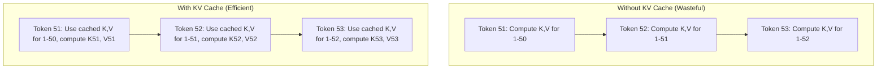
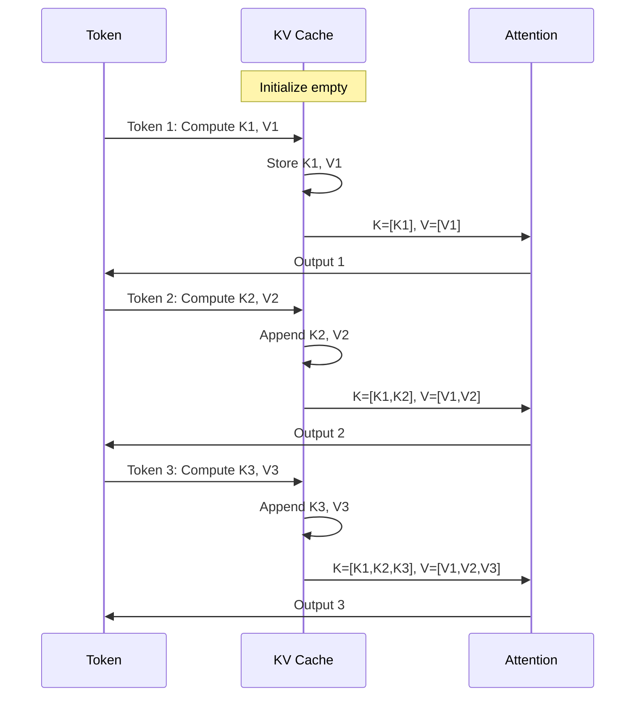
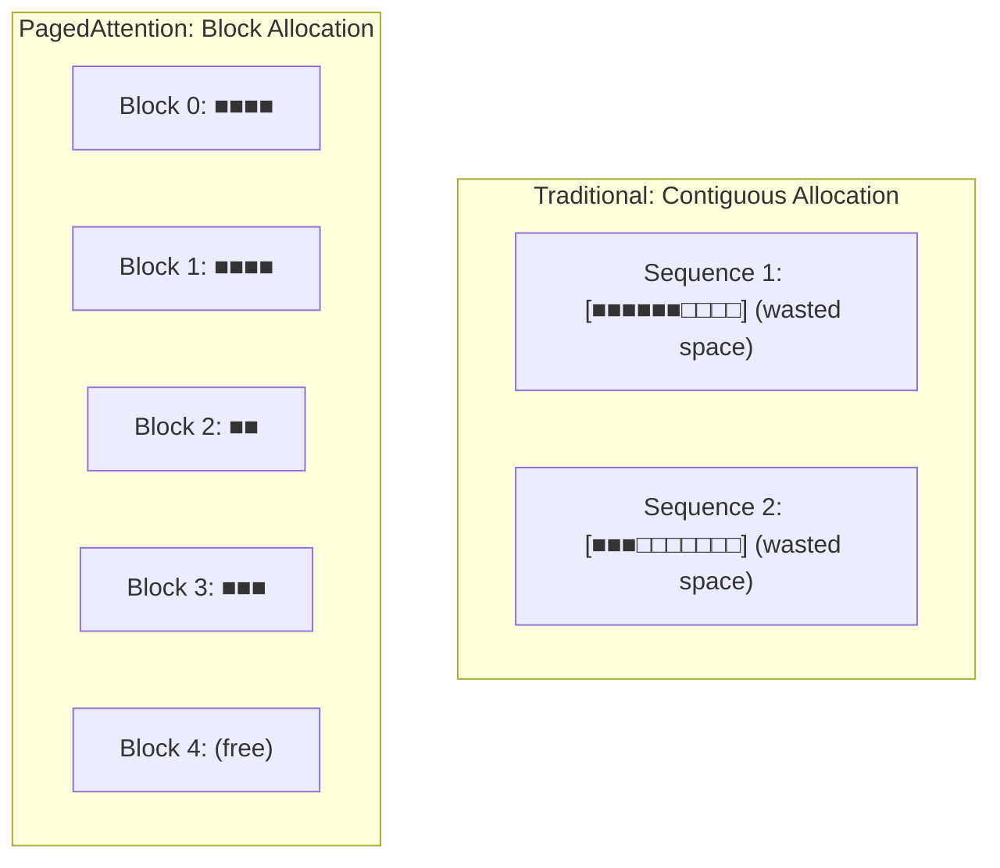
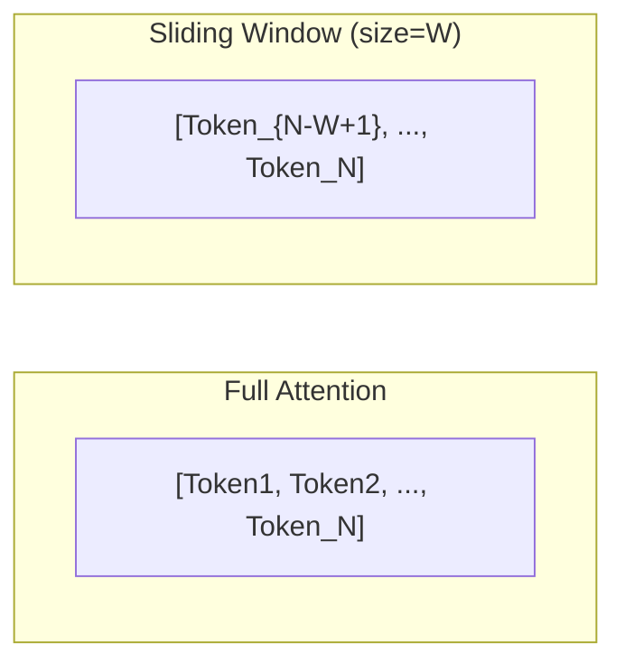
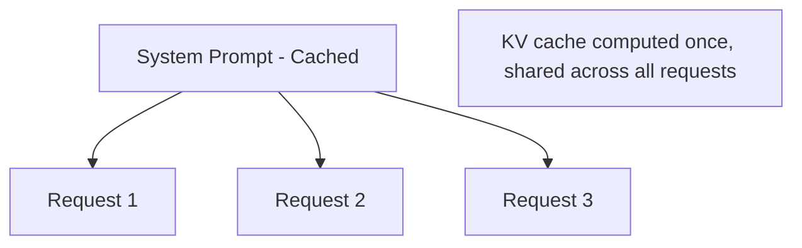
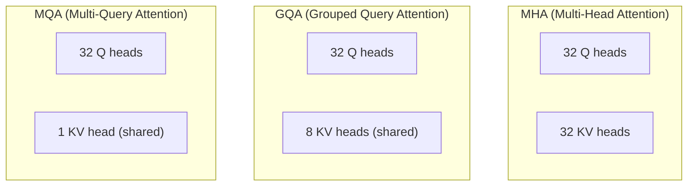

# KV Cache

## Overview

The KV (Key-Value) cache stores intermediate attention computations during autoregressive generation. Without it, each new token would require recomputing attention over all previous tokens — making generation O(n²) per token. With KV cache, each token only needs to attend to cached previous states, making generation O(n) per token.

KV cache is the **single largest memory consumer** during LLM inference and a favorite interview topic.

## Why KV Cache Exists

### The Attention Computation Problem

During autoregressive generation, to generate token t+1, we need:
```
Attention(Q_{t+1}, K_{1:t}, V_{1:t})
```

Without caching, generating a 100-token response from a 50-token prompt would:
- Token 51: Compute K,V for tokens 1-50 (redundant!)
- Token 52: Compute K,V for tokens 1-51 (redundant!)
- ...
- Token 150: Compute K,V for tokens 1-149 (redundant!)



### KV Cache Workflow



## KV Cache Memory Calculation

### Formula

```
KV_cache_bytes = 2 × num_layers × num_kv_heads × head_dim × seq_len × batch_size × bytes_per_element
```

Where:
- **2**: Both K and V
- **num_layers**: Transformer layers (e.g., 32 for LLaMA-7B)
- **num_kv_heads**: KV heads (may be fewer than Q heads with GQA)
- **head_dim**: Dimension per head (e.g., 128)
- **seq_len**: Total sequence length (prompt + generation)
- **batch_size**: Number of concurrent sequences
- **bytes_per_element**: 2 for FP16, 1 for INT8

### Examples

| Model | Layers | KV Heads | Head Dim | KV per token | 4K context | 32K context |
|---|---|---|---|---|---|---|
| LLaMA-7B | 32 | 32 | 128 | 0.5 MB | 2 GB | 16 GB |
| LLaMA-13B | 40 | 40 | 128 | 0.8 MB | 3.2 GB | 25.6 GB |
| LLaMA-70B | 80 | 8 | 128 | 0.1 MB | 0.4 GB | 3.2 GB |
| Mixtral-8x7B | 32 | 8 | 128 | 0.1 MB | 0.4 GB | 3.2 GB |

**Key observation**: GQA (fewer KV heads) dramatically reduces KV cache memory. LLaMA-70B uses GQA with 8 KV heads instead of 64, reducing KV cache by 8×.

### Per-Batch KV Cache

With batch_size=B, total KV cache = B × per_sequence_KV_cache.

For LLaMA-7B at 4K context, batch_size=32:
```
32 × 2 GB = 64 GB — exceeds most GPUs!
```

This is why KV cache optimization is critical.

## KV Cache Optimization Techniques

### 1. GQA (Grouped Query Attention)

Fewer KV heads = smaller cache:

| Architecture | Q Heads | KV Heads | Cache Reduction |
|---|---|---|---|
| MHA | 32 | 32 | 1× |
| GQA-8 | 32 | 8 | 4× |
| GQA-4 | 32 | 4 | 8× |
| MQA | 32 | 1 | 32× |

### 2. PagedAttention (vLLM)

Instead of allocating contiguous memory for KV cache, use fixed-size "pages":



**Benefits:**
- No memory waste from variable-length sequences
- Near-zero internal fragmentation
- 2-4× more concurrent sequences
- Dynamic allocation (no pre-allocation needed)

### 3. KV Cache Quantization

Quantize cached KV values from FP16 to INT8 or INT4:

| Precision | Memory Reduction | Quality Impact |
|---|---|---|
| FP16 | 1× (baseline) | None |
| INT8 | 2× | Minimal (<0.5% perplexity increase) |
| INT4 | 4× | Small (~1% perplexity increase) |

### 4. Sliding Window Attention

Only keep the most recent N tokens in KV cache:



Used by Mistral (window size 4096). Trades long-range context for memory efficiency.

### 5. Token Dropping / Eviction

Strategically remove less important tokens from cache:

| Strategy | How It Works |
|---|---|
| **H2O (Heavy-Hitter Oracle)** | Keep tokens with highest attention scores |
| **StreamingLLM** | Keep first few tokens (attention sinks) + recent window |
| **SnapKV** | Cluster and compress KV cache |

### 6. Prefix Caching

Share KV cache for common prefixes (system prompts, few-shot examples):



Used by vLLM (`--enable-prefix-caching`), SGLang. Massive savings when many requests share the same system prompt.

## KV Cache in Multi-Head Architectures



| Architecture | KV Cache per Token (LLaMA-7B scale) |
|---|---|
| MHA | 0.5 MB |
| GQA (8 groups) | 0.125 MB |
| MQA | 0.016 MB |

## Interview Questions

### Q1: What is the KV cache and why is it necessary?
**Answer:** The KV cache stores the Key and Value tensors from previous tokens during autoregressive generation. Without it, generating each new token would require recomputing attention over ALL previous tokens — O(n²) total for n tokens. With the cache, each step only computes the new token's Q, K, V and attends to cached K, V — making each step O(n) and total generation O(n²) instead of O(n³). It's necessary for practical LLM inference.

### Q2: How do you calculate KV cache memory usage?
**Answer:** KV cache memory = 2 × L × H_kv × d_head × seq_len × batch × bytes
For LLaMA-7B (32 layers, 32 KV heads, 128 head dim, FP16):
- Per token: 2 × 32 × 32 × 128 × 2 bytes = 512 KB
- 4K context: 512 KB × 4096 = 2 GB per sequence
- Batch of 32: 64 GB (exceeds A100 80GB!)

This is why GQA (fewer KV heads) and PagedAttention are critical.

### Q3: How does PagedAttention reduce KV cache memory waste?
**Answer:** Traditional KV cache pre-allocates contiguous memory for the maximum sequence length. If a sequence is short, the remaining memory is wasted (internal fragmentation). PagedAttention (vLLM) uses fixed-size blocks (pages) that are allocated on-demand. Like virtual memory in OS, it eliminates fragmentation by storing KV cache in non-contiguous blocks with a page table. This reduces waste from ~60% to near zero, enabling 2-4× more concurrent requests.

### Q4: What is prefix caching and when is it useful?
**Answer:** Prefix caching stores the KV cache for common prompt prefixes (system prompts, few-shot examples, RAG context) and reuses them across requests. When many requests share the same prefix (e.g., a system prompt), the prefix's KV cache is computed once and shared. This can save 5-10× on prefill time for shared prefixes. Implementations: vLLM's `--enable-prefix-caching`, SGLang's RadixAttention.

### Q5: Explain the trade-off between MHA, GQA, and MQA.
**Answer:**
- **MHA**: Each Q head has its own KV head. Best quality, largest KV cache.
- **GQA**: Groups of Q heads share KV heads. 4-8× smaller KV cache with <1% quality loss.
- **MQA**: All Q heads share one KV head. 32× smaller cache but can hurt quality.
- GQA is the modern sweet spot — LLaMA 2/3, Mistral, Gemma all use GQA.

## Common Mistakes

- ❌ Forgetting KV cache when estimating GPU memory requirements
- ❌ Not accounting for batch size in KV cache calculations
- ❌ Pre-allocating max sequence length for all requests (massive waste)
- ❌ Ignoring that KV cache grows linearly with sequence length
- ❌ Not using GQA when available (4-8× free memory savings)

## Summary

KV cache is essential for efficient autoregressive generation, but it's the largest memory consumer during inference. Key optimizations: GQA (fewer KV heads), PagedAttention (block allocation), KV quantization (lower precision), sliding window (limited context), and prefix caching (shared prefixes). Understanding KV cache math is critical for capacity planning and model serving.

## Cross-References

- [Architecture →](architecture.md) Attention mechanism and GQA
- [Inference →](inference.md) Prefill vs decode phases
- [Quantization →](quantization.md) KV cache quantization
- [vLLM →](vllm.md) PagedAttention implementation
- [Batching →](batching.md) Batching and KV cache interaction
- [Attention](../ml/deep-learning/attention.md)
- [Storage Memory](../storage/overview.md)
