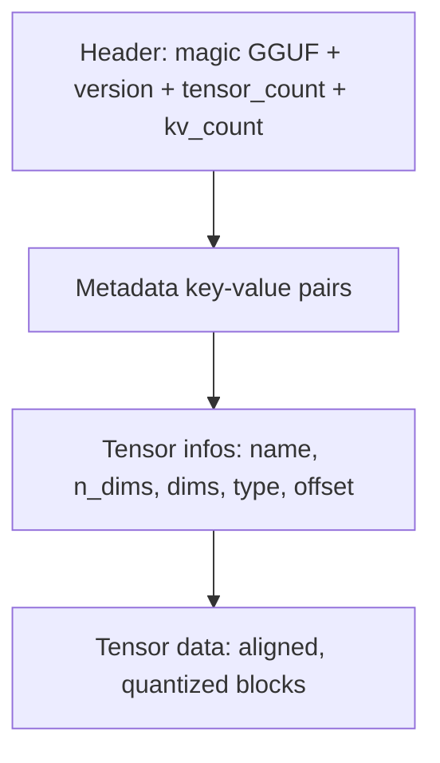
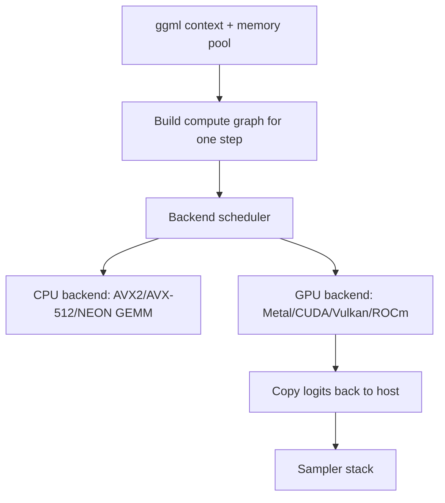

# llama.cpp and GGUF

## Overview

llama.cpp is a dependency-light C/C++ LLM inference engine built on the ggml tensor library, and GGUF is its single-file model container format. Together they dominate CPU, edge, and consumer-GPU inference: Ollama and LM Studio are both front-ends over llama.cpp, and every major model release ships a GGUF quantization matrix within hours. In interviews this page's material appears as "how would you run an LLM locally/on-device", "what does Q4_K_M mean", and "why is llama.cpp fast on CPU but vLLM is not".

## The llama.cpp Project

Started in March 2023 by Georgi Gerganov to run LLaMA on a MacBook, now maintained under the ggml-org GitHub organization with an MIT license. The design goal is a single static binary with no Python runtime, no CUDA toolkit requirement, and no package manager — the whole stack is plain C/C++ with hand-written SIMD and GPU kernels.

| Layer | Artifact | Role |
|---|---|---|
| Tensor library | ggml | N-d tensors, compute graphs, per-backend kernels (the "mini PyTorch" for inference) |
| File format | GGUF | Self-contained model container: weights + tokenizer + hyperparameters |
| Inference engine | llama.cpp | LLaMA-family (and now most open) architectures, sampling, KV cache |
| CLI tools | `llama-cli`, `llama-quantize`, `llama-perplexity` | Run, re-quantize, evaluate |
| Server | `llama-server` | OpenAI-compatible HTTP server with slots and a web UI |

Model coverage grew far beyond LLaMA: Mistral, Qwen, Gemma, Phi, DeepSeek (including its MoE variants), Yi, Falcon, and multimodal models (LLaVA-style via an `mmproj` projection file) are all supported. New architectures typically get a ggml port within days of release because the community treats it as a reference implementation.

## GGUF: The Single-File Container

GGUF (GGML Universal File, successor to GGML/GGMF/GGJT) packs everything needed for inference into one file: weights, tokenizer vocabulary and merges, and architecture hyperparameters. It is versioned (currently v3), supports sharding into multi-part files (`-00001-of-00003.gguf`), and is endianness- and alignment-explicit so a loader can map it without parsing a config JSON or `tokenizer.model` separately.

### File layout



### KV metadata

Metadata is an ordered map of UTF-8 keys to typed values (`uint8..uint64`, `float32/64`, `bool`, `string`, arrays). Common keys you will see when dumping a file with `llama-gguf`:

| Key | Example value | Why it matters |
|---|---|---|
| `general.architecture` | `llama` | Selects the graph-building code path |
| `llama.block_count` | `32` | Number of transformer layers |
| `llama.context_length` | `131072` | Default max sequence length |
| `llama.embedding_length` | `4096` | Hidden size |
| `llama.attention.head_count_kv` | `8` | GQA grouping — sets KV cache size |
| `llama.rope.freq_base` | `5000000.0` | RoPE scaling for long context |
| `tokenizer.ggml.model` | `gpt2` (BPE) | Tokenizer implementation |
| `tokenizer.ggml.tokens` | `["<|begin...>", ...]` | Vocabulary array |
| `general.file_type` | `15` | Encodes the quant type (15 = Q4_K_M) |

### Tensor info, alignment, and mmap

Each tensor entry records name, dimensions, GGML type, and byte offset; the data section starts at the next multiple of `general.alignment` (default 32 bytes, raised to 64 for some quant formats). Offsets are absolute, so a loader can `mmap()` the file and hand the kernel a pointer directly into the mapped region — no deserialization step.

**mmap behavior is a defining property.** Loading a 4.9 GB Q4_K_M model is effectively instant because no data is read at load time; the OS pages tensor bytes in on first touch, and Linux/macOS keep them in the page cache where other processes (a second `llama-server`, Ollama) share the same physical pages. Trade-offs: first-token latency includes page-in stalls from disk, and `--no-mmap` (full preload into RAM, optionally `--mlock` to pin) gives more predictable latency on machines where the model would be evicted between requests. On macOS unified memory, mmap lets a 16 GB model run in a machine with less free RAM than the model size, because cold pages are dropped rather than held.

## GGUF Quantization Types

Quantization is the core value proposition of the format. Block-wise quantization stores weights in blocks (classically 32 values) with a shared scale and, in some formats, a min offset. The families:

| Family | Types | Bits per weight (bpw) | Design |
|---|---|---|---|
| Legacy | Q4_0, Q4_1, Q5_0, Q5_1, Q8_0 | 4.5 – 8.5 | Fixed 32-value blocks, single FP16 scale (+min for the `_1` variants) |
| K-quants | Q2_K … Q6_K, incl. Q3_K_M, Q4_K_M, Q5_K_M | 2.6 – 6.6 | Super-blocks of 256 with 8-bit sub-block scales; sensitive layers (attention.wv, feed_forward.w2) kept at higher precision |
| I-quants | IQ1_S … IQ4_XS | 1.5 – 4.5 | Codebook/vector quantization for extreme compression |
| Full precision | F16, BF16, F32 | 16 – 32 | Reference / embedding layers |

**Q4_K_M is the de facto default** (~4.85 bpw): it keeps "important" tensors at Q6_K and quantizes the rest to Q4_K, hitting a quality-per-GB sweet spot. Q8_0 (~8.5 bpw) is effectively lossless and used for draft models and embeddings. Below ~4 bpw you move into IQ quants, which trade kernel simplicity for bits and benefit strongly from an **importance matrix** (`imatrix`): activation statistics gathered on calibration text that weight which weights matter, recovering perplexity at 1-3 bpw. The `llama-quantize` tool builds all of these from an F16 GGUF; perplexity regression is checked with `llama-perplexity`.

Rule-of-thumb sizes for a 7-8B model: Q4_K_M ≈ 4.4-4.9 GB, Q5_K_M ≈ 5.4-5.7 GB, Q6_K ≈ 6.3-6.6 GB, Q8_0 ≈ 8.1-8.5 GB. The same bpw ladder is why Ollama's model tags (`q4_K_M`, `q8_0`) map straight onto this table.

## The ggml Tensor Library and Backends

ggml executes inference as a **compute graph**: each decoding step builds a DAG of tensor ops (embedding lookup, per-layer matmuls, RMSNorm, RoPE, attention, MoE routing, output head), then a backend scheduler assigns ops to devices and copies tensors across backend boundaries. This is deliberately unlike training frameworks — no autograd, no dynamic shapes, allocation is done up front from a fixed memory pool so the decode loop has no allocator jitter.



| Backend | Hardware | Notes |
|---|---|---|
| CPU (default) | x86 AVX2/AVX-512/AMX, ARM NEON | Quantized GEMM dequantizes tiles into registers; the only backend with zero setup |
| Metal | Apple silicon | First-class citizen; unified memory means no PCIe copy for the weights |
| CUDA | NVIDIA | FlashAttention support (`-fa`), multi-GPU layer split via `--tensor-split` |
| Vulkan | AMD/Intel/Android GPUs | Portable fallback where CUDA/ROCm are unavailable |
| ROCm (HIP) | AMD | Datacenter and RDNA consumer cards |
| SYCL | Intel oneAPI | GPU Gen/Max series |

Two implementation details interviewers probe. First, **quantized matmul on CPU** works by streaming packed weight blocks from RAM and dequantizing a tile at a time into SIMD registers — which is exactly why decode speed tracks memory bandwidth, not FLOPS. Second, **KV cache quantization** (`--cache-type-k q8_0 --cache-type-v q8_0`) halves KV memory with small quality cost, and FlashAttention gates V-cache quantization because the V path needs the fused kernel.

## The Sampling Stack

llama.cpp implements the full sampler chain over raw logits, in order:

1. **Penalties**: `repeat_penalty` (divide repeated logits), `presence_penalty`, `frequency_penalty` over the last N tokens.
2. **Temperature** scaling.
3. **Top-k** truncation, then **top-p** (nucleus) truncation, then **min-p** (drop tokens below `min_p × p_max` — increasingly preferred as it scales with the distribution's confidence).
4. **Mirostat** (v1/v2) as an alternative adaptive controller that targets a fixed perplexity instead of fixed thresholds.
5. **Grammar masking** via GBNF — logits for tokens that would violate the grammar are set to `-inf` *before* sampling, making structured output exact rather than best-effort.

GBNF (GGML BNF) is a regex-like grammar language compiled into a per-step token mask:

```text
root    ::= object
object  ::= "{" ws pair ("," ws pair)* "}" ws
pair    ::= string ws ":" ws value
value   ::= object | array | string | number | "true" | "false" | "null"
```

The same sampler CLI flags apply to the server: `--temp 0.7 --top-p 0.9 --min-p 0.05 --repeat-penalty 1.1 --grammar-file json.gbnf`. Because grammar masking happens pre-sample, llama.cpp's constrained decoding is one of the most robust implementations — a point of comparison for engines that bolt on an external guided-decoding library (see [Structured Output & Decoding](../advanced/structured-output-decoding.md)).

## Context Extension and Cache Options

Context length is a first-class knob in llama.cpp, and the flags interleave with quantization choices:

| Flag | Effect | Typical use |
|---|---|---|
| `-c N` | Context size (KV budget). Total is split across parallel slots | `-c 8192` for 4 slots × 2k each |
| `--rope-scaling linear --rope-scale 2.0` | Stretch trained context (quality degrades gracefully) | Running a 8k-trained model at 16k |
| `--rope-frequency-base N` | Raise RoPE base for long context | Model cards specify it (e.g. 1M for Llama 3.1) |
| `--cache-type-k/v q8_0` | KV cache quantization | Halve KV bytes; q4_0 for extreme contexts |
| `-fa` (`--flash-attn`) | Fused attention kernels | Required for V-cache quantization; faster long context |
| `--yarn-orig-ctx N` | YaRN-style RoPE extension | Extending context beyond training length with less drift |

The KV memory math makes the trade-offs concrete. Per token, the cache costs \\( 2 \times L \times n_{kv} \times d_h \times b \\) bytes where \\( L \\) is layer count, \\( n_{kv} \\) the number of KV heads (GQA shrinks this), \\( d_h \\) head dim, and \\( b \\) bytes per element. An 8B GQA model at F16 costs ~131 KB/token; at 32k context that is ~4.3 GB — often larger than a Q4_0 weight file, which is exactly why KV quantization (`q8_0`) and slot-splitting (`-c` divided by `--parallel`) matter on CPU/edge hosts. Full derivation: [KV Cache](./kv-cache.md).

## Speculative Decoding and Performance Tooling

llama.cpp supports **draft-model speculative decoding**: a small model (e.g. a 0.5B Q8_0 companion for an 8B target, via `--model-draft`) proposes K tokens that the target verifies in one batched forward pass. Because target verification of K tokens costs roughly the same memory traffic as generating one, accepted spans are near-free latency wins. The catch on CPU/edge hosts: the draft model adds its own memory footprint and prefill work, so gains depend on acceptance rate — high for code and templated text, weak for open-ended chat.

Measurement tooling ships in-tree and is the honest way to settle hardware questions:

```bash
# Matrix benchmark: pp = prompt processing (prefill), tg = text generation (decode)
llama-bench -m model.gguf -p 512,2048 -n 128 -ngl 99

# Perplexity regression after re-quantizing
llama-perplexity -m model-q4km.gguf --ppl-stride 32
```

`llama-bench` reports prefill (pp) and decode (tg) throughput separately — the two regimes with opposite bottlenecks — which maps directly onto the bandwidth-vs-compute analysis above. A useful interview habit: quote pp/tg pairs, never a single "tokens per second".

## llama-server: OpenAI-Compatible Serving

`llama-server` wraps the engine in an HTTP service exposing `/v1/chat/completions`, `/v1/completions`, `/v1/embeddings`, and `/v1/models` (OpenAI wire-compatible, so the `openai` Python client works unchanged), plus native endpoints (`/completion`, `/tokenize`, `/slots`) and a built-in web UI at the root path.

```bash
llama-server -m Qwen2.5-7B-Instruct-Q4_K_M.gguf \
  -c 16384 -ngl 99 --parallel 4 --cont-batching \
  --flash-attn --metrics --api-key sk-local
```

Key serving concepts:

| Flag | Meaning |
|---|---|
| `-c` | Total KV context, divided across `--parallel` slots |
| `-np` (`--parallel`) | Number of request slots → the unit of concurrency |
| `--cont-batching` | Continuous batching across slots (default in recent releases) |
| `-ngl` | Layers offloaded to GPU; `-ngl 99` = everything, `-ngl 16` = hybrid CPU/GPU |
| `--metrics` | Prometheus endpoint with prompt/eval token counters |
| `--mmproj` | Multimodal projector file for LLaVA/InternVL-style models |

Throughput profile: llama-server batches the decode steps of concurrent slots, so a single user gets full speed and N users degrade gracefully — but it has no PagedAttention-style memory manager, no chunked prefill, and no cross-request prefix cache of vLLM/SGLang quality. It is optimized for **one-to-few concurrent users per host**, which is the honest dividing line against the datacenter engines.

## CPU and Edge Inference: When It Wins

Decode is **memory-bandwidth-bound**: every generated token requires streaming the whole weight matrix set through the memory hierarchy once.

\\[ \text{tokens/s} \le \frac{\text{memory bandwidth (GB/s)} \times 1000}{\text{model size (GB)}} \\]

Worked example — Llama-3.1-8B at Q4_K_M (~4.9 GB):

| Hardware | Bandwidth | Theoretical ceiling | Realistic decode |
|---|---|---|---|
| Desktop DDR5, dual-channel | ~80 GB/s | ~16 tok/s | 10-14 tok/s |
| Apple M2 (base) | ~100 GB/s | ~20 tok/s | 12-16 tok/s |
| Apple M3 Max | ~300 GB/s | ~61 tok/s | 40-50 tok/s |
| RTX 4090 (fully offloaded) | ~1008 GB/s | ~205 tok/s | 130-160 tok/s |

Prefill is the opposite: **compute-bound** at roughly \\( 2 \times P \times n_{prompt} \\) FLOPs. A modern 16-core desktop sustains only ~50-150 prefill tokens/s on an 8B model, so a 2,000-token RAG context costs 15-40 seconds before the first token — the single biggest reason CPU deployments fail in practice. Mitigations: keep prompts short, rely on the (basic) prompt cache for repeated prefixes, or use a hybrid split where a small GPU computes prefill.

Where llama.cpp is the *correct* engineering answer:

| Scenario | Why llama.cpp wins |
|---|---|
| Per-user local apps (chat assistants, IDE copilots) | batch=1 latency competitive with GPUs for ≤8B models; zero serving infra |
| On-device privacy (phones, kiosks, air-gapped) | Static binary, no network, runs via JNI/Termux on Android |
| Cost arbitrage on idle servers | Free compute on machines you already own; Q4 models need no GPU |
| Massive fleet of cheap instances | Scales horizontally (many users × small models) instead of vertically |
| Embeddings/structured extraction | Q8_0 + GBNF grammar gives deterministic JSON on CPU |

Where it loses: high-QPS multi-tenant serving (no paged KV, weaker continuous batching), long-context prefill, and 70B+ models at interactive speed on anything but high-end Apple or multi-GPU offload.

## llama.cpp vs Ollama

Ollama is a Go desktop application that **embeds llama.cpp as a library** — it is a packaging and distribution layer, not a competing engine.

| Dimension | llama.cpp | Ollama |
|---|---|---|
| Abstraction | Library + CLI + server | Service/daemon + model registry |
| Install | Build from source or download binary | One-line installer, runs in background |
| Models | You fetch GGUF files yourself | `ollama pull` from a curated registry |
| Upstream freshness | Day-0 support for new models/quants | Pins a llama.cpp version; features lag days-weeks |
| Configuration | Every knob exposed (samplers, backends, caches) | Modelfile presets; fewer knobs by design |
| API | OpenAI-compatible on 8080 | OpenAI-compatible on 11434 |
| Multi-model lifecycle | Manual | Automatic load/unload with keep-alive |

Practical split: use Ollama when you want a managed local runtime and standard models; drop to raw llama.cpp when you need a brand-new quant or model before Ollama's pin updates it, when benchmarking (`llama-bench`), or when embedding the library in a product. See [Ollama](./ollama.md) for the consumer-facing details.

## Common Mistakes

- ❌ Judging quant quality by file size alone — Q4_K_M and IQ4_XS are both "4-bit" but differ materially; check `llama-perplexity` deltas against F16.
- ❌ Reporting one "tokens/s" number — prefill (pp) and decode (tg) are different regimes with different bottlenecks; always quote both.
- ❌ Setting `-c` to the model's max context while running 8 parallel slots — the context is divided across slots, and users hit silent truncation.
- ❌ Deploying CPU inference with long prompts — prefill at ~50-150 tok/s means a 2k RAG context adds tens of seconds of TTFT; keep prompts short or add a small GPU for prefill.
- ❌ Skipping `--no-mmap`/`--mlock` on hosts with memory pressure — mmap eviction between requests reintroduces disk-latency spikes that look like random slow requests.
- ❌ Treating Ollama's pinned llama.cpp as identical to upstream — new quant formats and architectures land upstream first.

## Interview Questions

1. **What is GGUF and why does it exist alongside safetensors?** GGUF is a self-contained single-file container that stores weights, tokenizer, and architecture hyperparameters with explicit alignment so it can be `mmap`ed and used without parsing external config files. Safetensors stores only tensors and assumes a separate modeling code stack (PyTorch + config.json + tokenizer files). GGUF's design goals are zero-dependency loading in C, instant startup via mmap and page-cache sharing, and embedding quantization metadata (`general.file_type`) in the file itself. It is the natural format for an engine that must run with no Python and no package ecosystem.

2. **What does Q4_K_M actually mean?** Q4 = ~4-4.5 bits per weight target, K = K-quant family (256-value super-blocks with 8-bit sub-block scales rather than the legacy 32-value blocks), M = medium mix — "important" tensors such as attention output and feed-forward down projections are kept at higher precision (Q6_K) while the bulk uses Q4_K. The result is ~4.85 bpw with perplexity much closer to FP16 than legacy Q4_0 at the same size. The _S/_M/_L suffixes are different importance-mixing recipes, not different bit rates.

3. **Why is llama.cpp fast at decoding on CPU but slow at prefill?** Decode is memory-bound: each token streams all weights once, so tokens/s ≈ bandwidth/model-bytes — an 8B Q4_K_M model at ~4.9 GB on 80 GB/s DDR5 yields ~14 tok/s regardless of CPU FLOPS. Prefill is compute-bound: ~2·P·n FLOPs for n prompt tokens, and a CPU delivers one to two orders of magnitude fewer effective FLOPS than a GPU. So a GPU wins prefill by 100× but decode by only ~10×, which is why CPU/edge deployments must keep prompts short and why hybrid layer-offload (`-ngl`) is a common compromise.

4. **When would you deploy llama.cpp instead of vLLM?** When serving one-to-few users per host with small-to-mid models on hardware without datacenter GPUs: local apps, on-device privacy requirements, air-gapped sites, or cost arbitrage on existing CPU fleets. llama.cpp has no PagedAttention-grade memory manager and weaker batching, so at high concurrency its throughput per GPU collapses versus vLLM. A useful heuristic: llama.cpp optimizes per-request latency and simplicity; vLLM optimizes aggregate throughput. Many products use both — llama.cpp client-side, vLLM server-side.

5. **How does mmap make model loading "instant" and what are the trade-offs?** GGUF tensor offsets are absolute, so the loader maps the file into the address space and hands kernels pointers directly into it; the OS pages data in on first touch and keeps it in the page cache, shared across processes using the same file. Startup cost is therefore near-zero and RAM footprint adapts to usage. Trade-offs: the first tokens after load pay page-in stalls from disk, and on hosts with memory pressure the model can be evicted between requests, reintroducing disk latency — handled with `--no-mmap`/`--mlock` at the cost of losing sharing.

6. **What is GBNF and why is grammar-based sampling exact?** GBNF is llama.cpp's BNF-style grammar language. The engine compiles the grammar into a state machine over the tokenizer's vocabulary, and at every step masks (sets to `-inf`) the logits of all tokens that cannot legally follow the current partial output. Because invalid tokens are removed before sampling rather than repaired afterwards, the output always conforms to the grammar by construction — unlike prompt-based "please output JSON" or post-hoc parsers.

## Key Takeaways

- llama.cpp (ggml-org, MIT) is the CPU/edge inference reference: plain C/C++, single binary, ggml compute-graph execution, first-class Metal plus CUDA/Vulkan/ROCm backends.
- GGUF is a self-contained container: header, typed KV metadata (architecture, tokenizer, RoPE), aligned tensor infos, and tensor data — designed for `mmap` and page-cache sharing, giving instant loads and multi-process memory dedup.
- Quant ladder: legacy Q4_0/Q8_0 → K-quants (Q4_K_M ≈ 4.85 bpw is the default choice) → I-quants (IQ1_S-IQ4_XS) for extreme budgets; `imatrix` calibration recovers quality at low bpw.
- Decode speed ≈ bandwidth / model bytes (8B Q4_K_M: ~14 tok/s on desktop DDR5, ~45 on M3 Max, ~140 on a 4090); prefill is compute-bound and is the CPU story's real weakness.
- `llama-server` speaks the OpenAI API with slots, continuous batching, Prometheus metrics, and GBNF grammar-constrained output — but targets one-to-few users, not multi-tenant QPS.
- Ollama is a wrapper: Go daemon + model registry + Modelfile around an embedded llama.cpp; upstream llama.cpp always gets new models/quants first.
- Pick llama.cpp for per-user latency, privacy, edge, and cost; pick vLLM/SGLang for concurrent throughput — see [Engine Comparison](./engine-comparison.md).

## References

- llama.cpp repository and in-repo docs (GGUF spec under `docs/`, server README): [github.com/ggml-org/llama.cpp](https://github.com/ggml-org/llama.cpp)
- Ollama documentation (llama.cpp-based runtime, API): [docs.ollama.com](https://docs.ollama.com/) and API reference [docs.ollama.com/api](https://docs.ollama.com/api)
- Hugging Face Hub GGUF documentation (format usage and upload conventions): [huggingface.co/docs/hub/gguf](https://huggingface.co/docs/hub/gguf)
- vLLM documentation — the paged-KV counterpoint for high-concurrency serving: [docs.vllm.ai/en/latest](https://docs.vllm.ai/en/latest/)

## Cross-References

- [Ollama →](./ollama.md) — the consumer wrapper around this engine
- [Quantization →](./quantization.md) — quantization theory behind Q4_K_M and friends
- [vLLM →](./vllm.md) — the high-throughput, paged-KV alternative for multi-tenant serving
- [KV Cache →](./kv-cache.md) — memory math that explains the bandwidth-bound decode limit
- [Inference →](./inference.md) — prefill vs decode fundamentals used in the FLOPs math
- [ML Edge Deployment →](../../ml/advanced/edge.md) — the wider on-device deployment landscape
- [Engine Comparison →](./engine-comparison.md) — where llama.cpp sits against the datacenter engines
