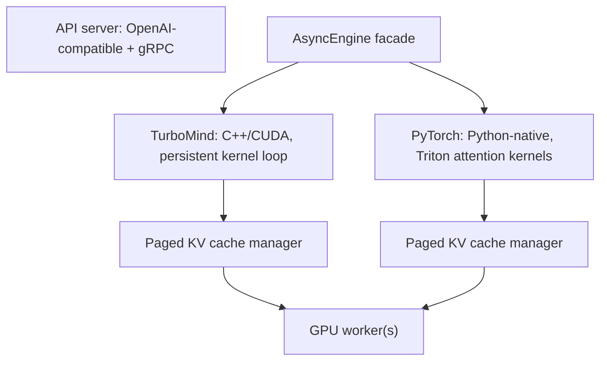
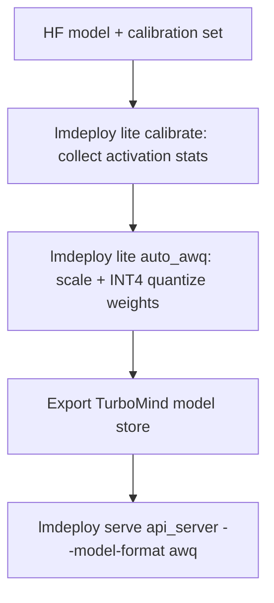

# LMDeploy

## Overview

LMDeploy is an open-source LLM serving toolkit from the InternLM team (Shanghai AI Laboratory) built around two inference engines: **TurboMind**, a C++/CUDA engine with persistent kernels and paged KV cache, and a pure-**PyTorch** engine for extensibility. Its differentiators are strong W4A16 (AWQ INT4-weight) serving, KV-cache INT8/INT4 quantization, first-class vision-language serving, and project-reported throughput above vLLM on several configurations. Interviews test it as the "engine that isn't vLLM/TensorRT": when you pick it, what TurboMind buys you, and how W4A16 changes the memory math.

## The Two Engines

LMDeploy exposes one API surface (`lmdeploy serve`) over two interchangeable backends selected with `--backend`:



| Property | TurboMind | PyTorch engine |
|---|---|---|
| Implementation | C++/CUDA core, Python wrapper | Pure PyTorch + Triton kernels |
| Execution model | Persistent kernel loop — the batch loop never returns to Python between decode steps | Standard PyTorch eager/graph execution per step |
| KV cache | Paged, block-based, quantizable (INT8/INT4) | Paged, block-based |
| New-model support | Lags: kernels must be ported per architecture | Fastest path for brand-new model classes |
| Extensibility | Requires C++/CUDA work | Modify Python directly (research, custom ops) |
| Production readiness | Highest — used to serve InternLM deployments | Good, historically slightly behind |

**TurboMind's persistent kernel design** is the headline. In a Python-first engine, every decode step hops between Python scheduler code, kernel launches, and synchronization — overhead that dominates when the model is small or the GPU is fast. TurboMind keeps the scheduling and execution loop inside a long-lived C++/CUDA structure, so step-to-step overhead approaches kernel-launch floor. It descends from the FasterTransformer kernel lineage: fused attention, fused layernorms, weight-only-quantized GEMMs. This is the same reason TensorRT-LLM compiles engines — but TurboMind keeps per-model builds out of the user's hands, loading GGUF-style converted model stores at runtime instead.

The PyTorch engine exists because kernel-ported engines always trail the model zoo. When a new architecture (new attention variant, new MoE layout) appears, the PyTorch engine serves it immediately with Triton kernels while TurboMind support is built.

## W4A16 Quantization: The AWQ Pipeline

LMDeploy's signature quantization story is **W4A16**: weights stored in INT4, activations in FP16, using **AWQ** (Activation-aware Weight Quantization, Lin et al., 2023). AWQ observes that a small fraction of "salient" weight channels — identifiable from activation magnitudes — dominate quantization error, and scales those channels up before quantizing, preserving accuracy without mixed precision.



The pipeline is two commands plus serving:

```bash
# 1. Quantize with AWQ (uses an internal calibration set by default)
lmdeploy lite auto_awq internlm/internlm2_5-7b-chat \
  --calib-dataset ptb --work-dir ./internlm2_5-7b-awq

# 2. Serve the W4A16 checkpoint
lmdeploy serve api_server ./internlm2_5-7b-awq \
  --backend turbomind --model-format awq --tp 1
```

What W4A16 buys, concretely:

| Effect | Mechanism | Magnitude |
|---|---|---|
| Weight memory | 4-bit weights vs FP16 | ~3.5-4× smaller files and footprint |
| Decode speed | Decode is bandwidth-bound; fewer bytes to stream | Often ~1.5-2× vs FP16 on the same GPU |
| Prefill speed | GEMMs load less weight data per tile | Measurable gain, less dramatic than decode |
| Accuracy | AWQ salient-channel scaling | Typically <1% average degradation on standard benchmarks |
| Capacity | Smaller weights → more room for KV cache | More concurrent sequences per GPU |

The capacity point is the systems insight: on a fixed 80 GB GPU, halving weight bytes does not halve cost — it frees memory for KV cache, directly raising max concurrency. The trade-off and W4A16's placement among quantization schemes is covered in [Quantization](./quantization.md).

**KV cache quantization** is independent of weight quantization: `--quant-policy 8` (KV INT8) or `--quant-policy 4` (KV INT4) at serve time roughly halves (or quarters) KV bytes, doubling or quadrupling long-context concurrency, at a small quality cost that must be evaluated per model.

## Vision-Language Serving

LMDeploy is one of the strongest open-source engines for **VLM serving**, historically because InternVL (same lab) was its reference workload. Supported model families include InternVL, LLaVA, Qwen-VL, DeepSeek-VL, CogVLM, and Phi-3-Vision. Two usage modes:

- **Pipeline API** (Python): `pipeline = pipeline(model_path, backend_config=...)`, chat with images passed as local paths, URLs, or base64; `pipeline(`https://.../img.jpg`, 'Describe this image')`.
- **OpenAI-compatible server**: `lmdeploy serve api_server OpenGVLab/InternVL2-8B` — the chat completions endpoint accepts image content parts the same way the OpenAI multimodal API does, so existing multimodal clients work unchanged.

The engine handles the VLM-specific prefill structure (vision encoder → projector → interleaved image/text tokens) inside the same batching and KV machinery as text-only serving. For teams serving multimodal chat at scale, this is often the deciding feature versus TensorRT-LLM, whose multimodal support trails its text stack.

## Python Pipeline and Offline Batch Inference

Not every workload needs an HTTP server. LMDeploy's `pipeline` object wraps the same engines in a Python API for offline and batch workloads — evaluation harnesses, synthetic-data generation, embedding extraction:

```python
from lmdeploy import pipeline, GenerationConfig, TurbomindEngineConfig

pipe = pipeline(
    "internlm/internlm2_5-7b-chat",
    backend_config=TurbomindEngineConfig(tp=1, session_len=8192),
)

cfg = GenerationConfig(top_p=0.9, temperature=0.7, max_new_tokens=512)
prompts = [["Explain PagedAttention."], ["Write a merge sort in Python."]]
outputs = pipe(prompts, config=cfg)          # engine-level batching
for o in outputs:
    print(o.text)
```

Two details matter for throughput work. First, `pipe(prompts)` on a list achieves **engine-level batching**: the async scheduler packs the list into continuous batches exactly as the server would, so offline jobs reach near-server throughput without writing an HTTP loop. Second, the pipeline accepts chat-formatted messages (`[{"role": "user", "content": ...}]`) or raw strings; raw strings skip the chat template, which is a common silent quality bug when evaluating base-style checkpoints.

The same pipeline object serves VLM inference (`pipe(("describe this", image))`) and exposes token-level streaming via `pipe.stream_infer`, which is how evaluation loops and agent frameworks integrate without the server hop.

## Model Conversion and Coverage

TurboMind does not load Hugging Face checkpoints directly — models are **converted** into a TurboMind model store (`--dst-path`), which repacks weights into the fused, quantized layout the persistent kernels expect. The `lmdeploy convert` command covers the Llama, InternLM, Qwen, Mistral, DeepSeek, Baichuan, Phi, Gemma, and LLaVA-family lineages; the PyTorch engine, by contrast, can often load new HF checkpoints as-is, which is the concrete form of the coverage trade-off described earlier.

Practical implications:

- **Storage**: a converted store roughly matches the quantized weight size (a W4A16 conversion of a 7B model is ~4-5 GB), but it is a separate artifact from the HF checkpoint — plan disk and artifact management accordingly.
- **Docker**: official images publish the toolchain preinstalled, which sidesteps CUDA-version mismatch problems that dominate first-time setup failures.
- **Chat templates**: serving applies the model's template from the model store; mismatched templates (or serving an instruct model raw) silently degrade quality — a recurring incident class when teams convert custom checkpoints.

## Batching and Scheduling

LMDeploy implements **continuous (iteration-level) batching** — new requests join the running batch when slots and KV blocks free up, without waiting for the batch to drain (mechanism background: [Batching](./batching.md)). Scheduler-relevant flags:

| Flag | Effect | Tune when |
|---|---|---|
| `--max-batch-size` | Cap on concurrent sequences | Latency SLAs, admission control |
| `--cache-max-entry-count` | Fraction of free GPU memory used for KV blocks | Raise for long contexts, lower to leave room |
| `--session-len` | Max tokens per conversation session | Chat workloads with long history |
| `--tp` | Tensor-parallel degree across GPUs | Models that don't fit one GPU |
| `--quant-policy` | 4/8 = KV cache INT4/INT8 | Long-context capacity pressure |
| `--enable-prefix-caching` | Reuse KV for shared prompt prefixes | System prompts, few-shot, RAG |
| `--backend` | `turbomind` or `pytorch` | Model support vs speed |

Prefix caching reuses KV blocks across requests sharing a prompt prefix (chat system prompts, RAG documents), cutting prefill for repeats — the same capability vLLM and SGLang expose, though router-level, cross-instance prefix management needs external machinery (see [Cache-Aware Routing](./cache-aware-routing.md)).

LMDeploy also ships a **Triton Inference Server backend**, so teams standardized on NVIDIA Triton can embed TurboMind as a model backend rather than running the LMDeploy API server — relevant when Triton is already the org's serving substrate alongside non-LLM models.

## Benchmarks vs vLLM

The LMDeploy README and docs publish throughput comparisons where TurboMind **outperforms vLLM by up to ~1.8×** (and TGI by more) on their tested configurations — historically InternLM/Llama-class models, A100/H800 hardware, fp16 and W4A16 settings. Read these numbers with the standard benchmark skepticism:

| Dimension | LMDeploy/TurboMind | vLLM |
|---|---|---|
| Reported throughput | Up to ~1.8× vLLM (project-run benchmarks) | Baseline |
| Kernel strategy | Persistent C++/CUDA loop, fused weight-only-INT4 GEMMs | Python scheduler, CUDA graphs to cut launch overhead |
| Model breadth | Broad but kernel-ported; PyTorch engine fills gaps | Widest model coverage in the ecosystem |
| Community/ecosystem | Smaller, InternLM-centric | Largest, de facto default |
| W4A16 serving | Core competency (AWQ-native kernels) | Supported (AWQ/GPTQ kernels) |
| Multimodal | Strong (InternVL lineage) | Supported, broad VLM zoo |
| API | OpenAI-compatible + gRPC | OpenAI-compatible |

Practical guidance: for a standard open model at high concurrency on NVIDIA GPUs, both engines are in the same performance band and the honest answer in an interview is that **measured numbers on *your* model, *your* prompt-length distribution, and *your* hardware beat any README table** — differences of 1.2-1.8× appear and reverse depending on batch composition, context length, and quantization. LMDeploy earns a pick when W4A16 density, VLM serving, or gRPC/Triton integration is central; vLLM earns the default pick on ecosystem risk, tooling, and model coverage. See [vLLM](./vllm.md) and [Engine Comparison](./engine-comparison.md).

## A Capacity Worked Example

The levers above compose multiplicatively, so it is worth walking one 80 GB GPU end to end. Target: InternLM2.5-20B (roughly 40 GB at BF16, 2 layers of headroom-free VRAM), 32k context, GQA architecture with ~64 KB of KV per token at FP16 (illustrative for this size class).

| Configuration | Weights | KV budget (from ~72 GB usable) | KV per request at 32k | Concurrent requests |
|---|---|---|---|---|
| BF16 weights, FP16 KV | 40 GB | 32 GB | 2.0 GB | ~16 |
| W4A16 weights, FP16 KV | 11 GB | 61 GB | 2.0 GB | ~30 |
| W4A16 weights, KV INT8 | 11 GB | 61 GB | 1.0 GB | ~60 |
| W4A16 weights, KV INT8, prefix cache (50% hit) | 11 GB | 61 GB | 0.5 GB effective | ~120 |

Reading the table: the single biggest jump comes from W4A16 (weights stop crowding out KV), the second from KV INT8, and the third from prefix caching — which is not a memory saving per request but a deduplication of shared spans across requests. Each row also buys latency: fewer bytes streamed per decode step raises per-request speed at any batch size. The costs to verify per model: AWQ accuracy delta (<1% typical), KV INT8 quality delta (task-dependent; test retrieval-heavy workloads hardest), and prefix-cache hit-rate assumptions (measure, don't assume 50%).

The same arithmetic run backwards is a capacity-planning interview question: "we need 200 concurrent 16k-context conversations per node — what fits?" Working the KV bytes-per-token formula first (architecture-dependent, see [KV Cache](./kv-cache.md)), then applying weight quantization and KV quantization, is exactly the reasoning interviewers look for, with LMDeploy's flags as one concrete implementation.

## Deployment Recipe

A complete single-GPU production deployment:

```bash
pip install lmdeploy

# Serve InternLM2.5-7B-Chat, tensor parallel 1, 80% of VRAM for KV
lmdeploy serve api_server internlm/internlm2_5-7b-chat \
  --backend turbomind --tp 1 \
  --session-len 16384 \
  --cache-max-entry-count 0.8 \
  --max-batch-size 64 \
  --server-port 23333

# Client: OpenAI-compatible
```

```python
from openai import OpenAI

client = OpenAI(base_url="http://localhost:23333/v1", api_key="none")
resp = client.chat.completions.create(
    model="internlm2_5-7b-chat",
    messages=[{"role": "user", "content": "Explain paged attention."}],
)
print(resp.choices[0].message.content)
```

Deployment checklist:

1. **Quantize if capacity-bound**: AWQ W4A16 first (biggest lever: weight bytes → KV capacity), then KV INT8 if context length dominates.
2. **Size the KV pool**: `--cache-max-entry-count` trades KV blocks against headroom; watch OOM under burst.
3. **Set `--session-len` to your real chat length distribution**, not the model maximum — it bounds KV residency per conversation.
4. **Enable prefix caching** for shared system prompts; monitor hit rate.
5. **Load-test with realistic prompt/output length mixes** (vLLM's `benchmark_serving.py` works against any OpenAI-compatible server, including LMDeploy) and compare against a vLLM instance before committing.
6. **For gRPC or Triton-standardized shops**, use the corresponding backends rather than wrapping the REST API.

Containerized equivalent (pin the CUDA-matching tag for your driver stack):

```bash
docker run --gpus all -p 23333:23333 \
  openmmlab/lmdeploy:latest \
  lmdeploy serve api_server internlm/internlm2_5-7b-chat \
  --backend turbomind --tp 1 --session-len 16384
```

Operational notes that separate a demo from a deployment: mount the converted model store rather than re-downloading weights on boot; set an explicit health check against the server's health endpoint; export Prometheus metrics if your ingress supports scraping; and load-test from a second host — self-testing from the same box measures your client, not the engine.

## Common Mistakes

- ❌ Quoting the README's 1.8×-over-vLLM figure in a design doc without reproducing it — the gap depends on model, batch composition, and context lengths, and reverses in some configs.
- ❌ Serving FP16 when the deployment is capacity-bound — W4A16 is LMDeploy's core competency; leaving it off wastes the engine's main advantage.
- ❌ Ignoring KV quantization quality regression — `--quant-policy 4` quarters KV bytes but needs per-model evaluation, especially for retrieval-heavy RAG tasks.
- ❌ Setting `--session-len` to the model maximum — it inflates KV residency per conversation and cuts concurrency; size it to the real chat-length distribution.
- ❌ Using raw strings with the Python pipeline for instruct models — the chat template gets skipped and quality drops silently.
- ❌ Benchmarking TurboMind against vLLM with a harness that closes over batch size instead of measuring goodput at matched SLOs.

## Interview Questions

1. **What is TurboMind and what does "persistent kernel" buy over a Python engine?** TurboMind is LMDeploy's C++/CUDA engine, descended from FasterTransformer-style fused kernels. "Persistent" means the batching/execution loop lives in long-lived C++/CUDA code rather than returning to Python for every decode step, so per-step scheduler overhead approaches the kernel-launch floor. At batch=1 or with small models, Python overhead is a large fraction of step time, which is where TurboMind's design shows the biggest wins. It also ships weight-only INT4 (W4A16) GEMM kernels natively rather than relying on external quantization kernels.

2. **Why does W4A16 often increase throughput even though FLOPs don't change?** Decode is memory-bandwidth-bound: each generated token streams every weight byte once. Cutting weights from FP16 to INT4 cuts the bytes to stream by ~4×, so decode time drops toward bandwidth savings even though the arithmetic is unchanged (dequantize-then-FP16-multiply). The freed memory additionally enlarges the KV pool, raising concurrent capacity. Prefill gains less because it is compute-bound. This is why weight quantization is both an accuracy trade-off and a throughput optimization, not just memory compression.

3. **How does LMDeploy compare to vLLM for a production choice?** Both provide paged KV cache, continuous batching, prefix caching, and an OpenAI-compatible API, and both are in the same performance band on common models — project-reported gaps (up to ~1.8× for LMDeploy) are configuration-dependent and should be reproduced on your workload. LMDeploy differentiates on W4A16/AWQ serving depth, VLM serving (InternVL lineage), gRPC, and a Triton backend; vLLM differentiates on model coverage, community size, tooling, and release velocity. Default to vLLM for ecosystem risk; pick LMDeploy when its specific strengths map to your workload.

4. **What is AWQ and why is it better than naive RTN INT4?** AWQ (Activation-aware Weight Quantization) finds the few weight channels that dominate output error — those with large activation magnitudes — and scales them up before uniform INT4 quantization so they occupy more of the quantizer's range. This protects salient channels without mixed-precision storage. Naive round-to-nearest INT4 treats all channels equally and loses 1-3% more accuracy at 4 bits. AWQ is calibration-based but does not need backpropagation or retraining, making it a cheap post-training step — LMDeploy wraps it in `lmdeploy lite auto_awq`.

5. **Why does LMDeploy ship a PyTorch engine alongside TurboMind?** Kernel-ported engines must hand-implement every new architecture, so they always trail the model zoo. The PyTorch engine serves new model classes immediately using Triton attention kernels and standard PyTorch ops, at the cost of Python step overhead. The two-engine split is a deliberate engineering trade: production speed via TurboMind, coverage and hackability via PyTorch — the same pressure that keeps vLLM's kernel abstraction layer and TensorRT-LLM's per-model engine builds in tension.

6. **How would you fit more concurrent 128k-context conversations on one 80 GB GPU?** Sequence the levers: W4A16 weights to shrink the static footprint; KV INT8/INT4 (`--quant-policy 8/4`) to shrink per-token KV bytes — for GQA models the KV cache, not weights, dominates at long context; raise `--cache-max-entry-count` to give the pool almost all free VRAM; cap `--max-batch-size` so admitted requests never thrash; enable prefix caching since long conversations re-send history. Compute the KV bytes/token from the architecture (heads × head-dim × layers × 2 × bytes) before choosing, and validate quality loss from KV INT4 per model.

## Key Takeaways

- LMDeploy = TurboMind (C++/CUDA, persistent kernel loop, paged KV) + a PyTorch engine (coverage/extensibility) behind one OpenAI-compatible serving API.
- W4A16 via AWQ is the headline: ~4× smaller weights, bandwidth-bound decode gains of ~1.5-2×, <1% typical accuracy cost, and freed memory converted into KV-cache concurrency.
- KV cache INT8/INT4 (`--quant-policy 8/4`) is the independent lever for long-context capacity; at 128k contexts KV bytes dominate weights.
- First-class VLM serving (InternVL, LLaVA, Qwen-VL) through the same API, plus gRPC and an NVIDIA Triton backend for Triton-standardized shops.
- Project-reported throughput up to ~1.8× vLLM — directional only; benchmark on your model, lengths, and hardware before choosing.
- Choose LMDeploy for W4A16 density, multimodal, or InternLM stacks; choose vLLM for ecosystem and model breadth; see [Engine Comparison](./engine-comparison.md).

## References

- LMDeploy repository (TurboMind, PyTorch engine, AWQ pipeline, VLM support): [github.com/InternLM/lmdeploy](https://github.com/InternLM/lmdeploy)
- LMDeploy documentation (deployment, quantization, API server guide): [lmdeploy.readthedocs.io](https://lmdeploy.readthedocs.io/en/latest/)
- Ji Lin et al., "AWQ: Activation-aware Weight Quantization for LLM Compression and Acceleration", 2023: [arxiv.org/abs/2306.00978](https://arxiv.org/abs/2306.00978)
- InternLM model family repository: [github.com/InternLM/InternLM](https://github.com/InternLM/InternLM)
- vLLM repository (comparison baseline): [github.com/vllm-project/vllm](https://github.com/vllm-project/vllm)

## Cross-References

- [vLLM →](./vllm.md) — the default open-source engine this toolkit benchmarks against
- [TensorRT-LLM →](./tensorrt.md) — NVIDIA's compiled-engine approach to the same persistent-kernel goal
- [Quantization →](./quantization.md) — AWQ, GPTQ, and the W4A16 trade-off landscape
- [Batching →](./batching.md) — continuous batching mechanics shared by all modern engines
- [KV Cache →](./kv-cache.md) — the memory math behind `--cache-max-entry-count` and KV quantization
- [Cache-Aware Routing →](./cache-aware-routing.md) — cross-instance prefix and KV reuse beyond a single engine process
- [Engine Comparison →](./engine-comparison.md) — full decision matrix across serving engines
