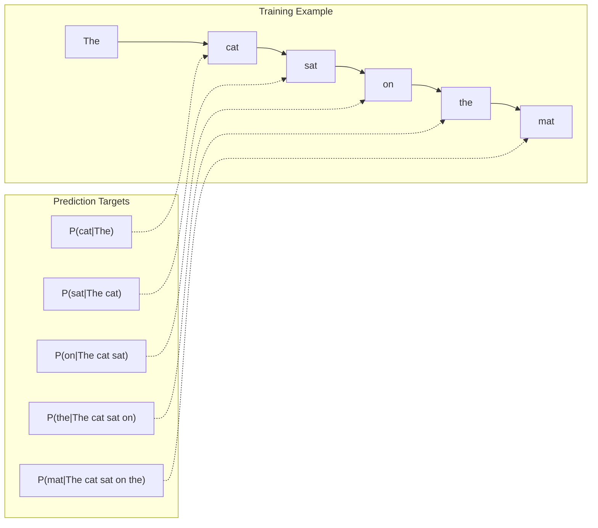
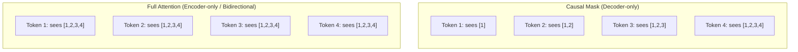
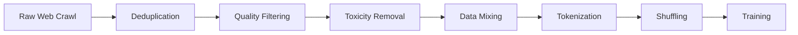
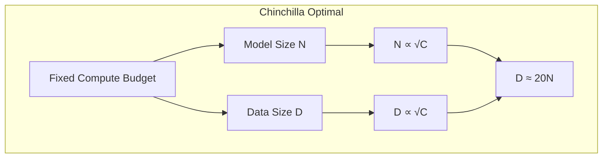
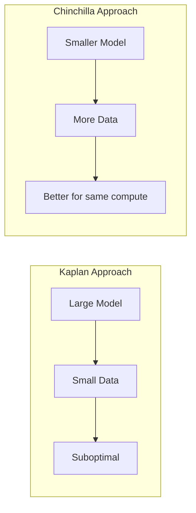

# Pre-training

## Overview

Pre-training is the foundational phase where an LLM learns language patterns from massive unlabeled text corpora. The model learns to predict the next token given previous tokens, developing a compressed representation of human knowledge. This phase requires enormous compute (thousands of GPUs for weeks/months) and data (trillions of tokens).

Understanding pre-training is essential for interviews because it explains why LLMs have certain capabilities, how scaling works, and what the fundamental training objective is.

## The Pre-training Objective: Next Token Prediction

The core objective is **autoregressive language modeling** — predict the next token given all previous tokens:

```
L = -Σ log P(x_t | x_1, x_2, ..., x_{t-1})
```



**Key insight:** Every token in the training sequence provides a learning signal. For a sequence of length T, we get T-1 training examples. This is extremely data-efficient.

### Masked vs Causal Attention



Decoder-only LLMs use **causal masking** — each token can only attend to previous tokens. This prevents "cheating" during training and enables autoregressive generation.

## Pre-training Data

### Data Sources

| Source | Examples | Scale | Quality |
|---|---|---|---|
| **Web crawl** | Common Crawl, C4 | Trillions of tokens | Noisy, requires filtering |
| **Books** | Books3, Gutenberg | ~100B tokens | High quality |
| **Code** | GitHub, StackOverflow | ~500B tokens | Structured, reasoning |
| **Academic** | ArXiv, PubMed | ~100B tokens | Technical depth |
| **Wikipedia** | Multiple languages | ~40B tokens | Factual, encyclopedic |
| **Social** | Reddit, forums | ~500B tokens | Conversational |

### Data Processing Pipeline



**Deduplication** is critical:
- **Exact dedup**: Remove identical documents
- **Fuzzy dedup**: MinHash + LSH to find near-duplicates
- Training on duplicates wastes compute and causes memorization

**Quality filtering**:
- Language detection (keep target language)
- Perplexity filtering (remove low-quality text)
- Heuristic rules (length, special characters, repetition)

### Data Mixing

The ratio of data sources matters enormously:

| Model | Web | Books | Code | Academic |
|---|---|---|---|---|
| GPT-3 | 60% | 16% | 0% | 24% |
| LLaMA | 67% | 4.5% | 4.5% | 2.5% |
| CodeLLaMA | 50% | 5% | 35% | 10% |
| Mixtral | 65% | 5% | 15% | 15% |

More code data → better reasoning. More diverse data → better generalization.

## Scaling Laws

### Chinchilla Scaling Laws (Hoffmann et al., 2022)

The most important finding in LLM scaling:

**Optimal scaling**: For a given compute budget C, the model size N and data size D should scale equally:

```
N_opt ∝ C^0.5
D_opt ∝ C^0.5
```

**Chinchilla's rule**: The optimal number of training tokens ≈ 20× the number of parameters.

| Parameters | Optimal Tokens | Example |
|---|---|---|
| 1B | 20B | Small model |
| 7B | 140B | LLaMA-7B (trained on 1T tokens — overtrained) |
| 70B | 1.4T | Chinchilla (70B, trained on 1.4T tokens) |
| 175B | 3.5T | GPT-3 was undertrained (300B tokens) |



### Kaplan Scaling Laws (OpenAI, 2020)

Earlier scaling laws suggested larger models are always better:

```
L(N) ∝ N^{-0.076}
L(D) ∝ D^{-0.095}
L(C) ∝ C^{-0.050}
```

**Key difference**: Kaplan suggested keeping data fixed and scaling model. Chinchilla showed this is suboptimal — you should scale both.

### Practical Implications



**Modern practice** (post-Chinchilla):
- **Overtrain** smaller models for inference efficiency (LLaMA-7B trained on 1T tokens)
- More tokens than Chinchilla-optimal → better downstream performance
- But more expensive to train (acceptable if serving costs dominate)

## Training Process

### Optimization

```python
# Simplified training loop
optimizer = AdamW(lr=3e-4, betas=(0.9, 0.95), weight_decay=0.1)
scheduler = CosineDecay(min_lr=1e-5)

for batch in dataloader:
    logits = model(batch.input_ids)
    loss = cross_entropy(logits[:, :-1], batch.input_ids[:, 1:])
    loss.backward()
    clip_grad_norm(model.parameters(), max_norm=1.0)
    optimizer.step()
    scheduler.step()
```

**Key hyperparameters:**
- **Learning rate**: Warmup (1000–2000 steps) → cosine decay
- **Batch size**: Millions of tokens per step (not samples)
- **Gradient clipping**: Max norm 1.0 to prevent explosions
- **Weight decay**: 0.1 for regularization

### Training Stability

Common issues during pre-training:
- **Loss spikes**: Sudden increases in loss, often from bad data batches
  - Solution: Skip the batch, reduce learning rate, or restart from checkpoint
- **Gradient explosions**: Gradients become very large
  - Solution: Gradient clipping, loss scaling (for FP16)
- **NaN/Inf**: Numerical instability
  - Solution: BF16 precision (larger dynamic range than FP16), careful initialization

### Compute Requirements

| Model | GPUs | Time | Cost (estimate) |
|---|---|---|---|
| LLaMA-7B | 2048 × A100 (80GB) | 21 days | ~$500K |
| LLaMA-65B | 2048 × A100 | 57 days | ~$2M |
| GPT-4 (estimated) | ~25,000 × A100 | ~100 days | ~$100M |
| Llama 3 405B | 16,384 × H100 | ~54 days | ~$30M+ |

**MFU (Model FLOPs Utilization)**: Ratio of actual throughput to theoretical peak. Good pre-training achieves 40–55% MFU.

## Emergent Abilities

As models scale, they develop capabilities not present at smaller scales:

| Ability | Emerges Around | Description |
|---|---|---|
| In-context learning | ~1B params | Learn from examples in the prompt |
| Chain-of-thought | ~10B params | Step-by-step reasoning |
| Code generation | ~10B params | Write functional code |
| Instruction following | ~10B params | Follow complex multi-step instructions |
| Mathematical reasoning | ~100B params | Multi-step math problems |

**Debate**: Are these truly emergent (sharp phase transitions) or do they appear gradually and only become measurable above certain thresholds? Recent research suggests the latter for most abilities.

## Interview Questions

### Q1: What is the Chinchilla scaling law and why is it important?
**Answer:** Chinchilla (Hoffmann et al., 2022) showed that for optimal compute efficiency, the number of training tokens should be approximately 20× the number of model parameters. This contradicted OpenAI's Kaplan scaling laws, which suggested scaling model size while keeping data relatively fixed. Chinchilla demonstrated that many models (including GPT-3) were undertrained — they were too large for their training data. This shifted the field toward training smaller models on more data, which also benefits inference (smaller models are cheaper to serve).

### Q2: Why is deduplication important in pre-training data?
**Answer:** Duplicate data has three negative effects:
1. **Wasted compute**: Training on the same text multiple times is inefficient
2. **Memorization**: Models memorize duplicated text, reducing generalization
3. **Benchmark contamination**: If test data appears in training, evaluations are unreliable

Studies show that even 1% duplicate data can significantly impact model quality. Deduplication uses exact matching (hash-based) and fuzzy matching (MinHash + LSH) to remove near-duplicates.

### Q3: How does pre-training data quality affect model performance?
**Answer:** Data quality is arguably more important than quantity. Key findings:
- Models trained on curated data (Books, Wikipedia) outperform those trained on more but noisier web data
- Data filtering (perplexity-based, heuristic rules) significantly improves downstream performance
- The "data wall" hypothesis suggests we're running out of high-quality web text
- Synthetic data and data augmentation are emerging solutions

### Q4: What is MFU and why does it matter?
**Answer:** Model FLOPs Utilization (MFU) measures how efficiently pre-training uses GPU compute:
```
MFU = (actual_throughput × 6N) / (GPU_peak_FLOPS × num_GPUs)
```
where 6N is the theoretical FLOPs per token for a model with N parameters. Good MFU is 40-55%. Low MFU indicates inefficiency in data loading, communication, or kernel execution. Improving MFU directly reduces training cost and time.

## Common Mistakes

- ❌ Assuming more data is always better (quality matters more above a threshold)
- ❌ Forgetting that Chinchilla's "optimal" is for training efficiency, not necessarily downstream performance
- ❌ Confusing pre-training loss with downstream task performance
- ❌ Ignoring data contamination (test data leaking into training)
- ❌ Underestimating the importance of data mixing ratios

## Summary

Pre-training teaches LLMs to predict the next token using massive text corpora. Chinchilla scaling laws guide optimal model/data sizing. Data quality (deduplication, filtering, mixing) is as important as quantity. The process requires enormous compute but creates models with general language understanding and emergent capabilities.

## Cross-References

- [Architecture →](architecture.md) The model being trained
- [Tokenization →](tokenization.md) How text becomes tokens
- [SFT →](sft.md) What happens after pre-training
- [RLHF →](rlhf.md) Alignment after SFT
- [Scaling Laws →](evaluation.md) How to evaluate trained models
- [Infrastructure →](../../ml/mlops/infrastructure.md) GPU clusters for training
