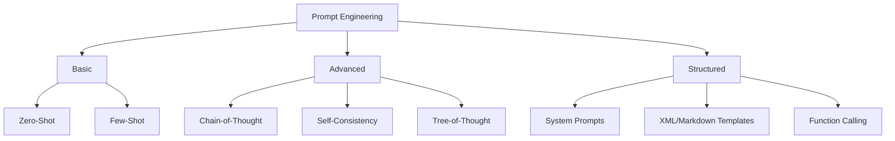
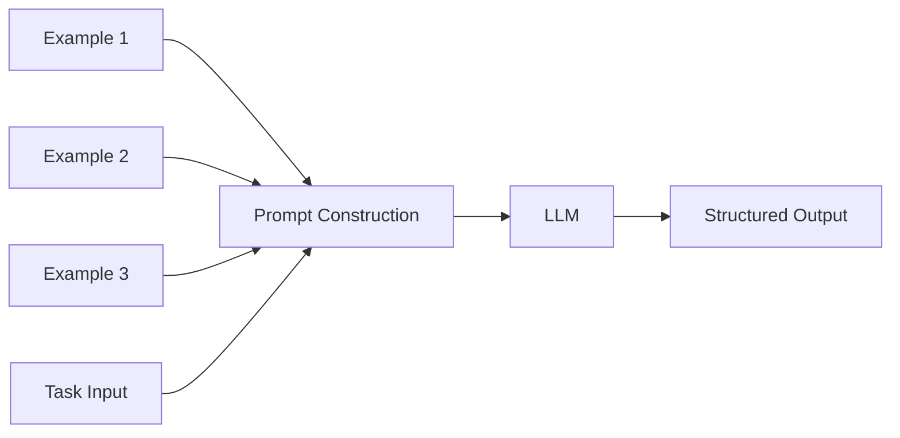
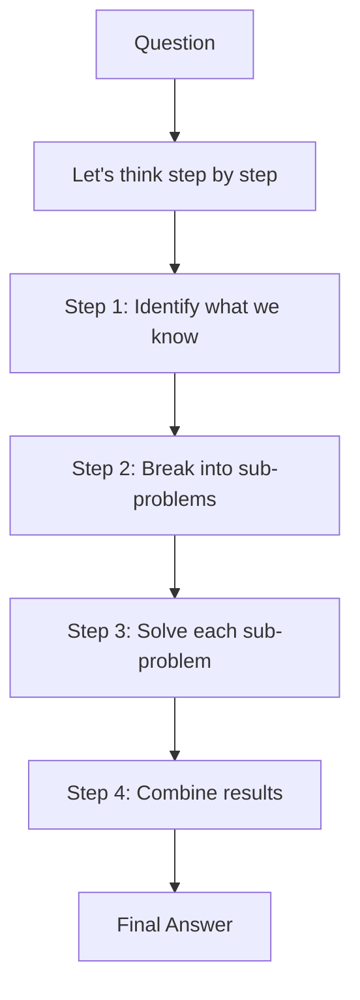
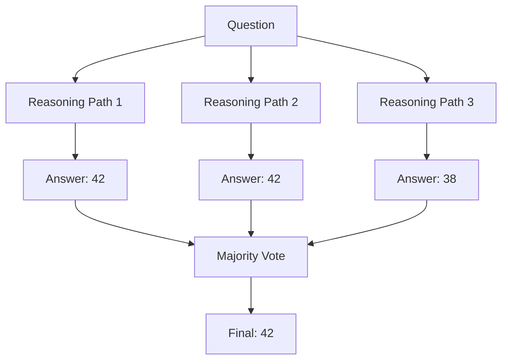
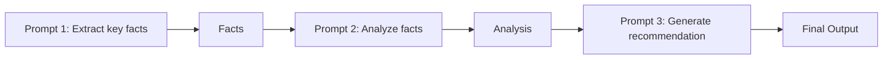
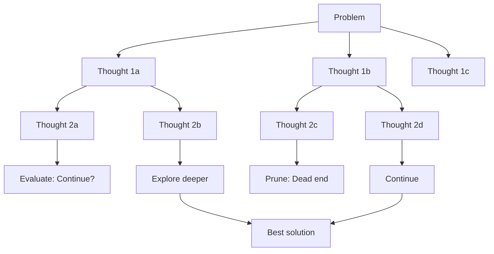
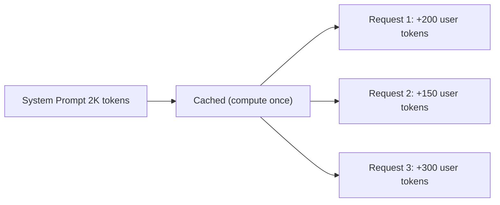

# Prompt Engineering

## Overview

Prompt engineering is the art and science of crafting inputs to LLMs to get desired outputs. Since LLMs are instruction-following systems, how you ask determines what you get. For placement interviews, prompt engineering shows you understand LLM behavior and can use them effectively.

## Prompting Techniques



## Zero-Shot Prompting

The simplest approach — give the model a task with no examples:

```
Classify the sentiment of the following review as positive, negative, or neutral:
"The food was amazing but the service was terrible."
```

**When it works:** Simple tasks where the model has seen similar patterns during pre-training.

**When it fails:** Complex tasks, specific output formats, domain-specific terminology.

## Few-Shot Prompting

Provide examples before the task:

```
Classify the sentiment:

Review: "I loved every minute of it!" → Positive
Review: "Waste of money and time." → Negative
Review: "It was okay, nothing special." → Neutral

Review: "The food was amazing but the service was terrible." →
```

**Key principles:**
- Examples should be diverse and representative
- Order matters (put the most similar example last)
- 3-5 examples is usually optimal
- Match the format you want in the output



## Chain-of-Thought (CoT) Prompting

Encourage the model to reason step-by-step before answering.

### Few-Shot CoT

```
Q: Roger has 5 tennis balls. He buys 2 more cans of tennis balls. Each can has 3 tennis balls. How many tennis balls does he have now?
A: Roger started with 5 balls. 2 cans of 3 balls each is 2 × 3 = 6 balls. 5 + 6 = 11. The answer is 11.

Q: The cafeteria had 23 apples. They used 20 for lunch and bought 6 more. How many apples do they have?
A:
```

### Zero-Shot CoT

Simply append "Let's think step by step" or "Think carefully before answering":

```
Q: If a train travels 60 mph for 2.5 hours, how far does it go?
A: Let's think step by step.
```

**Why CoT works:**
- Breaks complex problems into manageable steps
- Allows the model to use intermediate computations
- Reduces errors on multi-step reasoning
- Provides transparency into the model's reasoning



### CoT Variants

| Technique | Description | Use Case |
|---|---|---|
| **Zero-shot CoT** | "Let's think step by step" | General reasoning |
| **Few-shot CoT** | Examples with reasoning chains | Math, logic |
| **Auto-CoT** | Model generates its own examples | When you lack examples |
| **Self-Consistency** | Sample multiple CoT paths, majority vote | High-stakes reasoning |
| **Tree-of-Thought** | Explore multiple reasoning branches | Complex problems |

## Self-Consistency

Instead of one answer, sample multiple reasoning paths and take the majority vote:



**Why it works:** Different reasoning paths may make different mistakes. The correct answer is more likely to appear across multiple paths.

**Trade-off:** More samples = better accuracy but higher cost and latency.

## System Prompts

System prompts set the model's behavior, persona, and constraints:

```
You are an expert Python developer specializing in data engineering.
You always:
- Write clean, well-documented code
- Include type hints
- Handle edge cases
- Suggest improvements

You never:
- Use deprecated APIs
- Write code without error handling
- Assume the user knows advanced concepts without explanation
```

### System Prompt Best Practices

| Element | Example |
|---|---|
| **Role** | "You are a senior data engineer at a Fortune 500 company" |
| **Constraints** | "Only respond in JSON format" |
| **Style** | "Be concise. Use bullet points." |
| **Knowledge** | "You have expertise in Python, SQL, and Spark" |
| **Boundaries** | "If you don't know, say 'I don't know' rather than guessing" |

## Structured Output Prompts

### JSON Mode

```
Extract the following information from the text and return as JSON:
- name (string)
- age (integer)
- occupation (string)
- skills (array of strings)

Text: "John is a 35-year-old data scientist who knows Python, SQL, and TensorFlow."
```

Expected output:
```json
{
  "name": "John",
  "age": 35,
  "occupation": "data scientist",
  "skills": ["Python", "SQL", "TensorFlow"]
}
```

### XML Tags for Structure

```
<instructions>
Summarize the article in 3 bullet points.
Each bullet should be one sentence.
</instructions>

<article>
{article text}
</article>

<output_format>
- Bullet 1
- Bullet 2
- Bullet 3
</output_format>
```

## Advanced Techniques

### Role Prompting

```
Act as a senior DevOps engineer reviewing a production incident.
The application is a Python Flask API running on Kubernetes.
The error is: "OOMKilled" in pod logs.
```

### Negative Prompting

Tell the model what NOT to do:
```
Explain Docker to a beginner.
Do NOT:
- Use jargon without explaining it
- Assume they know Linux
- Write more than 200 words
```

### Prompt Chaining

Break complex tasks into sequential prompts:



### Meta-Prompting

Ask the model to improve your prompt:
```
I want to get the model to generate Python unit tests.
My current prompt is: "Write tests for this function."
How can I improve this prompt to get better test coverage?
```

## Common Prompt Patterns

### The CRISPE Framework

| Component | Description | Example |
|---|---|---|
| **C**apacity | Role/persona | "You are a Python expert" |
| **R**equest | Task description | "Write a function that..." |
| **I**nsight | Context/background | "The function will be used in..." |
| **S**tyle | Output format | "Use Google-style docstrings" |
| **P**ersonality | Tone | "Be direct and technical" |
| **E**xperiment | Iterate | "Provide 3 alternatives" |

### ReAct Pattern (for Agents)

```
Question: What is the population of the capital of France?

Thought: I need to find the capital of France first.
Action: Search("capital of France")
Observation: Paris is the capital of France.
Thought: Now I need to find Paris's population.
Action: Search("population of Paris 2024")
Observation: Paris has approximately 2.1 million people.
Thought: I have the answer.
Answer: The population of Paris (capital of France) is approximately 2.1 million.
```

## Tree-of-Thought (ToT) Prompting

Tree-of-Thought (Yao et al., 2023) generalizes CoT by exploring multiple reasoning branches:



**How ToT works:**
1. Generate multiple initial thoughts (branches)
2. Evaluate each thought's promise
3. Explore promising branches, prune dead ends
4. Use BFS or DFS to search the thought tree
5. Backtrack when a branch leads to a dead end

**CoT vs ToT:**

| Aspect | CoT | ToT |
|---|---|---|
| Structure | Linear chain | Branching tree |
| Exploration | Single path | Multiple paths |
| Backtracking | No | Yes |
| Cost | 1× | 5-10× (multiple evaluations) |
| Best for | Step-by-step reasoning | Creative problem-solving, puzzles |

**Example (24 game):**
```
Numbers: 4, 5, 6, 10 → Target: 24

Thought 1: Try 4 × 6 = 24, then need 5 and 10 to cancel → 10 - 5 = 5, doesn't work
Thought 2: Try 10 - 6 = 4, then 4 × 5 = 20, + 4 = 24 → Yes! (10-6) × 5 + 4 = 24
Thought 3: Try 5 × 6 = 30, then 30 - 10 + 4 = 24 → Yes!
```

## Structured Output Generation

### Function Calling / Tool Use

Modern LLMs support structured function calling:

```json
{
  "tools": [{
    "type": "function",
    "function": {
      "name": "get_weather",
      "description": "Get current weather for a city",
      "parameters": {
        "type": "object",
        "properties": {
          "city": {"type": "string"},
          "units": {"type": "string", "enum": ["celsius", "fahrenheit"]}
        },
        "required": ["city"]
      }
    }
  }]
}
```

The model outputs a structured JSON call instead of free text:
```json
{"name": "get_weather", "arguments": {"city": "San Francisco", "units": "celsius"}}
```

### JSON Mode and Constrained Decoding

| Method | How It Works | Reliability |
|---|---|---|
| **Prompt-based** | "Return valid JSON" in prompt | ~80% valid |
| **JSON mode** (OpenAI) | `response_format: {type: 'json_object'}` | ~95% valid |
| **Constrained decoding** | Grammar-based token masking (Outlines, Guidance) | 100% valid |
| **Structured outputs** (OpenAI) | JSON Schema enforcement | 100% valid |

**Constrained decoding** guarantees valid output by masking invalid tokens at each step:

```python
# Using Outlines library
import outlines

model = outlines.models.transformers("meta-llama/Llama-3-8B")

# Define schema
schema = '{"name": str, "age": int, "skills": [str]}'

# Generate guaranteed-valid JSON
result = outlines.generate.json(model, schema)("Extract info from: John, 35, Python/SQL")
```

## Prompt Caching

Many providers cache common prompt prefixes to reduce cost and latency:



**Provider support:**
| Provider | Feature | Savings |
|---|---|---|
| OpenAI | Automatic prefix caching | 50% cost on cached tokens |
| Anthropic | Prompt caching (beta) | 90% cost reduction on cached prefix |
| Google | Context caching | ~75% cost reduction |
| vLLM | `--enable-prefix-caching` | Free (open-source) |

**Best practices:**
- Put system prompt and static context at the beginning
- Keep frequently-used prefixes consistent across requests
- For RAG: cache the system prompt + few-shot examples, vary only the query + retrieved chunks

## DSPy: Programmatic Prompt Optimization

DSPy (Stanford, 2023) treats prompt engineering as a programming problem:

```python
import dspy

class RAG(dspy.Module):
    def __init__(self):
        self.retrieve = dspy.Retrieve(k=5)
        self.generate = dspy.ChainOfThought("context, question -> answer")
    
    def forward(self, question):
        context = self.retrieve(question)
        return self.generate(context=context, question=question)

# Optimize prompts automatically
from dspy.teleprompt import BootstrapFewShot
optimizer = BootstrapFewShot(metric=answer_correctness)
compiled_rag = optimizer.compile(RAG(), trainset=train_data)
```

**Why DSPy matters:**
- Automates few-shot example selection
- Optimizes prompts for specific metrics
- Compiles natural language programs into effective prompts
- Bridges the gap between prompt engineering and ML training

## Interview Questions

### Q1: What is Chain-of-Thought prompting and why does it work?
**Answer:** CoT prompting encourages the model to show intermediate reasoning steps before giving a final answer. It works because:
1. It decomposes complex problems into simpler sub-problems
2. Each step can be verified independently
3. It allows the model to use intermediate "scratchpad" computations
4. It reduces errors on multi-step reasoning tasks (math, logic, code)

Zero-shot CoT ("Let's think step by step") is simple but effective. Few-shot CoT (providing examples with reasoning chains) is more reliable for complex tasks.

### Q2: How do you choose between zero-shot, few-shot, and CoT prompting?
**Answer:**
- **Zero-shot**: Simple tasks the model has seen during training (classification, translation)
- **Few-shot**: Tasks requiring specific format or domain knowledge; 3-5 diverse examples
- **CoT**: Multi-step reasoning (math, logic, planning); use few-shot CoT for reliability
- **Self-Consistency**: High-stakes reasoning where accuracy matters more than cost
- **Rule of thumb**: Start with zero-shot. If quality is low, try few-shot. If reasoning is needed, add CoT.

### Q3: What makes a good system prompt?
**Answer:** A good system prompt defines:
1. **Role**: Who the model is ("You are a senior Python developer")
2. **Constraints**: What to do/not do ("Always include error handling")
3. **Output format**: How to respond ("Return valid JSON")
4. **Tone**: How to communicate ("Be concise and technical")
5. **Knowledge boundaries**: What the model knows/don't know ("If unsure, say 'I don't know'")

Bad system prompts are vague ("Be helpful"). Good ones are specific and actionable.

### Q4: What is self-consistency and when should you use it?
**Answer:** Self-consistency samples multiple reasoning paths for the same question and takes the majority vote of the final answers. It works because different paths may make different mistakes, but the correct answer is more likely to appear consistently. Use it when:
- Accuracy is critical (medical, legal, financial)
- The task involves multi-step reasoning
- You can afford the extra cost/latency (typically 3-5x)
- Single-path CoT is unreliable

## Common Mistakes

- ❌ Vague prompts ("Tell me about Python" → too broad)
- ❌ No output format specification (model may return paragraphs when you want JSON)
- ❌ Too many examples in few-shot (confuses the model, wastes context window)
- ❌ Not testing prompts across different inputs (edge cases)
- ❌ Ignoring token limits (prompt + output must fit in context window)
- ❌ Assuming the model "understands" — it follows patterns, not instructions literally

## Summary

Prompt engineering is the primary interface for using LLMs. Techniques range from simple zero-shot to advanced CoT, ToT, and self-consistency. System prompts set behavior, few-shot examples teach format, and CoT enables reasoning. Structured outputs via function calling and constrained decoding guarantee valid JSON/XML. Prompt caching reduces cost by 50-90% for repeated prefixes. DSPy automates prompt optimization as a programming problem. The key is matching the technique to the task complexity and iterating based on results.

## References

1. Wei et al., "Chain-of-Thought Prompting Elicits Reasoning in Large Language Models", NeurIPS 2022
2. Yao et al., "Tree of Thoughts: Deliberate Problem Solving with Large Language Models", NeurIPS 2023
3. Wang et al., "Self-Consistency Improves Chain of Thought Reasoning in Language Models", ICLR 2023
4. Khattab et al., "DSPy: Compiling Declarative Language Model Calls into Self-Improving Pipelines", ICLR 2024
5. Kojima et al., "Large Language Models are Zero-Shot Reasoners", NeurIPS 2022
6. Willard & Lou, "Efficient Guided Generation for Large Language Models", 2023 (Outlines)
7. White et al., "A Prompt Pattern Catalog to Enhance Prompt Engineering with ChatGPT", 2023

## Cross-References

- [Chain-of-Thought →](../agents/chain-of-thought.md) Detailed CoT techniques
- [ReAct →](../agents/react.md) Reasoning + Acting pattern
- [RAG →](rag.md) Augmenting prompts with retrieved context
- [SFT →](sft.md) How models learn to follow prompts
- [Tool Calling →](../agents/tool-calling.md) Function calling with prompts
