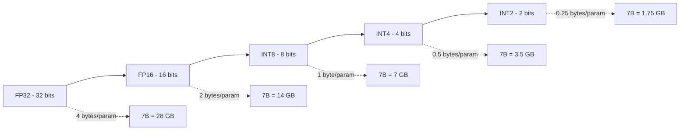
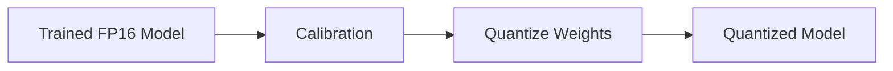
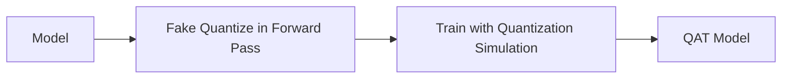
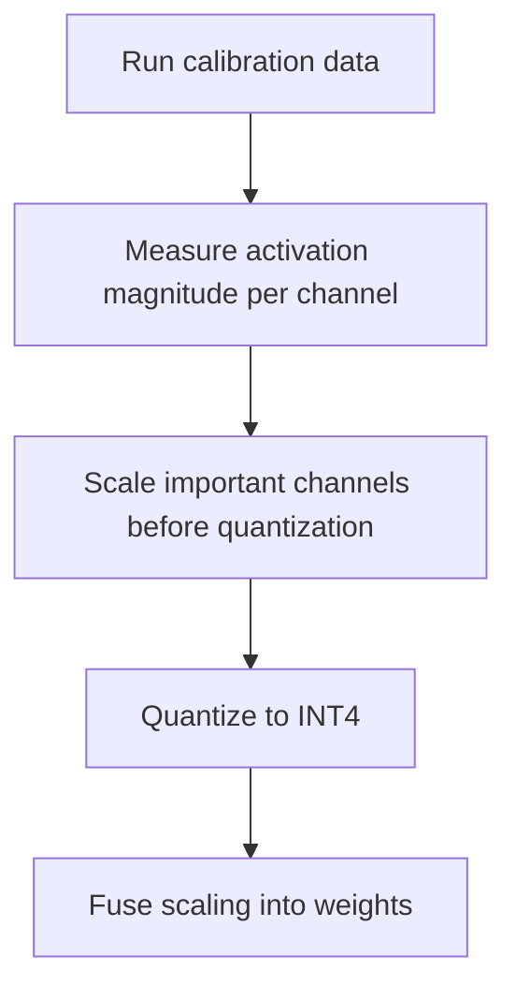
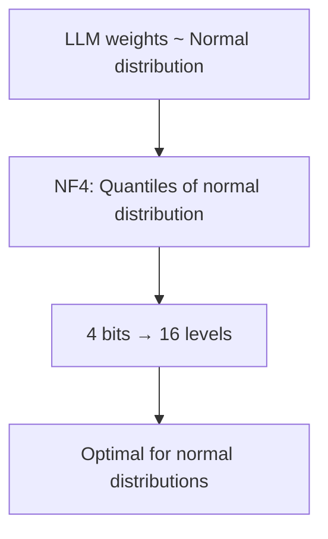
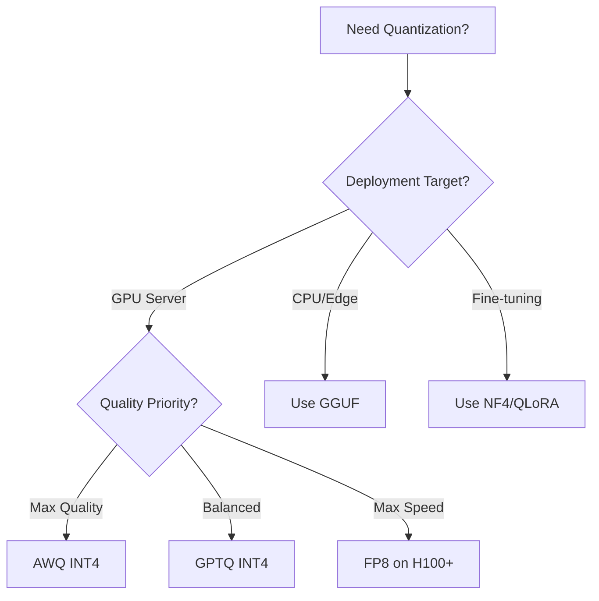
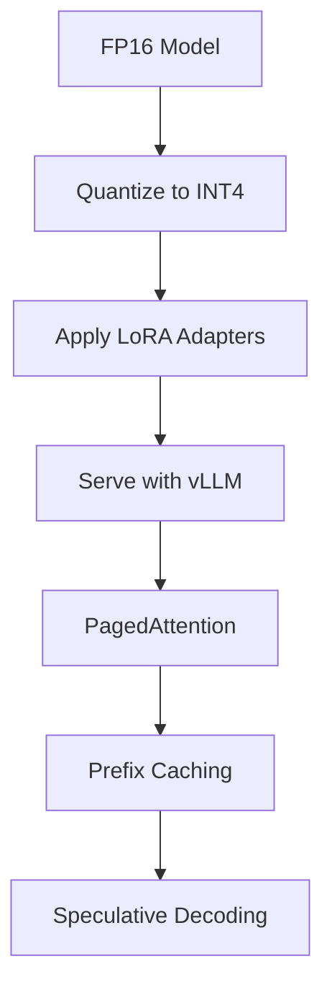

# Quantization

## Overview

Quantization reduces the precision of model weights (and optionally activations) from floating-point to lower-bit representations. This reduces memory usage, improves inference speed, and lowers cost — with minimal quality loss. For LLMs, quantization is essential for serving models on consumer hardware and reducing GPU requirements in production.

## Precision Levels



## Quantization Methods

### Post-Training Quantization (PTQ)

Quantize after training without retraining:



### Quantization-Aware Training (QAT)

Simulate quantization during training:



QAT is more accurate but rarely used for LLMs due to training cost.

## Key Quantization Methods

### GPTQ (GPT Quantization)

Post-training quantization to INT4/INT3 using layer-wise optimization:

```mermaid
graph TD
    LAYER[Weight Matrix W] --> HESSIAN[Compute Hessian (importance)]
    HESSIAN --> GROUP[Group columns (128 typical)]
    GROUP --> QUANTIZE[Quantize each group]
    QUANTIZE --> COMPENSATE[Compensate error using Hessian]
    COMPENSATE --> NEXT[Move to next layer]
```

**How GPTQ works:**
1. Process one layer at a time
2. Compute the Hessian (second-order information) to determine weight importance
3. Quantize weights in groups (e.g., 128 columns)
4. Use the Hessian to redistribute quantization error to unquantized weights
5. Move to next layer

**GPTQ Configuration:**
```python
from transformers import AutoModelForCausalLM, GPTQConfig

quantization_config = GPTQConfig(
    bits=4,                    # 4-bit quantization
    dataset="c4",             # Calibration dataset
    group_size=128,           # Quantization group size
    desc_act=True,            # Descending activation order
)

model = AutoModelForCausalLM.from_pretrained(
    "model-name",
    quantization_config=quantization_config,
    device_map="auto"
)
```

### AWQ (Activation-Aware Weight Quantization)

Protects important weights based on activation patterns:



**Key insight:** Not all weights are equally important. Weights that receive large activations should be quantized more carefully (or left at higher precision). AWQ identifies these channels and scales them to protect precision.

**AWQ vs GPTQ:**

| Aspect | GPTQ | AWQ |
|---|---|---|
| **Method** | Hessian-based error compensation | Activation-aware scaling |
| **Speed** | Slower quantization | Faster quantization |
| **Quality** | Good | Slightly better |
| **Hardware** | General | Optimized kernels |
| **Group size** | 128 typical | 128 typical |

### GGUF (llama.cpp format)

GGUF is the quantization format used by llama.cpp and Ollama:

| Type | Bits/Weight | Quality | Speed |
|---|---|---|---|
| **Q2_K** | 2.6 | Low | Fastest |
| **Q3_K_M** | 3.9 | Fair | Fast |
| **Q4_0** | 4.5 | Good | Good |
| **Q4_K_M** | 4.8 | Good | Good |
| **Q5_K_M** | 5.7 | Very good | Moderate |
| **Q6_K** | 6.6 | Excellent | Slower |
| **Q8_0** | 8.5 | Near-lossless | Slowest |

```python
# Convert model to GGUF
python convert_hf_to_gguf.py model-name --outfile model.gguf

# Quantize
./llama-quantize model.gguf model-q4_k_m.gguf Q4_K_M
```

### bitsandbytes (BNB)

Dynamic quantization integrated with Hugging Face:

```python
import torch
from transformers import AutoModelForCausalLM, BitsAndBytesConfig

# 8-bit quantization
bnb_config_8bit = BitsAndBytesConfig(load_in_8bit=True)

# 4-bit NF4 quantization (used by QLoRA)
bnb_config_4bit = BitsAndBytesConfig(
    load_in_4bit=True,
    bnb_4bit_quant_type="nf4",           # NormalFloat4
    bnb_4bit_compute_dtype=torch.bfloat16,
    bnb_4bit_use_double_quant=True,       # Double quantization
)

model = AutoModelForCausalLM.from_pretrained(
    "model-name",
    quantization_config=bnb_config_4bit,
    device_map="auto"
)
```

## NF4 (4-bit NormalFloat)

NF4 (Dettmers et al., 2023) is an information-theoretically optimal quantization for normally distributed weights:



Standard INT4 uses uniform spacing. NF4 uses non-uniform spacing that matches the normal distribution — more levels near zero where most weights are.

## Quantization Trade-offs

| Precision | Memory (7B) | Speed | Quality Loss | Use Case |
|---|---|---|---|---|
| FP16 | 14 GB | Baseline | None | Production baseline |
| INT8 | 7 GB | 1.5-2× | <0.5% perplexity | Production standard |
| INT4 (GPTQ/AWQ) | 3.5 GB | 2-3× | 1-3% perplexity | Consumer GPUs |
| INT4 (NF4/QLoRA) | 3.5 GB | 2-3× | 1-2% perplexity | Fine-tuning |
| INT3 | 2.6 GB | 2-4× | 3-5% perplexity | Very tight memory |
| INT2 | 1.75 GB | 3-5× | 5-10% perplexity | Extreme compression |

## Activation Quantization

Weight quantization is common; activation quantization is harder:

| Approach | Weights | Activations | Complexity |
|---|---|---|---|
| **W-only** | INT4/INT8 | FP16 | Simple |
| **W+A** | INT8 | INT8 | Moderate |
| **W4A8** | INT4 | INT8 | Advanced |
| **FP8** | FP8 | FP8 | NVIDIA H100+ |

### FP8 (Float8)

FP8 is emerging as the standard for H100/H200 GPUs:

```
FP8 E4M3: 4-bit exponent, 3-bit mantissa (for weights)
FP8 E5M2: 5-bit exponent, 2-bit mantissa (for gradients)
```

- 2× memory reduction vs FP16
- Near-lossless quality
- Hardware support on H100+
- Used in TensorRT-LLM, vLLM

## SmoothQuant

SmoothQuant (Xiao et al., 2023) makes activation quantization easier by migrating quantization difficulty from activations to weights:

```
Y = (X · diag(s)^{-1}) · (diag(s) · W) = X̂ · Ŵ
```

**Key insight:** Activations have outliers (some channels have very large values), making them hard to quantize. By dividing activations by a scaling factor s and multiplying weights by s, we smooth out the outliers. Both X̂ and Ŵ are easier to quantize.

## Quantization Benchmarks

Real-world perplexity impact on LLaMA-2-7B (measured on WikiText-2):

| Method | Bits | Perplexity | Relative Loss | Memory |
|---|---|---|---|---|
| FP16 (baseline) | 16 | 5.47 | — | 14 GB |
| GPTQ | 4 (g128) | 5.63 | +2.9% | 3.8 GB |
| AWQ | 4 (g128) | 5.60 | +2.4% | 3.8 GB |
| BNB NF4 | 4 | 5.68 | +3.8% | 3.8 GB |
| GGUF Q4_K_M | 4.8 | 5.55 | +1.5% | 4.2 GB |
| GGUF Q3_K_M | 3.9 | 5.82 | +6.4% | 3.4 GB |
| GGUF Q2_K | 2.6 | 6.65 | +21.6% | 2.3 GB |

**Key takeaways:**
- INT4 methods (GPTQ, AWQ, NF4) show 2-4% perplexity increase — acceptable for most applications
- Below INT4, quality degrades rapidly
- AWQ slightly outperforms GPTQ in most benchmarks
- GGUF Q4_K_M offers the best quality-to-size ratio for CPU/edge deployment
- Larger models (70B) tolerate quantization better than smaller models (7B)

### Quantization Impact on Downstream Tasks

| Task | FP16 | GPTQ-4 | AWQ-4 | Q4_K_M |
|---|---|---|---|---|
| MMLU (knowledge) | 46.2% | 45.5% | 45.8% | 45.0% |
| GSM8K (math) | 14.6% | 13.8% | 14.1% | 13.2% |
| HumanEval (code) | 12.8% | 12.2% | 12.5% | 11.6% |
| TruthfulQA | 38.3% | 37.9% | 38.1% | 37.4% |

Task-level degradation is typically smaller than perplexity suggests because most tasks don't depend on exact probability calibration.

## KV Cache Quantization

Separate from weight quantization, KV cache can also be quantized during inference:

| KV Precision | Memory Reduction | Quality Impact | Implementation |
|---|---|---|---|
| FP16 | 1× | None | Default |
| FP8 (E4M3) | 2× | <0.1% | H100+ native |
| INT8 | 2× | <0.5% | vLLM, TensorRT-LLM |
| INT4 | 4× | ~1% | Experimental |

**FP8 KV cache** is the sweet spot for H100/H200 deployments — 2× memory savings with negligible quality loss.

```python
# vLLM with KV cache quantization
from vllm import LLM

llm = LLM(
    model="meta-llama/Llama-3-8B",
    kv_cache_dtype="fp8",  # FP8 KV cache
    gpu_memory_utilization=0.90,
)
```

## Practical Deployment Guide

### Choosing a Quantization Method



### Decision Matrix

| Scenario | Recommended Method | Why |
|---|---|---|
| Production GPU server (A100) | GPTQ or AWQ INT4 | Best quality/speed trade-off |
| Production GPU server (H100) | FP8 | Native hardware support, near-lossless |
| Consumer GPU (24GB) | AWQ INT4 or BNB NF4 | Fits 7B-13B models |
| CPU inference / Ollama | GGUF Q4_K_M | Optimized for llama.cpp |
| Edge deployment (mobile) | GGUF Q3_K_M or Q2_K | Extreme compression |
| Fine-tuning (QLoRA) | BNB NF4 | HuggingFace integration |
| Maximum throughput | W4A8 (SmoothQuant) | Integer GEMM on GPU |

### Combining Quantization with Other Optimizations



**Stacking optimizations:**
1. Quantize base model (GPTQ/AWQ) → 4× memory reduction
2. Apply LoRA for task adaptation → minimal extra memory
3. Serve with vLLM → PagedAttention for KV cache efficiency
4. Enable prefix caching → 5-10× for shared system prompts
5. Add speculative decoding → 2-3× latency improvement

## Interview Questions

### Q1: Explain the difference between GPTQ and AWQ.
**Answer:**
- **GPTQ**: Uses second-order (Hessian) information to determine weight importance. Quantizes layer-by-layer, using the Hessian to redistribute quantization error to unquantized weights. Good general-purpose method.
- **AWQ**: Uses activation magnitudes to identify important weight channels. Scales important channels before quantization to protect their precision. Often slightly better quality and faster inference with optimized kernels.
- Both are post-training methods that quantize to INT4 with group-wise quantization (group_size=128 typical).

### Q2: What is NF4 and why is it better than INT4 for LLMs?
**Answer:** NF4 (NormalFloat4) is a quantization format where the 16 quantization levels are placed at the quantiles of a standard normal distribution. Since LLM weights are approximately normally distributed, NF4 is information-theoretically optimal — it minimizes quantization error for normally distributed data. Standard INT4 uses uniform spacing, which wastes levels on regions where few weights exist. NF4 is used in QLoRA for 4-bit fine-tuning.

### Q3: How does group_size affect quantization quality?
**Answer:** Group size determines how many weights share the same quantization parameters (scale and zero-point). Smaller group size (e.g., 32) = more accurate but more overhead (more scales to store). Larger group size (e.g., 128) = less accurate but less overhead. Common choice is 128, which provides a good balance. The overhead per parameter is: log2(group_size) / group_size bits.

### Q4: Can you quantize a model to 2 bits?
**Answer:** Technically yes (Q2_K in GGUF), but quality degrades significantly. At 2 bits, you only have 4 possible values per weight. Large models (70B+) can sometimes tolerate 2-bit quantization better than small models because the redundancy is higher. However, for production use, INT4 is typically the minimum for acceptable quality. INT2 is mainly used for extreme edge deployment or research.

### Q5: What is the difference between weight-only and weight+activation quantization?
**Answer:**
- **Weight-only**: Only model weights are quantized (INT4/INT8). Activations remain FP16. Simpler, widely supported, good quality.
- **Weight+activation (W+A)**: Both weights and activations are quantized (e.g., W8A8). Better throughput (integer GEMM is faster) but harder to maintain quality due to activation outliers. Requires techniques like SmoothQuant.
- **W4A8**: Weights in INT4, activations in INT8. Emerging standard balancing quality and speed.

## Common Mistakes

- ❌ Assuming INT4 is always "good enough" (quality depends on model, task, and method)
- ❌ Not testing quantized models on your specific use case before deploying
- ❌ Forgetting that quantization affects different layers differently (some are more sensitive)
- ❌ Confusing weight quantization with activation quantization
- ❌ Ignoring that KV cache can also be quantized (separate from weight quantization)

## Summary

Quantization reduces LLM memory and compute by using lower-precision representations. GPTQ and AWQ are the main INT4 methods for production. NF4 is optimal for normally distributed weights (used in QLoRA). GGUF is the standard for CPU/edge deployment. FP8 is emerging for H100+ GPUs with near-lossless quality. INT4 quantization typically shows 2-4% perplexity increase but minimal downstream task degradation. The choice depends on deployment target: AWQ/GPTQ for GPU servers, GGUF for CPU/edge, FP8 for H100+. Stacking quantization with LoRA, PagedAttention, and speculative decoding maximizes efficiency.

## References

1. Dettmers et al., "QLoRA: Efficient Finetuning of Quantized LLMs", NeurIPS 2023
2. Frantar et al., "GPTQ: Accurate Post-Training Quantization for Generative Pre-trained Transformers", ICLR 2023
3. Lin et al., "AWQ: Activation-aware Weight Quantization for LLM Compression and Acceleration", MLSys 2024
4. Xiao et al., "SmoothQuant: Accurate and Efficient Post-Training Quantization for LLMs", ICML 2023
5. Dettmers et al., "LLM.int8(): 8-bit Matrix Multiplication for Transformers at Scale", 2022
6. Micikevicius et al., "FP8 Formats for Deep Learning", 2022
7. llama.cpp / GGUF format specification, Georgi Gerganov, 2023-2025

## Cross-References

- [Architecture →](architecture.md) Weight matrices being quantized
- [KV Cache →](kv-cache.md) KV cache quantization
- [SFT →](sft.md) QLoRA fine-tuning with NF4
- [Inference →](inference.md) Speed improvements from quantization
- [vLLM →](vllm.md) Quantized model serving
- [Ollama →](ollama.md) GGUF model deployment
- [ML Quantization](../ml/advanced/quantization.md)
- [TensorRT](./tensorrt.md)
- [Model Compression](../ml/advanced/compression.md)
