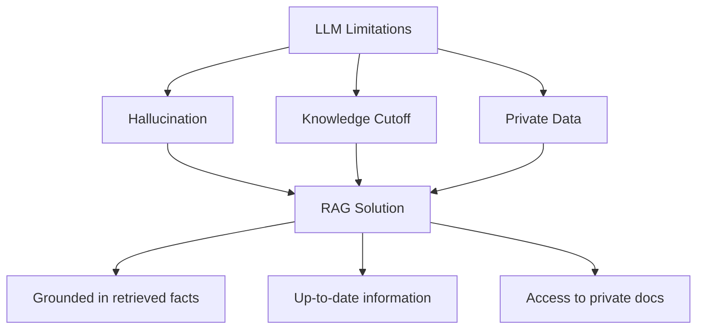
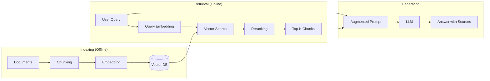
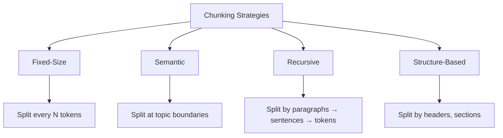
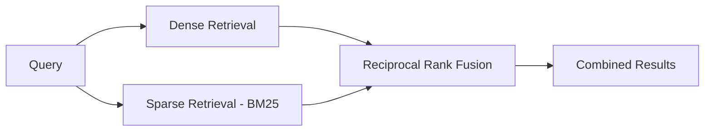
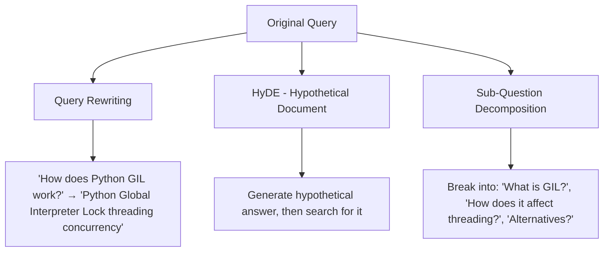
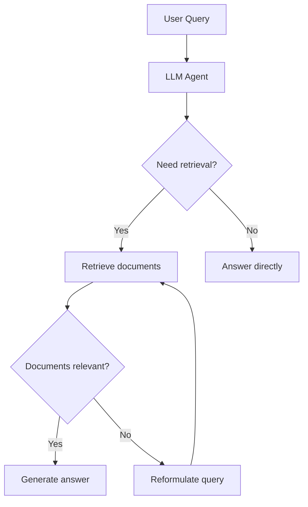

# RAG (Retrieval-Augmented Generation)

## Overview

RAG (Retrieval-Augmented Generation) enhances LLM responses by retrieving relevant documents from an external knowledge base before generating an answer. This solves two fundamental LLM limitations: **knowledge cutoff** (the model only knows what it was trained on) and **hallucination** (the model generates plausible but incorrect facts).

RAG is one of the most important production patterns for LLMs and a favorite interview topic.

## Why RAG?



| Approach | Pros | Cons |
|---|---|---|
| **Fine-tuning** | Model knows the domain | Expensive, needs retraining, can hallucinate |
| **RAG** | Always current, source-cited, cheaper | Retrieval quality limits answer quality |
| **Long context** | Simple, no retrieval needed | Expensive, "lost in the middle" problem |

## RAG Architecture



## Document Chunking

### Why Chunk?

LLMs have limited context windows. Documents must be split into manageable pieces that:
- Fit within the context window
- Maintain semantic coherence
- Are small enough for precise retrieval

### Chunking Strategies



| Strategy | How It Works | Best For |
|---|---|---|
| **Fixed-size** | Split every N tokens with overlap | Simple, fast |
| **Recursive** | Try paragraph → sentence → token splits | General purpose |
| **Semantic** | Embed and split when similarity drops | Topic-diverse docs |
| **Structure-based** | Split by headers, markdown sections | Structured documents |
| **Parent-child** | Small chunks for retrieval, return parent for context | Precision + context |

### Chunk Size Trade-offs

| Size | Precision | Context | Use Case |
|---|---|---|---|
| 100-256 tokens | High | Low | Factoid QA |
| 256-512 tokens | Good | Good | General QA |
| 512-1024 tokens | Moderate | High | Summarization |
| 1024+ tokens | Low | Very high | Long-form analysis |

**Overlap**: 10-20% overlap between chunks prevents information loss at boundaries.

## Embedding Models

Embedding models convert text into dense vectors for similarity search:

| Model | Dimensions | Max Tokens | Quality |
|---|---|---|---|
| **OpenAI text-embedding-3-small** | 1536 | 8191 | Good |
| **OpenAI text-embedding-3-large** | 3072 | 8191 | Excellent |
| **Cohere embed-v3** | 1024 | 512 | Excellent |
| **BGE-M3** | 1024 | 8192 | Excellent (multilingual) |
| **E5-mistral-7b** | 4096 | 32768 | State-of-art |
| **Nomic Embed** | 768 | 8192 | Good, open-source |

## Vector Databases

| Database | Type | Key Feature |
|---|---|---|
| **Pinecone** | Managed | Easy to use, serverless |
| **Weaviate** | Self-hosted/Managed | Hybrid search, modules |
| **Qdrant** | Self-hosted/Managed | High performance, Rust |
| **Chroma** | Embedded | Simple, lightweight |
| **Milvus** | Self-hosted | Scalable, GPU support |
| **pgvector** | PostgreSQL extension | Existing PostgreSQL infra |
| **FAISS** | Library | Meta, CPU/GPU, not a DB |

### Similarity Metrics

```python
# Cosine similarity (most common)
sim(A, B) = (A · B) / (||A|| × ||B||)

# Euclidean distance
dist(A, B) = ||A - B||₂

# Dot product
sim(A, B) = A · B
```

Cosine similarity is preferred for normalized embeddings. Dot product is faster for pre-normalized vectors.

## Retrieval Strategies

### Dense Retrieval

Standard vector similarity search:

```python
query_embedding = embed_model.encode("What is RAG?")
results = vector_db.search(query_embedding, top_k=10)
```

### Sparse Retrieval (BM25)

Traditional keyword-based retrieval:

```python
from rank_bm25 import BM25Okapi
bm25 = BM25Okapi(corpus_tokens)
scores = bm25.get_scores(query_tokens)
```

### Hybrid Retrieval

Combine dense and sparse for best results:



**Reciprocal Rank Fusion (RRF):**
```
RRF(d) = Σ 1/(k + rank_i(d))
```
where k=60 (typical constant) and rank_i is the rank in retrieval system i.

### Reranking

After initial retrieval, rerank results with a cross-encoder:


| Reranker | Type | Quality |
|---|---|---|
| **Cohere Rerank** | API | Excellent |
| **BGE-Reranker** | Open-source | Very good |
| **Cross-encoder (ms-marco)** | Open-source | Good |
| **ColBERT** | Late interaction | Good, fast |

Cross-encoders are more accurate than bi-encoders because they see query and document together, but they're slower (can't pre-compute embeddings).

## Advanced RAG Patterns

### Query Transformation



### HyDE (Hypothetical Document Embeddings)

1. Ask the LLM to generate a hypothetical answer
2. Embed the hypothetical answer (not the query)
3. Search for documents similar to the hypothetical answer

**Why it works:** The hypothetical answer is in "document space" rather than "query space," leading to better retrieval.

### Agentic RAG

The LLM decides when and how to retrieve:



## RAG Evaluation

| Metric | What It Measures |
|---|---|
| **Context Precision** | Are retrieved chunks relevant? |
| **Context Recall** | Did we retrieve all necessary information? |
| **Faithfulness** | Is the answer grounded in retrieved context? |
| **Answer Relevance** | Does the answer address the question? |

**Frameworks:** RAGAS, TruLens, DeepEval

## Interview Questions

### Q1: Explain the RAG pipeline and its components.
**Answer:** RAG has three phases:
1. **Indexing**: Documents are chunked, embedded into vectors, and stored in a vector database
2. **Retrieval**: The user query is embedded, similar chunks are found via vector search, optionally reranked
3. **Generation**: Retrieved chunks are inserted into the prompt alongside the query, and the LLM generates an answer grounded in the retrieved context

Key components: chunking strategy, embedding model, vector database, retrieval method (dense/sparse/hybrid), reranker, and the LLM.

### Q2: What is the difference between dense and sparse retrieval?
**Answer:**
- **Sparse retrieval (BM25)**: Matches keywords. Fast, interpretable, but misses semantic similarity ("car" won't match "automobile")
- **Dense retrieval**: Uses embedding vectors. Captures semantic similarity but may miss exact keyword matches
- **Hybrid**: Combines both using RRF or other fusion methods. Best of both worlds in practice

### Q3: How do you handle chunking for documents with tables and images?
**Answer:**
- **Tables**: Extract as markdown/HTML, keep as separate chunks with surrounding context. Some embedding models handle structured data better
- **Images**: Use multimodal embedding models (CLIP) or describe images with a vision model, then embed the description
- **Mixed content**: Structure-aware chunking that respects document boundaries (headers, sections)
- **Parent-child chunks**: Small chunks for precise retrieval, but return the parent section for full context

### Q4: What is HyDE and when is it useful?
**Answer:** HyDE (Hypothetical Document Embeddings) generates a hypothetical answer to the query, then uses that answer (not the query) for retrieval. It works because queries and documents are in different semantic spaces — a question and its answer are different. The hypothetical answer is closer to actual documents in embedding space. Useful when queries are short or ambiguous, but adds latency (extra LLM call).

### Q5: How do you evaluate RAG quality?
**Answer:** Key metrics:
- **Context Precision/Recall**: Retrieval quality (are we finding the right chunks?)
- **Faithfulness**: Is the answer grounded in retrieved context (not hallucinated)?
- **Answer Relevance**: Does the answer address the question?
- **End-to-end**: Human evaluation, task completion rate

Tools: RAGAS framework, TruLens, manual evaluation on a golden test set.

## Common Mistakes

- ❌ Chunks too large (dilutes relevant information) or too small (loses context)
- ❌ No overlap between chunks (information at boundaries is lost)
- ❌ Using only dense retrieval (missing exact keyword matches)
- ❌ No reranking (initial retrieval may not be optimal)
- ❌ Not evaluating retrieval separately from generation
- ❌ Ignoring the "lost in the middle" problem with many retrieved chunks

## Summary

RAG grounds LLM outputs in retrieved external knowledge, reducing hallucination and enabling access to current/private data. The pipeline involves chunking, embedding, retrieval (dense/sparse/hybrid), reranking, and generation. Advanced patterns like HyDE, query transformation, and agentic RAG improve quality. Proper chunking and retrieval evaluation are critical for production RAG systems.

## Cross-References

- [Embeddings →](embeddings.md) How text is vectorized
- [Prompt Engineering →](prompt-engineering.md) Constructing the augmented prompt
- [Agent Planning →](../../ml/agents/planning.md) Agentic RAG patterns
- [Evaluation →](evaluation.md) Measuring LLM quality
