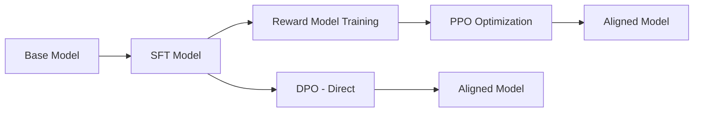
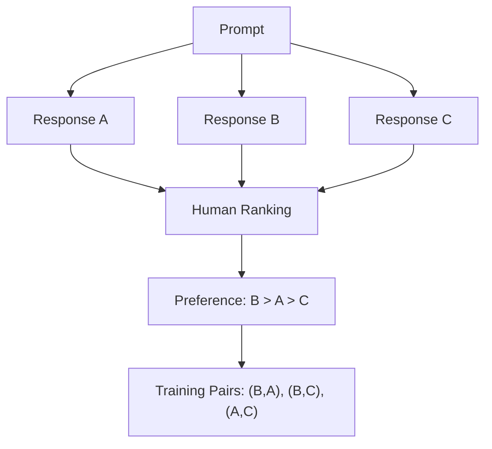
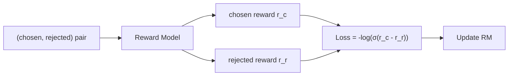
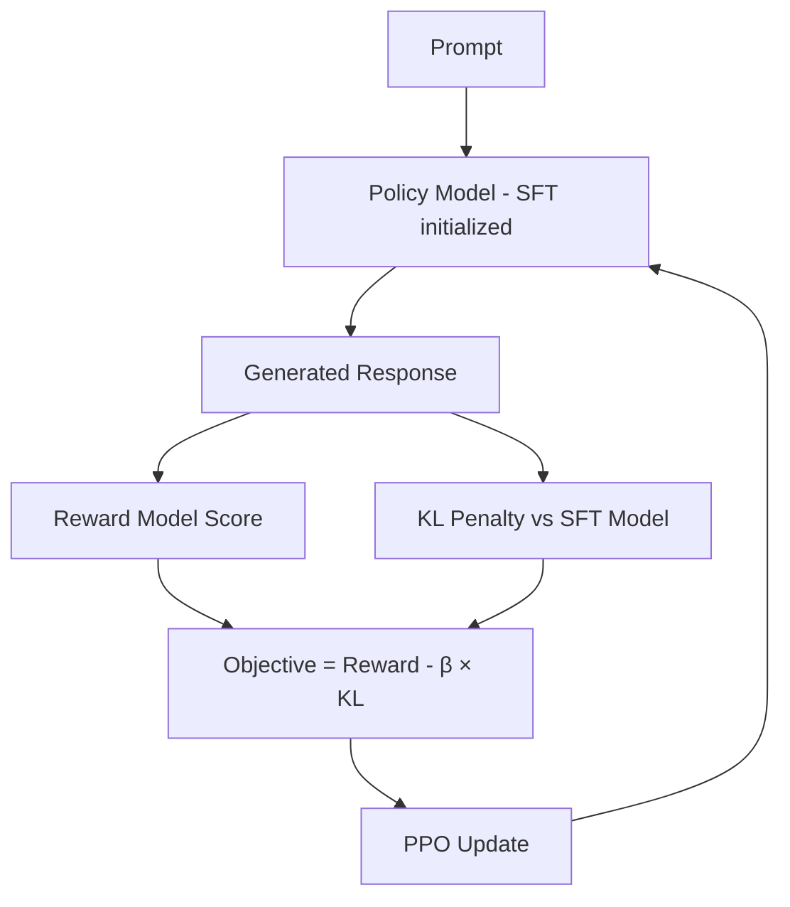
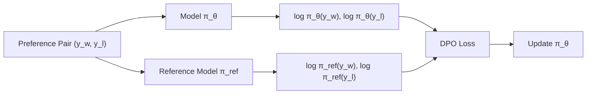
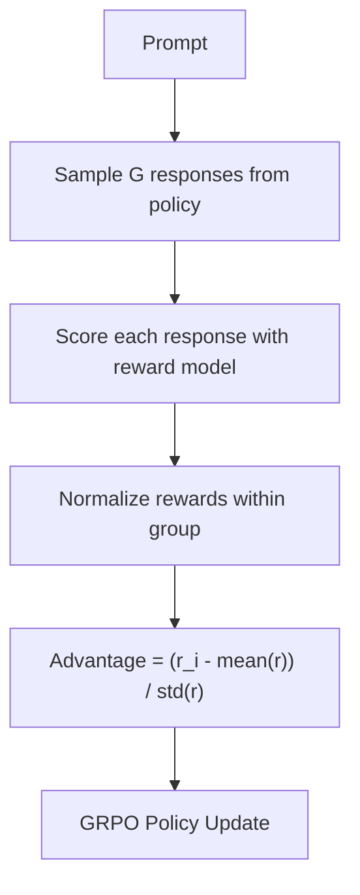
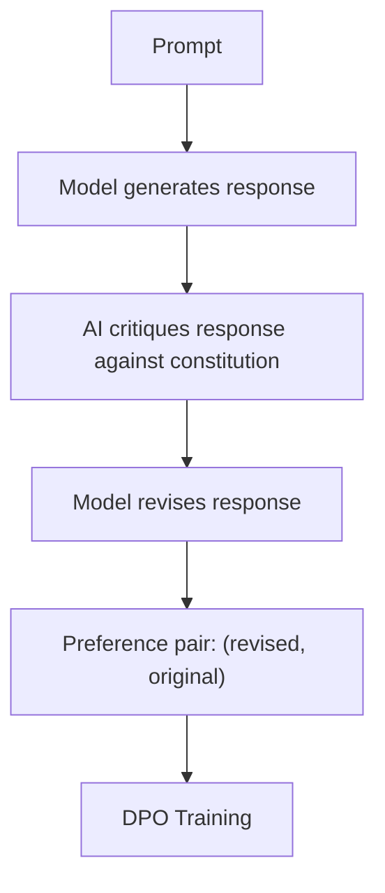
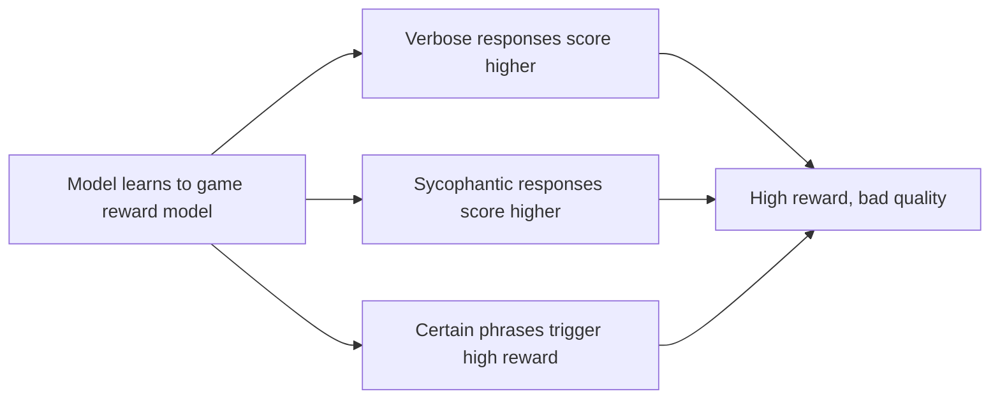

# RLHF & DPO

## Overview

RLHF (Reinforcement Learning from Human Feedback) and DPO (Direct Preference Optimization) are alignment techniques that make LLMs helpful, harmless, and honest (HHH). After SFT teaches the model to follow instructions, RLHF/DPO fine-tune it to match human preferences — choosing better responses over worse ones.

This is the final stage in the LLM training pipeline and is responsible for the "polish" that separates a good model from a great one.

## The Alignment Pipeline



## RLHF: Reinforcement Learning from Human Feedback

### Step 1: Collect Preference Data

For each prompt, generate multiple responses and ask humans to rank them:

```
Prompt: "Explain quantum computing to a 10-year-old"

Response A: "Quantum computing uses qubits that can be 0 and 1 simultaneously..."  [Rank: 2]
Response B: "Imagine you have a magic coin that can be heads AND tails at the same time..."  [Rank: 1]
Response C: "Quantum computing is a type of computation that harnesses quantum mechanical phenomena..."  [Rank: 3]
```



### Step 2: Train a Reward Model

The reward model learns to score responses based on human preferences:

```python
# Reward model architecture
class RewardModel(nn.Module):
    def __init__(self, base_model):
        super().__init__()
        self.backbone = base_model  # Usually the SFT model
        self.reward_head = nn.Linear(hidden_dim, 1)  # Scalar reward
    
    def forward(self, input_ids, attention_mask):
        hidden = self.backbone(input_ids, attention_mask).last_hidden_state
        reward = self.reward_head(hidden[:, -1, :])  # Last token's representation
        return reward
```

**Training objective** (Bradley-Terry model):

```
L = -log(σ(r_chosen - r_rejected))
```

Where r_chosen is the reward for the preferred response and r_rejected for the dispreferred one.



### Step 3: PPO (Proximal Policy Optimization)

Use the reward model to fine-tune the SFT model using reinforcement learning:



**PPO Objective:**

```
maximize E[r(x, y) - β × KL(π_θ || π_ref)]
```

Where:
- **r(x, y)**: Reward model score for prompt x and response y
- **β**: KL penalty coefficient (prevents deviation from SFT model)
- **π_θ**: Current policy (being trained)
- **π_ref**: Reference policy (frozen SFT model)

**Why KL penalty?** Without it, the model would "hack" the reward model — finding responses that score high but aren't actually good (reward hacking).

### PPO Components

PPO uses four models simultaneously:

| Model | Role | Updated? |
|---|---|---|
| **Policy** | Generates responses | Yes (main training target) |
| **Reference** | Computes KL penalty | No (frozen SFT model) |
| **Reward** | Scores responses | No (frozen after training) |
| **Value** | Estimates expected reward (critic) | Yes (helps compute advantages) |

This is why RLHF is memory-intensive — you need 4 copies of the model in memory.

## DPO: Direct Preference Optimization

### The Problem with RLHF

RLHF has several pain points:
1. **Complex**: Requires training a separate reward model
2. **Unstable**: PPO can be difficult to tune
3. **Memory-heavy**: 4 model copies needed
4. **Reward hacking**: Model can exploit reward model weaknesses

### DPO's Insight

DPO (Rafailov et al., 2023) shows that the RLHF objective can be optimized **directly** from preference data, without a separate reward model:

```
L_DPO = -log(σ(β × (log π_θ(y_w|x)/π_ref(y_w|x) - log π_θ(y_l|x)/π_ref(y_l|x))))
```

Where y_w is the winning (preferred) response and y_l is the losing (rejected) response.



### DPO vs RLHF Comparison

| Aspect | RLHF (PPO) | DPO |
|---|---|---|
| **Components** | 4 models (policy, ref, reward, value) | 2 models (policy, ref) |
| **Memory** | Very high | Moderate |
| **Complexity** | High (PPO tuning) | Low (standard supervised loss) |
| **Stability** | Can be unstable | Very stable |
| **Reward model** | Explicit (separate model) | Implicit (in the loss) |
| **Online data** | Generates new responses | Uses pre-collected preferences |
| **Quality** | Can be slightly better with good reward model | Comparable in most benchmarks |

### DPO Training Code

```python
# Simplified DPO training
for batch in preference_dataloader:
    # Forward pass on chosen and rejected
    chosen_logps = model.log_prob(batch.chosen_input_ids, batch.chosen_labels)
    rejected_logps = model.log_prob(batch.rejected_input_ids, batch.rejected_labels)
    
    # Reference model (frozen)
    with torch.no_grad():
        ref_chosen_logps = ref_model.log_prob(batch.chosen_input_ids, batch.chosen_labels)
        ref_rejected_logps = ref_model.log_prob(batch.rejected_input_ids, batch.rejected_labels)
    
    # DPO loss
    chosen_rewards = beta * (chosen_logps - ref_chosen_logps)
    rejected_rewards = beta * (rejected_logps - ref_rejected_logps)
    loss = -F.logsigmoid(chosen_rewards - rejected_rewards).mean()
    
    loss.backward()
    optimizer.step()
```

## GRPO: Group Relative Policy Optimization

GRPO (DeepSeek, 2024) is a newer alternative that removes the need for a value/critic model:



**Key innovation**: Instead of learning a value function (expensive), GRPO uses the group's mean reward as a baseline. Advantages are computed relative to other samples in the same group.

**Advantages over PPO:**
- No critic/value model needed (saves ~25% memory)
- Simpler implementation
- Competitive or better performance

## Constitutional AI (CAI)

Constitutional AI (Anthropic, 2022) uses AI feedback instead of human feedback:



**The Constitution**: A set of principles the model should follow:
- "Choose the response that is least harmful"
- "Choose the response that is most helpful while being honest"
- "Choose the response that refuses harmful requests most politely"

This reduces the need for human labelers while maintaining alignment quality.

## Reward Hacking and Mitigations

### What is Reward Hacking?

The model exploits weaknesses in the reward model to get high scores without actually being better:



### Mitigations

| Technique | How It Works |
|---|---|
| **KL penalty** | Prevents model from straying too far from SFT |
| **Reward model ensemble** | Average multiple reward models |
| **Iterative RLHF** | Regularly update reward model with new data |
| **Process reward models** | Reward each reasoning step, not just final answer |
| **Length penalty** | Penalize unnecessarily long responses |

## Interview Questions

### Q1: Explain the full RLHF pipeline.
**Answer:** RLHF has three stages:
1. **Data collection**: Generate multiple responses per prompt, humans rank them
2. **Reward model training**: Train a model to predict human preferences using Bradley-Terry loss: L = -log(σ(r_chosen - r_rejected))
3. **PPO optimization**: Fine-tune the SFT model to maximize reward while staying close to the reference model via KL penalty. The objective is E[r(x,y) - β·KL(π_θ||π_ref)].

This requires 4 models in memory: policy, reference, reward, and value (critic).

### Q2: How does DPO simplify RLHF?
**Answer:** DPO eliminates the reward model and PPO by showing that the optimal RLHF policy can be expressed directly in terms of preference data. The DPO loss is:
L = -log(σ(β·(log π_θ(y_w)/π_ref(y_w) - log π_θ(y_l)/π_ref(y_l))))

This is a simple supervised loss (no RL needed). Benefits: 2 models instead of 4, stable training, no reward model, no PPO complexity. Quality is comparable to RLHF in most benchmarks.

### Q3: What is reward hacking and how do you prevent it?
**Answer:** Reward hacking occurs when the model exploits reward model weaknesses to get high scores without quality improvements. Examples: generating verbose responses, using specific phrases that trigger high reward, or being sycophantic.

Prevention: KL penalty (limits deviation from SFT model), reward model ensembles (harder to exploit multiple models), iterative RLHF (update reward model regularly), process reward models (reward steps not just outcomes), and length normalization.

### Q4: What is GRPO and how does it differ from PPO?
**Answer:** GRPO (Group Relative Policy Optimization) removes the value/critic model from PPO. Instead of learning a value function, it samples G responses per prompt, scores them all, and computes advantages relative to the group mean: advantage_i = (r_i - mean(r)) / std(r). This saves ~25% memory and simplifies training while maintaining competitive performance. DeepSeek used GRPO for their models.

### Q5: Why do we need alignment if SFT already makes the model helpful?
**Answer:** SFT teaches the model to follow instructions, but doesn't teach it which responses are *better* than others. Problems with SFT alone:
- The model may give harmful responses if they appear in training data
- It may be verbose when concise is better
- It may hallucinate confidently
- It may be sycophantic (agreeing with the user even when wrong)

RLHF/DPO teaches nuance: not just "how to respond" but "which response is preferred." This is why ChatGPT (SFT+RLHF) dramatically outperforms base GPT-3.5 (SFT only).

## Common Mistakes

- ❌ Skipping RLHF/DPO and deploying an SFT-only model (poor quality)
- ❌ Not using KL penalty (reward hacking)
- ❌ Using too small a reward model (poor preference learning)
- ❌ Collecting preference data from non-expert annotators
- ❌ DPO on low-quality preference pairs (garbage in, garbage out)
- ❌ Forgetting that DPO still needs a reference model for the KL-like term

## Summary

RLHF aligns LLMs with human preferences through reward modeling and PPO. DPO simplifies this to a direct preference loss without a separate reward model. GRPO removes the critic model. Constitutional AI replaces human feedback with AI feedback. All methods share the goal of making LLMs helpful, harmless, and honest while avoiding reward hacking.

## Cross-References

- [SFT →](sft.md) The training phase before alignment
- [Pre-training →](pretraining.md) The foundation model
- [Prompt Engineering →](prompt-engineering.md) How to use aligned models
- [Evaluation →](evaluation.md) Measuring alignment quality
- [Agent Safety →](../agents/safety.md) Safety considerations for AI systems
