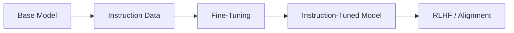
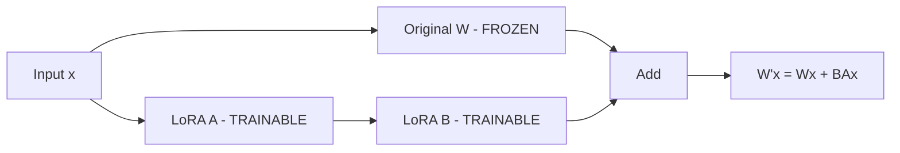
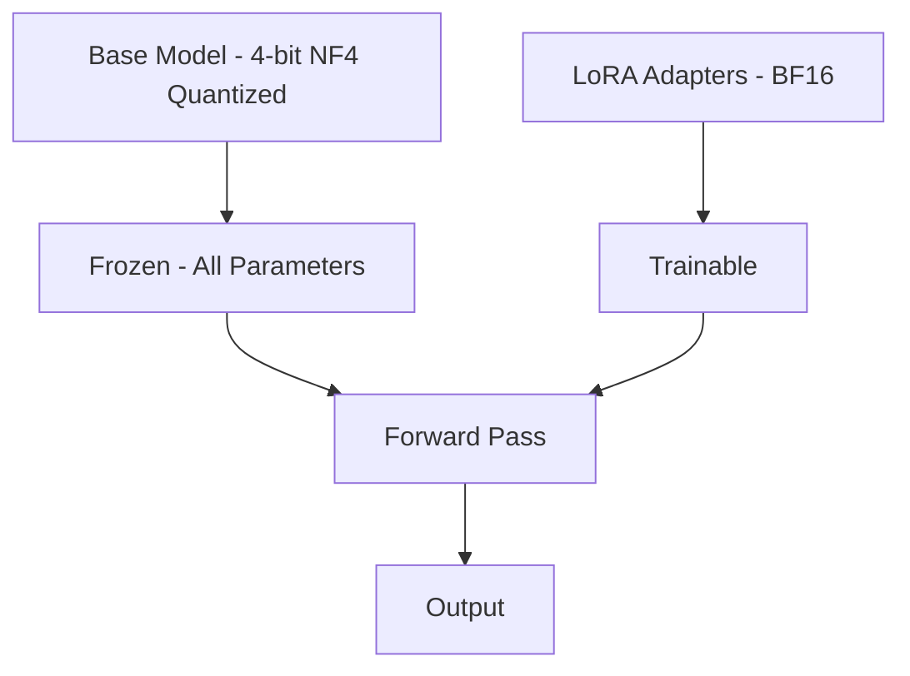
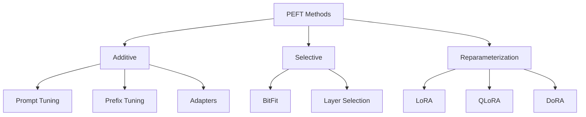

# Supervised Fine-Tuning (SFT)

## Overview

Supervised Fine-Tuning (SFT) transforms a pre-trained base model into an instruction-following assistant. While pre-training teaches language patterns, SFT teaches the model to respond helpfully to user instructions. This is the critical bridge between a raw language model and a useful AI product.

SFT also encompasses parameter-efficient fine-tuning (PEFT) methods like LoRA and QLoRA, which make fine-tuning accessible without massive compute budgets.

## The SFT Pipeline



### Base Model vs SFT Model

| Property | Base Model | SFT Model |
|---|---|---|
| **Behavior** | Completes text | Follows instructions |
| **Input format** | Any text | Instruction format |
| **Output** | Continuation of input | Structured, helpful responses |
| **Safety** | Unfiltered | Safety-tuned |
| **Example** | "The capital of France is" → "Paris" | "What is the capital of France?" → "The capital of France is Paris." |

## Instruction Tuning

### What is Instruction Tuning?

Instruction tuning trains the model on (instruction, response) pairs:

```json
{
  "instruction": "Explain the concept of recursion in programming.",
  "input": "",
  "output": "Recursion is a programming technique where a function calls itself to solve a problem by breaking it down into smaller, similar subproblems..."
}
```

### Datasets

| Dataset | Size | Source | Focus |
|---|---|---|---|
| **FLAN** | 1800+ tasks | Google | NLP tasks |
| **OpenAssistant** | 160K conversations | Community | Multi-turn dialog |
| **ShareGPT** | 90K conversations | ChatGPT users | Real-world usage |
| **Alpaca** | 52K | GPT-3.5 generated | Instruction following |
| **Dolly** | 15K | Databricks employees | Business tasks |
| **UltraChat** | 1.5M | GPT-3.5 generated | Multi-turn |

### Chat Template

Models use specific templates to distinguish user input from model output:

```
# LLaMA-2 style
<s>[INST] <<SYS>> You are a helpful assistant. <</SYS>>
{user_message} [/INST] {model_response} </s>

# ChatML style (OpenAI)
<|im_start|>system: You are a helpful assistant.
<|im_start|>user: {user_message}
<|im_start|>assistant: {model_response}
```

Using the wrong template is one of the most common SFT mistakes — the model may generate garbage or ignore instructions entirely.

## Full Fine-Tuning

### Process

Full fine-tuning updates **all** model parameters on instruction data:

```python
# Simplified SFT training loop
model = AutoModelForCausalLM.from_pretrained("base-model")
tokenizer = AutoTokenizer.from_pretrained("base-model")

for batch in instruction_dataloader:
    # Format as chat template
    inputs = tokenizer(batch["formatted_text"], return_tensors="pt")
    
    # Compute loss only on assistant tokens (not user input)
    labels = inputs["input_ids"].clone()
    labels[batch["is_user_turn"]] = -100  # Ignore in loss
    
    outputs = model(**inputs, labels=labels)
    loss = outputs.loss
    loss.backward()
    optimizer.step()
```

**Key detail**: We only compute loss on the **assistant's response tokens**, not the user's instruction. This teaches the model to generate good responses, not to predict the user's input.

### Hyperparameters

| Parameter | Typical Value | Notes |
|---|---|---|
| Learning rate | 1e-5 to 5e-5 | Lower than pre-training |
| Epochs | 1-3 | More risks overfitting |
| Batch size | 64-128 sequences | Gradient accumulation |
| Max sequence length | 2048-4096 | Depends on data |
| Warmup | 3-10% of steps | Gradual LR increase |

## PEFT: Parameter-Efficient Fine-Tuning

Full fine-tuning is expensive for large models. PEFT methods update only a small fraction of parameters.

### LoRA (Low-Rank Adaptation)

The most popular PEFT method. Instead of updating the full weight matrix W, LoRA adds a low-rank decomposition:

```
W' = W + ΔW = W + B × A
```

Where:
- **W** ∈ R^{d×d}: Original frozen weights
- **A** ∈ R^{r×d}: Down-projection (random init)
- **B** ∈ R^{d×r}: Up-projection (zero init)
- **r** << d: Rank (typically 8-64)



**Why it works:**
- Weight updates during fine-tuning have low intrinsic rank
- r=16 captures 95%+ of the information for most tasks
- Only 0.1-1% of parameters are trainable
- Can swap LoRA adapters for different tasks (like plugins)

**LoRA configuration:**

```python
from peft import LoraConfig

lora_config = LoraConfig(
    r=16,                    # Rank
    lora_alpha=32,           # Scaling factor
    target_modules=["q_proj", "v_proj", "k_proj", "o_proj",
                     "gate_proj", "up_proj", "down_proj"],
    lora_dropout=0.05,
    bias="none",
    task_type="CAUSAL_LM"
)
```

### QLoRA (Quantized LoRA)

QLoRA (Dettmers et al., 2023) combines quantization with LoRA for even more memory efficiency:



**Key innovations:**
1. **NF4 (4-bit NormalFloat)**: Optimal quantization for normally distributed weights
2. **Double quantization**: Quantize the quantization constants (saves 0.37 bit/param)
3. **Paged optimizers**: Use CPU memory for optimizer states when GPU is full

**Memory savings:**

| Method | 7B Model | 70B Model |
|---|---|---|
| Full fine-tuning (FP16) | ~56 GB | ~560 GB |
| LoRA (FP16 base) | ~16 GB | ~160 GB |
| QLoRA (4-bit base) | ~6 GB | ~36 GB |

QLoRA made it possible to fine-tune 70B models on a single 48GB GPU (A6000) or even 33B on 24GB (RTX 4090).

### Other PEFT Methods

| Method | How It Works | Params Updated |
|---|---|---|
| **Prefix Tuning** | Add learnable prefix tokens to attention | <1% |
| **Prompt Tuning** | Learn soft prompt embeddings | <0.1% |
| **Adapter Layers** | Insert small bottleneck layers | 1-5% |
| **IA3** | Rescale activations with learned vectors | <0.1% |
| **DoRA** | Decompose LoRA into direction and magnitude | ~1% |



## SFT Best Practices

### Data Quality > Quantity

Research shows:
- **LIMA** (Zhou et al., 2023): Only 1,000 high-quality examples → excellent results
- **Alpaca** (52K): Decent but lower quality than curated smaller datasets
- Rule of thumb: 1K-10K carefully curated examples often beats 100K noisy ones

### Loss Masking

Critical to only compute loss on assistant tokens:

```
User: What is Python?  [LOSS MASKED]
Assistant: Python is a programming language...  [LOSS COMPUTED]
```

Without masking, the model learns to predict both questions AND answers, wasting capacity.

### Multi-Turn Conversations

For multi-turn data, mask all user turns and system prompts:

```
[System] You are helpful.  [MASKED]
[User] Hello  [MASKED]
[Assistant] Hi! How can I help?  [COMPUTED]
[User] Tell me about Python  [MASKED]
[Assistant] Python is...  [COMPUTED]
```

## SFT Evaluation

### Automatic Metrics

| Metric | What It Measures | How To Compute |
|---|---|---|
| **Loss** | Token prediction quality | Validation set cross-entropy |
| **Perplexity** | How "surprised" the model is | exp(loss) |
| **BLEU/ROUGE** | N-gram overlap with reference | Compare generated vs reference text |
| **Pass@k** | Code correctness | Execute generated code, check tests |
| **Exact Match** | Factual accuracy | Compare answer to ground truth |

### LLM-as-Judge

Use a stronger model to evaluate SFT quality:

```python
judge_prompt = """
Rate the following response on a scale of 1-5 for:
- Helpfulness: Does it answer the question?
- Accuracy: Is the information correct?
- Clarity: Is it well-written?
- Safety: Does it avoid harmful content?

Question: {question}
Response: {response}

Return JSON: {"helpfulness": N, "accuracy": N, "clarity": N, "safety": N}
"""
```

**Frameworks:** MT-Bench, AlpacaEval, Arena-Hard

### Benchmark Suites

| Benchmark | Tests | Scale |
|---|---|---|
| **MT-Bench** | Multi-turn conversation quality | 80 questions, GPT-4 judge |
| **AlpacaEval** | Single-turn instruction following | 805 questions, win rate vs GPT-4 |
| **Arena-Hard** | Challenging real-world queries | 500 questions |
| **OpenLLM Leaderboard** | MMLU, ARC, HellaSwag, etc. | Standard NLP benchmarks |
| **IFEval** | Instruction following precision | Verifiable constraints |

## Training Frameworks

### Popular SFT Frameworks (2024-2025)

| Framework | Focus | Key Feature |
|---|---|---|
| **TRL** (Hugging Face) | Full training pipeline | SFT + RLHF + DPO in one library |
| **Axolotl** | Easy fine-tuning | YAML config, multi-GPU, LoRA/QLoRA |
| **LLaMA-Factory** | Comprehensive | 100+ models, web UI, multi-method |
| **Unsloth** | Speed | 2× faster training, 70% less memory |
| **OpenRLHF** | RLHF/DPO/GRPO | Distributed training with Ray |
| **torchtune** (Meta) | Official LLaMA | Meta's fine-tuning library |

### Example: SFT with TRL

```python
from trl import SFTTrainer, SFTConfig
from transformers import AutoModelForCausalLM, AutoTokenizer
from peft import LoraConfig

model = AutoModelForCausalLM.from_pretrained("meta-llama/Llama-3-8B")
tokenizer = AutoTokenizer.from_pretrained("meta-llama/Llama-3-8B")

peft_config = LoraConfig(
    r=16, lora_alpha=32, lora_dropout=0.05,
    target_modules=["q_proj", "v_proj", "k_proj", "o_proj",
                     "gate_proj", "up_proj", "down_proj"],
)

training_args = SFTConfig(
    output_dir="./sft-output",
    num_train_epochs=3,
    per_device_train_batch_size=4,
    gradient_accumulation_steps=8,
    learning_rate=2e-5,
    lr_scheduler_type="cosine",
    warmup_ratio=0.1,
    bf16=True,
    max_seq_length=4096,
)

trainer = SFTTrainer(
    model=model,\    args=training_args,
    train_dataset=dataset,
    tokenizer=tokenizer,
    peft_config=peft_config,
)
trainer.train()
```

### Example: SFT with Axolotl (YAML Config)

```yaml
base_model: meta-llama/Llama-3-8B
adapter: lora
lora_r: 16
lora_alpha: 32
lora_target_linear: true

datasets:
  - path: HuggingFaceH4/ultrachat_200k
    type: chat

micro_batch_size: 4
gradient_accumulation_steps: 8
num_epochs: 3
learning_rate: 2e-5
lr_scheduler: cosine
warmup_steps: 100
bf16: true
flash_attention: true
```

## Common SFT Pitfalls and Solutions

| Pitfall | Symptom | Solution |
|---|---|---|
| Wrong chat template | Garbage output, ignores instructions | Verify template matches model's training |
| Loss on all tokens | Model generates questions too | Mask user tokens with -100 |
| Too many epochs | Overfits, repeats training data | Use 1-3 epochs, monitor val loss |
| LR too high | Catastrophic forgetting | Use 1e-5 to 5e-5 |
| Data too uniform | Poor generalization | Diversify tasks and response styles |
| No eval set | Can't detect overfitting | Hold out 10% for validation |

## Interview Questions

### Q1: What is the difference between pre-training, SFT, and RLHF?
**Answer:**
- **Pre-training**: Learn language patterns from massive unlabeled data using next token prediction. The model learns grammar, facts, and reasoning patterns but doesn't know how to follow instructions.
- **SFT**: Fine-tune on (instruction, response) pairs to teach the model to follow instructions. The model learns the format of helpful responses.
- **RLHF**: Further align the model with human preferences using a reward model and PPO/DPO. The model learns to be helpful, harmless, and honest.

Think of it as: pre-training = elementary school, SFT = learning job skills, RLHF = learning workplace etiquette.

### Q2: Explain LoRA and why it works.
**Answer:** LoRA decomposes the weight update ΔW into a product of two low-rank matrices A and B: ΔW = BA, where A is d×r and B is r×d with r << d. It works because:
1. Intrinsic dimensionality: The useful information in weight updates has low rank
2. Pre-trained models are already in a good region; fine-tuning only needs small adjustments
3. Empirically, r=16-64 captures 95%+ of full fine-tuning quality
4. Benefits: 10-100× fewer trainable params, less memory, faster training, easy to swap adapters

### Q3: What is QLoRA and how does it achieve memory savings?
**Answer:** QLoRA combines three techniques:
1. **4-bit NF4 quantization**: Base model weights stored in 4-bit NormalFloat format (optimal for normally distributed weights), reducing base model memory by 4×
2. **Double quantization**: The quantization constants themselves are quantized, saving an additional 0.37 bits per parameter
3. **Paged optimizers**: Optimizer states use unified memory, paging to CPU when GPU memory is full

Result: Fine-tune a 70B model on a single 48GB GPU with minimal quality loss vs full 16-bit fine-tuning.

### Q4: Why compute loss only on assistant tokens during SFT?
**Answer:** If we compute loss on all tokens, the model learns to predict both user questions and assistant answers. This is wasteful because:
1. We want the model to be good at answering, not at generating questions
2. User inputs often contain instructions that shouldn't be "predicted"
3. Loss on user tokens can actually hurt instruction following by teaching the model to complete prompts rather than respond to them
4. Empirically, masking user tokens consistently improves SFT quality

### Q5: What makes a good SFT dataset?
**Answer:** Quality over quantity. Key properties:
- **Diverse tasks**: Cover many instruction types (QA, summarization, coding, math, creative)
- **High quality**: Expert-written or carefully reviewed responses
- **Proper formatting**: Consistent chat templates
- **Reasoning traces**: Show step-by-step thinking, not just answers
- **Safety**: Include refusals for harmful requests
- **Length variety**: Mix of short and long responses

Research (LIMA paper) showed 1,000 carefully curated examples can match 50K+ noisy examples.

## Common Mistakes

- ❌ Using the wrong chat template (model generates garbage)
- ❌ Computing loss on all tokens instead of just assistant tokens
- ❌ Training for too many epochs (overfitting, especially on small datasets)
- ❌ Using too high a learning rate (catastrophic forgetting of pre-trained knowledge)
- ❌ Not validating on held-out examples before deployment
- ❌ Applying LoRA to only attention layers (also apply to FFN for best results)

## Summary

SFT bridges pre-training and deployment by teaching models to follow instructions. Full fine-tuning updates all parameters; PEFT methods (LoRA, QLoRA) update only a small fraction with minimal quality loss. Data quality matters more than quantity — 1K curated examples can outperform 100K noisy ones. Loss masking, proper chat templates, and appropriate learning rates are critical details. Evaluation uses both automatic metrics (loss, perplexity, benchmarks) and LLM-as-judge (MT-Bench, AlpacaEval). Popular frameworks include TRL, Axolotl, LLaMA-Factory, and Unsloth. DoRA is an emerging improvement over LoRA that decomposes weight updates into direction and magnitude.

## References

1. Hu et al., "LoRA: Low-Rank Adaptation of Large Language Models", ICLR 2022
2. Dettmers et al., "QLoRA: Efficient Finetuning of Quantized LLMs", NeurIPS 2023
3. Liu et al., "Few-Shot Parameter-Efficient Fine-Tuning is Better and Cheaper than In-Context Learning", NeurIPS 2022
4. Zhou et al., "LIMA: Less Is More for Alignment", NeurIPS 2023
5. Taori et al., "Stanford Alpaca: An Instruction-following LLaMA Model", 2023
6. Liu et al., "DoRA: Weight-Decomposed Low-Rank Adaptation", ICML 2024
7. Zheng et al., "Judging LLM-as-a-Judge with MT-Bench and Chatbot Arena", NeurIPS 2023
8. Tunstall et al., "Zephyr: Direct Distillation of LM Alignment", 2023

## Cross-References

- [Pre-training →](pretraining.md) What happens before SFT
- [RLHF →](rlhf.md) Alignment after SFT
- [LoRA details →](quantization.md) Quantization methods used with QLoRA
- [Prompt Engineering →](prompt-engineering.md) How to use SFT models effectively
- [Evaluation →](evaluation.md) Measuring SFT model quality
- [ML RL DPO](../../ml/rl/dpo.md)
- [Transfer Learning](../../ml/deep-learning/transfer-learning.md)
