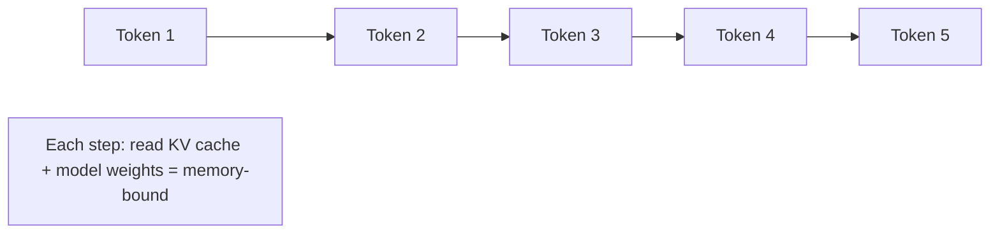
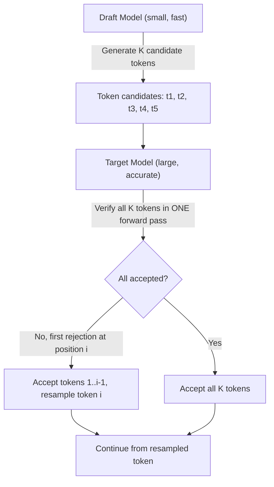
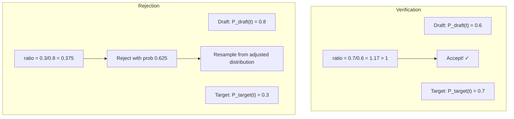
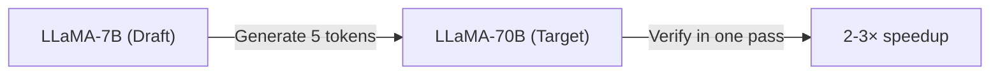
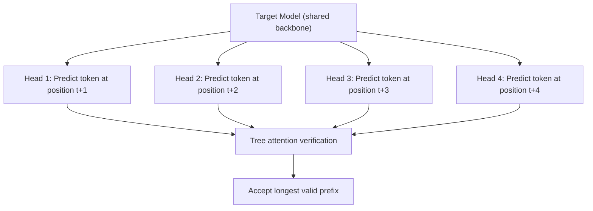
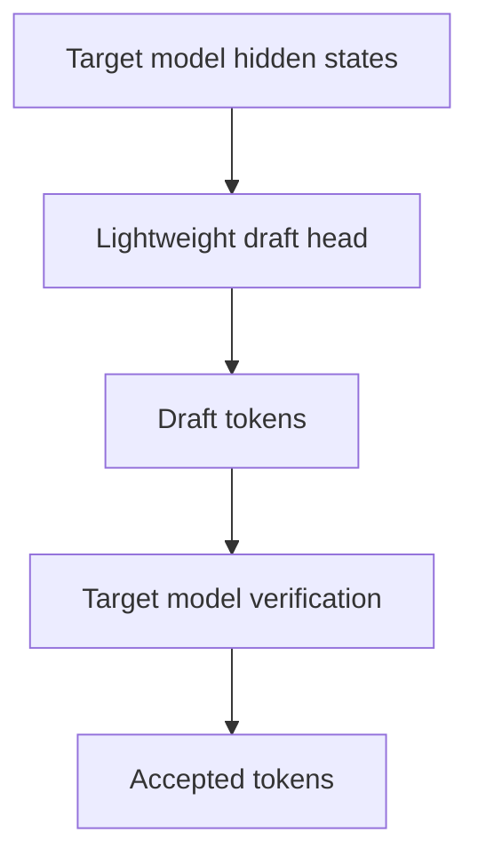
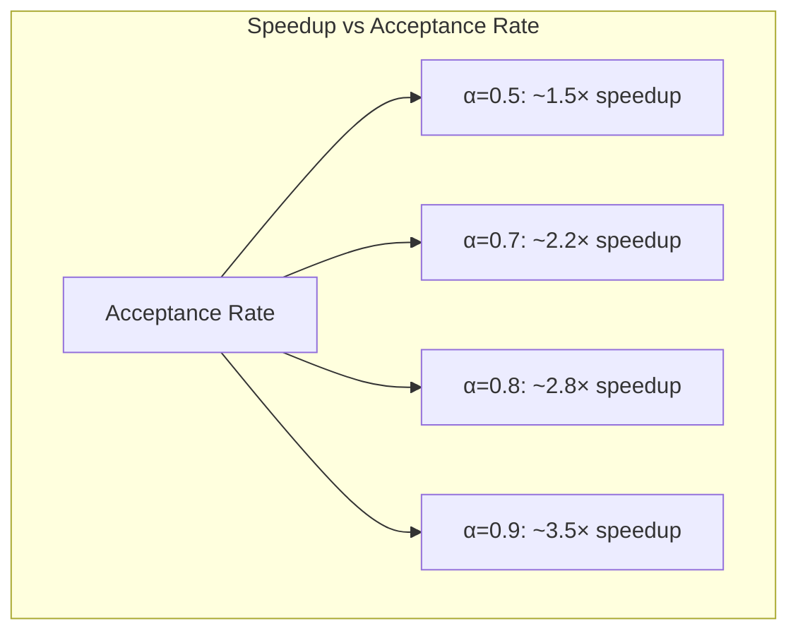

# Speculative Decoding

## Overview

Speculative decoding accelerates LLM inference by using a smaller "draft" model to generate candidate tokens, which are then verified by the larger "target" model in parallel. This achieves 2-3× speedup without any quality loss — the output is mathematically identical to the target model.

## The Problem: Autoregressive Bottleneck

Standard autoregressive generation is inherently sequential:



Each step is memory-bandwidth bound (reading the full model for one token). The GPU's compute units are idle most of the time.

## How Speculative Decoding Works



### Step-by-Step

1. **Draft**: The small draft model generates K tokens autoregressively (fast, ~10× cheaper)
2. **Verify**: The large target model evaluates all K tokens in a **single forward pass** (parallelized)
3. **Accept/Reject**: Using the draft and target probability distributions, accept or reject each token
4. **Bonus**: If all K are accepted, we get K+1 tokens (the target model generates one more)

### The Acceptance Criterion

Token t_i is accepted if:
```
P_target(t_i | context) ≥ P_draft(t_i | context)
```

Or with probability:
```
min(1, P_target(t_i) / P_draft(t_i))
```

If rejected, resample from the adjusted distribution:
```
P_resample(t) = max(0, P_target(t) - P_draft(t)) / Σ max(0, P_target(t) - P_draft(t))
```

**Key guarantee**: The output distribution is **exactly** the same as the target model. No quality loss.



## Draft Model Selection

### Options for Draft Models

| Draft Model | Pros | Cons |
|---|---|---|
| **Smaller same-family model** | Easy, good alignment | Need extra model in memory |
| **n-gram model** | No extra model, simple | Poor draft quality |
| **Self-drafting (Medusa)** | No extra model | Architecture changes needed |
| **Retrieval-based** | Good for repetitive text | Limited to retrieved patterns |
| **Distilled head** | Small, fast | Limited capability |

### Example: LLaMA-70B + LLaMA-7B



- Draft model generates 5 tokens (~10× faster per token than target)
- Target verifies all 5 in one forward pass (same cost as generating 1 token)
- Net: ~5 tokens in ~2 passes → 2.5× speedup

## Medusa (Self-Speculative Decoding)

Medusa adds multiple prediction heads to the target model, eliminating the need for a separate draft model:



**Benefits:**
- No separate draft model (saves memory)
- Shared backbone computation
- Can be fine-tuned for better draft quality

## EAGLE (Extrapolation Algorithm for Greater Language-model Efficiency)

EAGLE uses the target model's feature space to draft tokens:



EAGLE achieves higher acceptance rates than Medusa because drafting in feature space is easier than in token space.

## Speedup Analysis

### Theoretical Speedup

Expected speedup depends on:
- **Acceptance rate (α)**: Probability of draft token being accepted
- **Draft cost (c)**: Time to generate draft tokens relative to target
- **K**: Number of draft tokens

```
Speedup ≈ (1 - α^{K+1}) / ((1 - α) × (c × K + 1))
```

### Practical Speedup

| Setup | Acceptance Rate | Speedup |
|---|---|---|
| Same-family draft (7B → 70B) | 70-80% | 2-3× |
| N-gram draft | 40-60% | 1.3-1.8× |
| Medusa (4 heads) | 60-70% | 2-2.5× |
| EAGLE | 75-85% | 2.5-3.5× |



## When Speculative Decoding Helps

| Scenario | Help? | Why |
|---|---|---|
| **Long outputs** | ✅ Yes | More tokens to verify in parallel |
| **Short outputs** | ❌ Limited | Not enough tokens to amortize draft cost |
| **Memory-bound decode** | ✅ Yes | Verification uses compute efficiently |
| **Compute-bound prefill** | ❌ No | Already parallelized |
| **Large batch sizes** | ❌ Limited | GPU already utilized by batching |
| **Small batch sizes** | ✅ Yes | GPU is underutilized, speculation fills gaps |

## Interview Questions

### Q1: What is speculative decoding and why does it work?
**Answer:** Speculative decoding uses a small, fast draft model to generate K candidate tokens, then verifies them with the large target model in a single parallel forward pass. It works because:
1. Verification of K tokens is nearly as fast as generating 1 token (compute parallelism)
2. If the draft model is good, most tokens are accepted
3. The output is mathematically identical to the target model (no quality loss)
4. It converts memory-bound sequential decode into compute-bound parallel verification

### Q2: How is the output of speculative decoding identical to the target model?
**Answer:** The acceptance criterion ensures statistical equivalence. A draft token is accepted with probability min(1, P_target/P_draft). If rejected, we resample from max(0, P_target - P_draft), normalized. This rejection sampling scheme produces exactly the target model's distribution. The proof is that the acceptance + resampling process is equivalent to sampling directly from P_target.

### Q3: When should you use speculative decoding?
**Answer:** Best scenarios:
- Single-user or small batch (GPU underutilized during decode)
- Long output generation (more tokens to amortize draft overhead)
- Memory-bandwidth-bound models (most LLMs during decode)
Not useful for: large batch sizes (GPU already saturated), prefill-heavy workloads, or when draft model quality is poor (low acceptance rate).

### Q4: Compare Medusa, EAGLE, and traditional speculative decoding.
**Answer:**
- **Traditional**: Separate draft model. Extra memory but flexible. Good when a smaller model exists in the same family.
- **Medusa**: Multiple prediction heads on the target model. No extra model memory. Lower acceptance rate than good draft models.
- **EAGLE**: Drafts in feature space using hidden states. Highest acceptance rate. Slight memory overhead for draft head.
- Traditional is best when draft model quality is high. EAGLE is best overall but requires feature-level access.

## Common Mistakes

- ❌ Expecting speedup with large batch sizes (speculative decoding helps small batches)
- ❌ Using a draft model with very different distribution (low acceptance rate)
- ❌ Forgetting that draft model generation has a cost (too many draft tokens = wasted compute on rejections)
- ❌ Not tuning K (number of draft tokens) for the specific draft model quality

## Summary

Speculative decoding achieves 2-3× decode speedup with zero quality loss by using a small draft model to propose tokens that the large target model verifies in parallel. Key factors: draft model quality (acceptance rate), number of draft tokens (K), and workload characteristics (small batches benefit most). Variants like Medusa and EAGLE eliminate the need for a separate draft model.

## Cross-References

- [Inference →](inference.md) The decode bottleneck being solved
- [KV Cache →](kv-cache.md) KV cache management during verification
- [Batching →](batching.md) Batching vs speculation trade-off
- [vLLM →](vllm.md) Speculative decoding in production
- [Inference](./inference.md)
- [Batching](./batching.md)
- [vLLM](./vllm.md)
- [ML Transformers GPT](../ml/transformers/gpt.md)

