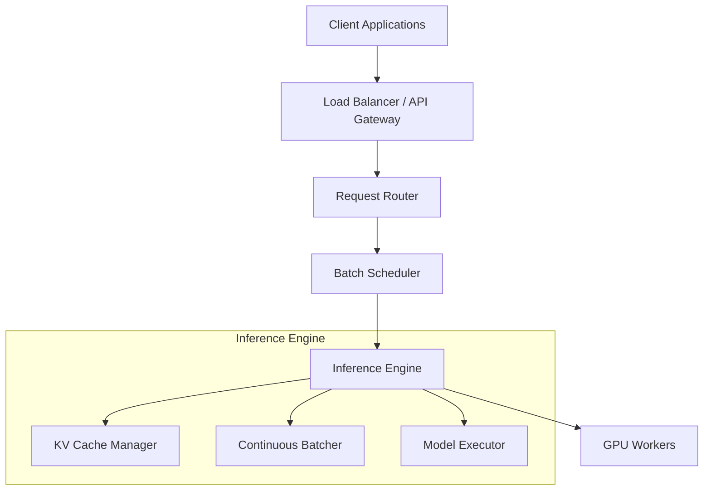
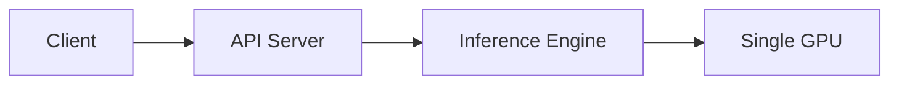
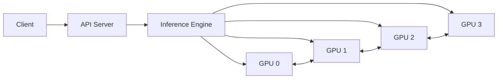
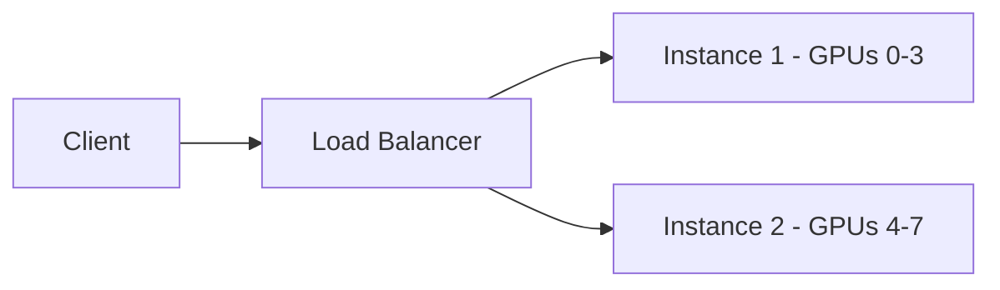

# LLM Serving Systems Overview

## Overview

LLM serving systems manage the deployment, scaling, and optimization of LLM inference in production. They handle request routing, batching, memory management, and GPU utilization. Choosing the right serving system is critical for cost, latency, and throughput.

## The Serving Stack

## Key Systems Comparison

| System | Developer | Key Feature | Best For |
|---|---|---|---|
| **vLLM** | UC Berkeley | PagedAttention | Production serving |
| **TensorRT-LLM** | NVIDIA | GPU optimization | NVIDIA GPUs |
| **TGI** | Hugging Face | Easy integration | HF ecosystem |
| **Ollama** | Community | Local deployment | Development/testing |
| **SGLang** | LMSYS | RadixAttention | Structured generation |
| **llama.cpp** | Community | CPU inference | Edge/consumer |
| **DeepSpeed-FastGen** | Microsoft | SplitFuse | Microsoft stack |
| **MLC-LLM** | CMU | Cross-platform | Mobile/edge |

## Feature Comparison

| Feature | vLLM | TRT-LLM | TGI | Ollama | SGLang |
|---|---|---|---|---|---|
| Continuous batching | ✅ | ✅ | ✅ | ❌ | ✅ |
| PagedAttention | ✅ | ✅ (paged KV) | ✅ | ❌ | ✅ |
| Speculative decoding | ✅ | ✅ | ❌ | ❌ | ✅ |
| Tensor parallelism | ✅ | ✅ | ✅ | ❌ | ✅ |
| Pipeline parallelism | ❌ | ✅ | ❌ | ❌ | ✅ |
| Quantization (GPTQ) | ✅ | ✅ | ✅ | ❌ | ✅ |
| Quantization (AWQ) | ✅ | ✅ | ✅ | ❌ | ✅ |
| Quantization (GGUF) | ❌ | ❌ | ❌ | ✅ | ❌ |
| Prefix caching | ✅ | ✅ | ❌ | ❌ | ✅ |
| OpenAI-compatible API | ✅ | ❌ | ✅ | ✅ | ✅ |

## Architecture Patterns

### Single-GPU Serving

Simple, suitable for development and low-traffic production.

### Multi-GPU (Tensor Parallelism)

Model is sharded across GPUs. Each GPU holds a portion of each layer.

### Multi-Instance (Data Parallelism)

Multiple independent model copies. Load balancer distributes requests.

## Scaling Considerations

| Scale | Architecture | Notes |
|---|---|---|
| **Development** | Single GPU, Ollama | Simple, no optimization needed |
| **Small production** | Single GPU, vLLM | Continuous batching sufficient |
| **Medium production** | Multi-GPU, vLLM/TRT-LLM | Tensor parallelism for large models |
| **Large production** | Multi-instance, LB | Data parallelism + multiple replicas |
| **Hyperscale** | Custom orchestration | Dynamic scaling, spot instances |

## Cost Optimization

| Strategy | Savings | Trade-off |
|---|---|---|
| Quantization (INT4) | 2-4× less GPU memory | Small quality loss |
| Dynamic batching | 5-20× throughput | Higher latency |
| Spot instances | 60-70% cost reduction | Preemption risk |
| Model distillation | Smaller model | Quality loss |
| Prefix caching | 5-10× for shared prompts | Memory for cache |
| Request routing | Route to appropriate model | Complexity |

## Interview Questions

### Q1: How would you design an LLM serving architecture for 1000 requests/second?
**Answer:**
1. **Load balancer** (e.g., nginx, AWS ALB) distributes requests across replicas
2. **Multiple vLLM instances**, each on 4-8 GPUs with tensor parallelism
3. **Continuous batching** with max_batch_size tuned per GPU memory
4. **Quantized models** (AWQ INT4) to maximize requests per GPU
5. **Prefix caching** if requests share system prompts
6. **Auto-scaling** based on queue depth and GPU utilization
7. **Rate limiting** and **priority queues** for SLA management

### Q2: When should you use vLLM vs TensorRT-LLM?
**Answer:**
- **vLLM**: Best for general-purpose serving. Easy to use, wide model support, active development. Use when you need quick deployment with good performance.
- **TensorRT-LLM**: Best for maximum performance on NVIDIA GPUs. More complex setup but better optimization (FP8, custom kernels). Use when you need the absolute lowest latency/highest throughput and are committed to NVIDIA hardware.
- **TGI**: Best for Hugging Face ecosystem integration. Good balance of features and ease of use.

## Common Mistakes

- ❌ Serving without batching (wasting 95% of GPU compute)
- ❌ Not quantizing models (2-4× cost waste)
- ❌ Over-provisioning GPUs (use auto-scaling)
- ❌ Ignoring KV cache memory in capacity planning
- ❌ Using the same serving config for all models (each model has different optimal settings)

## Summary

LLM serving systems handle the complex orchestration of model inference. vLLM (PagedAttention), TensorRT-LLM (NVIDIA optimization), and TGI (HF integration) are the main choices. Key optimizations: continuous batching, quantization, prefix caching, and tensor parallelism. Architecture scales from single-GPU to multi-instance with load balancing.

## Cross-References

- [vLLM →](vllm.md) Deep dive into vLLM
- [TensorRT-LLM →](tensorrt.md) NVIDIA optimization
- [TGI →](tgi.md) HuggingFace serving
- [Ollama →](ollama.md) Local deployment
- [Batching →](batching.md) Batching strategies
- [Inference →](inference.md) Inference fundamentals
- [Agent Tool Calling](../ml/agents/tool-calling.md)
- [RAG](./rag.md)
- [Prompt Engineering](./prompt-engineering.md)
- [Cloud API Gateway](../cloud/aws/vpc.md)

