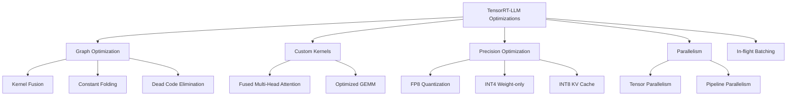
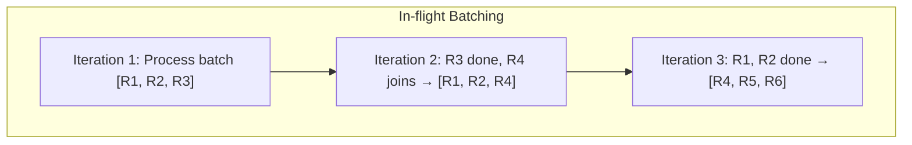
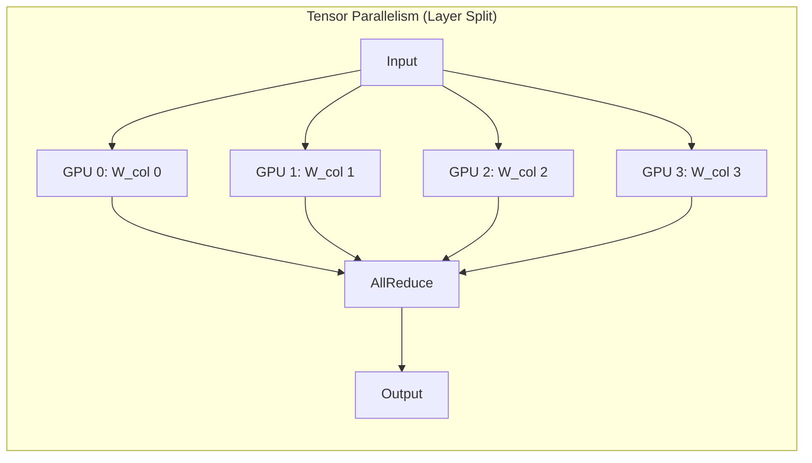

# TensorRT-LLM

## Overview

TensorRT-LLM is NVIDIA's high-performance inference engine for LLMs on NVIDIA GPUs. It combines TensorRT's optimization capabilities with LLM-specific optimizations (FP8, paged KV cache, in-flight batching) to achieve maximum throughput and minimum latency on NVIDIA hardware.

## Key Optimizations



## FP8 Quantization

TensorRT-LLM leverages H100's FP8 hardware support:

| Precision | Memory | Speed | Hardware |
|---|---|---|---|
| FP16 | 2 bytes/param | Baseline | All GPUs |
| FP8 | 1 byte/param | 1.5-2× faster | H100+ |
| INT4 | 0.5 bytes/param | 2-3× faster | All GPUs |

FP8 provides near-lossless quality with 2× memory reduction and significant speedup on H100.

## In-Flight Batching

TRT-LLM's version of continuous batching:



## Tensor Parallelism

Split model layers across multiple GPUs:



| Parallelism | What's Split | Communication | Best For |
|---|---|---|---|
| **Tensor** | Layer weights across GPUs | AllReduce per layer | Single node, fast interconnect |
| **Pipeline** | Layers across GPUs | Point-to-point between stages | Multi-node, slower interconnect |

## Build and Serve

```bash
# Convert model to TRT-LLM format
python convert_checkpoint.py \
    --model_dir ./llama-2-7b \
    --output_dir ./trt_ckpt \
    --tp_size 1

# Build engine
trtllm-build \
    --checkpoint_dir ./trt_ckpt \
    --output_dir ./trt_engine \
    --gemm_plugin float16 \
    --max_batch_size 64 \
    --max_input_len 2048 \
    --max_output_len 512

# Run inference
python run.py \
    --engine_dir ./trt_engine \
    --max_output_len 256 \
    --input_text "Explain quantum computing"
```

## Performance

Typical TRT-LLM performance (H100, LLaMA-70B, FP8):

| Metric | Value |
|---|---|
| Throughput | ~4000-6000 tokens/sec |
| TTFT (p50) | ~50ms |
| TPOT (p50) | ~15ms |
| Max batch size | ~128+ |

## Interview Questions

### Q1: What makes TensorRT-LLM faster than vLLM?
**Answer:** TRT-LLM achieves higher performance through:
1. **Graph optimization**: Kernel fusion, constant folding, dead code elimination at the graph level
2. **Custom CUDA kernels**: Fused multi-head attention, optimized GEMM for specific shapes
3. **FP8 support**: Native FP8 on H100, which vLLM has limited support for
4. **Compiled engine**: Unlike vLLM's eager execution, TRT-LLM compiles an optimized execution graph
5. **NVIDIA-specific optimizations**: Can use the latest CUDA features before they're upstreamed to PyTorch

Trade-off: More complex setup, less model flexibility (need to rebuild engines for different configs).

### Q2: What is the difference between tensor parallelism and pipeline parallelism?
**Answer:**
- **Tensor parallelism**: Splits individual layer weights across GPUs. Each GPU computes part of each layer. Requires fast interconnect (NVLink) for AllReduce communication every layer.
- **Pipeline parallelism**: Splits layers across GPUs. Each GPU processes a complete layer for the input. Communication is point-to-point between stages. Better for slower interconnects (across nodes).
- Tensor parallelism is preferred within a node; pipeline parallelism across nodes.

## Common Mistakes

- ❌ Not rebuilding the engine when changing batch size or sequence length
- ❌ Using FP16 on H100 when FP8 is available (2× throughput loss)
- ❌ Tensor parallelism over slow interconnects (network becomes bottleneck)
- ❌ Not profiling with realistic workloads (synthetic benchmarks mislead)

## Summary

TensorRT-LLM maximizes LLM inference performance on NVIDIA GPUs through graph optimization, custom kernels, FP8 quantization, and in-flight batching. It achieves 1.5-2× higher throughput than vLLM on NVIDIA hardware but requires more setup. Best for production deployments where NVIDIA is the target and maximum performance is needed.

## Cross-References

- [vLLM →](vllm.md) Alternative serving engine
- [Quantization →](quantization.md) FP8 and INT4 methods
- [Batching →](batching.md) In-flight batching theory
- [Systems Overview →](systems.md) Comparison table
- [Quantization](./quantization.md)
- [vLLM](./vllm.md)
- [TGI](./tgi.md)
- [Cloud GPU](../cloud/virtualization/README.md)

