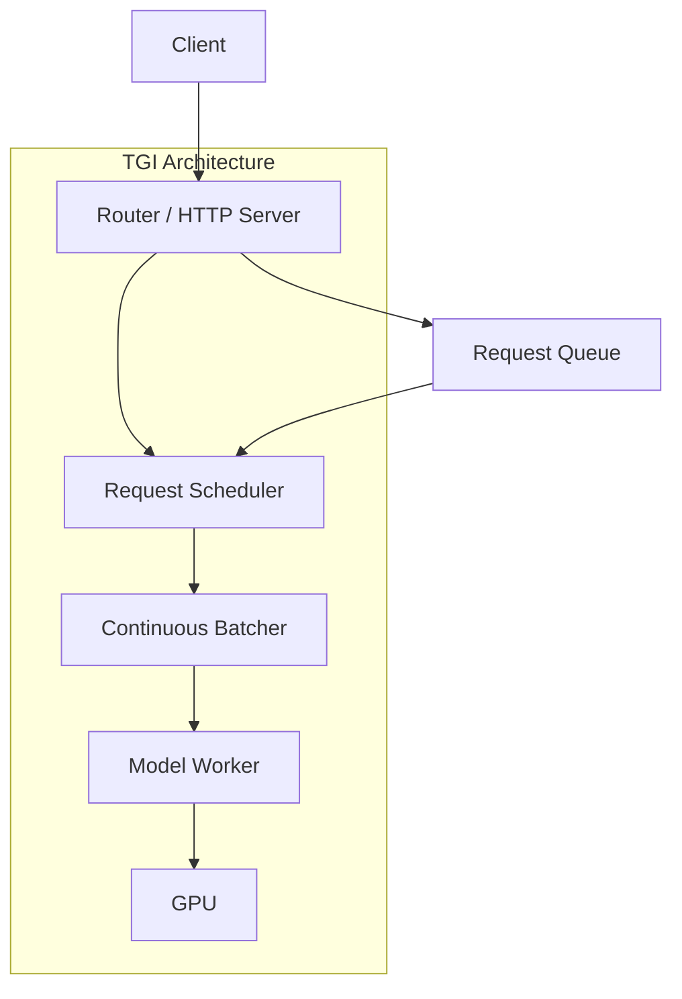

# TGI (Text Generation Inference)

## Overview

Text Generation Inference (TGI) is Hugging Face's open-source LLM serving solution. It's designed for easy deployment with good performance, integrating seamlessly with the Hugging Face ecosystem. TGI supports continuous batching, FlashAttention, and various quantization methods.

## Architecture



## Key Features

| Feature | Description |
|---|---|
| **Continuous batching** | Iteration-level scheduling |
| **FlashAttention** | Efficient attention computation |
| **Quantization** | GPTQ, AWQ, bitsandbytes, EETQ |
| **Token streaming** | Server-sent events for streaming |
| **Watermarking** | Add watermarks to generated text |
| **Grammar/constrained decoding** | JSON mode, regex constraints |
| **Multi-GPU** | Tensor parallelism via `CUDA_VISIBLE_DEVICES` |

## Installation & Usage

### Docker (Recommended)

```bash
# Run with Docker
docker run --gpus all -p 8080:80 \
    -v $PWD/data:/data \
    ghcr.io/huggingface/text-generation-inference:latest \
    --model-id meta-llama/Llama-2-7b-chat-hf \
    --max-input-length 2048 \
    --max-total-tokens 4096 \
    --max-batch-prefill-tokens 4096
```

### Python Client

```python
from huggingface_hub import InferenceClient

client = InferenceClient("http://localhost:8080")

# Text generation
response = client.text_generation(
    "Explain quantum computing in simple terms:",
    max_new_tokens=256,
    temperature=0.7,
)

# Chat completion (OpenAI-compatible)
response = client.chat_completion(
    messages=[{"role": "user", "content": "Hello!"}],
    model="meta-llama/Llama-2-7b-chat-hf",
    max_tokens=256,
)
```

## Configuration

| Parameter | Description | Default |
|---|---|---|
| `--max-input-length` | Max input tokens | 1024 |
| `--max-total-tokens` | Max total (input + output) | 2048 |
| `--max-batch-prefill-tokens` | Max tokens in prefill batch | 4096 |
| `--max-concurrent-requests` | Max concurrent requests | 128 |
| `--quantize` | Quantization method | None |
| `--dtype` | Model dtype | auto |

## Constrained Decoding

TGI supports grammar-constrained generation:

```python
# JSON mode
response = client.text_generation(
    "Extract info: John, 30, engineer",
    grammar={
        "type": "json",
        "schema": {
            "type": "object",
            "properties": {
                "name": {"type": "string"},
                "age": {"type": "integer"},
                "job": {"type": "string"},
            },
        },
    },
)
```

## Interview Questions

### Q1: How does TGI compare to vLLM?
**Answer:**
- **TGI**: Hugging Face ecosystem, Docker-first deployment, constrained decoding (JSON/regex), watermarking. Good for teams already using HF.
- **vLLM**: Better performance (PagedAttention), wider model support, prefix caching, speculative decoding. Better for maximum throughput.
- Both support continuous batching and tensor parallelism. TGI is easier to set up; vLLM is more performant.

### Q2: What is constrained decoding in TGI?
**Answer:** Constrained decoding forces the model to generate output matching a specific grammar or schema. TGI implements this by masking logits at each step — setting the probability of invalid tokens to -∞. This guarantees valid JSON, regex matches, or other structured outputs. It's useful for extracting structured data from LLMs without post-processing.

## Common Mistakes

- ❌ Not setting appropriate `max-total-tokens` (OOM with long sequences)
- ❌ Using Docker without `--gpus all` (no GPU access)
- ❌ Not streaming for chat applications (poor user experience)

## Summary

TGI is Hugging Face's production LLM serving solution with continuous batching, FlashAttention, and constrained decoding. It's Docker-first and integrates well with the HF ecosystem. While not as performant as vLLM or TRT-LLM, it offers a good balance of features and ease of use.

## Cross-References

- [vLLM →](vllm.md) Alternative serving engine
- [Systems Overview →](systems.md) Feature comparison
- [Batching →](batching.md) Continuous batching theory
- [Ollama](./ollama.md)
- [Inference](./inference.md)
- [Cloud Kubernetes](../../cloud/kubernetes/README.md)
