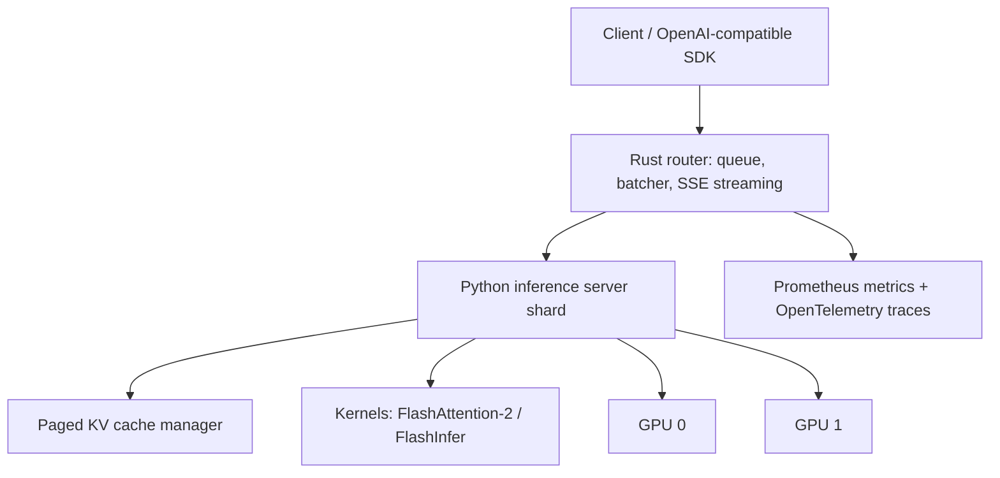

# TGI (Text Generation Inference)

## Overview

Text Generation Inference (TGI) is Hugging Face's open-source LLM serving solution, built as a Rust router in front of Python inference-server shards. It is designed for easy deployment with good performance, integrating seamlessly with the Hugging Face ecosystem: Hub-native model loading, Inference Endpoints compatibility, and built-in extras like grammar-constrained decoding and output watermarking that other engines leave to middleware. TGI supports continuous batching, paged KV cache (since the v2 rewrite), FlashAttention-class kernels, tensor-parallel sharding, and a wide menu of weight quantization formats.

This page covers TGI itself — architecture, batching policy, quantization, streaming, safety, LoRA serving, and operations. For the raw performance comparison, read [vLLM](./vllm.md) and [Serving Engine Comparison](./engine-comparison.md), which hold the decision matrix; this page deliberately avoids re-arguing those benchmarks and focuses on how TGI is built and where its design choices show up in production. For batching theory in general, see [Batching](./batching.md).

## Quick start

TGI is distributed as a Docker-first product: the container bundles the router, the launcher, the shard server, and the compiled kernels, so a working deployment is one `docker run`. The only mandatory parameter is `--model-id`; the limits below are the admission-control knobs the next sections discuss.

```bash
# Run with Docker
docker run --gpus all -p 8080:80 \
    -v $PWD/data:/data \
    ghcr.io/huggingface/text-generation-inference:latest \
    --model-id meta-llama/Llama-2-7b-chat-hf \
    --max-input-length 2048 \
    --max-total-tokens 4096 \
    --max-batch-prefill-tokens 4096
```

The same server speaks both TGI's native `/generate` API and an OpenAI-compatible `/v1/chat/completions` surface, so existing client code usually works unchanged. The Python client below shows both styles plus streaming; the stream call is the one to use for chat UIs.

```python
from huggingface_hub import InferenceClient

client = InferenceClient("http://localhost:8080")

# Non-streaming generation
response = client.text_generation(
    "Explain quantum computing in simple terms:",
    max_new_tokens=256,
    temperature=0.7,
)

# Chat completion (OpenAI-compatible)
response = client.chat_completion(
    messages=[{"role": "user", "content": "Hello!"}],
    model="meta-llama/Llama-2-7b-chat-hf",
    max_tokens=256,
)

# Streaming: iterate text chunks as the batch loop yields them
for chunk in client.text_generation(
    "Write a haiku about GPUs:",
    max_new_tokens=64,
    stream=True,
):
    print(chunk, end="", flush=True)
```

## Architecture: router + inference-server shards

TGI splits serving into two planes. The **router** is a Rust web server that terminates HTTP, validates and tokenizes requests, enforces admission control, forms batches, and streams tokens back over SSE. The **inference server** (one Python shard process per model replica) owns the model weights, the paged KV cache, and the generation loop; with tensor parallelism enabled, a single shard process spans multiple GPUs and all-reduces activations between layers. The two planes communicate over gRPC, which keeps the hot token path out of the Python web framework entirely — request parsing, queueing, and response streaming are all in Rust.


```mermaid
flowchart TD
    CLIENT["Client / OpenAI-compatible SDK"] --> ROUTER["Rust router: queue, batcher, SSE streaming"]
    ROUTER --> SHARD["Python inference server shard"]
    SHARD --> KV["Paged KV cache manager"]
    SHARD --> KERN["Kernels: FlashAttention-2 / FlashInfer"]
    SHARD --> GPU0["GPU 0"]
    SHARD --> GPU1["GPU 1"]
    ROUTER --> OBS["Prometheus metrics + OpenTelemetry traces"]
```

| Component | Language | Responsibility |
|---|---|---|
| Router (web server) | Rust | HTTP/SSE termination, tokenization, admission control, batching policy, metrics |
| Inference server shard | Python | Model forward pass, sampling, paged KV cache management, CUDA graphs |
| Launcher | Rust/Python | GPU discovery, shard process supervision, NCCL setup for tensor parallelism |
| Quantization kernels | CUDA/Rust | bitsandbytes, EETQ, GPTQ/AWQ Marlin, ExLlamaV2 dequant paths |

The split explains most of TGI's operational personality. Because the router owns admission, capacity is expressed in *tokens* rather than requests: each request reserves `max-total-tokens` of KV budget up front, and the router admits new requests only when the reservation fits. That makes tail-latency behavior predictable — a batch can rarely OOM mid-generation — at the cost of conservative batch sizes, which is the trade vLLM's on-demand paged allocation is designed to beat.

## Core configuration

The flags below are the ones that actually move throughput and stability in reviews and postmortems; everything else has a sane default. The three token budgets work together: `max-input-length` bounds prefill per request, `max-total-tokens` bounds each request's KV reservation, and `max-batch-prefill-tokens` bounds how much prefill work one batch step may absorb.

| Parameter | Description | Default | Tune when |
|---|---|---|---|
| `--max-input-length` | Max input tokens accepted per request | 1024 | Long prompts get rejected — raise it, but watch prefill cost |
| `--max-total-tokens` | Max KV reservation per request (input + output) | 2048 | The batch-capacity lever: halving it roughly doubles headroom |
| `--max-batch-prefill-tokens` | Max tokens processed in one prefill step | 4096 | TTFT spikes when big prompts arrive — cap prefill work |
| `--max-concurrent-requests` | Max requests in flight | 128 | Lower it to keep queue depth visible to autoscalers |
| `--quantize` | Weight quantization backend | none | VRAM-constrained deployments — see the matrix below |
| `--dtype` | Model compute dtype | auto | Force float16 on GPUs that mis-detect |
| `--num-shards` | Number of GPUs to shard the model across | 1 | Models larger than one GPU's memory |

A useful tuning exercise before any capacity review: plot maximum batch size as a function of `--max-total-tokens` for your model and GPU, because the curve is the entire cost story of the reservation design. Then check whether your real workload's output lengths actually reach the cap — chat outputs usually do not, which is exactly the waste vLLM's paged allocation reclaims.

## Continuous batching: TGI vs vLLM

Both engines implement iteration-level scheduling — new requests join the batch as others finish — but they gate admission differently, and that single difference drives most of the throughput gap on long-prompt workloads. The table below is the interview-ready summary; the mechanism detail follows it.

| Aspect | TGI | vLLM |
|---|---|---|
| Scheduler location | Rust router (request admission) + Python shard (per-iteration batch) | Single Python scheduler, iteration-level |
| KV allocation | Reserves `max-total-tokens` per request up front | Paged blocks allocated on demand; block table grows as needed |
| Admission gate | Reserved token budget must fit; else request queues | Block availability; can preempt and swap requests mid-flight |
| Chunked prefill | No — prefill happens per batch before decode resumes | Yes — prefill split across iterations to protect decode latency |
| Prefix caching | No — shared system prompts recompute every time | Yes — KV reuse across requests with common prefixes |
| KV eviction under pressure | Admission prevents over-subscription; no preemption | Preemption: swap or recompute, freeing blocks for the batch |
| Capacity knob | `max-batch-prefill-tokens`, `max-total-tokens`, `max-concurrent-requests` | `max-num-seqs`, `max-num-batched-tokens`, `gpu-memory-utilization` |

The practical consequence: TGI's worst-case reservation makes its batch capacity a linear function of `max-total-tokens` — halve the max sequence budget and you roughly double achievable batch size. For chat workloads with long shared system prompts, vLLM's prefix caching plus chunked prefill pulls further ahead, which is exactly why [Serving Engine Comparison](./engine-comparison.md) routes shared-prompt agent traffic away from TGI. TGI's counterweight is operational: the reservation model yields very stable p99 latency because batches rarely face memory-driven preemption storms.

## Attention backends

TGI's decode and prefill performance comes from its attention kernels rather than a novel scheduler. On NVIDIA GPUs the default path is FlashAttention-2 for prefill attention and a fused paged-attention decode kernel against the v2 block-based KV cache; TGI can also run an **eager** mode that disables the fused paths and CUDA graphs, which is useful for debugging kernel issues or running exotic architectures before their kernels are wired. Newer TGI releases integrate **FlashInfer** as an alternative backend — a kernel library with strong paged-attention and shared-prefix primitives — selectable by flag, so teams can A/B backends on their own workload instead of trusting README charts.

Choosing between backends is an empirical question with a short answer procedure. Run your own trace replay through both, compare TTFT and TPOT at your real batch mix, and pin the winner per model family; kernel advantages move between releases, so re-run after upgrades. The one a priori signal: if your workload is dominated by short prompts and long decodes, paged-attention decode kernel quality matters most; if it is dominated by long shared prefixes, shared-prefix-aware kernels (FlashInfer, or a different engine entirely) matter more.

## Quantization options

TGI ships a broad weight-quantization menu, and the right choice is driven by the trade between VRAM density, kernel speed, and quality risk. All formats below load through the same `--quantize` flag; GPTQ and AWQ models additionally dispatch to fused Marlin kernels when the GPU supports them, which recovers most of the speed lost to dequantization.

| Format | Bits | Runtime / kernels | Best for | Notes |
|---|---|---|---|---|
| bitsandbytes | 8 / 4 | bnb linear kernels | Quick experiments, zero model prep | Slowest of the menu at decode; no calibration step needed |
| EETQ | 8 | EETQ weight-only kernels | Fast 8-bit baseline on NVIDIA | Near-FP16 quality; faster than bnb int8 |
| GPTQ | 4 | Marlin-fused GPTQ | Production 4-bit on a budget | Needs calibrated checkpoint; Marlin path is the one to use |
| AWQ | 4 | Marlin-fused AWQ | Production 4-bit, activation-aware | Slightly better quality than GPTQ on some models; needs AWQ checkpoint |
| ExLlamaV2 (exl2) | 2–8 mixed | ExLlamaV2 kernels | Maximum density on constrained VRAM | Mixed-bit per-layer budgeting; verify quality for your model |
| fp8 | 8 | Hopper FP8 tensor cores | H100-class fleets | Hardware-accelerated, not checkpoint-prepared; needs supported GPU |

Depth versus the competition matters for capacity planning: LMDeploy's W4A16 path is its headline feature and its TurboMind kernels are tuned for exactly that density, while vLLM's list is broader still (FP8 KV cache, INT8 KV) where TGI does not quantize the KV cache at all — check [Quantization](./quantization.md) for the formats themselves. The interview-safe summary: TGI covers weight-only quantization comprehensively but leaves KV-cache quantization and chunked-prefill economics to other engines, so extreme-density deployments usually land on LMDeploy or vLLM rather than TGI.

## Streaming semantics

TGI streams over **Server-Sent Events**: each generated token arrives as a `StreamResponse` event, and the stream terminates with a final event carrying the finish reason and usage counts (prompt tokens, generated tokens, timing). The router flushes per token as the shard's batch loop yields them, so inter-token latency tracks the decode step time plus SSE overhead, not a buffering layer — which is why streaming TGI deployments show visibly better perceived latency than non-streaming ones even at identical throughput.

Client-side, the Hugging Face ecosystem exposes streaming as an iterator: the Python client's stream methods yield text chunks as they arrive, and `TextIteratorStreamer` does the same job for local pipelines — a producer thread pushes tokens into a queue and the consumer iterates lazily. This iterator semantics matters operationally for two reasons. First, backpressure is natural: a slow consumer simply iterates slower while the server-side SSE stream keeps the connection open, so you get flow control without explicit acks. Second, the *final* event is where usage accounting lives — clients that break out of the iterator early still receive termination server-side, but metrics collectors should hook the terminal event to count tokens accurately.

## Safety and watermarking

TGI is unusual among serving engines in shipping **output watermarking** built into the generation loop. The implementation follows the Kirchenbauer green-list scheme: sampling-time parameters `watermark_gamma` (the green-list proportion) and `watermark_delta` (the logit bias toward green-list tokens) bias generation in a statistically detectable way without changing the model weights. Detection is a hypothesis test over token statistics, which is adequate for provenance screening and inadequate for adversarial paraphrasing — a caveat worth stating in any interview answer about "AI text detection".

On the policy side, TGI's grammar and constrained-decoding support doubles as a safety tool: JSON-schema and regex constraints bound what the model can emit, and stopping criteria plus max-new-tokens bound what it can spend. What TGI deliberately does *not* ship is a content filter — moderation belongs upstream or downstream of the engine, typically in the gateway or the application layer, and treating the serving engine as a policy enforcement point is a design mistake. The right mental model: TGI guarantees *shape* (grammar, length, watermark), while your platform guarantees *content* policy.

### Constrained decoding in practice

Grammar constraints are passed per request, and the server masks logits at each decoding step so every token emitted keeps the output inside the grammar — invalid continuations get probability zero rather than a post-hoc validation error. This is how you get guaranteed-JSON extraction, regex-shaped identifiers, or enum-valued fields from a model with no fine-tuning:

```python
response = client.text_generation(
    "Extract info: John, 30, engineer",
    grammar={
        "type": "json",
        "value": '{"type": "object", "properties": {"name": {"type": "string"}, "age": {"type": "integer"}, "job": {"type": "string"}}, "required": ["name", "age", "job"]}',
    },
)
```

Two costs are worth stating before you promise this in production. Constrained decoding slows generation — the mask is applied every step and some grammars prune aggressively — and an over-constrained grammar can starve the sampler into degenerate loops, so validate outputs on your real prompts. For agent pipelines needing heavy structured output at high throughput, [Serving Engine Comparison](./engine-comparison.md) notes that xgrammar-class implementations elsewhere may fit better; TGI's version wins on simplicity, not peak speed.

## LoRA multi-serve

TGI supports serving **multiple LoRA adapters over one base model** dynamically: adapters are declared at startup (or loaded on demand from the Hub), referenced per request, and hot-swapped in the GPU adapter cache without reloading the base weights. This turns one replica into a multi-tenant fleet for fine-tuned variants — one Llama base serving per-customer adapters, switching per request — which changes the unit of capacity planning from "model" to "base model plus adapter working set".

The costs are concrete and worth reciting. Each resident adapter consumes VRAM proportional to its rank and target modules, so dozens of adapters on one replica compress the KV-cache budget the batch can use; the first request against a cold adapter pays a load-and-warm penalty that shows up as a TTFT spike; and quality-sensitive workloads should pin adapters to replicas (routing affinity) rather than letting any replica load any adapter. If your product is genuinely N-customer fine-tunes at moderate QPS each, multi-LoRA serving is a large win; if it is one fine-tune at high QPS, bake the adapter in and skip the machinery.

## Scale-to-zero, autoscaling, and serving economics

Because TGI is the engine behind Hugging Face Inference Endpoints and many Knative-style serverless deployments, its economics questions usually arrive as scale-to-zero questions. Cold start is the dominant cost: scaling from zero means image pull, weight fetch from the Hub (tens of GB for 70B-class models), CUDA context init, and warmup before the first token — minutes for large models, which is why production configs typically set a minimum replica count for serving paths with real SLOs and reserve scale-to-zero for batch or preview traffic. The quantization table above is also an economics table: an AWQ 4-bit model halves the weight-load phase and the VRAM footprint, directly shortening cold starts.

For steady-state scaling, TGI's router exports queue and batch gauges to Prometheus, and the standard Kubernetes pattern is an **HPA (or KEDA scaler) driven by queue depth**: scale out while pending requests per replica exceed a threshold, and scale in on a slow window to avoid thrashing during batch drain. The knobs that matter are admission (`max-concurrent-requests`) versus replicas — raising admission hides queue depth from the autoscaler, so keep admission conservative and let replicas carry the burst instead. Tie the autoscaling alerting to the [Kubernetes](../../cloud/kubernetes/README.md) primitives (custom-metrics API, KEDA `prometheus` scaler) rather than scraping dashboards by hand; queue depth is a leading indicator, while GPU utilization is a lagging one that misses burst absorption entirely.

## Observability, telemetry, and versioning

TGI ships an operations surface that is easy to underestimate in an interview about "just the model". Metrics: the router exposes a Prometheus `/metrics` endpoint with request counts and latency histograms, queue and batch gauges, and token counters — enough to build SLO dashboards (TTFT p50/p99, TPOT, queue-time) without touching the application. Tracing: OpenTelemetry support propagates spans across the router and shards, exported via an OTLP endpoint, which is how you correlate a slow generation with the batch it waited behind. Logs are structured JSON with request IDs, which makes the three planes joinable in practice.

Versioning deserves one deliberate sentence in any deployment plan: TGI moved fast through its v2 (unified paged-KV rewrite) and v3 (zero-overhead scheduling push) generations, and kernel-level performance wins appear and disappear release to release — pin the version, re-run your benchmark harness after upgrades, and read the release notes before assuming a flag still exists. This is the same discipline [Serving Engine Comparison](./engine-comparison.md) recommends for every engine, and it is doubly true for TGI because its feature surface (quantization menu, attention backends) has changed materially between minor versions.

## Trade-offs vs vLLM and LMDeploy

The one-line positioning: vLLM is the throughput default, LMDeploy is the density-and-multimodal specialist, and TGI is the Hugging Face-native operational choice. The table converts that into the rows interviews actually probe; [engine-comparison.md](./engine-comparison.md) extends it to five engines and the full decision flowchart.

| Dimension | TGI | vLLM | LMDeploy |
|---|---|---|---|
| Core architecture | Rust router + Python shards, gRPC split | Python engine, single scheduler | C++/CUDA TurboMind + PyTorch engine |
| KV cache | Paged (v2 rewrite) | PagedAttention, on-demand + preemption | Paged, quantizable INT8/INT4 |
| Prefix caching / chunked prefill | No / No | Yes / Yes | Yes / No |
| Weight quantization | bnb, EETQ, GPTQ, AWQ, exl2, fp8 | GPTQ, AWQ, FP8, INT8, bnb | AWQ W4A16 native (headline) |
| KV quantization | No | FP8/INT8 | INT8/INT4 |
| Structured output | Grammar (JSON/regex) | xgrammar/outlines family | Partial |
| Ecosystem pull | HF Hub, Inference Endpoints, watermarking | Largest community, OpenAI-compatible default | InternLM lineage, strong VLM serving |
| Pick it when | Hub-centric platform, ops simplicity, stable p99 | Default serving, shared prompts, broad model zoo | W4A16 density or VLM-heavy product |

Read the table as a routing, not a ranking. TGI's reservation-based admission buys latency stability that pure-throughput engines trade away, and its Hub integration removes an entire deployment step for HF-native platforms; but shared-prefix agent workloads and extreme-density fleets have better-fitting homes. If asked to choose in an interview, answer with the workload sentence first and the engine second — that ordering is what the question is actually testing.

## Hardware, sharding, and decoding extras

TGI runs on NVIDIA (primary) and AMD (ROCm builds), which makes it a reasonable choice for mixed-vendor fleets — the [engine comparison](./engine-comparison.md) hardware matrix marks it ✅/✅ on both. Sharding across GPUs is driven by `--num-shards` (or `CUDA_VISIBLE_DEVICES` to pin devices), with tensor parallelism handled by the shard process and NCCL; the launcher validates that shard count divides sensibly against the model's parallelism heads and fails fast otherwise. Weight-only quantization from the matrix above is the standard way to keep a 70B-class model on a single node without TP complications.

Two decode-side features round out the picture. TGI supports **speculative decoding** with n-gram and Medusa-style drafters — a throughput lever for latency-sensitive workloads that vLLM implements more broadly (draft models, EAGLE), so treat it as a bonus rather than a differentiator. And because TGI reuses Hugging Face `transformers` model definitions, new architecture support often lands in TGI on day one of a Hub release — the flip side being that exotic custom architectures with custom kernels are easier to run on engines designed for them.

## Common Mistakes

- ❌ Leaving `--max-total-tokens` at defaults for long-context models — batch capacity collapses because every request reserves the full budget.
- ❌ Running the container without GPU access (`--gpus all` missing) and debugging a mysteriously CPU-bound server.
- ❌ Serving a chat product without streaming — perceived latency suffers even when measured throughput is fine.
- ❌ Treating TGI's grammar support as a content-moderation layer — it constrains *shape*, never policy.
- ❌ Scaling on GPU utilization instead of queue depth, so the fleet reacts after p99 has already blown.
- ❌ Deploying scale-to-zero on SLO-bearing traffic and discovering minute-level cold starts the hard way.
- ❌ Assuming feature parity across releases — quantization menus and backend flags moved materially between TGI generations; pin and verify.

## Interview Questions

1. **How does TGI's admission control differ from vLLM's, and what latency/throughput trade does it buy?** TGI reserves `max-total-tokens` of KV budget per request at admission: a request enters the batch only if its worst-case reservation fits, so the batch cannot over-subscribe memory mid-generation. vLLM instead allocates paged blocks on demand and preempts/swaps when memory tightens, fitting more requests per GPU. The result: TGI gives more stable p99 latency (no preemption storms) at lower peak throughput, especially on long-sequence workloads; vLLM wins throughput and recovers tail stability via careful `gpu-memory-utilization` and preemption tuning. Which you prefer depends on whether your SLO punishes rare tail spikes or average wait.

2. **When would you pick TGI over vLLM for a production deployment?** When the platform is Hugging Face-centric (models sourced from the Hub, Inference Endpoints, HF tooling), when you want built-in grammar-constrained decoding and watermarking without extra middleware, or when ops simplicity and stable tails matter more than peak tokens/sec. TGI's Rust router also keeps the hot HTTP/SSE path out of Python, which some teams find easier to reason about under load. If the workload is shared-prompt agent traffic or prefix-cache-sensitive, say explicitly that vLLM or SGLang would win and why — naming the disqualifier scores better than defending a favorite.

3. **How does TGI streaming work end to end, and what breaks if a client stops consuming mid-generation?** The router streams SSE events per token from the shard's batch loop and terminates with a final event carrying finish reason and usage; clients consume it as a lazy iterator (the same semantics as `TextIteratorStreamer` locally). A stalled consumer backs up its SSE connection but does not stall the batch loop — the server finishes generation, closes the stream, and counts usage; the wasted tokens are a cost issue, not a correctness one. Production hardening adds client-timeout headers, generation-level cancellation where the API allows it, and usage accounting hooked on the terminal event.

4. **You must serve 40 customer-specific LoRA fine-tunes of one 8B base model. How do you do it on TGI, and what changes in capacity planning?** Serve the base model once per replica with multi-LoRA: register adapters, reference them per request, and rely on the GPU adapter cache for hot-swapping. Capacity planning shifts from replicas-per-model to the adapter working set: each resident adapter costs VRAM that otherwise buys KV-cache batch headroom, cold adapters cause TTFT spikes on first hit, and quality/tenant isolation may justify pinning adapters to replica subsets. Watch the adapter hit rate in metrics; evict cold adapters deliberately rather than letting the cache thrash.

5. **Design the autoscaling for a TGI fleet behind bursty traffic on Kubernetes.** Scale on queue depth, not CPU or raw GPU utilization: export the router's queue gauges to Prometheus and drive an HPA via the custom-metrics API or a KEDA Prometheus scaler, scaling out while pending-per-replica exceeds threshold and scaling in on a long stable window. Keep `max-concurrent-requests` conservative so admission preserves visible queue depth for the autoscaler, and set min-replicas above zero for SLO-bearing traffic because scale-to-zero cold start (image pull + weight load + warmup) is minutes for large models. For preview or batch traffic where minutes of cold start are acceptable, scale-to-zero with pre-pulled images and quantized weights trims the bill.

6. **What does TGI's watermarking feature actually do, and what are its limits?** It implements green-list watermarking: during sampling, a pseudo-randomly chosen subset of the vocabulary receives a logit bias (`watermark_delta`) covering `watermark_gamma` of the token distribution, so generated text carries a statistically detectable signature without model retraining. Detection is a z-test over green-list hits, workable for provenance screening at moderate text lengths. Its limits: paraphrasing and translation dilute the signal, short outputs lack statistical power, and it is a *provenance* tool — not a content-moderation or safety mechanism, which TGI deliberately leaves to the platform layer.

## Key Takeaways

- TGI is a Rust router in front of Python inference shards: HTTP/SSE, queueing, and admission in Rust; weights, paged KV cache, and the generation loop in Python across gRPC.
- Admission reserves `max-total-tokens` per request — the root of TGI's stable p99 tails *and* its throughput ceiling versus vLLM's on-demand paged allocation.
- No prefix caching, no chunked prefill, no KV quantization: shared-prompt and extreme-density workloads route to vLLM or LMDeploy, per [engine-comparison.md](./engine-comparison.md).
- Weight quantization is comprehensive (bnb, EETQ, GPTQ, AWQ, exl2, fp8); pair GPTQ/AWQ with Marlin kernels for production 4-bit serving.
- Streaming is SSE with a terminal usage event; clients consume it as an iterator — treat the final event as the accounting point.
- Multi-LoRA serving makes one replica multi-tenant; capacity planning moves to adapter working set and hit rate.
- Operate on queue depth (HPA/KEDA over Prometheus), keep admission conservative, and treat scale-to-zero as a batch-tier tool because cold start is minutes.

## References

- TGI repository: [github.com/huggingface/text-generation-inference](https://github.com/huggingface/text-generation-inference)
- TGI documentation: [huggingface.co/docs/text-generation-inference](https://huggingface.co/docs/text-generation-inference/en/index)
- OpenTelemetry project and OTLP spec: [opentelemetry.io](https://opentelemetry.io/)
- Kirchenbauer et al., "A Watermark for Large Language Models", ICML 2023: [arxiv.org/abs/2301.10226](https://arxiv.org/abs/2301.10226)
- Kwon et al., "Efficient Memory Management for LLM Serving with PagedAttention", SOSP 2023 (the vLLM contrast): [arxiv.org/abs/2309.06180](https://arxiv.org/abs/2309.06180)

## Cross-References

- [vLLM](./vllm.md) — the throughput-default alternative and its PagedAttention design
- [Serving Engine Comparison](./engine-comparison.md) — the full five-engine decision matrix and bake-off method
- [Systems Overview](./systems.md) — the serving stack above the engine layer
- [Batching](./batching.md) — continuous batching theory every engine implements
- [Quantization](./quantization.md) — the compression formats behind TGI's `--quantize` menu
- [Ollama](./ollama.md) — the developer-machine counterpoint to server fleets
- [Inference](./inference.md) — inference fundamentals behind the serving layer
- [Kubernetes](../../cloud/kubernetes/README.md) — HPA/KEDA primitives for the autoscaling pattern
