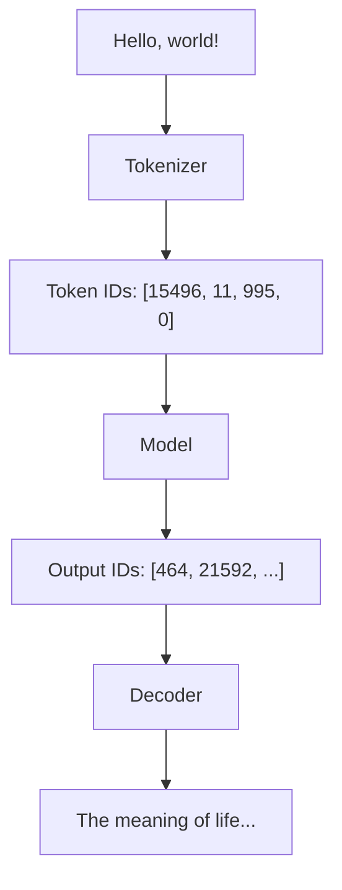
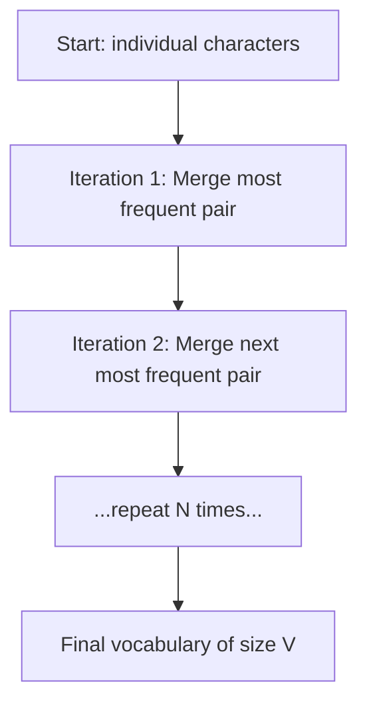
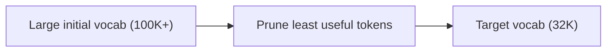

# Tokenization

## Overview

Tokenization converts raw text into a sequence of integer tokens that the model can process. The choice of tokenization algorithm affects vocabulary size, token efficiency, multilingual support, and model performance. Understanding tokenization is essential because it determines how the model "sees" text and directly impacts cost (API pricing is per token).

## Why Tokenization Matters



**Impact of tokenization:**
- **Cost**: API pricing is per token; inefficient tokenization = higher cost
- **Context window**: Token limit is in tokens, not characters
- **Multilingual**: Some languages tokenize much less efficiently
- **Code**: Special characters may split awkwardly

## Tokenization Algorithms

### Byte Pair Encoding (BPE)

The most common algorithm (GPT, LLaMA, Mistral). Iteratively merges the most frequent pair of tokens:



**Example:**
```
Input: "low lower lowest"
Characters: l, o, w, e, r, s, t

Step 1: 'l' + 'o' → 'lo' (most frequent pair)
Step 2: 'lo' + 'w' → 'low'
Step 3: 'e' + 'r' → 'er'
Step 4: 'low' + 'er' → 'lower'
...
```

```python
# BPE tokenization example
from transformers import AutoTokenizer

tokenizer = AutoTokenizer.from_pretrained("meta-llama/Llama-2-7b-hf")
tokens = tokenizer.tokenize("Hello, how are you?")
# ['▁Hello', ',', '▁how', '▁are', '▁you', '?']
```

### WordPiece

Used by BERT. Similar to BPE but uses a different merging criterion:

| BPE | WordPiece |
|---|---|
| Merges most frequent pair | Merges pair that maximizes likelihood |
| `low + er → lower` | `##low + ##er → ##lower` |
| Greedy frequency | Greedy likelihood |

### Unigram

Starts with a large vocabulary and prunes:



Used by T5 and ALBERT. Works in reverse of BPE — starts with many subwords and removes them.

### SentencePiece

A framework that implements both BPE and Unigram:

```python
import sentencepiece as spm

# Train a SentencePiece model
spm.SentencePieceTrainer.train(
    input='data.txt',
    model_prefix='tokenizer',
    vocab_size=32000,
    model_type='bpe',  # or 'unigram'
)

# Use it
sp = spm.SentencePieceProcessor(model_file='tokenizer.model')
tokens = sp.encode("Hello world", out_type=str)
# ['▁Hello', '▁world']
```

**Key feature**: Language-agnostic. Handles whitespace as a special character (▁), making it work for languages without spaces (Chinese, Japanese).

## Tokenizer Comparison

| Model | Algorithm | Vocab Size | Special Feature |
|---|---|---|---|
| GPT-2/3/4 | BPE | 50,257 | Byte-level BPE |
| LLaMA/LLaMA-2 | BPE (SentencePiece) | 32,000 | SentencePiece |
| Mistral | BPE (SentencePiece) | 32,000 | Same as LLaMA |
| BERT | WordPiece | 30,522 | ## prefix for subwords |
| T5 | Unigram (SentencePiece) | 32,100 | SentencePiece |
| Gemma | BPE (SentencePiece) | 256,000 | Large vocabulary |
| GPT-4o | BPE (tiktoken) | ~100,000 | Multilingual |

## Tokenization Efficiency

Different tokenizers encode text differently:

```python
# Efficiency comparison
text = "Hello, how are you today?"

# GPT-2: 6 tokens
# LLaMA: 7 tokens
# GPT-4o: 6 tokens

# Multilingual comparison
text_cn = "你好，今天怎么样？"
# GPT-2: ~15 tokens (very inefficient for Chinese)
# LLaMA: ~10 tokens
# GPT-4o: ~6 tokens (better multilingual)
```

| Language | GPT-2 tokens/word | LLaMA tokens/word | GPT-4o tokens/word |
|---|---|---|---|
| English | 1.3 | 1.5 | 1.2 |
| Chinese | 2.5 | 1.8 | 1.3 |
| Japanese | 2.8 | 2.0 | 1.4 |
| Code | 1.5 | 1.8 | 1.3 |

## Special Tokens

| Token | Purpose | Example |
|---|---|---|
| `<\|endoftext\|>` | End of text | GPT models |
| `<s>`, `</s>` | Start/end of sequence | LLaMA, Mistral |
| `<\|pad\|>` | Padding | Batch processing |
| `<\|im_start\|>`, `<\|im_end\|>` | Chat message boundaries | ChatML |
| `[CLS]`, `[SEP]` | Classification/separator | BERT |

## Interview Questions

### Q1: Explain BPE tokenization step by step.
**Answer:**
1. **Initialize**: Start with individual characters (bytes) as the vocabulary
2. **Count pairs**: Count frequency of all adjacent token pairs in the corpus
3. **Merge**: Create a new token from the most frequent pair
4. **Repeat**: Continue merging until the desired vocabulary size is reached
5. **Encode**: To tokenize new text, apply the learned merges in order

BPE is deterministic, language-agnostic, and handles unknown words by falling back to subword units.

### Q2: Why does tokenization affect API cost?
**Answer:** API pricing is per token. Inefficient tokenization means more tokens for the same text, directly increasing cost. For example:
- "Hello" might be 1 token, but "Supercalifragilisticexpialidocious" might be 10 tokens
- Chinese text is often 2-3× more tokens than English in GPT-2's tokenizer
- Code with many special characters can be token-heavy
Using models with efficient tokenizers (GPT-4o, LLaMA-3) saves money on multilingual and code tasks.

### Q3: What is the difference between BPE and WordPiece?
**Answer:**
- **BPE**: Merges the most frequent adjacent pair. Frequency-based criterion.
- **WordPiece**: Merges the pair that maximizes the likelihood of the training data. Likelihood-based criterion.
- In practice, they produce similar results. BPE is simpler and more widely used. WordPiece adds ## prefix for non-initial subwords.

### Q4: How do you handle tokenization for a new domain (e.g., medical text)?
**Answer:**
1. **Option 1**: Use existing tokenizer (suboptimal for domain-specific terms)
2. **Option 2**: Train a new tokenizer on domain data, then train the model from scratch
3. **Option 3**: Extend the existing tokenizer with domain tokens (add to vocabulary, resize embeddings)
4. **Option 4**: Use a model with a large vocabulary (Gemma: 256K) that likely covers domain terms
In practice, option 3 or 4 is most common.

## Common Mistakes

- ❌ Ignoring tokenization when estimating costs
- ❌ Assuming all languages tokenize equally efficiently
- ❌ Not using the correct tokenizer for the model (each model has its own)
- ❌ Confusing token count with word count (tokens ≠ words)
- ❌ Forgetting special tokens when counting context length

## Summary

Tokenization converts text to integer sequences. BPE (GPT, LLaMA) and SentencePiece (T5, LLaMA) are the most common algorithms. Tokenization affects cost, context usage, and multilingual performance. Understanding the tokenizer is essential for prompt engineering, cost estimation, and model selection.

## Cross-References

- [Architecture →](architecture.md) How tokens become embeddings
- [Embeddings →](embeddings.md) Dense vector representations
- [Inference →](inference.md) Token generation
- [Pretraining](./pretraining.md)
- [ML Transformers](../../ml/transformers/README.md)
