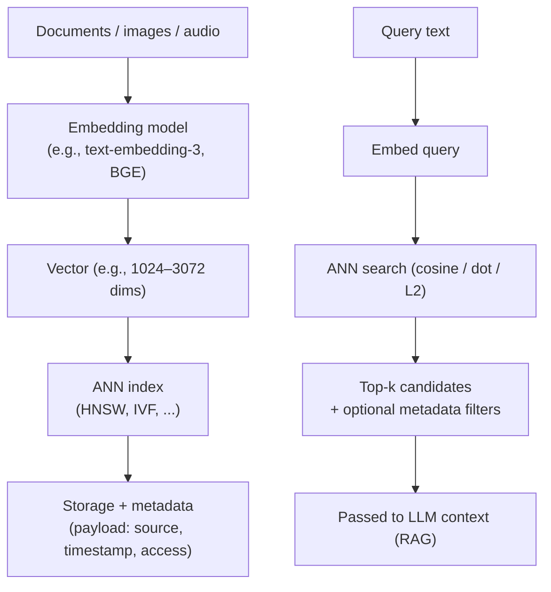
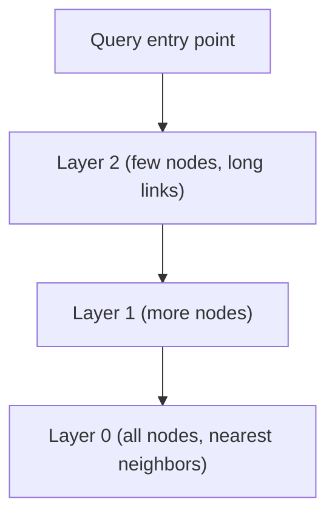

# Vector Databases

## Overview

A **vector database** stores, indexes, and searches **embeddings** — high-dimensional vectors produced by neural models (see [Embeddings](./embeddings.md)) — using **approximate nearest neighbor (ANN)** search. It is the retrieval backbone of production **RAG** systems (see [RAG](./rag.md)), semantic search, recommendation, and deduplication.

Vector search answers *"which stored vectors are closest to this query vector?"* — but exact search (scan all vectors, compute distance) is O(N·d) per query and unusable at scale. Vector databases build **ANN indexes** that trade a small, configurable amount of recall for orders-of-magnitude faster search.

## How a Vector Database Works



The vector database adds three things a plain vector **library** (like FAISS) does not:

1. **Persistence and durability** (library indexes live in RAM/process).
2. **Metadata/payload filtering** ("same vector, but only category = X").
3. **Operational features** — replication, sharding, high availability, incremental upserts/deletes.

## ANN Index Structures

### HNSW (Hierarchical Navigable Small World) — the default choice

A multi-layer graph: upper layers have long links (fast coarse navigation), the bottom layer has fine-grained links to actual neighbors. Search walks down the layers toward the query.



Key parameters:

| Parameter | Effect |
|---|---|
| `M` | Max links per node; higher = better recall, more memory |
| `ef_construction` | Build-time search width; higher = better index quality, slower build |
| `ef_search` | Query-time search width; higher = better recall, slower query |

Memory is the main cost: a 768-dim float32 vector is ~3 KB of raw data, and HNSW graph edges multiply that.

### IVF (Inverted File)

Clusters vectors with k-means into `nlist` partitions; query checks the nearest few partitions (`nprobe`), then does exact search inside them. **IVF-PQ** additionally applies **product quantization** to compress vectors (16–64× smaller), enabling billion-scale in RAM — at some recall cost.

### FLAT / exact

Brute-force scan. Only for small datasets (< ~100K vectors) or when 100% recall is mandatory.

## Distance Metrics

| Metric | Use case |
|---|---|
| **Cosine** | Most common for text embeddings (direction matters, magnitude irrelevant) |
| **Dot product** | Fast, assumes normalized vectors; default for many embedding models |
| **L2 / Euclidean** | When absolute distance matters |

## The Ecosystem (as of 2026)

| System | Type | Notes |
|---|---|---|
| **Pinecone** | Managed SaaS | Zero ops; but no exposure of HNSW tuning knobs |
| **Milvus** | Open source | Billion-scale, many index types (IVF, HNSW, DiskANN), horizontal scale-out |
| **Qdrant** | Open source (Rust) | Very fast **filtered** search, payload filtering first-class |
| **Weaviate** | Open source | Native **hybrid search** (BM25 + dense), GraphQL, multimodal |
| **pgvector** | Postgres extension | HNSW (v0.5+) and IVFFlat; SQL filters "just work"; degrades past ~10M vectors without care; by far the cheapest option if you already run Postgres |
| **Chroma** | Open source, embedded | Prototyping and small apps |
| **Elasticsearch / OpenSearch** | Search engine | HNSW + dense in existing search stack |
| **Vespa** | Open source | Hybrid + structured ranking at scale |
| **FAISS / ScaNN** | Library (not a DB) | In-process, static datasets, experiments |

**Choosing:** ≤ ~5M vectors and you already use Postgres → pgvector. Need sub-10 ms with heavy metadata filtering → Qdrant. Billion-scale or many index types → Milvus. Want hybrid search out of the box → Weaviate. Zero-ops managed → Pinecone.

## Hybrid Search

Dense (embedding) search alone misses exact-keyword matches ("Paxos" spelled exactly, product codes). **Hybrid search** combines:

```text
score = α · dense_similarity + (1 − α) · sparse_similarity (BM25)
```

with `α` tuned per domain, plus optional **RRF (Reciprocal Rank Fusion)** to merge result lists without tuning weights. Weaviate, Vespa, Qdrant, and OpenSearch/Elasticsearch support this natively; pgvector does not out of the box.

## Practical Considerations

- **Chunking quality beats index choice** — retrieval quality is dominated by how documents are chunked (see [RAG](./rag.md#document-chunking)).
- **Filtered search** changes the index math — pushing a metadata filter inside HNSW (filtered graphs) behaves differently from post-filtering.
- **Quantization** (PQ/SQ8) trades memory for recall; test at your recall target (e.g., recall@10 ≥ 0.95).
- **Staleness**: embedding models change; re-embedding and re-indexing is an operational chore (version your embedding space).
- Keep embeddings **normalized** if you use dot product; store the model + version metadata so queries and corpus match.

## Interview Questions

### Q: Vector database vs vector library (FAISS)?

A library gives you an in-memory index and search primitives; a database adds durability, metadata filtering, incremental upserts, replication, sharding, and operational tooling. Use a library for static/experimental data; a database for production RAG.

### Q: Why approximate search instead of exact?

Exact kNN is O(N·d) per query — at 100M vectors that's seconds. ANN indexes (HNSW/IVF) reduce latency to milliseconds while keeping recall at 95–99%+, which is what RAG needs. The trade-off is controlled via index parameters.

### Q: How does HNSW achieve fast search?

It builds a hierarchical graph: coarse layers with long-range links navigate to the right neighborhood quickly; the bottom layer contains exact neighbor links. Search is greedy graph traversal from a top-layer entry point, then descends — effectively log-like scaling instead of linear scan.

### Q: When would you choose pgvector over a dedicated vector database?

When the dataset is modest (≤ ~5M vectors), you already run Postgres, and you value transactional consistency with relational data and SQL filtering. Dedicated systems win at extreme scale, specialized index types, and filtered-latency guarantees.

## References

- HNSW paper: Malkov & Yashunin, *Efficient and Robust Approximate Nearest Neighbor Search Using Hierarchical Navigable Small World Graphs* (2016/2018) — https://arxiv.org/abs/1603.09320
- Johnson, Douze, Jégou, *Billion-scale similarity search with GPUs (FAISS)* — https://arxiv.org/abs/1702.08734
- pgvector documentation — https://github.com/pgvector/pgvector
- Milvus — https://milvus.io/docs
- Qdrant — https://qdrant.tech/documentation/
- Weaviate — https://weaviate.io/developers/weaviate
- ANN-Benchmarks — https://ann-benchmarks.com/

## Related Topics

- [Embeddings](./embeddings.md) — how vectors are produced
- [RAG](./rag.md) — retrieval pipeline that consumes vector search
- [Indexing](../../dbms/indexing/README.md) — classic database indexes (B-trees, hash) vs ANN
- [Distributed Storage](../../storage/distributed.md) — sharding and replication patterns
