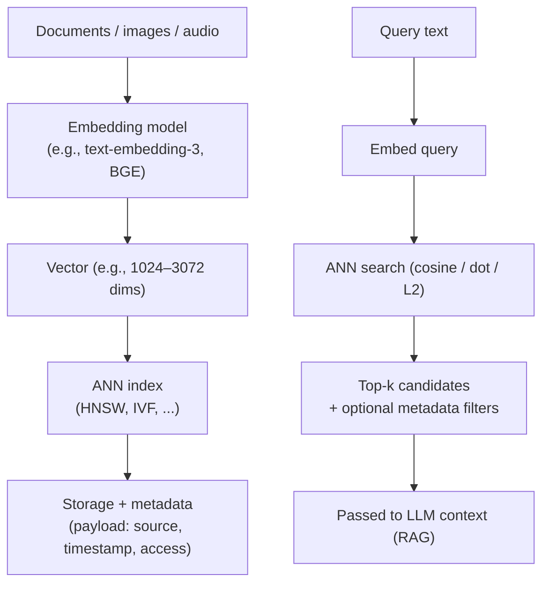
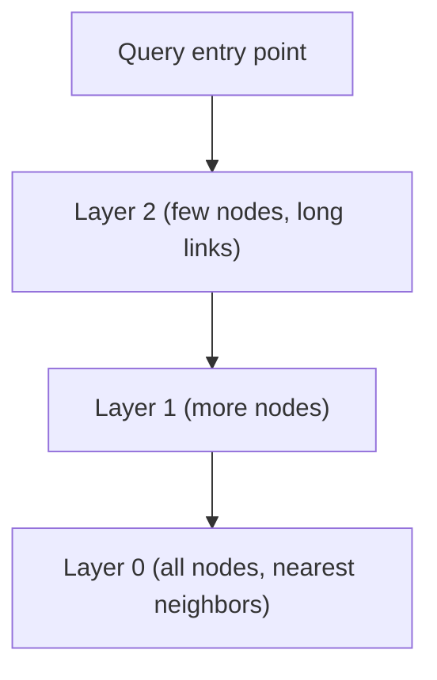

# Vector Databases

## Overview

A **vector database** stores, indexes, and searches **embeddings** — high-dimensional vectors produced by neural models (see [Embeddings](./embeddings.md)) — using **approximate nearest neighbor (ANN)** search. It is the retrieval backbone of production **RAG** systems (see [RAG](./rag.md)), semantic search, recommendation, and deduplication.

Vector search answers *"which stored vectors are closest to this query vector?"* — but exact search (scan all vectors, compute distance) is O(N·d) per query and unusable at scale. Vector databases build **ANN indexes** that trade a small, configurable amount of recall for orders-of-magnitude faster search. What distinguishes a *database* from a vector *library* is everything around the index: durability, filtering, updates, replication, and access control — which is why this page spends as much space on those as on index internals.

## How a Vector Database Works


```mermaid
graph TD
    DOC["Documents / images / audio"] --> EMB["Embedding model<br/>(e.g., text-embedding-3, BGE)"]
    EMB --> VEC["Vector (e.g., 1024–3072 dims)"]
    VEC --> IDX["ANN index<br/>(HNSW, IVF, ...)"]
    IDX --> STORE["Storage + metadata<br/>(payload: source, timestamp, access)"]
    QUERY["Query text"] --> QEMB["Embed query"]
    QEMB --> SEARCH["ANN search (cosine / dot / L2)"]
    SEARCH --> RANK["Top-k candidates<br/>+ optional metadata filters"]
    RANK --> LLM["Passed to LLM context (RAG)"]
```

The vector database adds three things a plain vector **library** (like FAISS — see [FAISS Deep Dive](../advanced/faiss.md)) does not:

1. **Persistence and durability** (library indexes live in RAM/process).
2. **Metadata/payload filtering** ("same vector, but only category = X").
3. **Operational features** — replication, sharding, high availability, incremental upserts/deletes.

## ANN Index Internals: HNSW vs IVF vs DiskANN

### HNSW — Hierarchical Navigable Small World

A multi-layer graph: upper layers have long links (fast coarse navigation), the bottom layer has fine-grained links to actual neighbors. Search walks greedily from a top-layer entry point down toward the query, descending a layer when the local search stops improving. Query cost scales roughly logarithmically with corpus size instead of linearly, which is why HNSW is the default in pgvector, Qdrant, Milvus, Weaviate, and Elasticsearch.


```mermaid
graph TB
    L2["Layer 2 (few nodes, long links)"] --> L1["Layer 1 (more nodes)"]
    L1 --> L0["Layer 0 (all nodes, nearest neighbors)"]
    Q["Query entry point"] --> L2
```

Key parameters:

| Parameter | Effect |
|---|---|
| `M` | Max links per node; higher = better recall, more memory |
| `ef_construction` | Build-time search width; higher = better index quality, slower build |
| `ef_search` | Query-time search width; higher = better recall, slower query |

Memory is the main cost: the raw vector is `dims × 4` bytes for float32, and each graph edge adds another 4 bytes of neighbor ID. With `M = 16`, layer 0 holds about `2M` out-links per node ≈ 128 bytes per vector — small next to a 3 KB vector, but it compounds, and graph traversal is also cache-unfriendly on huge datasets.

### IVF — Inverted File (and IVF-PQ)

IVF clusters vectors with k-means into `nlist` partitions (coarse quantizer); a query computes distances to partition centroids, probes the nearest `nprobe`, then does exact (or PQ-compressed) search inside those lists. It is a *cluster-prune* strategy: accuracy depends on the true neighbors landing in a probed cluster, so recall degrades smoothly with `nprobe`. **IVF-PQ** additionally applies **product quantization** — split the vector into `m` subvectors, quantize each to an 8-bit codebook — compressing 16–64× so billion-scale corpora fit in RAM, at a recall cost partially recovered by re-ranking PQ candidates with exact float32 distances. IVF needs a training pass (k-means on a sample) and degrades if the data distribution drifts far from the training sample.

### DiskANN / Vamana — SSD-resident graphs

DiskANN (Microsoft, NeurIPS 2019) builds a **Vamana** graph designed for SSD-resident search: compressed vectors (PQ) live in RAM to guide navigation, full-precision vectors stay on SSD and are fetched only for final re-ranking, keeping the per-query I/O to a few dozen sector reads. A billion vectors fit on one node with single-digit-millisecond p99 latency — the memory math section below shows why that matters. Milvus and Azure Cosmos DB ship DiskANN; it is the answer to "your index doesn't fit in RAM and PQ-only recall isn't enough."

### Comparison

| Index | Recall (typical) | QPS / latency | Memory for 100M × 768-dim | Update behavior | Best for |
|---|---|---|---|---|---|
| FLAT (exact) | 100% | Low; O(N·d) scan | ~307 GB + overhead | Trivial (in-place) | < ~100K vectors; 100% recall required |
| HNSW | 0.95–0.99 @ tuned `ef_search` | Highest; < 5 ms p99 | ~320 GB (float32 + graph) | Tombstones + periodic repair | Default; low latency, filtered search |
| IVF-Flat | 0.90–0.98 @ `nprobe` ≈ 8–32 | High; depends on `nprobe` | ~307 GB (no graph overhead) | Rebalance clusters on drift | Batch/analytics workloads; GPU (FAISS) |
| IVF-PQ | 0.85–0.95 (re-rank helps) | High; cheap distance eval | ~6–20 GB compressed | Re-train codebooks on drift | Billion-scale in RAM, recall-tolerant |
| DiskANN (Vamana) | 0.95+ @ tuned beam | High; ms-class, I/O bound | ~10–30 GB RAM + SSD for full vectors | Append-friendly; rebuild cycles | Single-node billion-scale, low RAM |

There is no universally best index — ANN-Benchmarks results flip with dataset, metric, and target recall. State the workload (dimensions, N, recall target, QPS, update rate) before naming an index; that ordering is exactly what interviewers listen for.

### Query-time tuning cheat sheet

Recall is bought at query time as much as at build time, and every engine exposes the same few levers under different names. The failure mode to avoid is tuning them against a benchmark dataset instead of your own labeled query set, because recall targets are distribution-dependent.

| Knob | Engines | Turn it up when... | Cost |
|---|---|---|---|
| `ef_search` | HNSW (pgvector, Qdrant, Weaviate, ES) | recall@k misses target | latency grows ~linearly |
| `nprobe` | IVF family | true neighbors fall outside probed clusters | CPU + latency per query |
| Re-rank depth | IVF-PQ, DiskANN | PQ recall loss visible in eval | exact distance evals on the candidate set |
| Oversample `k'` | post-filtered search | selective filters shrink result counts | more candidates to filter and rank |
| Beam width | DiskANN/Vamana | p99 tail latency too high | more SSD reads per query |

## Distance Metrics

| Metric | Use case |
|---|---|
| **Cosine** | Most common for text embeddings (direction matters, magnitude irrelevant) |
| **Dot product** | Fast, assumes normalized vectors; default for many embedding models |
| **L2 / Euclidean** | When absolute distance matters |

For normalized vectors cosine and dot product induce the *same* ranking, which is why most serving stacks normalize at write time and use dot product throughout. Mismatched metric (L2 index, cosine query intent) is a silent recall killer, so the metric is fixed per collection and versioned with the embedding model.

## Filtering: Pre-Filter vs Post-Filter

Production queries are almost never "nearest neighbors, period" — they are "nearest neighbors **among this tenant's documents** with `status = published`". How the metadata filter interacts with the ANN search is a first-order performance and correctness decision.

- **Post-filter**: run ANN first, drop results failing the predicate. Cheap and simple, but under selective filters the candidate list shrinks below `k` — 100 candidates can yield 3 results — and recall collapses exactly where precision matters most. The standard mitigation is over-fetching: request `k' = k / expected_selectivity` and re-filter.
- **Pre-filter**: apply the predicate first (via a payload index), then search within the matching subset — exact scan if the subset is small, ANN if large. Correct but can be slow when the filter matches millions of points.
- **Filtered-graph search** (Qdrant's approach, also in newer pgvector): traverse the HNSW graph while respecting the filter, using cardinality estimates to switch strategies — treat near-unselective filters as unfiltered, do filtered traversal for selective ones. This preserves approximate-search speed under selective predicates.
- **Exact-filter-then-rank**: for very selective filters (dozens of matches), skip ANN entirely and brute-force the subset; it is both faster *and* exact.

Payload indexes (B-tree/trie-style indexes on scalar payload fields) make the pre-filter path cheap; without one, every filter evaluation touches raw payload storage. The security corollary from [LLM Security](./security.md): tenant/permission predicates must be enforced *inside* the query, never applied post-hoc on the top-k — a post-filtered permission check is a leak waiting for a selective query.

## Memory Math: What Does 100M Vectors Cost?

Worked example for a production-sized corpus — 100M vectors, 768 dimensions (a typical embedding-model output). Every number below derives from one fact: **768 dims × 4 bytes (float32) = 3,072 bytes ≈ 3 KB per vector**.

| Component | Math | Size |
|---|---|---|
| Raw vectors, float32 | 100M × 3,072 B | **~307 GB** |
| Raw vectors, fp16 | 100M × 1,536 B | ~154 GB |
| Scalar-quantized int8 | 100M × 768 B | ~77 GB |
| Product-quantized (m = 64, 8-bit codes) | 100M × 64 B | **~6.4 GB** |
| HNSW graph, M = 16 (layer-0 links, 4 B per edge ID) | 100M × 2 × 16 × 4 B | ~13 GB |
| HNSW layer-1+ nodes (≈ 1/N of layer 0) | negligible | < 1 GB |
| Payload/metadata (200 B average, JSON/protobuf) | 100M × 200 B | ~20 GB |

So the honest planning numbers are: **~320 GB** for float32 HNSW (must be sharded across nodes or quantized), **~90 GB** for int8-scalar-quantized HNSW, **~20 GB** for PQ-compressed with re-ranking — plus 10–20% operational overhead for replicas, build buffers, and delete churn. This arithmetic is why: (a) quantization is a default, not an optimization, past ~10M vectors; (b) DiskANN exists (307 GB on SSD instead of RAM); (c) dimension reduction (e.g., Matryoshka embeddings, 768 → 256 dims cuts vectors 3×) is often the cheapest scale lever; and (d) pgvector's comfort zone ends around 5–10M float32 vectors on a single well-provisioned node. Higher-dim models multiply everything linearly: the same corpus at 3072 dims is 4× these numbers.

## Hybrid Search and Reciprocal Rank Fusion

Dense (embedding) search alone misses exact-keyword matches ("Paxos" spelled exactly, product codes, error strings), while BM25 nails rare tokens but misses synonymy. **Hybrid search** runs both retrievers and merges their lists:

```text
score = α · dense_similarity + (1 − α) · sparse_similarity (BM25)
```

with `α` tuned per domain. The tuning-free alternative is **Reciprocal Rank Fusion**, which merges by rank position only:

\\( \\mathrm{RRF}(d) = \\sum_{i=1}^{n} \\frac{1}{k + \\mathrm{rank}_i(d)} \\quad \\text{with } k = 60 \\)

where `rank_i(d)` is document `d`'s rank in retriever `i`'s list (absent = not summed). RRF is order-only — it ignores score magnitudes and therefore needs no score normalization between BM25's unbounded scale and cosine's [0, 1] — and a document ranked 2nd on both lists beats one ranked 1st on one list and 50th on the other. The worked document-by-document example, weighted-RRF extensions, and per-engine configuration are covered in [Retrieval Advanced: Hybrid Search and Fusion](../retrieval-advanced/hybrid-search-fusion.md); Weaviate, Vespa, Qdrant, and Elasticsearch/OpenSearch support hybrid natively, while pgvector needs a manual two-query merge.

## Consistency and Updates: Deletes, Tombstones, Segments

A vector "update" is physically **delete-then-insert**: re-embedding changes the vector's geometry, so the new point has a different place in the index, and no in-place mutation is possible. This single fact drives the update machinery of every engine.

- **HNSW deletes**: removing a node requires reconnecting its neighbors' edges (graph repair) — expensive and concurrent-unfriendly. Engines therefore mark the node with a **tombstone** (soft delete), skip tombstoned nodes during traversal, and amortize true repair into background compaction or scheduled rebuilds. A delete-heavy workload accumulates tombstones that waste traversal time and memory until compaction catches up.
- **Lucene-style segment engines** (Elasticsearch/OpenSearch dense_vector): the index is an immutable set of **segments**. A delete is a tombstone bit on the document; an update is insert-new + tombstone-old; background **merges** rewrite segments and physically drop deleted docs. Visibility is **near-real-time**: a refreshed segment is searchable after the refresh interval (default ~1 s), so read-your-writes requires an explicit refresh — a classic integration surprise when test suites write-then-search.
- **Mutable-segment engines** (Qdrant, Weaviate): writes land in a WAL plus a small mutable segment (searchable immediately — read-your-writes works), flush to immutable segments, and merge in the background. You get Lucene-style compaction *plus* real-time visibility, at the cost of managing WAL durability.
- **Bulk re-embedding** (new embedding model, corpus-wide): this is a full **reindex**, not an update — build a new collection/index alongside the old (blue/green), backfill, validate recall on a golden query set, then cut traffic over. Embedding spaces are not comparable across models, so version the model ID into collection metadata and never mix generations in one index.

The interview-grade summary: vector indexes are **append-optimized with eventually-collected garbage**. Design for append-heavy traffic, batch your deletes, budget compaction I/O, and treat "update latency" as "how long until tombstones are compacted" rather than "how fast is a write".

## Sharding and Replication Models

At 100M+ vectors you must shard; at any production availability target you must replicate. The engines make different trade-offs:

| System | Sharding model | Replication | Consistency | Notes |
|---|---|---|---|---|
| **Pinecone** | Managed; namespaces + serverless partitions (legacy pod-based) | Managed replicas per index | Eventually consistent reads | Zero ops; no exposure of shard internals or HNSW knobs |
| **Weaviate** | Hash-based shard buckets per class (configurable count) | Replica groups; raft-based coordinator for ops | Tunable consistency levels (ONE → QUORUM/ALL per op) | Shards also bound HNSW size; filter pushdown per shard |
| **Qdrant** | Hash-ring shards of a collection | Shard replicas; Raft for cluster metadata | Tunable read/write consistency (majority options) | Distributed mode optional; single-node up to ~tens of millions |
| **Milvus** | Log-broker (WAL) architecture; segments assigned to query nodes; partitions | Segment-level replicas; storage (S3) as source of truth | Bounded staleness via WAL; growing vs sealed segments | Compute/storage separation; scales to billions (see [Milvus Deep Dive](../advanced/milvus.md)) |
| **pgvector** | None built-in — Postgres table partitioning or Citus | Postgres streaming replication | Full ACID on one node | Scale-out is really Postgres scale-out; easiest ops under ~10M vectors |

Two design questions decide most of it. **Shard key choice**: hash-sharding by ID spreads load but scatters a user's documents across shards (fan-out queries), while partitioning by tenant gives locality and cheap per-tenant filters but risks hot shards — the same skew debate as any sharded system (see [Distributed Storage](../../storage/distributed.md)). **Replication purpose**: replicas serve both HA failover and read throughput, but HNSW memory means each replica re-pays the full index memory bill — replicas are expensive, so shard-then-replicate with intent, not "replicas = 3" by reflex. Concretely, the 100M-vector float32 deployment from the memory section at 3 shards × 2 replicas is ~640 GB of RAM committed across six index holders, which is why quantization decisions and replication factors must be made together, not sequentially.

## The Ecosystem (as of 2026)

| System | Type | Notes |
|---|---|---|
| **Pinecone** | Managed SaaS | Zero ops; but no exposure of HNSW tuning knobs |
| **Milvus** | Open source | Billion-scale, many index types (IVF, HNSW, DiskANN), horizontal scale-out |
| **Qdrant** | Open source (Rust) | Very fast **filtered** search, payload filtering first-class |
| **Weaviate** | Open source | Native **hybrid search** (BM25 + dense), GraphQL, multimodal |
| **pgvector** | Postgres extension | HNSW (v0.5+) and IVFFlat; SQL filters "just work"; degrades past ~10M vectors without care; by far the cheapest option if you already run Postgres |
| **Chroma** | Open source, embedded | Prototyping and small apps |
| **Elasticsearch / OpenSearch** | Search engine | HNSW + dense in existing search stack; Lucene segment semantics |
| **Vespa** | Open source | Hybrid + structured ranking at scale |
| **FAISS / ScaNN** | Library (not a DB) | In-process, static datasets, experiments |

**Choosing:** ≤ ~5M vectors and you already use Postgres → pgvector. Need sub-10 ms with heavy metadata filtering → Qdrant. Billion-scale or many index types → Milvus. Want hybrid search out of the box → Weaviate. Zero-ops managed → Pinecone. Adding vectors to an existing Elasticsearch stack → dense_vector on the engine you already operate. The deep-internals companions are [pgvector Deep Dive](../advanced/pgvector.md), [Milvus Deep Dive](../advanced/milvus.md), and [FAISS Deep Dive](../advanced/faiss.md).

## When NOT to Use a Vector Database

Vector databases are 2024–2026's default answer, and interviews increasingly probe whether you know the failure cases. Reach for something else when:

- **The corpus fits in the context window.** A few hundred kilobytes of internal docs is *prompt stuffing*, not retrieval — no index, no query latency, no staleness. The trade-offs are analyzed in [Long Context vs RAG](../retrieval-advanced/long-context-vs-rag.md).
- **Exact keyword or identifier lookup dominates.** "Find the invoice with number INV-2026-0007" is a B-tree/SQL problem; BM25 or plain SQL beats embeddings on precision and cost (see [Hybrid Search and Fusion](../retrieval-advanced/hybrid-search-fusion.md) for where lexical still wins).
- **Structured filters dominate similarity.** If 95% of queries are "latest price for SKU X in region Y", a relational database is correct, and pgvector adds semantic search *to* it rather than replacing it.
- **The dataset is small and static.** An in-process FAISS index over 50K vectors loads in milliseconds, has zero network hops, and removes an entire service from your architecture — the library-vs-database split again (see [FAISS Deep Dive](../advanced/faiss.md)).
- **The relationship structure matters more than similarity.** Multi-hop questions ("which services depend on the library CVE-2026-1234 affects?") need graph traversal — [GraphRAG](../retrieval-advanced/graphrag.md) — not nearest neighbors.
- **Deduplication at ingestion scale** may need MinHash/LSH pipelines rather than semantic ANN, since near-duplicate detection has different precision requirements than relevance ranking.

The honest pitch is conditional: a vector DB earns its keep when you have > ~1M chunks, update churn, multi-tenant filtering, and availability requirements. Below that line, it is an operational dependency in search of a problem.

## Practical Considerations

- **Chunking quality beats index choice** — retrieval quality is dominated by how documents are chunked (see [RAG](./rag.md#document-chunking) and [Chunking Strategies](../retrieval-advanced/chunking-strategies.md)).
- **Filtered search changes the index math** — pushing a metadata filter inside HNSW (filtered graphs) behaves differently from post-filtering (see the filtering section above).
- **Quantization** (PQ/SQ8) trades memory for recall; test at your recall target (e.g., recall@10 ≥ 0.95) on *your* data, not benchmark numbers.
- **Staleness**: embedding models change; re-embedding and re-indexing is an operational chore (version your embedding space).
- Keep embeddings **normalized** if you use dot product; store the model + version metadata so queries and corpus match.
- **Measure recall empirically**: hold a labeled query set, run ANN at your production parameters, and track recall@k alongside p99 latency on a dashboard — recall regressions ship silently otherwise.

## Interview Questions

### Q: Vector database vs vector library (FAISS)?

A library gives you an in-memory index and search primitives; a database adds durability, metadata filtering, incremental upserts, replication, sharding, and operational tooling. Use a library for static/experimental data; a database for production RAG. The one-liner: FAISS answers "what are the nearest neighbors", a vector database answers "nearest neighbors that this tenant may see, survive restarts, and stay fresh under updates".

### Q: Why approximate search instead of exact?

Exact kNN is O(N·d) per query — at 100M vectors that's seconds per query and hundreds of gigabytes streamed. ANN indexes (HNSW/IVF) reduce latency to milliseconds while keeping recall at 95–99%+, which is what RAG needs. The trade-off is controlled via index parameters (`ef_search`, `nprobe`), so you tune to a recall target rather than accepting a fixed loss.

### Q: How does HNSW achieve fast search?

It builds a hierarchical graph: coarse layers with long-range links navigate to the right neighborhood quickly; the bottom layer contains exact neighbor links. Search is greedy graph traversal from a top-layer entry point, then descends — effectively log-like scaling instead of linear scan. The costs are memory for graph edges and cache-unfriendly traversal, which is why `M` and `ef_search` exist as tuning knobs and why billion-scale systems move to DiskANN-style SSD-resident graphs.

### Q: When would you choose pgvector over a dedicated vector database?

When the dataset is modest (≤ ~5M vectors), you already run Postgres, and you value transactional consistency with relational data and SQL filtering. Dedicated systems win at extreme scale, specialized index types, and filtered-latency guarantees. The operational argument is strong both ways: pgvector adds no new system to operate, but it also couples vector load to your primary OLTP database's health.

### Q: Walk me through the memory math for a 768-dim, 100M-vector deployment.

768 × 4 bytes = 3 KB per vector, so raw float32 is ~307 GB. HNSW with M = 16 adds ~128 bytes/vector of graph edges (~13 GB) and payload adds ~20 GB — call it ~320 GB total, which must be sharded or quantized. int8 scalar quantization cuts vectors to ~77 GB total; PQ with 64 8-bit codes cuts them to ~6.4 GB plus re-ranking costs. From this you derive the real decisions: quantize past ~10M vectors, shard past a single node's RAM, or go DiskANN and keep full precision on SSD.

### Q: Pre-filter or post-filter for "top-10 in tenant T"? Why?

Enforce the tenant predicate **pre-filter** — inside the query, ideally via filtered-graph search — never as a post-filter on top-k. Post-filtering shrinks results under selective predicates (10 ANN hits may contain 0 permitted documents) and, worse, turns the permission check into a probabilistic filter that leaks by construction. Pre-filtering with a payload index keeps the permission predicate part of candidate enumeration, so a selective filter yields a correct (if sometimes smaller) result set, and filtered-HNSW implementations keep the latency close to unfiltered search.

### Q: What actually happens on an "update" in a vector database?

The engine inserts the new vector and tombstones the old one — it never mutates geometry in place, since a changed vector belongs in a different part of the graph/cluster structure. HNSW engines skip tombstoned nodes during traversal and repair/compact in the background; Lucene-style engines (Elasticsearch) write a new segment and let merges physically drop tombstones, with near-real-time visibility after a refresh interval. Operational consequences: delete-heavy workloads need compaction budget, and "read-your-writes" depends on the engine's refresh/flush semantics, not on any transactional guarantee you'd assume from the word "update".

### Q: Name three situations where you would not use a vector database.

Corpus small enough to stuff into the prompt (no retrieval at all — see [Long Context vs RAG](../retrieval-advanced/long-context-vs-rag.md)); exact-match/structured lookups dominating (SQL/BM25 is more precise and cheaper); and small static datasets where an in-process FAISS index removes a whole service. A fourth worth volunteering: multi-hop relational questions, where GraphRAG-style traversal beats nearest neighbors. The pattern interviewers reward is conditioning the tool on workload shape instead of defaulting to the trend.

## References

- HNSW paper: Malkov & Yashunin, *Efficient and Robust Approximate Nearest Neighbor Search Using Hierarchical Navigable Small World Graphs* (2016/2018) — https://arxiv.org/abs/1603.09320
- DiskANN: Jayaram Subramanya et al., *DiskANN: Fast Accurate Billion-point Nearest Neighbor Search on a Single Node* (NeurIPS 2019) — https://arxiv.org/abs/1910.13021
- Johnson, Douze, Jégou, *Billion-scale similarity search with GPUs (FAISS)* — https://arxiv.org/abs/1702.08734
- Cormack, Clarke, Buettcher, *Reciprocal Rank Fusion Outperforms Condorcet and Individual Rank Learning Methods* (SIGIR 2009) — https://dl.acm.org/doi/10.1145/1571941.1572114
- pgvector documentation — https://github.com/pgvector/pgvector
- Milvus documentation — https://milvus.io/docs
- Qdrant documentation — https://qdrant.tech/documentation/
- Weaviate developer documentation — https://weaviate.io/developers/weaviate
- ANN-Benchmarks — https://ann-benchmarks.com/

## Related Topics

- [Embeddings](./embeddings.md) — how vectors are produced
- [RAG](./rag.md) — retrieval pipeline that consumes vector search
- [Hybrid Search and Fusion](../retrieval-advanced/hybrid-search-fusion.md) — BM25/SPLADE internals and RRF math in depth
- [Chunking Strategies](../retrieval-advanced/chunking-strategies.md) — the upstream decision that dominates retrieval quality
- [GraphRAG](../retrieval-advanced/graphrag.md) — when relationships beat similarity
- [Long Context vs RAG](../retrieval-advanced/long-context-vs-rag.md) — the "just use the context window" alternative
- [FAISS Deep Dive](../advanced/faiss.md) — the library-level ANN implementation
- [Milvus Deep Dive](../advanced/milvus.md) — billion-scale engine internals
- [pgvector Deep Dive](../advanced/pgvector.md) — vectors inside Postgres
- [Indexing](../../dbms/indexing/README.md) — classic database indexes (B-trees, hash) vs ANN
- [Distributed Storage](../../storage/distributed.md) — sharding and replication patterns
- [LLM Security](./security.md) — retrieval-time authorization (LLM08)
