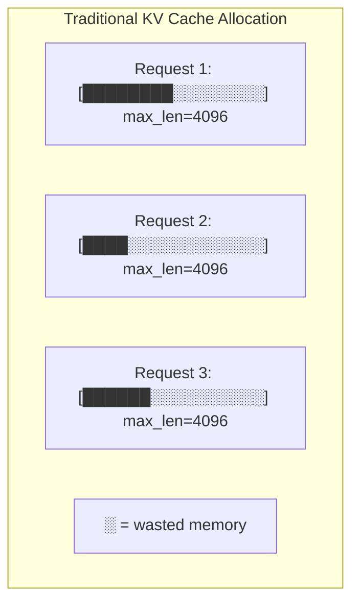
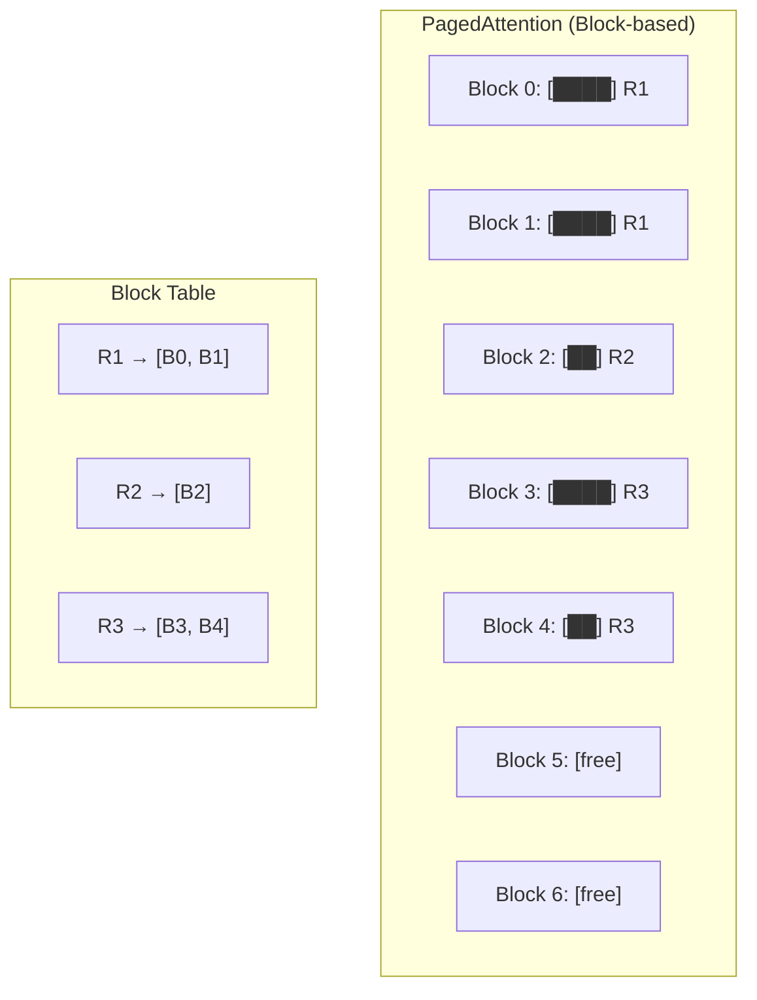
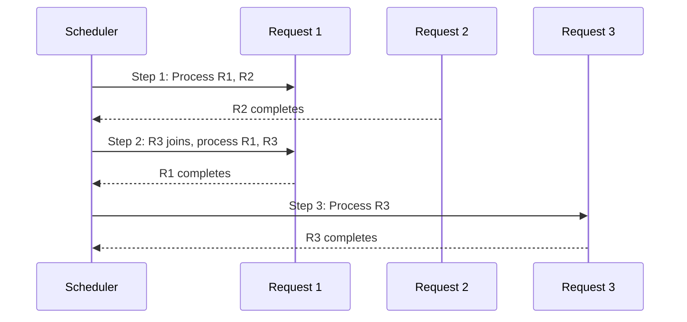

# vLLM

## Overview

vLLM (Virtual Large Language Model) is an open-source high-throughput LLM inference engine developed by UC Berkeley. Its key innovation is **PagedAttention**, which manages KV cache like virtual memory, eliminating fragmentation and enabling 2-4× more concurrent requests. vLLM is the de facto standard for production LLM serving.

## PagedAttention

### The Problem

Traditional KV cache allocates contiguous memory for each request at maximum sequence length. This causes:
- **Internal fragmentation**: Short sequences waste allocated memory
- **External fragmentation**: Memory gaps between allocations
- **Over-provisioning**: Must allocate worst-case upfront



### The Solution: PagedAttention

PagedAttention borrows the concept of **virtual memory** from operating systems:



**Key ideas:**
- KV cache is divided into fixed-size **blocks** (e.g., 16 tokens each)
- Each request gets blocks **on demand** as it generates tokens
- A **block table** maps logical positions to physical blocks
- Blocks can be **non-contiguous** in physical memory
- **No internal fragmentation**: Only the last block may have unused space

### Memory Savings

| Metric | Traditional | PagedAttention |
|---|---|---|
| Internal fragmentation | ~50% average | ~4% (one block) |
| Memory utilization | ~50% | ~96% |
| Concurrent requests | 1× | 2-4× |

## Continuous Batching in vLLM

vLLM implements iteration-level scheduling:



## vLLM Architecture

```mermaid
graph TD
    subgraph "vLLM Engine"
        API[OpenAI-compatible API]
        SCHED[Scheduler]
        KV[KV Cache Manager (PagedAttention)]
        MODEL[Model Runner]
        WORKER[GPU Workers]
    end

    CLIENT[Client] --> API
    API --> SCHED
    SCHED --> KV
    KV --> MODEL
    MODEL --> WORKER
```

### Components

| Component | Role |
|---|---|
| **API Server** | OpenAI-compatible HTTP API |
| **Scheduler** | Decides which requests to process each iteration |
| **KV Cache Manager** | Allocates/frees blocks using PagedAttention |
| **Model Runner** | Executes model forward pass |
| **GPU Worker** | Manages GPU memory and computation |

## Installation and Usage

### Installation

```bash
pip install vllm

# With specific CUDA version
pip install vllm --extra-index-url https://download.pytorch.org/whl/cu118
```

### Basic Usage

```python
from vllm import LLM, SamplingParams

# Initialize model
llm = LLM(
    model="meta-llama/Llama-2-7b-chat-hf",
    tensor_parallel_size=1,
    gpu_memory_utilization=0.9,
    max_model_len=4096,
)

# Define sampling parameters
sampling_params = SamplingParams(
    temperature=0.7,
    top_p=0.9,
    max_tokens=512,
)

# Generate
outputs = llm.generate(
    ["Explain quantum computing", "Write a Python function"],
    sampling_params
)

for output in outputs:
    print(output.outputs[0].text)
```

### OpenAI-Compatible Server

```bash
# Start server
python -m vllm.entrypoints.openai.api_server \
    --model meta-llama/Llama-2-7b-chat-hf \
    --tensor-parallel-size 2 \
    --gpu-memory-utilization 0.9 \
    --enable-prefix-caching \
    --max-model-len 4096

# Client usage (same as OpenAI API)
from openai import OpenAI
client = OpenAI(base_url="http://localhost:8000/v1")
response = client.chat.completions.create(
    model="meta-llama/Llama-2-7b-chat-hf",
    messages=[{"role": "user", "content": "Hello!"}]
)
```

## Key Features

### Prefix Caching

```bash
# Enable prefix caching for shared system prompts
python -m vllm.entrypoints.openai.api_server \
    --model model-name \
    --enable-prefix-caching
```

When many requests share the same prefix (system prompt, few-shot examples), the KV cache is computed once and shared. Saves 5-10× on prefill for shared prefixes.

### Speculative Decoding

```python
llm = LLM(
    model="meta-llama/Llama-2-70b-chat-hf",
    speculative_model="meta-llama/Llama-2-7b-chat-hf",
    num_speculative_tokens=5,
)
```

### Tensor Parallelism

```bash
# Split model across 4 GPUs
python -m vllm.entrypoints.openai.api_server \
    --model meta-llama/Llama-2-70b-chat-hf \
    --tensor-parallel-size 4
```

### Quantization Support

```python
# GPTQ quantized model
llm = LLM(
    model="TheBloke/Llama-2-7B-Chat-GPTQ",
    quantization="gptq",
)

# AWQ quantized model
llm = LLM(
    model="TheBloke/Llama-2-7B-Chat-AWQ",
    quantization="awq",
)
```

## Configuration Tuning

| Parameter | Default | Description | Tune When |
|---|---|---|---|
| `gpu_memory_utilization` | 0.9 | GPU memory fraction | OOM errors |
| `max_model_len` | Model default | Max sequence length | Memory constraints |
| `max_num_seqs` | 256 | Max concurrent sequences | Throughput tuning |
| `max_num_batched_tokens` | Model default | Max tokens per batch | Latency tuning |
| `swap_space` | 4 GB | CPU swap for preemption | Long sequences |
| `enable_prefix_caching` | False | Share KV cache for prefixes | Shared prompts |
| `enforce_eager` | False | Disable CUDA graphs | Debugging |

## Performance Benchmarks

Typical vLLM performance (A100 80GB, LLaMA-7B, FP16):

| Metric | Value |
|---|---|
| Throughput (tokens/sec) | ~2000-3000 |
| TTFT (p50) | ~100ms |
| TTFT (p99) | ~500ms |
| TPOT (p50) | ~30ms |
| Max batch size | ~64-128 (4K context) |

## Interview Questions

### Q1: What is PagedAttention and how does it work?
**Answer:** PagedAttention manages KV cache like virtual memory in an OS. Instead of allocating contiguous memory for each request's maximum sequence length, it uses fixed-size blocks (e.g., 16 tokens). As a request generates tokens, new blocks are allocated on demand. A block table maps logical token positions to physical blocks. This eliminates internal fragmentation (from ~50% to ~4%), enabling 2-4× more concurrent requests on the same GPU.

### Q2: How does vLLM's continuous batching work?
**Answer:** vLLM schedules requests at the iteration level, not the request level. Each decode iteration, the scheduler decides which requests to include in the batch based on available KV cache blocks. Requests can join mid-generation (when a slot opens) and leave when complete (blocks are freed). This avoids the "wait for longest request" problem of static batching.

### Q3: How would you optimize vLLM for a workload with shared system prompts?
**Answer:**
1. Enable `--enable-prefix-caching` to share KV cache for common prefixes
2. Set appropriate `max_model_len` to avoid wasting memory
3. Use quantization (AWQ INT4) to increase batch capacity
4. Monitor prefix cache hit rate in metrics
5. Consider chunked prefill if prompts are very long

### Q4: What is the difference between vLLM and TensorRT-LLM?
**Answer:**
- **vLLM**: Open-source, Python-based, easy to use, wide model support, PagedAttention. Best for general-purpose serving.
- **TensorRT-LLM**: NVIDIA proprietary, C++/Python, maximum NVIDIA GPU performance, FP8 support, custom CUDA kernels. Best for NVIDIA-only deployments where maximum performance is critical.
- vLLM is easier to deploy; TRT-LLM is faster but requires more setup.

## Common Mistakes

- ❌ Not setting `gpu_memory_utilization` (defaults may be too aggressive or conservative)
- ❌ Ignoring `max_model_len` (default may be too large, wasting memory)
- ❌ Not enabling prefix caching when prompts are shared
- ❌ Using vLLM for CPU-only deployment (use llama.cpp instead)
- ❌ Not monitoring KV cache utilization for capacity planning

## Summary

vLLM is the leading open-source LLM serving engine. PagedAttention eliminates KV cache fragmentation, enabling 2-4× more concurrent requests. Continuous batching maximizes GPU utilization. Features include prefix caching, speculative decoding, tensor parallelism, and quantization support. The OpenAI-compatible API makes it a drop-in replacement for production deployments.

## Cross-References

- [KV Cache →](kv-cache.md) The memory management problem PagedAttention solves
- [Batching →](batching.md) Continuous batching theory
- [TensorRT-LLM →](tensorrt.md) Alternative serving engine
- [Quantization →](quantization.md) Model compression supported by vLLM
- [Systems Overview →](systems.md) Comparison of serving systems
- [TGI](./tgi.md)
- [TensorRT](./tensorrt.md)
- [Batching](./batching.md)
- [KV Cache](./kv-cache.md)

