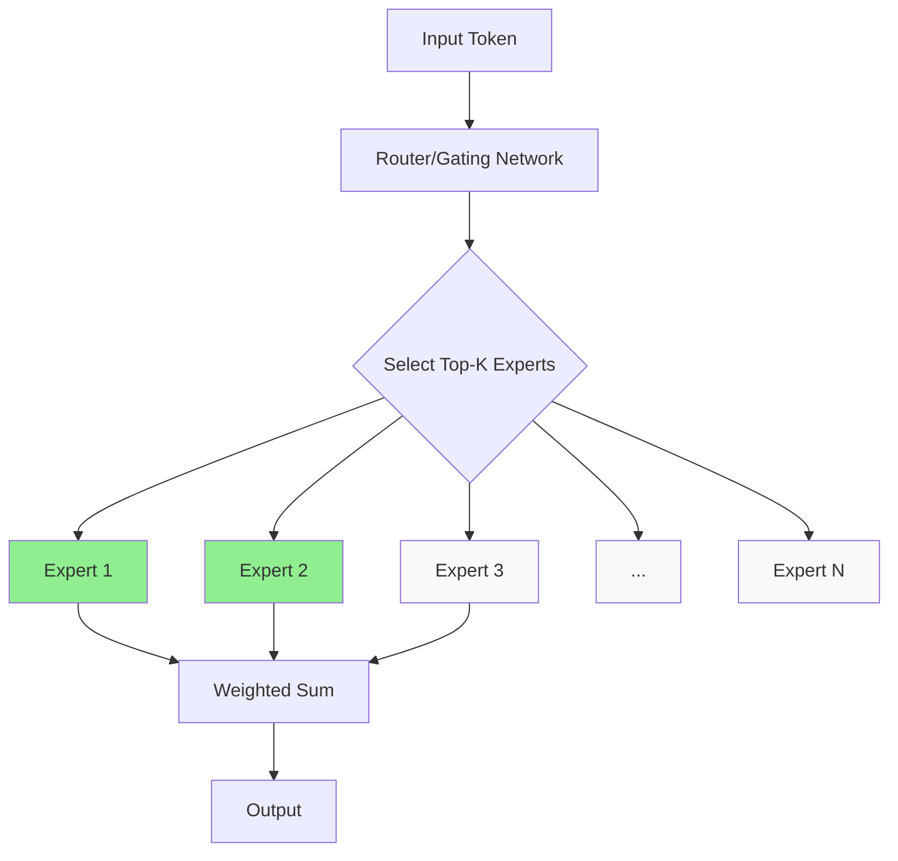

# Mixture of Experts (MoE)

Mixture of Experts is an architecture that uses multiple specialized "expert" networks with a gating mechanism that selectively activates only a subset of experts for each input. This enables scaling model capacity without proportional compute increase.

## Overview



## Core Concept

### Dense vs Sparse Models

```python
# Dense Model: ALL parameters used for every input
class DenseLayer(nn.Module):
    def __init__(self, d_model):
        super().__init__()
        self.ffn = FeedForward(d_model)  # All parameters active
    
    def forward(self, x):
        return self.ffn(x)  # Uses all parameters

# Sparse Model (MoE): Only TOP-K experts used
class MoELayer(nn.Module):
    def __init__(self, d_model, num_experts=8, top_k=2):
        super().__init__()
        self.experts = nn.ModuleList([
            FeedForward(d_model) for _ in range(num_experts)
        ])
        self.router = nn.Linear(d_model, num_experts)
        self.top_k = top_k
    
    def forward(self, x):
        # Route to top-k experts
        router_logits = self.router(x)
        top_k_logits, top_k_indices = router_logits.topk(self.top_k)
        top_k_weights = F.softmax(top_k_logits, dim=-1)
        
        # Only process through selected experts
        output = torch.zeros_like(x)
        for i, expert in enumerate(self.experts):
            mask = (top_k_indices == i).any(dim=-1)
            if mask.any():
                expert_output = expert(x[mask])
                weight = top_k_weights[mask, (top_k_indices[mask] == i).nonzero()[:, 1]]
                output[mask] += weight.unsqueeze(-1) * expert_output
        
        return output
```

### Why MoE?

| Aspect | Dense Model | MoE Model |
|--------|-------------|-----------|
| Parameters | All active | Only top-k active |
| Compute per token | O(d²) | O(d² × k/n) |
| Model capacity | Limited by compute | Can be very large |
| Training | Standard | Needs load balancing |
| Examples | GPT-3 175B | Mixtral 8×7B |

## Architecture Components

### Expert Network

```python
class Expert(nn.Module):
    """Individual expert - typically a Feed-Forward Network"""
    def __init__(self, d_model, d_ff):
        super().__init__()
        self.w1 = nn.Linear(d_model, d_ff)
        self.w2 = nn.Linear(d_ff, d_model)
        self.w3 = nn.Linear(d_model, d_ff)  # SwiGLU
    
    def forward(self, x):
        return self.w2(F.silu(self.w1(x)) * self.w3(x))  # SwiGLU activation
```

### Router/Gating Network

```python
class Router(nn.Module):
    """Routes tokens to experts"""
    def __init__(self, d_model, num_experts):
        super().__init__()
        self.gate = nn.Linear(d_model, num_experts, bias=False)
    
    def forward(self, x):
        # x: (batch, seq_len, d_model)
        logits = self.gate(x)  # (batch, seq_len, num_experts)
        return logits

class TopKRouter(nn.Module):
    """Select top-k experts per token"""
    def __init__(self, d_model, num_experts, top_k=2):
        super().__init__()
        self.gate = nn.Linear(d_model, num_experts, bias=False)
        self.top_k = top_k
    
    def forward(self, x):
        logits = self.gate(x)
        top_k_logits, top_k_indices = logits.topk(self.top_k, dim=-1)
        top_k_weights = F.softmax(top_k_logits, dim=-1)
        return top_k_weights, top_k_indices
```

## MoE Transformer Layer

```python
class MoETransformerBlock(nn.Module):
    """Transformer block with MoE FFN"""
    def __init__(self, d_model, num_experts, top_k, num_heads):
        super().__init__()
        self.attention = nn.MultiheadAttention(d_model, num_heads)
        self.moe = MoELayer(d_model, num_experts, top_k)
        self.norm1 = nn.LayerNorm(d_model)
        self.norm2 = nn.LayerNorm(d_model)
    
    def forward(self, x):
        # Self-attention
        attn_out, _ = self.attention(x, x, x)
        x = self.norm1(x + attn_out)
        
        # MoE FFN
        moe_out = self.moe(x)
        x = self.norm2(x + moe_out)
        
        return x
```

## Load Balancing

The biggest challenge in MoE: ensuring all experts are used equally.

### The Problem

```python
# Without load balancing, router may collapse to using only 1-2 experts
# This wastes capacity and reduces model quality

# Example of collapse:
# Expert 1: 95% of tokens
# Expert 2: 3% of tokens
# Expert 3: 1% of tokens
# Expert 4: 1% of tokens
# ... (8 experts, but effectively using 1)
```

### Load Balancing Loss

```python
def load_balancing_loss(router_logits, top_k_indices, num_experts):
    """Auxiliary loss to encourage balanced expert usage"""
    # Fraction of tokens routed to each expert
    router_probs = F.softmax(router_logits, dim=-1)
    
    # One-hot encoding of selected experts
    expert_mask = F.one_hot(top_k_indices, num_experts).float()
    
    # Average probability per expert
    avg_prob = router_probs.mean(dim=[0, 1])  # (num_experts,)
    
    # Fraction of tokens per expert
    fraction_tokens = expert_mask.mean(dim=[0, 1])  # (num_experts,)
    
    # Load balancing loss: encourage uniform distribution
    loss = num_experts * (avg_prob * fraction_tokens).sum()
    
    return loss

# Total loss = task_loss + α * load_balancing_loss
# α is typically 0.01
```

## Expert Parallelism

Distributing experts across GPUs for efficient training.

```python
# Each GPU holds a subset of experts
# Tokens are routed to the appropriate GPU

class ExpertParallelism:
    def __init__(self, num_experts, num_gpus):
        self.experts_per_gpu = num_experts // num_gpus
        # GPU 0: Expert 0, 1
        # GPU 1: Expert 2, 3
        # GPU 2: Expert 4, 5
        # GPU 3: Expert 6, 7
    
    def route_to_gpu(self, token, expert_idx):
        """Send token to GPU holding the expert"""
        target_gpu = expert_idx // self.experts_per_gpu
        return send_to_gpu(token, target_gpu)
    
    def all_to_all_communication(self, tokens, routing):
        """All-to-all communication pattern"""
        # Each GPU sends tokens to appropriate expert GPUs
        # Then receives results back
        pass
```

## Key MoE Models

| Model | Experts | Active | Parameters | Year |
|-------|---------|--------|------------|------|
| Switch Transformer | 128 | 1 | 1.6T | 2021 |
| GShard | 2048 | 2 | 600B | 2020 |
| Mixtral 8×7B | 8 | 2 | 47B | 2023 |
| DeepSeek-V3 | 256 | 8 | 671B | 2024 |
| Grok-1 | 8 | 2 | 314B | 2024 |

## Training Challenges

### 1. Router Collapse
```python
# Problem: Router learns to always select same experts
# Solution: Load balancing loss, noisy top-k
```

### 2. Expert Specialization
```python
# Problem: Experts don't specialize enough
# Solution: Larger batch sizes, more training data
```

### 3. Communication Overhead
```python
# Problem: All-to-all communication between GPUs
# Solution: Expert parallelism, hierarchical routing
```

### 4. Token Dropping
```python
# Problem: Expert capacity exceeded
# Solution: Capacity factor, token dropping
```

## Inference Optimization

### Expert Caching

```python
class ExpertCache:
    """Cache frequently used experts in memory"""
    def __init__(self, num_experts, cache_size=2):
        self.cache = {}  # GPU memory
        self.disk = {}   # CPU/disk storage
        self.cache_size = cache_size
    
    def get_expert(self, expert_idx):
        if expert_idx in self.cache:
            return self.cache[expert_idx]
        else:
            # Load from disk, swap if needed
            expert = self.load_from_disk(expert_idx)
            self.swap_cache(expert_idx, expert)
            return expert
```

### Quantized Experts

```python
# Quantize experts to reduce memory
# INT4 quantization: 4x memory reduction
quantized_experts = [quantize_int4(expert) for expert in experts]
```

## Interview Questions

1. **What is Mixture of Experts?**
   An architecture using multiple expert networks where only a subset (top-k) are activated per input. A router decides which experts to use. This enables scaling model capacity without proportional compute increase.

2. **How does the router work?**
   The router is a linear layer that produces logits for each expert. Top-k experts are selected based on these logits, and their outputs are weighted by softmax probabilities.

3. **What is load balancing in MoE?**
   Ensuring all experts are used equally. Without it, the router may collapse to using only 1-2 experts. Load balancing loss encourages uniform expert utilization.

4. **What is the difference between dense and sparse models?**
   Dense models use all parameters for every input. Sparse models (MoE) only activate a subset of parameters per input, enabling larger models with less compute per token.

5. **How does expert parallelism work?**
   Experts are distributed across GPUs. Tokens are routed to the GPU holding the appropriate expert using all-to-all communication. This enables scaling to many experts.

6. **What is token dropping in MoE?**
   When an expert's capacity is exceeded, excess tokens are either dropped (skipped) or passed through a residual connection. This prevents bottlenecks but may lose information.

7. **Why use MoE instead of a larger dense model?**
   MoE achieves similar quality with less compute per token. A 47B MoE model (Mixtral) can match a 70B dense model while being faster at inference.

## Common Mistakes

- ❌ Not implementing load balancing (router collapse)
- ❌ Using too few experts (limits capacity)
- ❌ Ignoring communication overhead in expert parallelism
- ❌ Not handling token dropping properly
- ❌ Treating MoE like dense model during fine-tuning

## Summary

MoE enables scaling model capacity by selectively activating experts per input. The router decides which experts to use, and load balancing ensures efficient utilization. Key models include Switch Transformer, Mixtral, and DeepSeek-V3. Training requires careful load balancing, and inference benefits from expert caching and quantization.

## Cross-References

- [MoE Architecture](architecture.md) - Detailed architecture
- [Routing Strategies](routing.md) - How routers work
- [Switch Transformer](switch.md) - Simplified MoE
- [Mixtral](mixtral.md) - Open-source MoE
- [Training MoE](training.md) - Training challenges
- [Transformers](../transformers.md) - Base architecture
