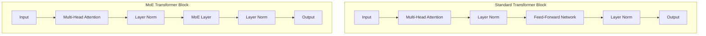

# MoE Architecture

The Mixture of Experts architecture replaces standard feed-forward layers with multiple expert networks and a gating mechanism. This enables scaling model capacity while keeping computational cost manageable.

## Overview



## Detailed Architecture

### MoE Layer Components

```python
class MoELayer(nn.Module):
    """
    Mixture of Experts Layer
    - N expert networks (typically FFNs)
    - Router/gating network
    - Top-k selection
    - Weighted combination
    """
    def __init__(self, d_model, d_ff, num_experts=8, top_k=2, 
                 dropout=0.1, capacity_factor=1.25):
        super().__init__()
        self.num_experts = num_experts
        self.top_k = top_k
        self.capacity_factor = capacity_factor
        
        # Expert networks
        self.experts = nn.ModuleList([
            FeedForward(d_model, d_ff, dropout) 
            for _ in range(num_experts)
        ])
        
        # Router
        self.router = nn.Linear(d_model, num_experts, bias=False)
    
    def forward(self, x):
        batch_size, seq_len, d_model = x.shape
        num_tokens = batch_size * seq_len
        
        # Flatten tokens
        x_flat = x.view(-1, d_model)  # (num_tokens, d_model)
        
        # Compute router logits
        router_logits = self.router(x_flat)  # (num_tokens, num_experts)
        
        # Select top-k experts
        top_k_logits, top_k_indices = router_logits.topk(self.top_k, dim=-1)
        top_k_weights = F.softmax(top_k_logits, dim=-1)
        
        # Compute expert capacity
        capacity = int(num_tokens * self.top_k * self.capacity_factor / self.num_experts)
        
        # Dispatch tokens to experts
        output = self.dispatch_to_experts(x_flat, top_k_weights, 
                                          top_k_indices, capacity)
        
        return output.view(batch_size, seq_len, d_model)
    
    def dispatch_to_experts(self, x, weights, indices, capacity):
        """Route tokens to appropriate experts"""
        output = torch.zeros_like(x)
        
        for expert_idx in range(self.num_experts):
            # Find tokens routed to this expert
            expert_mask = (indices == expert_idx).any(dim=-1)
            
            if expert_mask.any():
                expert_input = x[expert_mask]
                expert_output = self.experts[expert_idx](expert_input)
                
                # Get weights for this expert
                expert_weights = weights[expert_mask]
                # Find which position in top-k this expert is
                pos = (indices[expert_mask] == expert_idx).float().argmax(dim=-1)
                weight = expert_weights[torch.arange(len(pos)), pos]
                
                output[expert_mask] += weight.unsqueeze(-1) * expert_output
        
        return output
```

### Expert Network Design

```python
class SwiGLUExpert(nn.Module):
    """SwiGLU-based expert (used in Mixtral, DeepSeek)"""
    def __init__(self, d_model, d_ff):
        super().__init__()
        self.w1 = nn.Linear(d_model, d_ff, bias=False)
        self.w2 = nn.Linear(d_ff, d_model, bias=False)
        self.w3 = nn.Linear(d_model, d_ff, bias=False)
    
    def forward(self, x):
        return self.w2(F.silu(self.w1(x)) * self.w3(x))

class StandardExpert(nn.Module):
    """Standard FFN expert"""
    def __init__(self, d_model, d_ff, dropout=0.1):
        super().__init__()
        self.w1 = nn.Linear(d_model, d_ff)
        self.w2 = nn.Linear(d_ff, d_model)
        self.dropout = nn.Dropout(dropout)
        self.activation = nn.GELU()
    
    def forward(self, x):
        return self.w2(self.dropout(self.activation(self.w1(x))))
```

## Router Design

### Token-Choice Router (Most Common)

```python
class TokenChoiceRouter(nn.Module):
    """Each token chooses its top-k experts"""
    def __init__(self, d_model, num_experts, top_k=2, noise_std=0.1):
        super().__init__()
        self.gate = nn.Linear(d_model, num_experts, bias=False)
        self.top_k = top_k
        self.noise_std = noise_std
    
    def forward(self, x, training=True):
        # Compute logits
        logits = self.gate(x)
        
        # Add noise during training for exploration
        if training:
            noise = torch.randn_like(logits) * self.noise_std
            logits = logits + noise
        
        # Top-k selection
        top_k_logits, top_k_indices = logits.topk(self.top_k, dim=-1)
        top_k_weights = F.softmax(top_k_logits, dim=-1)
        
        return top_k_weights, top_k_indices, logits
```

### Expert-Choice Router

```python
class ExpertChoiceRouter(nn.Module):
    """Each expert chooses its top-k tokens"""
    def __init__(self, d_model, num_experts, capacity_factor=1.0):
        super().__init__()
        self.gate = nn.Linear(d_model, num_experts, bias=False)
        self.capacity_factor = capacity_factor
    
    def forward(self, x):
        logits = self.gate(x)  # (num_tokens, num_experts)
        probs = F.softmax(logits, dim=0)  # Softmax over tokens
        
        num_tokens = x.shape[0]
        capacity = int(num_tokens * self.capacity_factor / self.num_experts)
        
        # Each expert selects top tokens
        assignments = []
        for expert_idx in range(self.num_experts):
            expert_probs = probs[:, expert_idx]
            top_tokens = expert_probs.topk(capacity).indices
            assignments.append((expert_idx, top_tokens))
        
        return assignments
```

### Router Comparison

| Aspect | Token-Choice | Expert-Choice |
|--------|-------------|---------------|
| Selection | Each token picks experts | Each expert picks tokens |
| Load Balance | Needs auxiliary loss | Natural balance |
| Capacity | May drop tokens | Guaranteed capacity |
| Training | Standard | More complex |
| Used in | Mixtral, Switch | Some research models |

## Capacity and Token Dropping

```python
class CapacityManagedMoE(nn.Module):
    """MoE with capacity management and token dropping"""
    def __init__(self, d_model, num_experts, top_k, capacity_factor=1.25):
        super().__init__()
        self.num_experts = num_experts
        self.top_k = top_k
        self.capacity_factor = capacity_factor
        self.experts = nn.ModuleList([SwiGLUExpert(d_model, d_model*4) 
                                       for _ in range(num_experts)])
        self.router = TokenChoiceRouter(d_model, num_experts, top_k)
    
    def forward(self, x):
        batch_size, seq_len, d_model = x.shape
        num_tokens = batch_size * seq_len
        x_flat = x.view(-1, d_model)
        
        # Route tokens
        weights, indices, logits = self.router(x_flat)
        
        # Calculate capacity per expert
        capacity = int(num_tokens * self.top_k * self.capacity_factor / self.num_experts)
        
        # Track which tokens are dropped
        token_dropped = torch.zeros(num_tokens, dtype=torch.bool, device=x.device)
        
        output = torch.zeros_like(x_flat)
        
        for expert_idx in range(self.num_experts):
            # Find tokens for this expert
            mask = (indices == expert_idx).any(dim=-1)
            expert_tokens = x_flat[mask]
            
            if len(expert_tokens) > capacity:
                # Drop excess tokens
                expert_tokens = expert_tokens[:capacity]
                # Mark dropped tokens
                dropped_indices = mask.nonzero()[capacity:]
                token_dropped[dropped_indices] = True
            
            if len(expert_tokens) > 0:
                expert_output = self.experts[expert_idx](expert_tokens)
                
                # Get weights
                pos = (indices[mask] == expert_idx).float().argmax(dim=-1)
                w = weights[mask][torch.arange(min(len(pos), capacity)), 
                                   pos[:capacity]]
                
                output[mask][:len(expert_tokens)] += w[:len(expert_tokens), 
                                                         None] * expert_output
        
        # Handle dropped tokens (pass through residual)
        output[token_dropped] = x_flat[token_dropped]
        
        return output.view(batch_size, seq_len, d_model)
```

## Shared vs Specialized Experts

```python
class HybridMoE(nn.Module):
    """Mix of shared and specialized experts"""
    def __init__(self, d_model, num_routed_experts=7, num_shared_experts=1):
        super().__init__()
        # Shared expert: always active (DeepSeek-V2 style)
        self.shared_expert = SwiGLUExpert(d_model, d_model * 4)
        
        # Routed experts: selectively activated
        self.routed_experts = nn.ModuleList([
            SwiGLUExpert(d_model, d_model * 4) 
            for _ in range(num_routed_experts)
        ])
        self.router = TokenChoiceRouter(d_model, num_routed_experts, top_k=2)
    
    def forward(self, x):
        # Shared expert always processes all tokens
        shared_output = self.shared_expert(x)
        
        # Routed experts
        weights, indices, _ = self.router(x)
        routed_output = self.dispatch_to_experts(x, weights, indices)
        
        # Combine
        return shared_output + routed_output
```

## MoE Variants

### GShard (Google, 2020)

```python
# First large-scale MoE model
# - 600B parameters, 2048 experts
# - Top-2 routing
# - Capacity factor for load balancing
# - Used in machine translation
```

### Switch Transformer (Google, 2021)

```python
# Simplified MoE with top-1 routing
# - Only 1 expert per token (simpler, faster)
# - Larger capacity factor to compensate
# - Up to 1.6T parameters
# - Easier to train than top-2
```

### Mixtral (Mistral, 2023)

```python
# Open-source MoE model
# - 8 experts, top-2 routing
# - 47B total, ~13B active per token
# - Matches LLaMA 2 70B quality
# - Much faster inference
```

### DeepSeek-V2/V3

```python
# Innovative MoE design
# - Shared expert + routed experts
# - Fine-grained expert segmentation
# - Auxiliary-loss-free load balancing
# - 671B total, 37B active
```

## Implementation Details

### Efficient Batched MoE

```python
class EfficientMoE(nn.Module):
    """Efficient implementation using grouped operations"""
    def __init__(self, d_model, num_experts, top_k):
        super().__init__()
        self.num_experts = num_experts
        self.top_k = top_k
        
        # Stack all expert weights for efficient batched computation
        self.expert_weights = nn.ParameterList([
            nn.Parameter(torch.randn(d_model, d_model * 4))
            for _ in range(num_experts)
        ])
    
    def forward(self, x_flat, top_k_weights, top_k_indices):
        # Group tokens by expert
        # Use batched matrix multiplication
        # More efficient than per-expert loops
        
        output = torch.zeros_like(x_flat)
        
        for expert_idx in range(self.num_experts):
            mask = (top_k_indices == expert_idx).any(dim=-1)
            if mask.any():
                expert_input = x_flat[mask]
                # Batched computation
                expert_output = F.linear(
                    F.silu(F.linear(expert_input, self.expert_weights[expert_idx])),
                    self.expert_weights[expert_idx].T
                )
                # ... weighted accumulation
        
        return output
```

### Expert Parallelism Communication

```python
class ExpertParallelMoE:
    """MoE with expert parallelism across GPUs"""
    def __init__(self, num_experts, num_gpus):
        self.experts_per_gpu = num_experts // num_gpus
        # Distribute experts across GPUs
    
    def forward(self, x, routing):
        # Step 1: All-to-all - send tokens to expert GPUs
        dispatched = self.all_to_all_dispatch(x, routing)
        
        # Step 2: Each GPU processes its experts
        expert_outputs = self.process_local_experts(dispatched)
        
        # Step 3: All-to-all - return results
        combined = self.all_to_all_combine(expert_outputs, routing)
        
        return combined
```

## Interview Questions

1. **What is the MoE architecture?**
   MoE replaces standard FFN layers with multiple expert networks and a router. Only top-k experts are activated per token, enabling scaling model capacity without proportional compute increase.

2. **How does the router decide which experts to use?**
   The router is a linear layer that produces logits for each expert. Top-k experts are selected based on these logits, and weights are computed via softmax.

3. **What is expert-choice vs token-choice routing?**
   Token-choice: each token selects its top-k experts. Expert-choice: each expert selects its top-k tokens. Expert-choice provides natural load balancing but is more complex.

4. **Why is load balancing important in MoE?**
   Without load balancing, the router may collapse to using only 1-2 experts, wasting capacity. Load balancing loss encourages uniform expert utilization.

5. **What is capacity factor in MoE?**
   Controls how many tokens each expert can process. Capacity factor > 1 allows some buffer. Tokens exceeding capacity are dropped or passed through residual.

6. **How does expert parallelism work?**
   Experts are distributed across GPUs. Tokens are routed to the GPU holding the appropriate expert using all-to-all communication.

7. **What is a shared expert?**
   An expert that always processes all tokens (DeepSeek-V2 style). Provides baseline capability while routed experts add specialization.

## Common Mistakes

- ❌ Not implementing load balancing (router collapse)
- ❌ Using too small capacity factor (excessive token dropping)
- ❌ Ignoring communication overhead in expert parallelism
- ❌ Not handling variable sequence lengths in routing
- ❌ Treating all experts as identical during initialization

## Summary

MoE architecture uses multiple expert networks with selective activation. Key components include the router (selecting experts), experts (processing tokens), and load balancing (ensuring utilization). Variations include token-choice vs expert-choice routing, shared experts, and capacity management.

## Cross-References

- [MoE Overview](README.md) - High-level introduction
- [Routing Strategies](routing.md) - Detailed routing methods
- [Switch Transformer](switch.md) - Top-1 routing
- [Mixtral](mixtral.md) - Open-source implementation
- [Training MoE](training.md) - Training challenges
- [ML Transformers](../ml/transformers/architecture.md)
- [Routing](./routing.md)
- [Mixtral](./mixtral.md)
- [Cloud Distributed](../storage/distributed.md)

