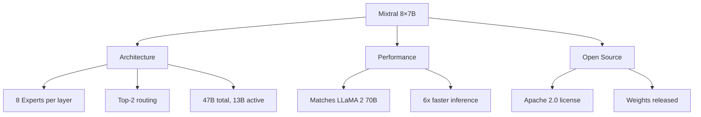

# Mixtral

Mixtral (Mixture of Experts Transformer) by Mistral AI is the most prominent open-source Mixture of Experts model. It demonstrates that MoE can match much larger dense models while being significantly faster.

## Overview



## Architecture

### Model Specifications

| Specification | Value |
|--------------|-------|
| Total Parameters | 46.7B |
| Active Parameters | 12.9B per token |
| Experts per Layer | 8 |
| Active Experts | 2 (top-2) |
| Layers | 32 |
| Hidden Dimension | 4096 |
| Attention Heads | 32 |
| Context Length | 32K (76K with YaRN) |
| Vocab Size | 32,000 |

### Architecture Details

```python
class MixtralBlock(nn.Module):
    """Mixtral transformer block"""
    def __init__(self, d_model=4096, num_heads=32, num_experts=8, top_k=2):
        super().__init__()
        # Standard attention
        self.attention = MixtralAttention(d_model, num_heads)
        self.attention_norm = RMSNorm(d_model)
        
        # MoE FFN
        self.moe = MixtralMoE(d_model, num_experts, top_k)
        self.ffn_norm = RMSNorm(d_model)
    
    def forward(self, x, mask=None):
        # Attention with RMSNorm
        h = x + self.attention(self.attention_norm(x), mask)
        
        # MoE FFN with RMSNorm
        out = h + self.moe(self.ffn_norm(h))
        
        return out

class MixtralAttention(nn.Module):
    """Multi-head attention with GQA"""
    def __init__(self, d_model, num_heads, num_kv_heads=8):
        super().__init__()
        self.num_heads = num_heads
        self.num_kv_heads = num_kv_heads
        self.head_dim = d_model // num_heads
        
        # Grouped Query Attention (GQA)
        self.wq = nn.Linear(d_model, num_heads * self.head_dim, bias=False)
        self.wk = nn.Linear(d_model, num_kv_heads * self.head_dim, bias=False)
        self.wv = nn.Linear(d_model, num_kv_heads * self.head_dim, bias=False)
        self.wo = nn.Linear(num_heads * self.head_dim, d_model, bias=False)
        
        # RoPE
        self.rotary_emb = RotaryEmbedding(self.head_dim)
    
    def forward(self, x, mask=None):
        batch_size, seq_len, _ = x.shape
        
        q = self.wq(x).view(batch_size, seq_len, self.num_heads, self.head_dim)
        k = self.wk(x).view(batch_size, seq_len, self.num_kv_heads, self.head_dim)
        v = self.wv(x).view(batch_size, seq_len, self.num_kv_heads, self.head_dim)
        
        # Apply RoPE
        q, k = self.rotary_emb(q, k)
        
        # GQA: repeat k, v for each query group
        k = k.repeat_interleave(self.num_heads // self.num_kv_heads, dim=2)
        v = v.repeat_interleave(self.num_heads // self.num_kv_heads, dim=2)
        
        # Attention
        attn = F.scaled_dot_product_attention(q, k, v, attn_mask=mask)
        attn = attn.view(batch_size, seq_len, -1)
        
        return self.wo(attn)
```

### MoE Layer

```python
class MixtralMoE(nn.Module):
    """Mixtral MoE layer with top-2 routing"""
    def __init__(self, d_model=4096, num_experts=8, top_k=2):
        super().__init__()
        self.num_experts = num_experts
        self.top_k = top_k
        
        # Router
        self.gate = nn.Linear(d_model, num_experts, bias=False)
        
        # Experts (SwiGLU FFN)
        self.experts = nn.ModuleList([
            MixtralExpert(d_model, d_model * 4)
            for _ in range(num_experts)
        ])
    
    def forward(self, x):
        batch_size, seq_len, d_model = x.shape
        
        # Router logits
        router_logits = self.gate(x)  # (B, S, num_experts)
        
        # Top-2 routing
        top_k_logits, top_k_indices = router_logits.topk(self.top_k, dim=-1)
        top_k_weights = F.softmax(top_k_logits, dim=-1)
        
        # Process through experts
        output = torch.zeros_like(x)
        
        for expert_idx in range(self.num_experts):
            # Find tokens for this expert
            mask = (top_k_indices == expert_idx).any(dim=-1)
            
            if mask.any():
                expert_input = x[mask]
                expert_output = self.experts[expert_idx](expert_input)
                
                # Get weight for this expert
                # Find position in top-k
                pos = (top_k_indices[mask] == expert_idx).float().argmax(dim=-1)
                weight = top_k_weights[mask, pos]
                
                output[mask] += weight.unsqueeze(-1) * expert_output
        
        return output

class MixtralExpert(nn.Module):
    """SwiGLU expert"""
    def __init__(self, d_model, d_ff):
        super().__init__()
        self.w1 = nn.Linear(d_model, d_ff, bias=False)
        self.w2 = nn.Linear(d_ff, d_model, bias=False)
        self.w3 = nn.Linear(d_model, d_ff, bias=False)
    
    def forward(self, x):
        return self.w2(F.silu(self.w1(x)) * self.w3(x))
```

## Performance

### Benchmark Results

```python
# Mixtral 8×7B vs other models

benchmarks = {
    "LLaMA 2 70B": {
        "parameters": "70B (dense)",
        "active": "70B",
        "MMLU": 69.9,
        "GSM8K": 56.8,
        "HumanEval": 29.9,
        "Speed": "1x"
    },
    "Mixtral 8×7B": {
        "parameters": "47B (MoE)",
        "active": "13B",
        "MMLU": 70.6,
        "GSM8K": 74.4,
        "HumanEval": 40.2,
        "Speed": "~6x"
    }
}

# Key insight: Mixtral matches LLaMA 2 70B quality
# with 6x faster inference
```

### Speed Comparison

```python
# Inference speed (tokens/second, approximate)
# LLaMA 2 70B: ~30 tok/s (single GPU)
# Mixtral 8×7B: ~180 tok/s (single GPU)
# ~6x speedup for similar quality

# Memory usage:
# LLaMA 2 70B: ~140 GB (FP16)
# Mixtral 8×7B: ~94 GB (FP16)
# ~1.5x less memory
```

## Variants

### Mixtral 8×7B (Original)

```python
# Base model
# 47B total parameters
# 13B active per token
# 32K context
```

### Mixtral 8×7B Instruct

```python
# Instruction-tuned version
# Better at following instructions
# Trained with DPO/RLHF
# Top performance on chat benchmarks
```

### Mixtral 8×22B

```python
# Larger variant
# 141B total parameters
# 39B active per token
# 64K context
# Even stronger performance
```

### Mixtral Small/Next

```python
# Mixtral Small: 8×2.7B
# Mixtral Next: Next generation
# Various sizes for different use cases
```

## Using Mixtral

### With Hugging Face Transformers

```python
from transformers import AutoModelForCausalLM, AutoTokenizer

# Load model
model_name = "mistralai/Mixtral-8x7B-Instruct-v0.1"
tokenizer = AutoTokenizer.from_pretrained(model_name)
model = AutoModelForCausalLM.from_pretrained(
    model_name,
    torch_dtype=torch.float16,
    device_map="auto"
)

# Generate
messages = [
    {"role": "user", "content": "Explain quantum computing in simple terms"}
]
inputs = tokenizer.apply_chat_template(messages, return_tensors="pt")
outputs = model.generate(inputs, max_new_tokens=200)
print(tokenizer.decode(outputs[0]))
```

### With vLLM (Optimized Inference)

```python
from vllm import LLM, SamplingParams

# Load with vLLM for optimized inference
llm = LLM(
    model="mistralai/Mixtral-8x7B-Instruct-v0.1",
    tensor_parallel_size=2,  # Split across GPUs
    gpu_memory_utilization=0.9
)

# Generate
sampling_params = SamplingParams(temperature=0.7, max_tokens=200)
outputs = llm.generate(["Explain quantum computing"], sampling_params)
print(outputs[0].outputs[0].text)
```

### Quantized Versions

```python
# AWQ quantization (4-bit)
from transformers import AutoModelForCausalLM

model = AutoModelForCausalLM.from_pretrained(
    "TheBloke/Mixtral-8x7B-Instruct-v0.1-AWQ",
    torch_dtype=torch.float16,
    device_map="auto"
)
# ~24 GB memory (vs 94 GB FP16)
```

## Comparison with Dense Models

| Model | Parameters | Active | MMLU | Speed | Memory |
|-------|-----------|--------|------|-------|--------|
| LLaMA 2 7B | 7B | 7B | 46.7 | 1x | 14 GB |
| LLaMA 2 13B | 13B | 13B | 54.8 | 0.7x | 26 GB |
| LLaMA 2 70B | 70B | 70B | 69.9 | 0.2x | 140 GB |
| Mixtral 8×7B | 47B | 13B | 70.6 | 0.5x | 94 GB |

## Training Mixtral

### Training Data

```python
# Mixtral trained on:
# - Web crawl data
# - Books
# - Code
# - Scientific papers
# Total: ~2T tokens (estimated)

# Instruction tuning:
# - Open-source instruction datasets
# - Synthetic data from stronger models
# - DPO for alignment
```

### Training Infrastructure

```python
# Mixtral trained with:
# - Expert parallelism across GPUs
# - Standard AdamW optimizer
# - Cosine learning rate schedule
# - Mixed precision (bfloat16)

# Load balancing: auxiliary loss (α = 0.01)
# Capacity factor: 1.0 (no token dropping in practice)
```

## MoE Design Choices

### Why 8 Experts?

```python
# Trade-off:
# - More experts → more capacity, more communication
# - Fewer experts → less capacity, faster inference
# - 8 experts: good balance for current hardware

# Other models use different counts:
# Switch Transformer: 128 experts
# DeepSeek-V3: 256 experts
# Mixtral: 8 experts (simpler)
```

### Why Top-2 Routing?

```python
# Top-1: Faster but less expert mixing
# Top-2: Good balance of speed and quality
# Top-3+: Diminishing returns, more compute

# Mixtral uses top-2:
# - Each token processed by 2 experts
# - Outputs weighted by router confidence
# - Better quality than top-1
```

### SwiGLU Experts

```python
# Mixtral uses SwiGLU activation (like LLaMA)
# SwiGLU(x) = SiLU(xW1) ⊙ (xW3)
# Output = SwiGLU(x) @ W2

# Better than standard ReLU FFN
# More parameters but better performance
```

## Limitations

### 1. Memory Requirements

```python
# Mixtral 8×7B requires ~94 GB in FP16
# Even with quantization: ~24 GB minimum
# Cannot run on consumer GPUs easily

# Solution: Use smaller variants or more quantization
```

### 2. Expert Parallelism Complexity

```python
# MoE requires expert parallelism for large models
# All-to-all communication between GPUs
# Complex to implement efficiently

# Solution: Use frameworks like vLLM, TGI
```

### 3. Fine-tuning Challenges

```python
# Fine-tuning MoE is different from dense models
# - Need to maintain expert diversity
# - Load balancing during fine-tuning
# - May need specialized data

# Solution: Use LoRA or adapter methods
```

## Interview Questions

1. **What is Mixtral?**
   Mixtral is Mistral AI's Mixture of Experts model with 8 experts per layer and top-2 routing. It has 47B total parameters but only activates 13B per token, matching LLaMA 2 70B quality with 6x faster inference.

2. **How does Mixtral's routing work?**
   Each token is routed to the top-2 experts by a learned router. The router produces logits for each expert, softmax is applied over the top-2, and outputs are weighted combination of the two experts.

3. **Why is Mixtral faster than LLaMA 2 70B?**
   Mixtral only activates 13B parameters per token (vs 70B for LLaMA 2), while having similar total capacity. This reduces compute per token while maintaining quality.

4. **What is SwiGLU activation?**
   SwiGLU combines SiLU activation with gating: SwiGLU(x) = SiLU(xW1) ⊙ (xW3). Used in both Mixtral experts and LLaMA.

5. **How does Grouped Query Attention (GQA) work in Mixtral?**
   GQA uses fewer key-value heads than query heads. Mixtral has 32 query heads but only 8 KV heads, reducing memory and compute while maintaining quality.

6. **What are the challenges of using Mixtral?**
   High memory requirements (94GB FP16), need for expert parallelism, and fine-tuning complexity. Quantization helps but requires careful implementation.

7. **How does Mixtral compare to DeepSeek-V3?**
   DeepSeek-V3 uses more experts (256), shared experts, and auxiliary-loss-free balancing. Mixtral is simpler with 8 experts and standard load balancing.

## Common Mistakes

- ❌ Not using quantization (requires too much memory)
- ❌ Ignoring expert parallelism setup
- ❌ Treating Mixtral like a dense model for fine-tuning
- ❌ Not monitoring which experts are being used
- ❌ Using too small batch size (underutilizes experts)

## Summary

Mixtral demonstrates that MoE can achieve dense model quality with significantly less compute. Its 8-expert, top-2 routing design balances simplicity and performance. Open-source availability has enabled widespread adoption and research. Key innovations include SwiGLU experts, GQA, and efficient routing.

## Cross-References

- [MoE Architecture](architecture.md) - Architecture fundamentals
- [Routing Strategies](routing.md) - Top-2 routing details
- [Switch Transformer](switch.md) - Top-1 routing comparison
- [Training MoE](training.md) - Training challenges
- [Llama](../sota/llama.md) - Comparable dense model
