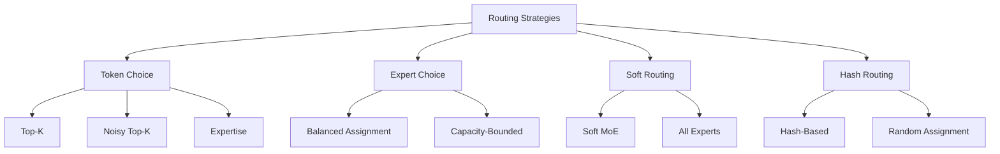

# Routing Strategies in MoE

The routing mechanism is the core of Mixture of Experts models. It determines which experts process which tokens, directly impacting model quality, efficiency, and load balancing.

## Overview



## Token-Choice Routing

Each token independently selects its top-k experts.

### Basic Top-K

```python
class TopKRouter(nn.Module):
    """Standard top-k routing"""
    def __init__(self, d_model, num_experts, top_k=2):
        super().__init__()
        self.gate = nn.Linear(d_model, num_experts, bias=False)
        self.top_k = top_k
    
    def forward(self, x):
        # x: (batch * seq_len, d_model)
        logits = self.gate(x)  # (num_tokens, num_experts)
        
        # Select top-k experts
        top_k_logits, top_k_indices = logits.topk(self.top_k, dim=-1)
        
        # Compute weights (softmax over selected experts)
        top_k_weights = F.softmax(top_k_logits, dim=-1)
        
        return top_k_weights, top_k_indices, logits
```

### Noisy Top-K (GShard)

```python
class NoisyTopKRouter(nn.Module):
    """Top-k with noise for exploration"""
    def __init__(self, d_model, num_experts, top_k=2, noise_std=0.1):
        super().__init__()
        self.gate = nn.Linear(d_model, num_experts, bias=False)
        self.noise_linear = nn.Linear(d_model, num_experts, bias=False)
        self.top_k = top_k
        self.noise_std = noise_std
    
    def forward(self, x, training=True):
        logits = self.gate(x)
        
        if training:
            # Add tunable noise
            noise = torch.randn_like(logits) * self.noise_std
            noise_logits = self.noise_linear(x)
            noise = noise * F.softplus(noise_logits)
            logits = logits + noise
        
        top_k_logits, top_k_indices = logits.topk(self.top_k, dim=-1)
        top_k_weights = F.softmax(top_k_logits, dim=-1)
        
        return top_k_weights, top_k_indices, logits
```

### Top-1 Routing (Switch Transformer)

```python
class Top1Router(nn.Module):
    """Simplified routing: each token to exactly 1 expert"""
    def __init__(self, d_model, num_experts, capacity_factor=1.25):
        super().__init__()
        self.gate = nn.Linear(d_model, num_experts, bias=False)
        self.capacity_factor = capacity_factor
    
    def forward(self, x):
        logits = self.gate(x)
        
        # Select top-1 expert
        expert_idx = logits.argmax(dim=-1)  # (num_tokens,)
        expert_weight = logits.max(dim=-1).values  # (num_tokens,)
        expert_weight = torch.sigmoid(expert_weight)  # Confidence
        
        return expert_weight, expert_idx, logits
```

## Expert-Choice Routing

Each expert selects its top-k tokens. Provides natural load balancing.

```python
class ExpertChoiceRouter(nn.Module):
    """Each expert chooses which tokens to process"""
    def __init__(self, d_model, num_experts, capacity_factor=1.0):
        super().__init__()
        self.gate = nn.Linear(d_model, num_experts, bias=False)
        self.num_experts = num_experts
        self.capacity_factor = capacity_factor
    
    def forward(self, x):
        num_tokens = x.shape[0]
        logits = self.gate(x)  # (num_tokens, num_experts)
        
        # Softmax over tokens (not experts!)
        probs = F.softmax(logits, dim=0)  # (num_tokens, num_experts)
        
        # Capacity per expert
        capacity = int(num_tokens * self.capacity_factor / self.num_experts)
        
        # Each expert selects top tokens
        expert_assignments = {}
        for expert_idx in range(self.num_experts):
            expert_probs = probs[:, expert_idx]
            top_token_indices = expert_probs.topk(capacity).indices
            expert_assignments[expert_idx] = {
                'tokens': top_token_indices,
                'weights': expert_probs[top_token_indices]
            }
        
        return expert_assignments
```

### Expert-Choice vs Token-Choice

| Aspect | Token-Choice | Expert-Choice |
|--------|-------------|---------------|
| Selection | Token picks experts | Expert picks tokens |
| Load Balance | Needs auxiliary loss | Natural balance |
| Capacity | May overflow/drop | Guaranteed capacity |
| Training | Standard | More complex |
| Parallelism | Easier | Harder |
| Used in | Mixtral, Switch | Research models |

## Soft Routing

Instead of hard selection, use weighted combination of all experts.

### Soft MoE

```python
class SoftMoE(nn.Module):
    """Soft routing: all experts contribute"""
    def __init__(self, d_model, num_experts, num_slots):
        super().__init__()
        self.num_experts = num_experts
        self.num_slots = num_slots
        
        # Expert weight matrices
        self.experts = nn.ParameterList([
            nn.Parameter(torch.randn(d_model, d_model))
            for _ in range(num_experts)
        ])
        
        # Slot parameters
        self.slots = nn.Parameter(torch.randn(num_experts, num_slots, d_model))
    
    def forward(self, x):
        # x: (batch, seq_len, d_model)
        batch_size, seq_len, d_model = x.shape
        
        # Compute assignment weights
        # phi = softmax(X @ S^T) over slots
        logits = torch.einsum('bsd,esd->bse', x, self.slots)
        logits = logits.reshape(batch_size, seq_len, -1)  # (B, S, E*slots)
        weights = F.softmax(logits, dim=-1)
        weights = weights.reshape(batch_size, seq_len, self.num_experts, self.num_slots)
        
        # Weighted combination of expert outputs
        output = torch.zeros_like(x)
        for expert_idx in range(self.num_experts):
            expert_out = x @ self.experts[expert_idx]  # (B, S, D)
            expert_weight = weights[:, :, expert_idx, :].sum(dim=-1)  # (B, S)
            output += expert_weight.unsqueeze(-1) * expert_out
        
        return output
```

### Advantages of Soft Routing

```python
# 1. Differentiable: End-to-end training without straight-through estimator
# 2. No token dropping: All experts contribute
# 3. Better gradient flow: No discrete selection bottleneck
# 4. Simpler training: No load balancing loss needed

# Disadvantage:
# - Uses ALL experts (no compute savings)
# - But can be made efficient with low-rank approximations
```

## Hash Routing

Use hash functions for deterministic, balanced routing.

```python
class HashRouter(nn.Module):
    """Hash-based routing for deterministic load balancing"""
    def __init__(self, num_experts):
        super().__init__()
        self.num_experts = num_experts
        self.hash_seeds = torch.randn(num_experts)
    
    def forward(self, x):
        # Simple hash: use random projection
        # Deterministic and balanced by design
        
        batch_size, seq_len, d_model = x.shape
        
        # Project to num_experts dimensions
        hash_values = x @ self.hash_seeds.unsqueeze(-1)  # (B, S, 1)
        
        # Assign to experts based on hash
        expert_idx = (hash_values.squeeze(-1) * self.num_experts).long() % self.num_experts
        
        return expert_idx
```

### Hyperplane Hashing

```python
class HyperplaneHashRouter(nn.Module):
    """Use random hyperplanes for hashing"""
    def __init__(self, d_model, num_experts):
        super().__init__()
        # Random hyperplanes
        self.hyperplanes = nn.Parameter(
            torch.randn(int(math.log2(num_experts)), d_model)
        )
    
    def forward(self, x):
        # Project onto hyperplanes
        projections = x @ self.hyperplanes.T  # (num_tokens, log2(num_experts))
        
        # Binary hash
        binary_hash = (projections > 0).int()  # 0 or 1
        
        # Convert binary to expert index
        powers = 2 ** torch.arange(binary_hash.shape[-1], device=x.device)
        expert_idx = (binary_hash * powers).sum(dim=-1)
        
        return expert_idx
```

## Hierarchical Routing

Two-level routing for very large number of experts.

```python
class HierarchicalRouter(nn.Module):
    """Two-level routing: first select group, then expert within group"""
    def __init__(self, d_model, num_groups=8, experts_per_group=8):
        super().__init__()
        self.num_groups = num_groups
        self.experts_per_group = experts_per_group
        
        # First level: select group
        self.group_router = nn.Linear(d_model, num_groups, bias=False)
        
        # Second level: select expert within group
        self.expert_routers = nn.ModuleList([
            nn.Linear(d_model, experts_per_group, bias=False)
            for _ in range(num_groups)
        ])
    
    def forward(self, x):
        # Level 1: Select group
        group_logits = self.group_router(x)
        group_idx = group_logits.argmax(dim=-1)
        
        # Level 2: Select expert within group
        expert_idx = torch.zeros_like(group_idx)
        for g in range(self.num_groups):
            mask = (group_idx == g)
            if mask.any():
                expert_logits = self.expert_routers[g](x[mask])
                expert_idx[mask] = expert_logits.argmax(dim=-1)
        
        # Global expert index
        global_idx = group_idx * self.experts_per_group + expert_idx
        
        return global_idx
```

## Routing Regularization

### Z-Loss

```python
def z_loss(router_logits):
    """Z-loss: penalize large logits for numerical stability"""
    # Encourages router to be less confident
    return torch.logsumexp(router_logits, dim=-1).square().mean()
```

### Auxiliary Load Balancing Loss

```python
def auxiliary_loss(router_logits, expert_indices, num_experts):
    """Load balancing loss"""
    # Fraction of tokens routed to each expert
    router_probs = F.softmax(router_logits, dim=-1)
    
    # One-hot encoding of selected experts
    expert_mask = F.one_hot(expert_indices, num_experts).float()
    
    # Average router probability per expert
    avg_prob = router_probs.mean(dim=0)
    
    # Fraction of tokens per expert
    fraction_tokens = expert_mask.mean(dim=0)
    
    # Load balancing loss
    loss = num_experts * (avg_prob * fraction_tokens).sum()
    
    return loss
```

### Expert Diversity Loss

```python
def diversity_loss(expert_outputs):
    """Encourage experts to produce different outputs"""
    # Compute pairwise similarities
    similarities = F.cosine_similarity(
        expert_outputs.unsqueeze(1),
        expert_outputs.unsqueeze(0),
        dim=-1
    )
    
    # Penalize high similarity (want low similarity)
    loss = similarities.mean()
    
    return loss
```

## Interview Questions

1. **What is the difference between token-choice and expert-choice routing?**
   Token-choice: each token selects its top-k experts (most common). Expert-choice: each expert selects its top-k tokens (natural balance). Token-choice needs load balancing loss; expert-choice is naturally balanced.

2. **Why use noisy top-k routing?**
   Noise encourages exploration during training, preventing the router from getting stuck using only a few experts. It acts as regularization for the routing decisions.

3. **What is soft routing in MoE?**
   Instead of hard selection, all experts contribute with learned weights. Enables end-to-end training without discrete selection, but uses all experts (no compute savings).

4. **How does expert-choice routing provide natural load balancing?**
   Each expert selects the same number of tokens (its capacity), so load is inherently balanced. No auxiliary loss needed.

5. **What is hierarchical routing?**
   Two-level routing: first select a group of experts, then select within that group. Enables efficient routing with very large numbers of experts (e.g., 2048).

6. **What is the role of the capacity factor?**
   Controls how many tokens each expert can process. Higher capacity factor = more tokens per expert but more compute. Lower = faster but may drop tokens.

7. **How do you evaluate routing quality?**
   Metrics: expert utilization uniformity, token dropping rate, load variance, expert specialization (do experts learn different things?), and downstream task performance.

## Common Mistakes

- ❌ Not adding noise during training (router gets stuck)
- ❌ Using too small capacity factor (excessive token dropping)
- ❌ Not monitoring expert utilization (hidden collapse)
- ❌ Ignoring routing in gradient computation
- ❌ Using soft routing when compute efficiency matters

## Summary

Routing strategies determine how tokens are assigned to experts in MoE models. Token-choice (top-k) is most common but needs load balancing. Expert-choice provides natural balance. Soft routing enables differentiable training. Hierarchical routing scales to many experts. Regularization (z-loss, auxiliary loss) is essential for stable training.

## Cross-References

- [MoE Architecture](architecture.md) - Overall architecture
- [Load Balancing](training.md#load-balancing) - Training with balanced routing
- [Switch Transformer](switch.md) - Top-1 routing
- [Mixtral](mixtral.md) - Practical routing implementation
- [MoE Architecture](./architecture.md)
- [Switch Transformer](./switch.md)
- [ML Deep Learning Attention](../ml/deep-learning/attention.md)

