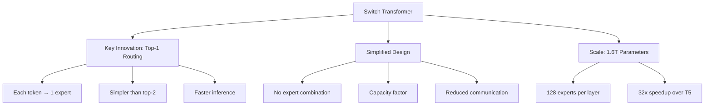

# Switch Transformer

Switch Transformer (Google, 2021) simplified Mixture of Experts by using top-1 routing - each token goes to exactly one expert. This simplification, combined with design improvements, enabled training models with over 1 trillion parameters.

## Overview



## Architecture

### Switch Transformer Block

```python
class SwitchTransformerBlock(nn.Module):
    """Switch Transformer: simplified MoE with top-1 routing"""
    def __init__(self, d_model, d_ff, num_experts, capacity_factor=1.25):
        super().__init__()
        self.attention = nn.MultiheadAttention(d_model, num_heads=8)
        self.norm1 = nn.LayerNorm(d_model)
        self.norm2 = nn.LayerNorm(d_model)
        
        # MoE layer with top-1 routing
        self.moe = SwitchMoELayer(d_model, d_ff, num_experts, capacity_factor)
    
    def forward(self, x):
        # Self-attention
        attn_out, _ = self.attention(x, x, x)
        x = self.norm1(x + attn_out)
        
        # Switch MoE (top-1 routing)
        moe_out = self.moe(x)
        x = self.norm2(x + moe_out)
        
        return x

class SwitchMoELayer(nn.Module):
    """MoE layer with top-1 routing"""
    def __init__(self, d_model, d_ff, num_experts, capacity_factor):
        super().__init__()
        self.num_experts = num_experts
        self.capacity_factor = capacity_factor
        
        # Experts
        self.experts = nn.ModuleList([
            SwitchExpert(d_model, d_ff) for _ in range(num_experts)
        ])
        
        # Router
        self.router = nn.Linear(d_model, num_experts, bias=False)
    
    def forward(self, x):
        batch_size, seq_len, d_model = x.shape
        num_tokens = batch_size * seq_len
        x_flat = x.view(-1, d_model)
        
        # Route to single expert (top-1)
        router_logits = self.router(x_flat)
        router_probs = F.softmax(router_logits, dim=-1)
        
        # Top-1 selection
        expert_idx = router_logits.argmax(dim=-1)  # (num_tokens,)
        expert_weight = router_probs.gather(1, expert_idx.unsqueeze(1))  # (num_tokens, 1)
        
        # Capacity management
        capacity = int(num_tokens * self.capacity_factor / self.num_experts)
        
        # Process tokens through experts
        output = torch.zeros_like(x_flat)
        tokens_per_expert = torch.zeros(self.num_experts, device=x.device)
        
        for expert_id in range(self.num_experts):
            # Find tokens routed to this expert
            mask = (expert_idx == expert_id)
            num_tokens_expert = mask.sum().item()
            
            if num_tokens_expert > 0:
                if num_tokens_expert > capacity:
                    # Drop excess tokens
                    expert_tokens = x_flat[mask][:capacity]
                    expert_weight_cap = expert_weight[mask][:capacity]
                else:
                    expert_tokens = x_flat[mask]
                    expert_weight_cap = expert_weight[mask]
                
                # Process through expert
                expert_output = self.experts[expert_id](expert_tokens)
                
                # Weighted output
                output[mask][:len(expert_tokens)] = expert_weight_cap * expert_output
                tokens_per_expert[expert_id] = len(expert_tokens)
        
        return output.view(batch_size, seq_len, d_model)
```

### Switch Expert

```python
class SwitchExpert(nn.Module):
    """Individual expert in Switch Transformer"""
    def __init__(self, d_model, d_ff, dropout=0.1):
        super().__init__()
        self.w1 = nn.Linear(d_model, d_ff)
        self.w2 = nn.Linear(d_ff, d_model)
        self.dropout = nn.Dropout(dropout)
        self.activation = nn.ReLU()
    
    def forward(self, x):
        return self.w2(self.dropout(self.activation(self.w1(x))))
```

## Key Design Decisions

### 1. Top-1 Routing

```python
# Why top-1 instead of top-2?
# 1. Simpler: No need to combine expert outputs
# 2. Faster: Only 1 expert per token
# 3. Less communication: Fewer expert calls
# 4. Scales better: Can use more experts

# Trade-off: Less expert mixing
# Solution: Use more experts to compensate
```

### 2. Capacity Factor

```python
# Capacity factor controls tokens per expert
# capacity = num_tokens * capacity_factor / num_experts

# capacity_factor = 1.0: Exactly balanced (may drop tokens)
# capacity_factor = 1.25: 25% buffer (default)
# capacity_factor = 2.0: 100% buffer (no dropping, but uneven)

# Higher capacity factor = fewer dropped tokens but more compute
```

### 3. Simplified Expert Design

```python
# Switch uses simpler experts than GShard
# - ReLU instead of GELU
# - Single FFN instead of gated FFN
# - Fewer parameters per expert

# This enables more experts with same total parameters
```

## Training

### Load Balancing Loss

```python
def switch_load_balancing_loss(router_logits, expert_mask, num_experts):
    """
    Switch Transformer load balancing loss
    
    Args:
        router_logits: (num_tokens, num_experts)
        expert_mask: (num_tokens, num_experts) one-hot
    """
    # Router probability per expert
    router_probs = F.softmax(router_logits, dim=-1)
    
    # Average router probability per expert
    avg_router_prob = router_probs.mean(dim=0)  # (num_experts,)
    
    # Fraction of tokens routed to each expert
    fraction_tokens = expert_mask.float().mean(dim=0)  # (num_experts,)
    
    # Load balancing loss
    # Want: avg_router_prob ≈ fraction_tokens ≈ 1/num_experts
    loss = num_experts * (avg_router_prob * fraction_tokens).sum()
    
    return loss

# Total loss
total_loss = task_loss + α * load_balancing_loss
# α = 0.01 typically
```

### Training Recipe

```python
# Switch Transformer training:
# 1. Use standard language modeling objective
# 2. Add load balancing loss (α = 0.01)
# 3. Capacity factor = 1.25
# 4. Use bfloat16 for efficiency
# 5. Expert parallelism across GPUs

optimizer = AdamW(model.parameters(), lr=1e-4)

for batch in dataloader:
    # Forward pass
    logits = model(batch.input_ids)
    
    # Task loss
    task_loss = F.cross_entropy(logits.view(-1, vocab_size), 
                                 batch.labels.view(-1))
    
    # Load balancing loss
    lb_loss = load_balancing_loss(router_logits, expert_mask, num_experts)
    
    # Total loss
    loss = task_loss + 0.01 * lb_loss
    
    # Backward pass
    loss.backward()
    optimizer.step()
    optimizer.zero_grad()
```

## Scaling Results

### Model Configurations

| Model | Experts | Layers | d_model | Parameters | Speed |
|-------|---------|--------|---------|------------|-------|
| Switch-Base | 8 | 12 | 768 | 128M | 7x |
| Switch-Base | 64 | 12 | 768 | 3.8B | 15x |
| Switch-Base | 128 | 12 | 768 | 7.4B | 24x |
| Switch-Large | 128 | 24 | 1024 | 264B | 28x |
| Switch-XXL | 128 | 32 | 4096 | 1.6T | 32x |

### Performance Comparison

```python
# Pre-training (C4 dataset):
# Switch-Base (128 experts) vs T5-Base
# - Same compute budget
# - 7x faster to same quality
# - Or 4% better quality at same step

# Downstream tasks:
# - Summarization: +2.0 ROUGE
# - Translation: +1.5 BLEU
# - Question answering: +3.0 EM
```

## Token Dropping Analysis

```python
# Impact of capacity factor on token dropping:
# CF = 1.0: ~5-10% tokens dropped
# CF = 1.25: ~1-2% tokens dropped
# CF = 1.5: <0.5% tokens dropped
# CF = 2.0: ~0% tokens dropped

# Impact on quality:
# CF = 1.0: Noticeable quality drop
# CF = 1.25: Minimal quality impact
# CF = 1.5+: No additional benefit

# Recommendation: Use CF = 1.25
```

## Implementation Details

### Efficient Implementation

```python
class EfficientSwitchMoE(nn.Module):
    """Efficient Switch implementation with grouped operations"""
    def __init__(self, d_model, d_ff, num_experts):
        super().__init__()
        self.num_experts = num_experts
        
        # Use grouped linear for efficiency
        # Instead of N separate linear layers, use one big linear
        self.w1 = nn.Parameter(torch.randn(num_experts, d_model, d_ff))
        self.w2 = nn.Parameter(torch.randn(num_experts, d_ff, d_model))
    
    def forward(self, x, expert_idx):
        # Group tokens by expert
        # Use batched matrix multiplication
        
        # This is more efficient than per-expert loops
        pass
```

### Mixed Precision Training

```python
# Switch Transformer uses bfloat16 for efficiency
# - Router: float32 (needs precision)
# - Experts: bfloat16 (saves memory)
# - Communication: bfloat16

# Mixed precision recipe:
scaler = torch.cuda.amp.GradScaler()

with torch.cuda.amp.autocast():
    output = model(input)
    loss = criterion(output, target)

scaler.scale(loss).backward()
scaler.step(optimizer)
scaler.update()
```

## Comparison with Other MoE Models

| Aspect | Switch | GShard | Mixtral |
|--------|--------|--------|---------|
| Routing | Top-1 | Top-2 | Top-2 |
| Experts | 128 | 2048 | 8 |
| Capacity Factor | 1.25 | 1.5 | N/A |
| Token Dropping | Yes | Yes | No |
| Communication | Reduced | High | Low |
| Open Source | No | No | Yes |

## Interview Questions

1. **What is the Switch Transformer?**
   A simplified MoE model using top-1 routing (each token goes to exactly one expert). Enables scaling to 1.6T parameters with efficient training and inference.

2. **Why use top-1 instead of top-2 routing?**
   Simpler (no expert combination), faster (one expert per token), less communication, and scales better. Compensates by using more experts.

3. **What is the capacity factor?**
   Controls how many tokens each expert can process. Capacity = num_tokens × CF / num_experts. CF = 1.25 provides buffer with minimal quality impact.

4. **How does token dropping work?**
   When an expert receives more tokens than its capacity, excess tokens are dropped (their output is zero). They effectively pass through the residual connection.

5. **What is the load balancing loss?**
   Auxiliary loss that encourages uniform expert utilization. Penalizes when router probabilities and token fractions deviate from uniform distribution.

6. **How does Switch compare to dense models?**
   Switch achieves 7x speedup in pre-training compared to T5-Base with same compute budget. Can reach same quality much faster or better quality at same step.

7. **What are the training challenges of Switch?**
   Router collapse (mitigated by load balancing loss), token dropping (mitigated by capacity factor), and communication overhead (mitigated by top-1 routing).

## Common Mistakes

- ❌ Using too small capacity factor (excessive token dropping)
- ❌ Not monitoring token dropping rate during training
- ❌ Forgetting to add load balancing loss
- ❌ Using float32 for everything (waste of memory)
- ❌ Not handling dropped tokens properly in loss computation

## Summary

Switch Transformer simplified MoE by using top-1 routing, enabling scaling to 1.6T parameters. Key innovations include simplified routing, capacity factor management, and efficient training with load balancing loss. Achieves significant speedups over dense models while maintaining quality.

## Cross-References

- [MoE Architecture](architecture.md) - Overall MoE design
- [Routing Strategies](routing.md) - Comparison with other routing
- [Mixtral](mixtral.md) - Open-source MoE with top-2
- [Training MoE](training.md) - Training challenges
- [Transformers](../transformers.md) - Base architecture
