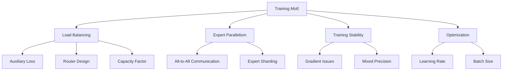

# Training Mixture of Experts

Training MoE models presents unique challenges not found in dense model training: load balancing, expert specialization, communication overhead, and training stability. This guide covers best practices and solutions.

## Overview



## Load Balancing

### The Problem

```python
# Without load balancing, router collapses:
# - Expert 1: 90% of tokens
# - Expert 2: 5% of tokens
# - Expert 3: 3% of tokens
# - Expert 4: 2% of tokens
# ... (only 1-2 experts actually used)

# Consequences:
# 1. Wasted capacity (experts not used)
# 2. Bottleneck (overloaded expert)
# 3. Poor generalization
# 4. Training instability
```

### Auxiliary Load Balancing Loss

```python
def load_balancing_loss(router_logits, num_experts, alpha=0.01):
    """
    Standard load balancing loss
    
    Encourages uniform distribution of tokens across experts
    """
    # Router probabilities
    router_probs = F.softmax(router_logits, dim=-1)  # (num_tokens, num_experts)
    
    # Fraction of tokens routed to each expert
    # One-hot of selected experts
    expert_indices = router_logits.argmax(dim=-1)  # (num_tokens,)
    expert_mask = F.one_hot(expert_indices, num_experts).float()  # (num_tokens, num_experts)
    
    # Average over tokens
    avg_router_prob = router_probs.mean(dim=0)  # (num_experts,)
    fraction_tokens = expert_mask.mean(dim=0)  # (num_experts,)
    
    # Load balancing loss: want both to be uniform
    # = num_experts * sum(avg_router_prob * fraction_tokens)
    # Minimized when both are 1/num_experts
    loss = num_experts * (avg_router_prob * fraction_tokens).sum()
    
    return alpha * loss
```

### Auxiliary Loss for Top-K Routing

```python
def top_k_load_balancing_loss(router_logits, top_k_indices, num_experts, top_k=2):
    """Load balancing for top-k routing"""
    router_probs = F.softmax(router_logits, dim=-1)
    
    # Create mask for all selected experts
    expert_mask = F.one_hot(top_k_indices, num_experts).float()
    # Sum over top-k dimension
    expert_mask = expert_mask.sum(dim=1)  # (num_tokens, num_experts)
    
    # Average over tokens
    avg_router_prob = router_probs.mean(dim=0)
    fraction_tokens = expert_mask.mean(dim=0) / top_k  # Normalize by k
    
    loss = num_experts * (avg_router_prob * fraction_tokens).sum()
    
    return loss
```

### DeepSeek's Auxiliary-Loss-Free Balancing

```python
class AuxiliaryLossFreeRouter(nn.Module):
    """
    DeepSeek-V2/V3 approach: dynamic bias for load balancing
    No auxiliary loss needed
    """
    def __init__(self, d_model, num_experts):
        super().__init__()
        self.gate = nn.Linear(d_model, num_experts, bias=False)
        self.bias = nn.Parameter(torch.zeros(num_experts))
        
        # Track expert utilization
        self.register_buffer('expert_count', torch.zeros(num_experts))
        self.register_buffer('total_tokens', torch.tensor(0))
    
    def forward(self, x):
        logits = self.gate(x) + self.bias
        
        # Update utilization tracking
        if self.training:
            expert_idx = logits.argmax(dim=-1)
            self.expert_count += F.one_hot(expert_idx, self.num_experts).float().sum(0)
            self.total_tokens += x.shape[0]
        
        return logits
    
    def update_bias(self):
        """Dynamically adjust bias based on utilization"""
        if self.total_tokens > 0:
            utilization = self.expert_count / self.total_tokens
            target = 1.0 / self.num_experts
            
            # Increase bias for underused experts, decrease for overused
            self.bias.data += 0.001 * (target - utilization)
            
            # Reset counters
            self.expert_count.zero_()
            self.total_tokens.zero_()
```

## Expert Parallelism

### All-to-All Communication

```python
class ExpertParallelism:
    """Distribute experts across GPUs"""
    
    def __init__(self, num_experts, num_gpus):
        self.num_experts = num_experts
        self.num_gpus = num_gpus
        self.experts_per_gpu = num_experts // num_gpus
    
    def dispatch(self, tokens, routing_weights, routing_indices):
        """
        Send tokens to appropriate expert GPUs
        
        Pattern: All-to-all communication
        """
        # Group tokens by target GPU
        gpu_tokens = [[] for _ in range(self.num_gpus)]
        gpu_metadata = [[] for _ in range(self.num_gpus)]
        
        for i, (token, weight, idx) in enumerate(zip(tokens, routing_weights, routing_indices)):
            target_gpu = idx // self.experts_per_gpu
            gpu_tokens[target_gpu].append(token)
            gpu_metadata[target_gpu].append((i, weight, idx))
        
        # All-to-all: each GPU sends tokens to appropriate GPUs
        received_tokens = all_to_all(gpu_tokens)
        
        return received_tokens, gpu_metadata
    
    def combine(self, expert_outputs, metadata, original_size):
        """
        Gather results back from expert GPUs
        
        Pattern: All-to-all (reverse)
        """
        # All-to-all: send results back
        received_outputs = all_to_all(expert_outputs)
        
        # Reconstruct original order
        output = torch.zeros(original_size)
        for gpu_meta, gpu_out in zip(metadata, received_outputs):
            for (orig_idx, weight, _), out in zip(gpu_meta, gpu_out):
                output[orig_idx] += weight * out
        
        return output
```

### Pipeline + Expert Parallelism

```python
# Combine pipeline parallelism with expert parallelism
# Pipeline: split layers across GPUs
# Expert: split experts across GPUs

# Example: 32 layers, 8 experts, 16 GPUs
# - 2 layers per GPU (pipeline)
# - 8 experts per layer, 2 GPUs per layer (expert)
# Each GPU has 2 experts from 2 different layers
```

## Training Stability

### Router Z-Loss

```python
def router_z_loss(router_logits):
    """
    Z-loss: penalize large router logits
    Improves training stability
    """
    # Encourages router to be less confident
    return torch.logsumexp(router_logits, dim=-1).square().mean()

# Total loss
loss = task_loss + 0.01 * load_balancing_loss + 0.001 * z_loss
```

### Gradient Clipping

```python
# Essential for MoE training stability
# Router gradients can be unstable

# Clip gradients
torch.nn.utils.clip_grad_norm_(model.parameters(), max_norm=1.0)

# Separate clipping for router
torch.nn.utils.clip_grad_norm_(router.parameters(), max_norm=0.5)
```

### Mixed Precision Training

```python
# MoE benefits from mixed precision
# - Router: float32 (needs precision)
# - Experts: bfloat16 (saves memory)
# - Communication: bfloat16

# Implementation
with torch.cuda.amp.autocast(dtype=torch.bfloat16):
    output = model(input)
    loss = criterion(output, target)

# Router in float32
router_logits = router(x.float())  # Explicit float32
```

### Learning Rate Considerations

```python
# MoE models may need different learning rates:
# - Router: lower LR (more sensitive)
# - Experts: standard LR
# - Shared layers: standard LR

optimizer = AdamW([
    {'params': router.parameters(), 'lr': 1e-5},
    {'params': experts.parameters(), 'lr': 1e-4},
    {'params': shared_parameters(), 'lr': 1e-4}
])
```

## Expert Specialization

### Encouraging Diversity

```python
def expert_diversity_loss(expert_outputs):
    """
    Encourage experts to produce different outputs
    Prevents experts from learning same thing
    """
    # Compute pairwise cosine similarity
    # Flatten expert outputs
    flat_outputs = [out.flatten() for out in expert_outputs]
    
    similarity_matrix = torch.zeros(len(expert_outputs), len(expert_outputs))
    for i in range(len(expert_outputs)):
        for j in range(len(expert_outputs)):
            similarity_matrix[i, j] = F.cosine_similarity(
                flat_outputs[i].unsqueeze(0),
                flat_outputs[j].unsqueeze(0)
            )
    
    # Penalize high similarity (want diverse experts)
    # Exclude diagonal (self-similarity)
    mask = ~torch.eye(len(expert_outputs), dtype=torch.bool)
    loss = similarity_matrix[mask].mean()
    
    return loss
```

### Expert Dropout

```python
class ExpertDropout(nn.Module):
    """
    Randomly drop entire experts during training
    Encourages redundancy and robustness
    """
    def __init__(self, drop_prob=0.1):
        super().__init__()
        self.drop_prob = drop_prob
    
    def forward(self, expert_outputs, training=True):
        if training and random.random() < self.drop_prob:
            # Randomly zero out an expert's output
            expert_idx = random.randint(0, len(expert_outputs) - 1)
            expert_outputs[expert_idx] = torch.zeros_like(expert_outputs[expert_idx])
        
        return expert_outputs
```

## Data Considerations

### Batch Size

```python
# MoE benefits from larger batch sizes:
# - More tokens per expert (better statistics)
# - Better load balancing
# - More efficient expert utilization

# Recommendation: 
# - Minimum: 1M tokens per batch
# - Optimal: 4-8M tokens per batch
# - Use gradient accumulation if needed
```

### Data Diversity

```python
# Diverse data helps expert specialization:
# - Different domains activate different experts
# - Code experts, math experts, language experts, etc.
# - Ensure training data covers all target domains

# Data mixing:
data_mix = {
    "web": 0.5,
    "books": 0.15,
    "code": 0.15,
    "academic": 0.1,
    "other": 0.1
}
```

## Monitoring Training

### Key Metrics

```python
class MoEMetrics:
    def __init__(self, num_experts):
        self.num_experts = num_experts
        self.expert_usage = []
        self.load_balance_loss = []
        self.token_drop_rate = []
    
    def update(self, router_logits, expert_indices):
        # Expert utilization
        usage = F.one_hot(expert_indices, self.num_experts).float().mean(0)
        self.expert_usage.append(usage)
        
        # Load balance
        lb_loss = load_balancing_loss(router_logits, self.num_experts)
        self.load_balance_loss.append(lb_loss)
    
    def log(self):
        # Print metrics
        usage = torch.stack(self.expert_usage).mean(0)
        print(f"Expert usage: min={usage.min():.3f}, max={usage.max():.3f}, "
              f"std={usage.std():.3f}")
        print(f"Load balance loss: {torch.stack(self.load_balance_loss).mean():.4f}")
```

### Early Warning Signs

```python
# Signs of training problems:
# 1. Expert usage std > 0.1 (imbalanced)
# 2. Load balance loss increasing
# 3. Token drop rate > 5%
# 4. Loss spikes or plateaus
# 5. One expert always selected

# Solutions:
# - Increase load balancing loss weight
# - Add noise to router
# - Increase capacity factor
# - Use auxiliary-loss-free balancing
```

## Training Recipe

### Standard Recipe

```python
# Mixtral-style training recipe
training_config = {
    "model": "Mixtral 8×7B",
    "optimizer": "AdamW",
    "learning_rate": 1e-4,
    "lr_schedule": "cosine",
    "warmup_steps": 2000,
    "batch_size": "4M tokens",
    "gradient_accumulation": 8,
    "max_grad_norm": 1.0,
    "weight_decay": 0.1,
    "dtype": "bfloat16",
    "load_balance_alpha": 0.01,
    "capacity_factor": 1.0,
    "z_loss_weight": 0.001
}
```

### DeepSeek-V3 Recipe

```python
# More advanced recipe
deepseek_config = {
    "model": "DeepSeek-V3",
    "optimizer": "AdamW",
    "learning_rate": 2.2e-4,
    "lr_schedule": "cosine_with_min",
    "min_lr_ratio": 0.1,
    "batch_size": "15M tokens",
    "max_grad_norm": 1.0,
    "dtype": "bfloat16",
    "auxiliary_loss_free": True,  # Dynamic bias balancing
    "shared_experts": 1,  # Always active expert
    "num_experts": 256,
    "top_k": 8
}
```

## Interview Questions

1. **What are the main challenges of training MoE models?**
   Load balancing (ensuring experts are used equally), expert specialization (avoiding redundancy), communication overhead (all-to-all), and training stability (gradient issues).

2. **How does the load balancing loss work?**
   It penalizes non-uniform expert utilization by encouraging both router probabilities and token fractions to be uniform across experts. Weighted by α (typically 0.01).

3. **What is expert parallelism?**
   Distributing experts across GPUs. Tokens are routed to the GPU holding the appropriate expert using all-to-all communication, then results are gathered back.

4. **How does DeepSeek's auxiliary-loss-free balancing work?**
   Instead of an auxiliary loss, a dynamic bias is added to router logits. The bias is adjusted based on expert utilization: increased for underused experts, decreased for overused.

5. **Why does MoE need larger batch sizes?**
   Larger batches provide more tokens per expert, enabling better statistics for routing and load balancing. It also improves GPU utilization with expert parallelism.

6. **What is router z-loss?**
   Penalizes large router logits for numerical stability. Encourages the router to be less confident, preventing extreme routing decisions.

7. **How do you monitor MoE training?**
   Track expert utilization distribution, load balance loss, token drop rate, and routing entropy. Warning signs: high utilization std, increasing load loss, high drop rate.

## Common Mistakes

- ❌ Not implementing load balancing (router collapse)
- ❌ Using too small batch size (poor expert statistics)
- ❌ Ignoring communication overhead in expert parallelism
- ❌ Not monitoring expert utilization
- ❌ Using float16 for router (needs float32)
- ❌ Setting learning rate too high (router instability)

## Summary

Training MoE requires careful attention to load balancing, expert parallelism, and training stability. Auxiliary loss or dynamic bias ensures balanced expert utilization. Expert parallelism enables scaling across GPUs. Monitoring key metrics (utilization, load loss, drop rate) is essential for successful training.

## Cross-References

- [MoE Architecture](architecture.md) - Architecture fundamentals
- [Routing Strategies](routing.md) - Router design
- [Switch Transformer](switch.md) - Top-1 routing training
- [Mixtral](mixtral.md) - Practical training example
- [DeepSeek](../sota/deepseek.md) - Advanced MoE training
