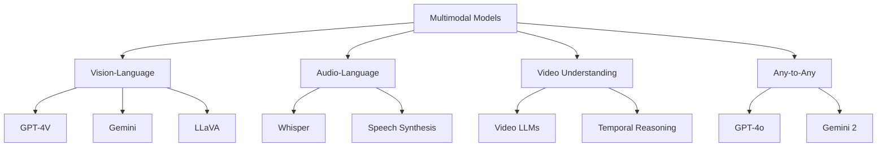
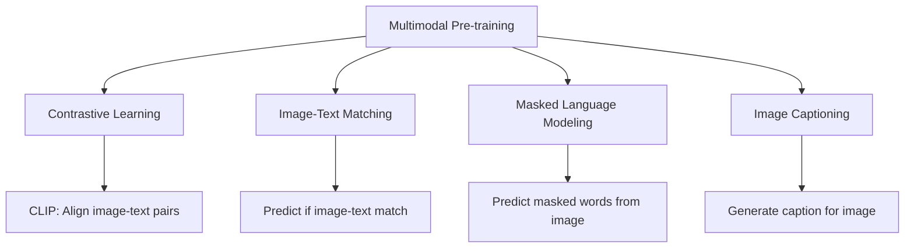
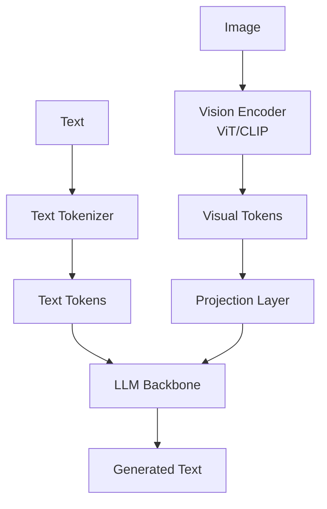

# Multimodal Models

Multimodal models process and generate multiple types of data (text, images, audio, video) within a unified framework. They represent the convergence of specialized AI systems into general-purpose models.

## Overview



## Why Multimodal?

### Human Perception is Multimodal
Humans naturally integrate information from multiple senses:
- **Visual:** 80% of sensory input
- **Auditory:** Speech, music, environmental sounds
- **Textual:** Reading, writing
- **Tactile:** Physical interaction

### Advantages of Multimodal Models

| Aspect | Unimodal | Multimodal |
|--------|----------|------------|
| Understanding | Limited to one modality | Rich cross-modal understanding |
| Tasks | Specialized per model | General-purpose |
| Reasoning | Within-modality | Cross-modal reasoning |
| Generation | Single output type | Multiple output types |
| Training | Independent models | Shared representations |

## Architecture Paradigms

### 1. Early Fusion
Concatenate inputs from different modalities before processing.

```python
class EarlyFusion(nn.Module):
    def __init__(self):
        super().__init__()
        self.text_encoder = TextEncoder()
        self.image_encoder = ImageEncoder()
        self.fusion = TransformerEncoder()
    
    def forward(self, text, image):
        text_features = self.text_encoder(text)      # (B, T, D)
        image_features = self.image_encoder(image)    # (B, V, D)
        combined = torch.cat([text_features, image_features], dim=1)
        output = self.fusion(combined)
        return output
```

### 2. Late Fusion
Process each modality independently, combine at the end.

```python
class LateFusion(nn.Module):
    def __init__(self):
        super().__init__()
        self.text_encoder = TextEncoder()
        self.image_encoder = ImageEncoder()
        self.fusion_layer = nn.Linear(2 * D, D)
    
    def forward(self, text, image):
        text_features = self.text_encoder(text).mean(dim=1)    # (B, D)
        image_features = self.image_encoder(image).mean(dim=1)  # (B, D)
        combined = torch.cat([text_features, image_features], dim=-1)
        output = self.fusion_layer(combined)
        return output
```

### 3. Cross-Attention Fusion
Let modalities attend to each other.

```python
class CrossAttentionFusion(nn.Module):
    def __init__(self, dim):
        super().__init__()
        self.cross_attn = nn.MultiheadAttention(dim, num_heads=8)
    
    def forward(self, text_features, image_features):
        # Text attends to image
        text_enhanced, _ = self.cross_attn(
            query=text_features,
            key=image_features,
            value=image_features
        )
        return text_enhanced
```

## Training Paradigms

### Pre-training Objectives



### Instruction Tuning

```python
# Stage 1: Pre-training on image-text pairs
# Stage 2: Instruction tuning on diverse tasks

# Example instruction format:
instruction = {
    "image": "path/to/image.jpg",
    "conversations": [
        {"role": "user", "content": "What is happening in this image?"},
        {"role": "assistant", "content": "The image shows a busy street market..."}
    ]
}
```

## Key Models Timeline

| Year | Model | Organization | Key Innovation |
|------|-------|--------------|----------------|
| 2021 | CLIP | OpenAI | Contrastive image-text pre-training |
| 2022 | Flamingo | DeepMind | Few-shot visual language model |
| 2023 | GPT-4V | OpenAI | Multimodal GPT-4 |
| 2023 | LLaVA | Microsoft | Visual instruction tuning |
| 2023 | Gemini | Google | Natively multimodal |
| 2024 | GPT-4o | OpenAI | Any-to-any multimodal |
| 2024 | Gemini 2 | Google | Enhanced multimodal reasoning |

## Common Architectures

### Vision-Language Model (VLM)



### Projection Strategies

```python
# 1. Linear Projection (LLaVA)
class LinearProjection(nn.Module):
    def __init__(self, vision_dim, llm_dim):
        super().__init__()
        self.proj = nn.Linear(vision_dim, llm_dim)
    
    def forward(self, visual_features):
        return self.proj(visual_features)

# 2. Q-Former (BLIP-2)
class QFormer(nn.Module):
    def __init__(self, num_queries=32, dim=768):
        super().__init__()
        self.queries = nn.Parameter(torch.randn(num_queries, dim))
        self.cross_attn = nn.MultiheadAttention(dim, num_heads=8)
    
    def forward(self, visual_features):
        # Learnable queries attend to visual features
        queries = self.queries.expand(visual_features.shape[0], -1, -1)
        output, _ = self.cross_attn(queries, visual_features, visual_features)
        return output

# 3. Perceiver Resampler (Flamingo)
class PerceiverResampler(nn.Module):
    def __init__(self, num_latents=64, dim=768):
        super().__init__()
        self.latents = nn.Parameter(torch.randn(num_latents, dim))
        self.cross_attn = nn.MultiheadAttention(dim, num_heads=8)
    
    def forward(self, visual_features):
        latents = self.latents.expand(visual_features.shape[0], -1, -1)
        output, _ = self.cross_attn(latents, visual_features, visual_features)
        return output
```

## Multimodal Benchmarks

| Benchmark | Task | Metrics |
|-----------|------|---------|
| VQAv2 | Visual Question Answering | Accuracy |
| GQA | Compositional QA | Accuracy |
| TextVQA | Text in Images QA | Accuracy |
| POPE | Object Hallucination | F1 |
| MMBench | Comprehensive Multimodal | Accuracy |
| MME | Perception & Cognition | Score |
| SEED-Bench | Image/Video Understanding | Accuracy |

## Interview Questions

1. **What is a multimodal model?**
   A model that can process and/or generate multiple types of data (text, images, audio, video) within a unified framework, enabling cross-modal understanding and reasoning.

2. **What is the difference between early and late fusion?**
   Early fusion combines inputs before processing (richer interaction but more complex). Late fusion processes modalities independently then combines (simpler but limited cross-modal reasoning).

3. **How do vision-language models work?**
   They use a vision encoder (ViT/CLIP) to extract visual features, project them to the language model's embedding space, and process both visual and text tokens through a transformer decoder.

4. **What is cross-attention in multimodal models?**
   A mechanism where one modality's tokens attend to another's. For example, text tokens attend to image features to ground language in visual context.

5. **Why is instruction tuning important for multimodal models?**
   It teaches models to follow diverse instructions across modalities, improving zero-shot performance on new tasks and enabling more natural interaction.

6. **What are the challenges of multimodal training?**
   Data alignment (matching modalities), modality imbalance (one dominates), computational cost, evaluation metrics (hard to measure cross-modal understanding), and hallucination.

## Summary

Multimodal models integrate multiple data types for richer understanding. Vision-language models use projection layers to connect vision encoders with language models. Training typically involves pre-training on aligned data followed by instruction tuning. The field is rapidly evolving toward any-to-any models.

## Cross-References

- [Vision-Language Models](vlm.md) - VLM architecture details
- [GPT-4V](gpt4v.md) - OpenAI's multimodal model
- [Gemini](gemini.md) - Google's multimodal approach
- [CLIP](../vision/clip.md) - Vision-language alignment
- [Audio Models](audio.md) - Speech and audio understanding
- [Video Understanding](video.md) - Temporal reasoning
