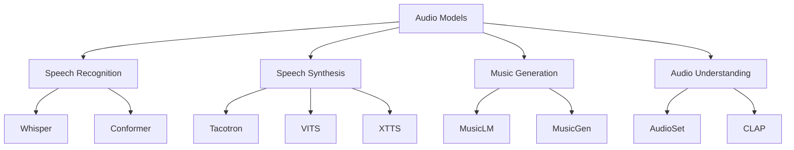
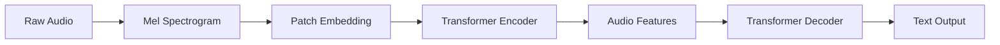
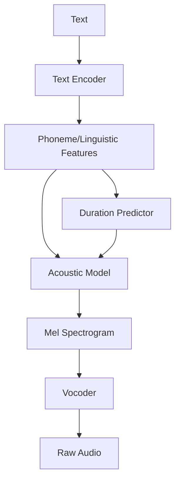
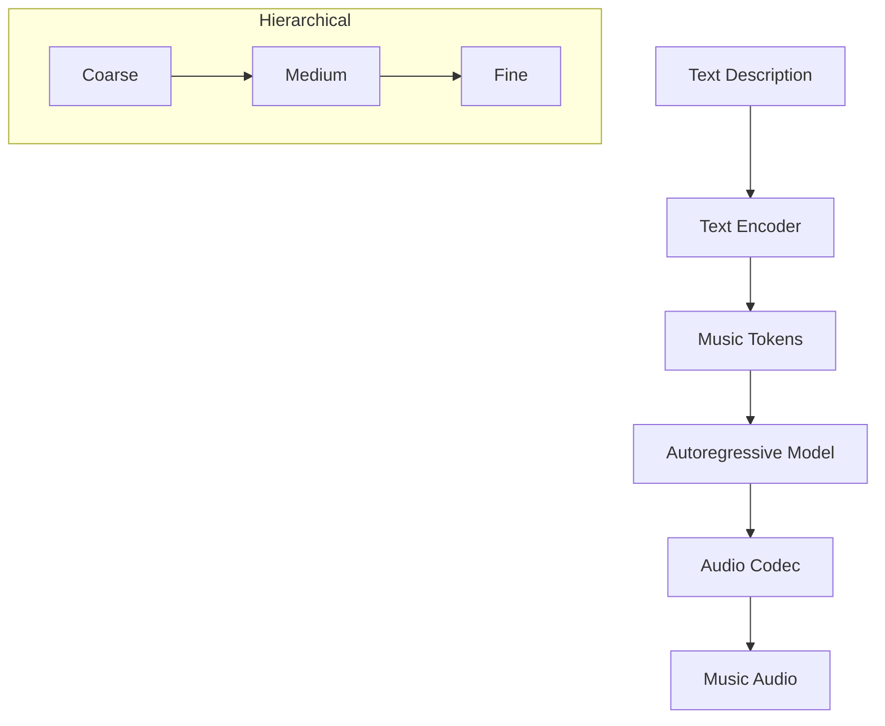

# Audio Models

Audio models process and generate speech, music, and environmental sounds. They enable applications like speech recognition, text-to-speech, music generation, and audio understanding.

## Overview



## Speech Recognition (ASR)

### Whisper (OpenAI)

The most popular open-source speech recognition model.

```python
# Whisper architecture
class Whisper(nn.Module):
    def __init__(self):
        super().__init__()
        # Audio encoder: Processes mel spectrogram
        self.encoder = AudioEncoder(
            n_mels=80,        # Mel frequency bins
            n_ctx=1500,       # 30 seconds of audio
            n_state=1280,     # Hidden dimension
            n_head=20,        # Attention heads
            n_layer=32        # Encoder layers
        )
        
        # Text decoder: Autoregressive
        self.decoder = TextDecoder(
            n_vocab=51865,    # Vocabulary size
            n_ctx=448,        # Max text length
            n_state=1280,     # Hidden dimension
            n_head=20,        # Attention heads
            n_layer=32        # Decoder layers
        )
```

#### Whisper Processing Pipeline



#### Mel Spectrogram

```python
def compute_mel_spectrogram(audio, sr=16000, n_mels=80):
    """Convert raw audio to mel spectrogram"""
    # 1. STFT (Short-Time Fourier Transform)
    stft = torch.stft(audio, n_fft=400, hop_length=160)
    magnitude = stft.abs() ** 2
    
    # 2. Mel filterbank
    mel_filters = librosa.filters.mel(sr=sr, n_fft=400, n_mels=n_mels)
    mel_spec = mel_filters @ magnitude
    
    # 3. Log scale
    log_mel = torch.log(mel_spec + 1e-9)
    
    return log_mel  # Shape: (n_mels, time_frames)
```

#### Whisper Model Sizes

| Model | Parameters | English WER | Multilingual | Speed |
|-------|-----------|-------------|--------------|-------|
| tiny | 39M | 7.6% | Yes | ~32x |
| base | 74M | 5.4% | Yes | ~16x |
| small | 244M | 4.3% | Yes | ~6x |
| medium | 769M | 3.5% | Yes | ~2x |
| large-v3 | 1550M | 2.7% | Yes | 1x |

#### Using Whisper

```python
import whisper

# Load model
model = whisper.load_model("base")

# Transcribe audio
result = model.transcribe("audio.mp3")
print(result["text"])

# With language detection
result = model.transcribe("audio.mp3", language="zh")
print(f"Detected language: {result['language']}")
print(f"Text: {result['text']}")

# With timestamps
segments = result["segments"]
for seg in segments:
    print(f"[{seg['start']:.1f}s - {seg['end']:.1f}s] {seg['text']}")
```

### Conformer

State-of-the-art ASR architecture combining CNN and Transformer.

```python
class ConformerBlock(nn.Module):
    """Conformer: CNN + Transformer hybrid"""
    def __init__(self, d_model, n_heads, conv_kernel_size=31):
        super().__init__()
        self.ffn1 = FeedForward(d_model)
        self.self_attn = MultiHeadAttention(d_model, n_heads)
        self.conv = ConvModule(d_model, conv_kernel_size)
        self.ffn2 = FeedForward(d_model)
        self.norm = LayerNorm(d_model)
    
    def forward(self, x):
        x = x + 0.5 * self.ffn1(x)
        x = x + self.self_attn(x)
        x = x + self.conv(x)
        x = x + 0.5 * self.ffn2(x)
        x = self.norm(x)
        return x

class ConvModule(nn.Module):
    """Convolution module in Conformer"""
    def __init__(self, d_model, kernel_size):
        super().__init__()
        self.pointwise_conv1 = nn.Conv1d(d_model, 2*d_model, 1)
        self.glu = nn.GLU(dim=1)
        self.depthwise_conv = nn.Conv1d(d_model, d_model, kernel_size, 
                                         padding=kernel_size//2, groups=d_model)
        self.batch_norm = nn.BatchNorm1d(d_model)
        self.pointwise_conv2 = nn.Conv1d(d_model, d_model, 1)
    
    def forward(self, x):
        x = self.pointwise_conv1(x.transpose(1,2))
        x = self.glu(x)
        x = self.depthwise_conv(x)
        x = self.batch_norm(x)
        x = F.silu(x)
        x = self.pointwise_conv2(x)
        return x.transpose(1,2)
```

## Text-to-Speech (TTS)

### Architecture Overview



### VITS (Variational Inference with adversarial learning for end-to-end TTS)

```python
class VITS(nn.Module):
    def __init__(self):
        super().__init__()
        self.text_encoder = TextEncoder()
        self.posterior_encoder = PosteriorEncoder()  # Training only
        self.flow = Flow()  # Normalizing flow
        self.decoder = HiFiGANDecoder()  # Vocoder
    
    def forward(self, text, audio=None):
        # Text encoding
        text_features = self.text_encoder(text)
        
        if self.training and audio is not None:
            # Posterior (from audio)
            z, mu, logvar = self.posterior_encoder(audio)
        else:
            # Prior (from text only)
            z = torch.randn_like(text_features)
            mu, logvar = self.text_encoder.predict_duration(text_features)
        
        # Flow-based transformation
        z = self.flow(z, reverse=True)
        
        # Generate waveform
        waveform = self.decoder(z)
        
        return waveform, mu, logvar
```

### XTTS (Coqui TTS)

```python
# Zero-shot TTS: Clone any voice from 6-second sample
from TTS.api import TTS

tts = TTS("tts_models/multilingual/multi-dataset/xtts_v2")

# Generate speech in cloned voice
tts.tts_to_file(
    text="Hello, this is a cloned voice.",
    speaker_wav="reference_audio.wav",  # 6-second sample
    language="en",
    file_path="output.wav"
)
```

### Bark (Suno)

```python
# Text-to-speech with emotion, music, sound effects
from bark import generate_audio, SAMPLE_RATE

# Generate speech
audio = generate_audio("Hello! [laughs] This is amazing!")

# With speaker preset
audio = generate_audio(
    "Welcome to the show!",
    speaker="v2/en_speaker_6"
)

# Non-speech sounds
audio = generate_audio("[music] La la la [/music]")
audio = generate_audio("[gasps] Oh no!")
```

## Music Generation

### MusicLM (Google)



### MusicGen (Meta)

```python
# Single-stage music generation
from audiocraft.models import MusicGen

model = MusicGen.get_pretrained('facebook/musicgen-small')
model.set_generation_params(duration=8)  # 8 seconds

# Generate from text
wav = model.generate(["A happy jazz song with piano and saxophone"])

# Generate with melody conditioning
wav = model.generate_with_chroma(
    ["A rock version of this melody"],
    melody_wav=melody_audio
)
```

### AudioCraft Framework

```python
# Meta's audio generation framework
from audiocraft.models import MusicGen, AudioGen, EnCodec

# Music generation
music_model = MusicGen.get_pretrained('facebook/musicgen-medium')
music = music_model.generate(["upbeat electronic dance music"])

# Sound effect generation
audio_model = AudioGen.get_pretrained('facebook/audiogen-medium')
sounds = audio_model.generate(["rain falling on a tin roof"])

# Audio codec (compression)
codec = EnCodec.get_pretrained('facebook/encodec_24k_audio')
encoded = codec.encode(audio)
decoded = codec.decode(encoded)
```

## Audio Understanding

### CLAP (Contrastive Language-Audio Pretraining)

```python
# Audio equivalent of CLIP
class CLAP(nn.Module):
    def __init__(self):
        super().__init__()
        self.audio_encoder = AudioEncoder()  # HTSAT or AST
        self.text_encoder = TextEncoder()     # RoBERTa
        self.projection = ProjectionLayer()
    
    def encode_audio(self, audio):
        features = self.audio_encoder(audio)
        return self.projection(features)
    
    def encode_text(self, text):
        features = self.text_encoder(text)
        return self.projection(features)
    
    def forward(self, audio, text):
        audio_emb = self.encode_audio(audio)
        text_emb = self.encode_text(text)
        return audio_emb, text_emb

# Zero-shot audio classification
def classify_audio(audio, classes, clap_model):
    audio_emb = clap_model.encode_audio(audio)
    text_embs = [clap_model.encode_text(f"a sound of {c}") for c in classes]
    similarities = [cosine_sim(audio_emb, t) for t in text_embs]
    return classes[np.argmax(similarities)]
```

### Audio Classification

```python
# Environmental sound classification
# Categories: dog bark, car horn, rain, music, speech, etc.

from transformers import pipeline

classifier = pipeline("audio-classification", 
                      model="MIT/ast-finetuned-audioset-10-10-0.4593")

result = classifier("audio.wav")
# [{"score": 0.95, "label": "Dog bark"}, 
#  {"score": 0.03, "label": "Animal"}]
```

## Speech Translation

### SeamlessM4T (Meta)

```python
# Speech-to-speech translation
from seamless_communication.inference import Translator

translator = Translator("seamlessM4T_v2_large")

# Speech to speech
translated_audio, _ = translator.predict(
    input="input_speech.wav",
    task_str="s2st",  # speech-to-speech translation
    tgt_lang="fra"     # Target: French
)

# Speech to text
translated_text, _ = translator.predict(
    input="input_speech.wav",
    task_str="s2tt",
    tgt_lang="spa"
)
```

## Neural Audio Codecs

### EnCodec (Meta)

```python
# Compress audio into discrete tokens
class EnCodec(nn.Module):
    def __init__(self, n_q=8, d_model=128):
        super().__init__()
        self.encoder = AudioEncoder(d_model)
        self.quantizer = ResidualVectorQuantizer(n_q, d_model)
        self.decoder = AudioDecoder(d_model)
    
    def encode(self, audio):
        # Audio → continuous features → discrete tokens
        features = self.encoder(audio)
        tokens, _ = self.quantizer(features)
        return tokens  # (B, n_q, T) discrete codes
    
    def decode(self, tokens):
        # Discrete tokens → continuous features → audio
        features = self.quantizer.decode(tokens)
        audio = self.decoder(features)
        return audio
```

### SoundStream (Google)

```python
# Similar to EnCodec
# Used in AudioLM, MusicLM
# Residual vector quantization
# ~6 kbps bitrate at high quality
```

## Interview Questions

1. **How does Whisper work?**
   Whisper converts audio to mel spectrogram, processes it through a Transformer encoder, then autoregressively decodes text. It handles multiple languages and can detect language automatically.

2. **What is a mel spectrogram?**
   A time-frequency representation of audio where frequencies are scaled to match human perception (mel scale). It's the standard input format for most audio models.

3. **How does zero-shot TTS work?**
   Models like XTTS encode a reference voice into a speaker embedding, then condition the TTS generation on that embedding. Only 6 seconds of reference audio needed.

4. **What is residual vector quantization?**
   A method to compress continuous audio into discrete tokens. Multiple codebooks work in sequence, each encoding the residual error from previous quantizers.

5. **How does CLAP work?**
   Similar to CLIP but for audio. Trains audio and text encoders with contrastive loss to align audio descriptions with audio in a shared embedding space.

6. **What is the difference between ASR and TTS?**
   ASR (Automatic Speech Recognition) converts speech to text. TTS (Text-to-Speech) converts text to speech. They're inverse tasks with different architectures.

7. **How do music generation models work?**
   Typically use audio codecs to tokenize music, then generate tokens autoregressively conditioned on text descriptions. Some use diffusion for higher quality.

## Common Mistakes

- ❌ Not resampling audio to expected sample rate (16kHz for Whisper)
- ❌ Ignoring audio preprocessing (noise reduction, normalization)
- ❌ Using wrong mel spectrogram parameters
- ❌ Not handling variable-length audio properly
- ❌ Confusing audio classification with speech recognition

## Summary

Audio models span speech recognition (Whisper), synthesis (VITS, XTTS), music generation (MusicGen), and understanding (CLAP). Neural audio codecs (EnCodec) enable token-based processing. The field is rapidly advancing toward natural, expressive audio generation and understanding.

## Cross-References

- [Multimodal Models](README.md) - Audio as part of multimodal AI
- [Transformers](../transformers.md) - Attention mechanism
- [CLIP](../vision/clip.md) - Contrastive learning paradigm
- [Gemini](gemini.md) - Native audio understanding
- [Video Understanding](video.md) - Audio-visual processing
