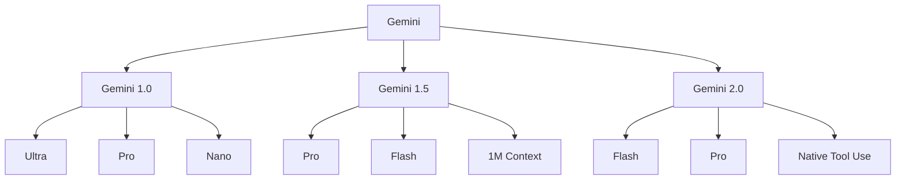
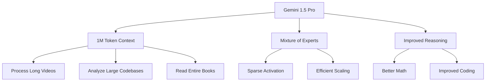

# Gemini

Gemini is Google DeepMind's multimodal AI model family, designed to be natively multimodal from the ground up. Unlike models that add vision capabilities to language models, Gemini was trained jointly on text, images, audio, and video.

## Overview



## Architecture

### Natively Multimodal

```python
# Unlike GPT-4V (vision added to text model),
# Gemini was trained on all modalities from the start

class GeminiArchitecture:
    """
    Key design principle: Native multimodality
    - Trained jointly on text, image, audio, video
    - No separate vision encoder needed
    - Unified tokenization across modalities
    """
    
    # Hypothetical architecture (not fully public)
    modalities = {
        "text": "SentencePiece tokenizer",
        "image": "ViT-like encoder (256 tokens per image)",
        "audio": "Audio encoder (25 tokens per second)",
        "video": "Frame sampling + temporal encoding"
    }
```

### Model Variants

| Model | Parameters | Context | Strengths |
|-------|-----------|---------|-----------|
| Gemini Ultra | ~1.5T+ | 128K | Most capable, complex reasoning |
| Gemini Pro | ~100B+ | 128K/1M | Balanced performance |
| Gemini Flash | ~10B+ | 1M | Fast, efficient |
| Gemini Nano | ~1.8B/3.25B | 32K | On-device |

### Context Window

```python
# Gemini 1.5 Pro: 1 million tokens context
# Can process:
# - 1 hour of video
# - 11 hours of audio
# - 30,000 lines of code
# - 700,000 words

# Practical example
def process_long_video(video_path, question):
    """Process entire movie with Gemini"""
    # Upload video (auto-processed into frames + audio)
    video_file = upload_to_gemini(video_path)
    
    response = gemini.generate(
        contents=[video_file, question],
        model="gemini-1.5-pro"
    )
    return response
```

## Multimodal Capabilities

### Image Understanding

```python
# Process images natively
def analyze_image(image_path, prompt):
    """Gemini processes images as native input"""
    image = Part.from_image(image_path)
    
    response = model.generate_content(
        contents=[image, prompt]
    )
    return response.text

# Example capabilities:
# - Image description
# - OCR (text extraction)
# - Chart/graph analysis
# - Object detection
# - Spatial reasoning
# - Visual math
```

### Audio Understanding

```python
# Process audio natively
def analyze_audio(audio_path, prompt):
    """Gemini understands audio directly"""
    audio = Part.from_audio(audio_path)
    
    response = model.generate_content(
        contents=[audio, prompt]
    )
    return response.text

# Capabilities:
# - Speech transcription
# - Speaker identification
# - Emotion detection
# - Music analysis
# - Sound classification
```

### Video Understanding

```python
# Process video with temporal understanding
def analyze_video(video_path, prompt):
    """Gemini understands video temporally"""
    video = Part.from_video(video_path)
    
    response = model.generate_content(
        contents=[video, prompt]
    )
    return response.text

# Capabilities:
# - Video captioning
# - Action recognition
# - Temporal reasoning
# - Long video understanding (1+ hour)
```

### Multi-Image Reasoning

```python
# Compare and reason across multiple images
def compare_images(image_paths, question):
    """Reason across multiple images"""
    images = [Part.from_image(p) for p in image_paths]
    
    response = model.generate_content(
        contents=[*images, question]
    )
    return response.text

# Example: Compare products, analyze sequences, etc.
```

## Gemini 1.5 Pro

### Key Innovations



### Long Context Performance

```python
# "Needle in a Haystack" test
# Gemini 1.5 Pro: 99.7% accuracy at 1M tokens

def long_context_test():
    """Test long context understanding"""
    # Insert a specific fact in a long document
    long_doc = "..." * 10000  # Very long document
    fact = "The secret number is 42."
    
    # Place fact at various positions
    for position in [0.1, 0.25, 0.5, 0.75, 0.9]:
        doc_with_fact = insert_at_position(long_doc, fact, position)
        
        response = gemini.generate(
            contents=[doc_with_fact, "What is the secret number?"]
        )
        
        assert "42" in response.text  # Should find it anywhere
```

## Gemini 2.0

### Key Features

```python
# Gemini 2.0 Flash (December 2024)
# - Native tool use
# - Code execution
# - Search grounding
# - Improved multimodal

class Gemini2Capabilities:
    tools = {
        "code_execution": "Run Python code directly",
        "google_search": "Ground responses with search",
        "function_calling": "Call external functions",
        "structured_output": "JSON mode"
    }
    
    multimodal = {
        "input": ["text", "image", "audio", "video"],
        "output": ["text", "image", "audio"]  # Native generation!
    }
```

### Native Tool Use

```python
# Gemini can use tools directly
def use_tools(prompt):
    """Gemini can search, code, and call functions"""
    response = model.generate_content(
        contents=prompt,
        tools=[
            google_search_tool(),
            code_execution_tool(),
            function_calling_tool(my_functions)
        ]
    )
    return response
```

## API Usage

### Basic Usage

```python
import google.generativeai as genai

# Configure
genai.configure(api_key="YOUR_API_KEY")
model = genai.GenerativeModel('gemini-pro')

# Text only
response = model.generate_content("Explain quantum computing")

# With image
image = genai.upload_file("image.jpg")
response = model.generate_content([image, "What's in this image?"])

# With video
video = genai.upload_file("video.mp4")
response = model.generate_content([video, "Describe this video"])
```

### Multimodal Input

```python
# Process multiple modalities
def multimodal_query(image_path, audio_path, question):
    """Combine image, audio, and text"""
    image = genai.upload_file(image_path)
    audio = genai.upload_file(audio_path)
    
    model = genai.GenerativeModel('gemini-1.5-pro')
    response = model.generate_content(
        [image, audio, question]
    )
    return response.text
```

### Streaming

```python
# Stream responses for long outputs
def stream_response(prompt):
    """Stream Gemini response"""
    model = genai.GenerativeModel('gemini-pro')
    
    for chunk in model.generate_content(prompt, stream=True):
        print(chunk.text, end="")
```

## Comparison with GPT-4V

| Feature | Gemini | GPT-4V |
|---------|--------|--------|
| Training | Natively multimodal | Vision added to LLM |
| Video | Native support | No |
| Audio | Native support | No |
| Context | 1M tokens | 128K tokens |
| OCR | Excellent | Excellent |
| Charts | Excellent | Excellent |
| Code | Strong | Strong |
| Search | Built-in | No |
| Tool Use | Native | Via function calling |

## Use Cases

### Document Understanding

```python
# Process long documents
def analyze_document(pdf_path, question):
    """Analyze entire PDF document"""
    pdf = genai.upload_file(pdf_path)
    
    model = genai.GenerativeModel('gemini-1.5-pro')
    response = model.generate_content(
        [pdf, f"Analyze this document and answer: {question}"]
    )
    return response.text
```

### Video Analysis

```python
# Analyze video content
def analyze_video(video_path, question):
    """Understand video content"""
    video = genai.upload_file(video_path)
    
    model = genai.GenerativeModel('gemini-1.5-pro')
    response = model.generate_content(
        [video, question]
    )
    return response.text

# Example: "What happens in the first 5 minutes?"
# Example: "Summarize the key points of this lecture"
```

### Code Analysis

```python
# Analyze large codebases
def analyze_codebase(repo_path, question):
    """Understand entire code repository"""
    # Upload all source files
    files = [genai.upload_file(f) for f in get_source_files(repo_path)]
    
    model = genai.GenerativeModel('gemini-1.5-pro')
    response = model.generate_content(
        [*files, question]
    )
    return response.text

# Example: "Explain the architecture of this project"
# Example: "Find potential security vulnerabilities"
```

### Multimodal Search

```python
# Search across modalities
def multimodal_search(query, database):
    """Search using text, images, or audio"""
    model = genai.GenerativeModel('gemini-pro')
    
    # Process query (could be any modality)
    results = model.generate_content(
        [query, "Find relevant items in the database"],
        tools=[search_tool(database)]
    )
    return results
```

## On-Device: Gemini Nano

```python
# Runs on mobile devices (Pixel 8 Pro, etc.)
# 1.8B or 3.25B parameters
# Quantized for efficiency

class GeminiNano:
    """On-device multimodal AI"""
    capabilities = [
        "Summarization",
        "Smart reply",
        "OCR",
        "Basic image understanding"
    ]
    
    # Integrated into Android via AICore
    # No internet connection required
    # Privacy-preserving
```

## Interview Questions

1. **What makes Gemini different from GPT-4V?**
   Gemini is natively multimodal (trained on text, image, audio, video jointly) while GPT-4V added vision to an existing text model. Gemini supports video and audio natively with 1M token context.

2. **What is Gemini's context window?**
   Gemini 1.5 Pro supports 1M tokens (128K standard). This enables processing 1 hour of video, 11 hours of audio, or 700K words.

3. **How does Gemini process video?**
   Video is sampled into frames and processed with temporal encoding. Audio is extracted and processed separately. The model understands both spatial and temporal relationships.

4. **What is Gemini Nano?**
   An on-device variant (1.8B/3.25B parameters) for mobile devices. Enables privacy-preserving AI without internet. Supports basic multimodal tasks.

5. **How does Gemini handle long context?**
   Uses efficient attention mechanisms and MoE architecture. Maintains high accuracy ("needle in a haystack") across the full 1M token context.

6. **What are Gemini's strengths vs GPT-4V?**
   Native video/audio support, longer context, built-in search grounding, tool use. GPT-4V may have edge in some text-only tasks and OCR.

7. **How does Gemini's MoE architecture work?**
   Uses mixture of experts for efficient scaling. Only a subset of parameters activates for each input, enabling larger models without proportional compute increase.

## Common Mistakes

- ❌ Not utilizing video and audio capabilities
- ❌ Sending too many frames for video (wastes tokens)
- ❌ Not leveraging the 1M context window for long documents
- ❌ Confusing Gemini variants (Ultra vs Pro vs Flash)
- ❌ Ignoring on-device options (Nano) for privacy-sensitive use cases

## Summary

Gemini represents a new paradigm in multimodal AI with native support for text, images, audio, and video. Its 1M token context window enables unprecedented long-form understanding. The MoE architecture enables efficient scaling, and Gemini Nano brings multimodal AI to mobile devices.

## Cross-References

- [GPT-4V](gpt4v.md) - OpenAI's multimodal model
- [Vision-Language Models](vlm.md) - VLM architecture fundamentals
- [Audio Models](audio.md) - Whisper and speech synthesis
- [Video Understanding](video.md) - Temporal reasoning
- [Mixture of Experts](../moe/README.md) - MoE architecture
